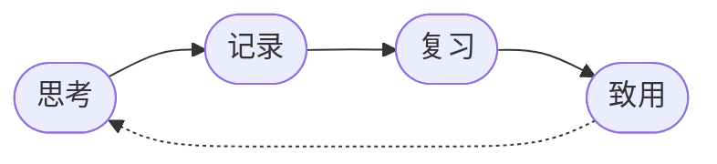

最小闭环 ： 思考,记录,复习,致用 

```mermaid
%% 最小闭环：思考 → 记录 → 复习 → 致用 →（回到）思考
flowchart LR
    A([思考]) --> B([记录])
    B --> C([复习])
    C --> D([致用])
    D -.-> A
```

> [!TIP] > 我是一个TIP 
> 

> [!NOTE] > 我是一个NOTE 
> 

> [!WARNING] 
> 我是一个WARNING 

> [!DANGER] 
> > 我是一个DANGER