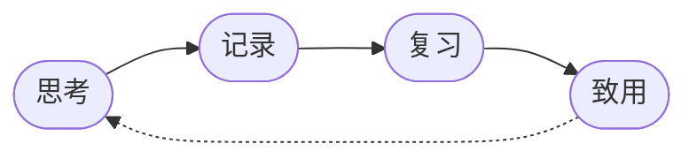

最小闭环 ： 思考,记录,复习,致用 

> 五线谱渲染已可用，见 [[五线谱测试]]




> [!TIP] 
> 我是一个TIP 

> [!NOTE] 
> 我是一个NOTE 


> [!WARNING] 
> 我是一个WARNING 


> [!DANGER] 
> > 我是一个DANGER

---

## 🎲 Three.js 测试

```threejs
var scene = new THREE.Scene();
scene.background = new THREE.Color(0x1a1a2e);

var camera = new THREE.PerspectiveCamera(75, w / h, 0.1, 1000);
camera.position.z = 3;

var renderer = new THREE.WebGLRenderer({ antialias: true });
renderer.setSize(w, h);
renderer.setPixelRatio(Math.min(window.devicePixelRatio, 2));
container.appendChild(renderer.domElement);

var geometry = new THREE.BoxGeometry(1, 1, 1);
var material = new THREE.MeshStandardMaterial({ color: 0x00bfff, metalness: 0.3, roughness: 0.4 });
var cube = new THREE.Mesh(geometry, material);
scene.add(cube);

var ambient = new THREE.AmbientLight(0x404040);
scene.add(ambient);
var light = new THREE.DirectionalLight(0xffffff, 1);
light.position.set(1, 2, 2);
scene.add(light);

function animate() {
  requestAnimationFrame(animate);
  cube.rotation.x += 0.01;
  cube.rotation.y += 0.02;
  renderer.render(scene, camera);
}
animate();

window.addEventListener('resize', function() {
  var r = container.getBoundingClientRect();
  renderer.setSize(r.width, r.height);
  camera.aspect = r.width / r.height;
  camera.updateProjectionMatrix();
});
```

---

### 🌀 旋转圆环 + 粒子背景

```threejs
var scene = new THREE.Scene();

var camera = new THREE.PerspectiveCamera(60, w / h, 0.1, 1000);
camera.position.z = 5;

var renderer = new THREE.WebGLRenderer({ antialias: true });
renderer.setSize(w, h);
renderer.setPixelRatio(Math.min(window.devicePixelRatio, 2));
container.appendChild(renderer.domElement);

// 粒子背景
var starsGeo = new THREE.BufferGeometry();
var starCount = 1000;
var positions = new Float32Array(starCount * 3);
for (var i = 0; i < starCount * 3; i++) {
  positions[i] = (Math.random() - 0.5) * 200;
}
starsGeo.setAttribute('position', new THREE.BufferAttribute(positions, 3));
var starsMat = new THREE.PointsMaterial({ color: 0xffffff, size: 0.3 });
var stars = new THREE.Points(starsGeo, starsMat);
scene.add(stars);

// 主环
var torusGeo = new THREE.TorusGeometry(1.5, 0.3, 16, 64);
var torusMat = new THREE.MeshStandardMaterial({
  color: 0xff6b6b,
  metalness: 0.6,
  roughness: 0.3
});
var torus = new THREE.Mesh(torusGeo, torusMat);
torus.rotation.x = Math.PI / 4;
scene.add(torus);

// 内环
var torus2Geo = new THREE.TorusGeometry(1.1, 0.15, 16, 48);
var torus2Mat = new THREE.MeshStandardMaterial({
  color: 0x4ecdc4,
  metalness: 0.4,
  roughness: 0.5
});
var torus2 = new THREE.Mesh(torus2Geo, torus2Mat);
torus2.rotation.x = -Math.PI / 4;
scene.add(torus2);

var ambient = new THREE.AmbientLight(0x404040);
scene.add(ambient);
var light = new THREE.DirectionalLight(0xffffff, 1);
light.position.set(2, 3, 4);
scene.add(light);
var light2 = new THREE.DirectionalLight(0xff6b6b, 0.5);
light2.position.set(-2, -1, 3);
scene.add(light2);

function animate() {
  requestAnimationFrame(animate);
  torus.rotation.y += 0.01;
  torus2.rotation.y -= 0.015;
  stars.rotation.y += 0.0005;
  renderer.render(scene, camera);
}
animate();
```

---

### 🔮 发光球体 + 地面反射

```threejs
var scene = new THREE.Scene();
scene.background = new THREE.Color(0x0a0a1a);

var camera = new THREE.PerspectiveCamera(50, w / h, 0.1, 1000);
camera.position.set(3, 2, 5);
camera.lookAt(0, 0, 0);

var renderer = new THREE.WebGLRenderer({ antialias: true });
renderer.setSize(w, h);
renderer.setPixelRatio(Math.min(window.devicePixelRatio, 2));
container.appendChild(renderer.domElement);

// 地面
var floorGeo = new THREE.PlaneGeometry(8, 8);
var floorMat = new THREE.MeshStandardMaterial({
  color: 0x222244,
  metalness: 0.8,
  roughness: 0.2,
  side: THREE.DoubleSide
});
var floor = new THREE.Mesh(floorGeo, floorMat);
floor.rotation.x = -Math.PI / 2;
floor.position.y = -1.2;
scene.add(floor);

// 球体
var sphereGeo = new THREE.SphereGeometry(1, 48, 48);
var sphereMat = new THREE.MeshStandardMaterial({
  color: 0x00bfff,
  emissive: 0x0044ff,
  emissiveIntensity: 0.3,
  metalness: 0.3,
  roughness: 0.2
});
var sphere = new THREE.Mesh(sphereGeo, sphereMat);
sphere.position.y = 0.3;
scene.add(sphere);

// 小卫星
var satGeo = new THREE.SphereGeometry(0.15, 16, 16);
var satMat = new THREE.MeshStandardMaterial({ color: 0xff6b6b, emissive: 0xff2200, emissiveIntensity: 0.5 });
var satellite = new THREE.Mesh(satGeo, satMat);
scene.add(satellite);

var ambient = new THREE.AmbientLight(0x101030);
scene.add(ambient);
var light = new THREE.DirectionalLight(0xffffff, 1.5);
light.position.set(5, 10, 5);
scene.add(light);

var angle = 0;
function animate() {
  requestAnimationFrame(animate);
  sphere.rotation.y += 0.005;
  sphere.position.y = 0.3 + Math.sin(Date.now() * 0.001) * 0.1;
  angle += 0.02;
  satellite.position.x = Math.cos(angle) * 1.8;
  satellite.position.z = Math.sin(angle) * 1.8;
  satellite.position.y = 0.3 + Math.sin(angle * 2) * 0.3;
  renderer.render(scene, camera);
}
animate();
```

---

### 🏗️ 随机方块塔

```threejs
var scene = new THREE.Scene();
scene.background = new THREE.Color(0x1a1a2e);

var camera = new THREE.PerspectiveCamera(60, w / h, 0.1, 1000);
camera.position.set(5, 4, 5);
camera.lookAt(0, 0, 0);

var renderer = new THREE.WebGLRenderer({ antialias: true });
renderer.setSize(w, h);
renderer.setPixelRatio(Math.min(window.devicePixelRatio, 2));
container.appendChild(renderer.domElement);

var colors = [0xff6b6b, 0x4ecdc4, 0x45b7d1, 0xf9ca24, 0xa29bfe];
var cubes = [];

for (var y = 0; y < 5; y++) {
  var size = 5 - y;
  for (var ix = 0; ix < size; ix++) {
    for (var iz = 0; iz < size; iz++) {
      var geo = new THREE.BoxGeometry(0.8, 0.8, 0.8);
      var mat = new THREE.MeshStandardMaterial({
        color: colors[y % colors.length],
        metalness: 0.3,
        roughness: 0.4
      });
      var cube = new THREE.Mesh(geo, mat);
      cube.position.set(
        ix - (size - 1) / 2,
        y * 0.85 - 1,
        iz - (size - 1) / 2
      );
      scene.add(cube);
      cubes.push(cube);
    }
  }
}

var ambient = new THREE.AmbientLight(0x404040);
scene.add(ambient);
var light = new THREE.DirectionalLight(0xffffff, 1);
light.position.set(3, 5, 3);
scene.add(light);

function animate() {
  requestAnimationFrame(animate);
  scene.rotation.y += 0.003;
  cubes.forEach(function(c, i) {
    c.rotation.x += 0.01;
    c.rotation.y += 0.02;
  });
  renderer.render(scene, camera);
}
animate();
```
---

### 🖱️ 带 OrbitControls 的交互场景（可拖拽旋转）

```threejs-orbit
var scene = new THREE.Scene();
scene.background = new THREE.Color(0x1a1a2e);

var camera = new THREE.PerspectiveCamera(45, w / h, 0.1, 1000);
camera.position.set(4, 3, 5);
camera.lookAt(0, 0, 0);

var renderer = new THREE.WebGLRenderer({ antialias: true });
renderer.setSize(w, h);
renderer.setPixelRatio(Math.min(window.devicePixelRatio, 2));
renderer.shadowMap.enabled = true;
container.appendChild(renderer.domElement);

var gridHelper = new THREE.GridHelper(10, 10, 0x4ecdc4, 0x45b7d1);
scene.add(gridHelper);

var cubes = [];
var colors = [0xff6b6b, 0x4ecdc4, 0x45b7d1, 0xf9ca24, 0xa29bfe, 0xfd79a8];
for (var i = 0; i < 12; i++) {
  var size = 0.3 + Math.random() * 0.5;
  var geo = new THREE.BoxGeometry(size, size, size);
  var mat = new THREE.MeshStandardMaterial({
    color: colors[i % colors.length],
    metalness: 0.4,
    roughness: 0.3
  });
  var cube = new THREE.Mesh(geo, mat);
  var angle = (i / 12) * Math.PI * 2;
  var radius = 1.5 + Math.random() * 1;
  cube.position.set(Math.cos(angle) * radius, Math.random() * 2 - 0.5, Math.sin(angle) * radius);
  cube.rotation.set(Math.random() * Math.PI, Math.random() * Math.PI, 0);
  scene.add(cube);
  cubes.push({ mesh: cube, angle: angle, radius: radius, speed: 0.002 + Math.random() * 0.005 });
}

var ambient = new THREE.AmbientLight(0x303050);
scene.add(ambient);
var light = new THREE.DirectionalLight(0xffffff, 1);
light.position.set(3, 5, 3);
scene.add(light);

var controls = new THREE.OrbitControls(camera, renderer.domElement);
controls.enableDamping = true;
controls.dampingFactor = 0.05;

function animate() {
  requestAnimationFrame(animate);
  controls.update();
  renderer.render(scene, camera);
}
animate();
```

---

## 🎨 Inline SVG 示例

### 坐标系 + 折线（替代之前 TikZ 测试）

<svg viewBox="0 0 520 320" xmlns="http://www.w3.org/2000/svg" style="max-width:100%;height:auto;background:#1a1a2e;border-radius:8px;display:block;margin:1em 0;">
  <style>
    .axis { stroke: #888; stroke-width: 1.5; }
    .grid { stroke: #2a2a4e; stroke-width: 0.5; }
    .line1 { stroke: #ff6b6b; stroke-width: 2.5; fill: none; }
    .label { fill: #ccc; font: 14px sans-serif; }
    .title { fill: #eee; font: 16px sans-serif; font-weight: bold; }
  </style>
  <line class="grid" x1="50" y1="50" x2="50" y2="250"/>
  <line class="grid" x1="120" y1="50" x2="120" y2="250"/>
  <line class="grid" x1="190" y1="50" x2="190" y2="250"/>
  <line class="grid" x1="260" y1="50" x2="260" y2="250"/>
  <line class="grid" x1="330" y1="50" x2="330" y2="250"/>
  <line class="grid" x1="400" y1="50" x2="400" y2="250"/>
  <line class="grid" x1="470" y1="50" x2="470" y2="250"/>
  <line class="grid" x1="50" y1="50" x2="470" y2="50"/>
  <line class="grid" x1="50" y1="100" x2="470" y2="100"/>
  <line class="grid" x1="50" y1="150" x2="470" y2="150"/>
  <line class="grid" x1="50" y1="200" x2="470" y2="200"/>
  <line class="axis" x1="50" y1="250" x2="490" y2="250"/>
  <line class="axis" x1="50" y1="250" x2="50" y2="30"/>
  <polygon points="485,250 490,250 487.5,244" fill="#888"/>
  <polygon points="50,35 50,30 44,32.5" fill="#888"/>
  <polyline class="line1" points="50,220 120,180 190,100 260,130 330,70 400,90 470,50"/>
  <circle cx="50" cy="220" r="4" fill="#ff6b6b"/>
  <circle cx="120" cy="180" r="4" fill="#ff6b6b"/>
  <circle cx="190" cy="100" r="4" fill="#ff6b6b"/>
  <circle cx="260" cy="130" r="4" fill="#ff6b6b"/>
  <circle cx="330" cy="70" r="4" fill="#ff6b6b"/>
  <circle cx="400" cy="90" r="4" fill="#ff6b6b"/>
  <circle cx="470" cy="50" r="4" fill="#ff6b6b"/>
  <text class="label" x="240" y="280" text-anchor="middle">X 轴</text>
  <text class="label" x="20" y="150" text-anchor="middle" transform="rotate(-90,20,150)">Y 轴</text>
  <text class="title" x="260" y="20" text-anchor="middle">折线图示例</text>
</svg>

### 柱状图 + 渐变

<svg viewBox="0 0 520 320" xmlns="http://www.w3.org/2000/svg" style="max-width:100%;height:auto;background:#1a1a2e;border-radius:8px;display:block;margin:1em 0;">
  <defs>
    <linearGradient id="barGrad1" x1="0" y1="0" x2="0" y2="1">
      <stop offset="0%" stop-color="#ff6b6b"/>
      <stop offset="100%" stop-color="#ee5a24"/>
    </linearGradient>
    <linearGradient id="barGrad2" x1="0" y1="0" x2="0" y2="1">
      <stop offset="0%" stop-color="#4ecdc4"/>
      <stop offset="100%" stop-color="#0abde3"/>
    </linearGradient>
    <linearGradient id="barGrad3" x1="0" y1="0" x2="0" y2="1">
      <stop offset="0%" stop-color="#f9ca24"/>
      <stop offset="100%" stop-color="#f0932b"/>
    </linearGradient>
  </defs>
  <style>
    .bar-label { fill: #ccc; font: 13px sans-serif; text-anchor: middle; }
    .val-label { fill: #eee; font: 12px sans-serif; text-anchor: middle; }
    .title2 { fill: #eee; font: 16px sans-serif; font-weight: bold; text-anchor: middle; }
    .axis-line { stroke: #555; stroke-width: 1; }
  </style>
  <text class="title2" x="260" y="25">柱状图</text>
  <line class="axis-line" x1="60" y1="270" x2="480" y2="270"/>
  <line class="axis-line" x1="60" y1="50" x2="60" y2="270"/>
  <rect x="80" y="170" width="60" height="100" fill="url(#barGrad1)" rx="4"/>
  <rect x="170" y="120" width="60" height="150" fill="url(#barGrad2)" rx="4"/>
  <rect x="260" y="80" width="60" height="190" fill="url(#barGrad3)" rx="4"/>
  <rect x="350" y="140" width="60" height="130" fill="#a29bfe" rx="4"/>
  <text class="val-label" x="110" y="162">34</text>
  <text class="val-label" x="200" y="112">51</text>
  <text class="val-label" x="290" y="72">73</text>
  <text class="val-label" x="380" y="132">43</text>
  <text class="bar-label" x="110" y="292">Q1</text>
  <text class="bar-label" x="200" y="292">Q2</text>
  <text class="bar-label" x="290" y="292">Q3</text>
  <text class="bar-label" x="380" y="292">Q4</text>
</svg>

### 带连接线的节点图

<svg viewBox="0 0 520 260" xmlns="http://www.w3.org/2000/svg" style="max-width:100%;height:auto;background:#1a1a2e;border-radius:8px;display:block;margin:1em 0;">
  <style>
    .node-rect { fill: #0d3b66; stroke: #4ecdc4; stroke-width: 2; rx: 6; }
    .node-text { fill: #eee; font: 14px sans-serif; text-anchor: middle; dominant-baseline: central; }
    .edge { stroke: #555; stroke-width: 1.5; fill: none; stroke-dasharray: 5,3; }
    .title3 { fill: #eee; font: 16px sans-serif; font-weight: bold; text-anchor: middle; }
  </style>
  <text class="title3" x="260" y="20">网络拓扑</text>
  <path class="edge" d="M 260 80 C 140 110, 100 130, 100 160"/>
  <path class="edge" d="M 260 80 C 260 110, 200 130, 200 160"/>
  <path class="edge" d="M 260 80 C 320 110, 300 130, 300 160"/>
  <path class="edge" d="M 260 80 L 420 160"/>
  <rect class="node-rect" x="210" y="55" width="100" height="35"/>
  <text class="node-text" x="260" y="72">核心路由</text>
  <rect class="node-rect" x="60" y="160" width="100" height="35" stroke="#ff6b6b"/>
  <text class="node-text" x="110" y="177">节点 A</text>
  <rect class="node-rect" x="160" y="160" width="100" height="35" stroke="#f9ca24"/>
  <text class="node-text" x="210" y="177">节点 B</text>
  <rect class="node-rect" x="260" y="160" width="100" height="35" stroke="#45b7d1"/>
  <text class="node-text" x="310" y="177">节点 C</text>
  <rect class="node-rect" x="370" y="160" width="100" height="35" stroke="#a29bfe"/>
  <text class="node-text" x="420" y="177">节点 D</text>
</svg>

---

## 🎯 Anime.js 动画测试

> Anime.js 是纯 JS 的开源动画库（MIT），写代码就能实现各种动效。

### 简单弹性动画

```anime-box
targets:
  #a1 100px 100px #ff6b6b  弹
  #a2 100px 100px #4ecdc4  性
  #a3 100px 100px #f9ca24  动
  #a4 100px 100px #a29bfe  画
animation:
  translateY: [0, -30]
  rotate: [0, 360]
  duration: 1200
  delay: anime.stagger(150)
  direction: alternate
  loop: true
  easing: 'easeInOutQuad'
```

### 描边动画（写字效果）

```anime-line
paths:
  - M 40 200 L 100 40 L 160 200
  - M 180 200 L 240 40 L 300 200
  - M 320 200 L 360 40 L 400 200
  - M 80 140 L 220 140
  - M 240 140 L 380 140
color: #4ecdc4
strokeWidth: 4
duration: 2500
```

### 网格扩散（Stagger）

```anime-stagger
count: 25
layout: grid
color: #ff6b6b
animation:
  scale: [0, 1]
  rotate: [0, 360]
  borderRadius: ['50%', '20%']
  delay: anime.stagger(60)
  duration: 800
  easing: 'easeOutElastic(1, .5)'
  loop: true
  direction: alternate
```

### 自定义 Anime.js 动画

```anime
// 使用 container 变量（自动传入，无需自己查找）
container.style.minHeight = '120px';

var ball = document.createElement('div');
ball.style.cssText = 'position:absolute;left:50%;top:50%;width:40px;height:40px;background:radial-gradient(circle at 35% 35%, #4ecdc4, #0abde3);border-radius:50%;transform:translate(-50%,-50%);';
container.appendChild(ball);

anime({
  targets: ball,
  translateX: [-100, 100],
  translateY: [-30, 30],
  scale: [1, 1.5, 1],
  duration: 2000,
  direction: 'alternate',
  loop: true,
  easing: 'easeInOutSine'
});
```

