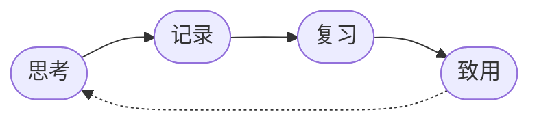

最小闭环 ： 思考,记录,复习,致用 

> 五线谱渲染已可用，见 [[五线谱测试]]




> [!TIP] 
> 我是一个TIP 

> [!NOTE] 
> 我是一个NOTE 


> [!WARNING] 
> 我是一个WARNING 


> [!DANGER] 
> > 我是一个DANGER

---

## 🎲 Three.js 测试

```threejs
var scene = new THREE.Scene();
scene.background = new THREE.Color(0x1a1a2e);

var camera = new THREE.PerspectiveCamera(75, w / h, 0.1, 1000);
camera.position.z = 3;

var renderer = new THREE.WebGLRenderer({ antialias: true });
renderer.setSize(w, h);
renderer.setPixelRatio(Math.min(window.devicePixelRatio, 2));
container.appendChild(renderer.domElement);

var geometry = new THREE.BoxGeometry(1, 1, 1);
var material = new THREE.MeshStandardMaterial({ color: 0x00bfff, metalness: 0.3, roughness: 0.4 });
var cube = new THREE.Mesh(geometry, material);
scene.add(cube);

var ambient = new THREE.AmbientLight(0x404040);
scene.add(ambient);
var light = new THREE.DirectionalLight(0xffffff, 1);
light.position.set(1, 2, 2);
scene.add(light);

function animate() {
  requestAnimationFrame(animate);
  cube.rotation.x += 0.01;
  cube.rotation.y += 0.02;
  renderer.render(scene, camera);
}
animate();

window.addEventListener('resize', function() {
  var r = container.getBoundingClientRect();
  renderer.setSize(r.width, r.height);
  camera.aspect = r.width / r.height;
  camera.updateProjectionMatrix();
});
```

---

### 🌀 旋转圆环 + 粒子背景

```threejs
var scene = new THREE.Scene();

var camera = new THREE.PerspectiveCamera(60, w / h, 0.1, 1000);
camera.position.z = 5;

var renderer = new THREE.WebGLRenderer({ antialias: true });
renderer.setSize(w, h);
renderer.setPixelRatio(Math.min(window.devicePixelRatio, 2));
container.appendChild(renderer.domElement);

// 粒子背景
var starsGeo = new THREE.BufferGeometry();
var starCount = 1000;
var positions = new Float32Array(starCount * 3);
for (var i = 0; i < starCount * 3; i++) {
  positions[i] = (Math.random() - 0.5) * 200;
}
starsGeo.setAttribute('position', new THREE.BufferAttribute(positions, 3));
var starsMat = new THREE.PointsMaterial({ color: 0xffffff, size: 0.3 });
var stars = new THREE.Points(starsGeo, starsMat);
scene.add(stars);

// 主环
var torusGeo = new THREE.TorusGeometry(1.5, 0.3, 16, 64);
var torusMat = new THREE.MeshStandardMaterial({
  color: 0xff6b6b,
  metalness: 0.6,
  roughness: 0.3
});
var torus = new THREE.Mesh(torusGeo, torusMat);
torus.rotation.x = Math.PI / 4;
scene.add(torus);

// 内环
var torus2Geo = new THREE.TorusGeometry(1.1, 0.15, 16, 48);
var torus2Mat = new THREE.MeshStandardMaterial({
  color: 0x4ecdc4,
  metalness: 0.4,
  roughness: 0.5
});
var torus2 = new THREE.Mesh(torus2Geo, torus2Mat);
torus2.rotation.x = -Math.PI / 4;
scene.add(torus2);

var ambient = new THREE.AmbientLight(0x404040);
scene.add(ambient);
var light = new THREE.DirectionalLight(0xffffff, 1);
light.position.set(2, 3, 4);
scene.add(light);
var light2 = new THREE.DirectionalLight(0xff6b6b, 0.5);
light2.position.set(-2, -1, 3);
scene.add(light2);

function animate() {
  requestAnimationFrame(animate);
  torus.rotation.y += 0.01;
  torus2.rotation.y -= 0.015;
  stars.rotation.y += 0.0005;
  renderer.render(scene, camera);
}
animate();
```

---

### 🔮 发光球体 + 地面反射

```threejs
var scene = new THREE.Scene();
scene.background = new THREE.Color(0x0a0a1a);

var camera = new THREE.PerspectiveCamera(50, w / h, 0.1, 1000);
camera.position.set(3, 2, 5);
camera.lookAt(0, 0, 0);

var renderer = new THREE.WebGLRenderer({ antialias: true });
renderer.setSize(w, h);
renderer.setPixelRatio(Math.min(window.devicePixelRatio, 2));
container.appendChild(renderer.domElement);

// 地面
var floorGeo = new THREE.PlaneGeometry(8, 8);
var floorMat = new THREE.MeshStandardMaterial({
  color: 0x222244,
  metalness: 0.8,
  roughness: 0.2,
  side: THREE.DoubleSide
});
var floor = new THREE.Mesh(floorGeo, floorMat);
floor.rotation.x = -Math.PI / 2;
floor.position.y = -1.2;
scene.add(floor);

// 球体
var sphereGeo = new THREE.SphereGeometry(1, 48, 48);
var sphereMat = new THREE.MeshStandardMaterial({
  color: 0x00bfff,
  emissive: 0x0044ff,
  emissiveIntensity: 0.3,
  metalness: 0.3,
  roughness: 0.2
});
var sphere = new THREE.Mesh(sphereGeo, sphereMat);
sphere.position.y = 0.3;
scene.add(sphere);

// 小卫星
var satGeo = new THREE.SphereGeometry(0.15, 16, 16);
var satMat = new THREE.MeshStandardMaterial({ color: 0xff6b6b, emissive: 0xff2200, emissiveIntensity: 0.5 });
var satellite = new THREE.Mesh(satGeo, satMat);
scene.add(satellite);

var ambient = new THREE.AmbientLight(0x101030);
scene.add(ambient);
var light = new THREE.DirectionalLight(0xffffff, 1.5);
light.position.set(5, 10, 5);
scene.add(light);

var angle = 0;
function animate() {
  requestAnimationFrame(animate);
  sphere.rotation.y += 0.005;
  sphere.position.y = 0.3 + Math.sin(Date.now() * 0.001) * 0.1;
  angle += 0.02;
  satellite.position.x = Math.cos(angle) * 1.8;
  satellite.position.z = Math.sin(angle) * 1.8;
  satellite.position.y = 0.3 + Math.sin(angle * 2) * 0.3;
  renderer.render(scene, camera);
}
animate();
```

---

### 🏗️ 随机方块塔

```threejs
var scene = new THREE.Scene();
scene.background = new THREE.Color(0x1a1a2e);

var camera = new THREE.PerspectiveCamera(60, w / h, 0.1, 1000);
camera.position.set(5, 4, 5);
camera.lookAt(0, 0, 0);

var renderer = new THREE.WebGLRenderer({ antialias: true });
renderer.setSize(w, h);
renderer.setPixelRatio(Math.min(window.devicePixelRatio, 2));
container.appendChild(renderer.domElement);

var colors = [0xff6b6b, 0x4ecdc4, 0x45b7d1, 0xf9ca24, 0xa29bfe];
var cubes = [];

for (var y = 0; y < 5; y++) {
  var size = 5 - y;
  for (var ix = 0; ix < size; ix++) {
    for (var iz = 0; iz < size; iz++) {
      var geo = new THREE.BoxGeometry(0.8, 0.8, 0.8);
      var mat = new THREE.MeshStandardMaterial({
        color: colors[y % colors.length],
        metalness: 0.3,
        roughness: 0.4
      });
      var cube = new THREE.Mesh(geo, mat);
      cube.position.set(
        ix - (size - 1) / 2,
        y * 0.85 - 1,
        iz - (size - 1) / 2
      );
      scene.add(cube);
      cubes.push(cube);
    }
  }
}

var ambient = new THREE.AmbientLight(0x404040);
scene.add(ambient);
var light = new THREE.DirectionalLight(0xffffff, 1);
light.position.set(3, 5, 3);
scene.add(light);

function animate() {
  requestAnimationFrame(animate);
  scene.rotation.y += 0.003;
  cubes.forEach(function(c, i) {
    c.rotation.x += 0.01;
    c.rotation.y += 0.02;
  });
  renderer.render(scene, camera);
}
animate();
```
---

### 🖱️ 带 OrbitControls 的交互场景（可拖拽旋转）

```threejs-orbit
var scene = new THREE.Scene();
scene.background = new THREE.Color(0x1a1a2e);

var camera = new THREE.PerspectiveCamera(45, w / h, 0.1, 1000);
camera.position.set(4, 3, 5);
camera.lookAt(0, 0, 0);

var renderer = new THREE.WebGLRenderer({ antialias: true });
renderer.setSize(w, h);
renderer.setPixelRatio(Math.min(window.devicePixelRatio, 2));
renderer.shadowMap.enabled = true;
container.appendChild(renderer.domElement);

var gridHelper = new THREE.GridHelper(10, 10, 0x4ecdc4, 0x45b7d1);
scene.add(gridHelper);

var cubes = [];
var colors = [0xff6b6b, 0x4ecdc4, 0x45b7d1, 0xf9ca24, 0xa29bfe, 0xfd79a8];
for (var i = 0; i < 12; i++) {
  var size = 0.3 + Math.random() * 0.5;
  var geo = new THREE.BoxGeometry(size, size, size);
  var mat = new THREE.MeshStandardMaterial({
    color: colors[i % colors.length],
    metalness: 0.4,
    roughness: 0.3
  });
  var cube = new THREE.Mesh(geo, mat);
  var angle = (i / 12) * Math.PI * 2;
  var radius = 1.5 + Math.random() * 1;
  cube.position.set(Math.cos(angle) * radius, Math.random() * 2 - 0.5, Math.sin(angle) * radius);
  cube.rotation.set(Math.random() * Math.PI, Math.random() * Math.PI, 0);
  scene.add(cube);
  cubes.push({ mesh: cube, angle: angle, radius: radius, speed: 0.002 + Math.random() * 0.005 });
}

var ambient = new THREE.AmbientLight(0x303050);
scene.add(ambient);
var light = new THREE.DirectionalLight(0xffffff, 1);
light.position.set(3, 5, 3);
scene.add(light);

var controls = new THREE.OrbitControls(camera, renderer.domElement);
controls.enableDamping = true;
controls.dampingFactor = 0.05;

function animate() {
  requestAnimationFrame(animate);
  controls.update();
  renderer.render(scene, camera);
}
animate();
```

---

### 📐 TikZ 矢量图测试

```tikz
\begin{document}
\begin{tikzpicture}
\draw[help lines] (0,0) grid (5,3);
\draw[->,thick] (0,0) -- (5.3,0) node[right] {x};
\draw[->,thick] (0,0) -- (0,3.3) node[above] {y};
\draw[red,thick] (0,0) -- (4,2);
\filldraw[fill=yellow!80!black] (3,1.5) circle (0.3);
\draw (0,0) rectangle (1,1);
\draw (1,1) rectangle (2,2);
\draw (2,2) rectangle (3,3);
\node at (3,2.5) {Hello};
\end{tikzpicture}
\end{document}
```
