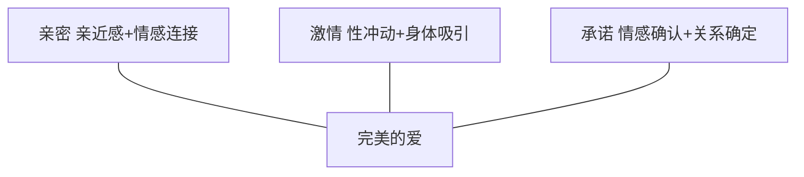

# 第02课：说了很多遍"我爱你"，你真的明白"爱"是什么了吗？

## 目录

- [爱情三角理论](#爱情三角理论)
- [亲密：情感连接的基石](#亲密情感连接的基石)
- [激情：爱情的火花](#激情爱情的火花)
- [承诺：关系的锚点](#承诺关系的锚点)
- [爱不是依赖](#爱不是依赖)
- [爱不是自我牺牲](#爱不是自我牺牲)
- [爱情能满足的四种需要](#爱情能满足的四种需要)
- [要点总结](#要点总结)

---

## 爱情三角理论

心理学家斯腾伯格提出经典的**爱情三角理论**，认为爱情由三个基本成分构成：

| 成分 | 定义 | 表现 |
|------|------|------|
| **亲密** | 亲近感和情感连接 | 彼此分享内心世界，互相理解 |
| **激情** | 性冲动和身体吸引 | 强烈的生理吸引和浪漫感觉 |
| **承诺** | 情感确认和关系确定 | 愿意为关系负责，共同规划未来 |

> 缺少任何一个要素，爱情都是不完整的。真正的爱是三个要素的平衡与统一。

---

## 亲密：情感连接的基石

亲密是爱情中最温柔的部分，表现为：

- 愿意分享内心真实的感受
- 在对方面前可以做真实的自己
- 彼此理解、支持、陪伴
- 有深层次的情感共鸣

**没有亲密的爱情**：只有激情和承诺，关系会显得空洞而机械。

---

## 激情：爱情的火花

激情是爱情中最炽热的部分，表现为：

- 强烈的身体吸引
- 想要靠近、触碰的冲动
- 浪漫的感觉和心跳加速
- 对彼此的渴望和思念

**没有激情的爱情**：只有亲密和承诺，关系更像是友情或亲情。

> [!note]
> 激情往往在关系初期最为强烈，但会随着时间自然消退。这不代表爱消失了，而是爱进入了更稳定的阶段。

---

## 承诺：关系的锚点

承诺是爱情中最理性的部分，表现为：

- 明确的情感确认："我们在一起"
- 对未来的共同规划
- 在困难时刻不轻易放弃
- 愿意为关系投入时间和精力

**没有承诺的爱情**：只有亲密和激情，是浪漫但不稳定的关系。

---

## 爱不是依赖

### 案例：过度依赖的恋爱

小雅与男友交往后，逐渐放弃了所有的社交活动和生活安排。她开始要求男友随时报告行踪，如果男友没有及时回复消息，就会焦虑不安。她认为这就是"太爱了"的表现。

### 依赖与爱的区别

| 依赖 | 爱 |
|------|-----|
| 害怕失去 | 愿意给予 |
| 控制对方 | 尊重对方 |
| 失去自我 | 保持独立 |
| 焦虑不安 | 信任安心 |

> 依赖是"我需要你，所以我爱你"；爱是"我爱你，所以我需要你"。前者是索取，后者是给予。

---

## 爱不是自我牺牲

### 案例：盲目付出的女友

小琳为了讨好男友，放弃了自己喜欢的专业，改学男友推荐的专业；放弃了自己的朋友圈，只陪男友的社交圈；甚至改变了自己的穿衣风格和兴趣爱好。她以为这就是爱的证明，但最终却感到越来越疲惫和迷失。

### 自我牺牲的危害

- **失去自我**：在关系中逐渐找不到自己的位置
- **积累怨气**：付出越多，期待越高，失望越大
- **关系失衡**：一方不断牺牲，一方不断索取
- **不可持续**：牺牲总有极限，一旦停止，关系就面临崩溃

> [!tip] 健康爱的关系
> 健康的关系是两个人各自完整，相互成就。不是一个人牺牲自己来成全另一个人。

---

## 爱情能满足的四种需要

1. **依赖需要**：有人可以依靠的安全感
2. **减少孤独的需要**：有人陪伴，不再孤单
3. **性需要**：生理层面的满足与亲密
4. **归属感的需要**：被接纳、被认可、有归属

> 好的爱情既能满足这些需要，又不会让人被这些需要所绑架。

---

## 要点总结

1. 爱情三角理论：亲密 + 激情 + 承诺，三者缺一不可
2. 亲密是情感连接，激情是身体吸引，承诺是关系锚点
3. 依赖不是爱——依赖是索取，爱是给予
4. 自我牺牲不是爱——牺牲会失去自我，导致关系失衡
5. 爱情能满足依赖、减少孤独、性、归属感四种需要
6. 真正的爱是完整的人之间的相互成就，而非残缺的人之间的相互依附
