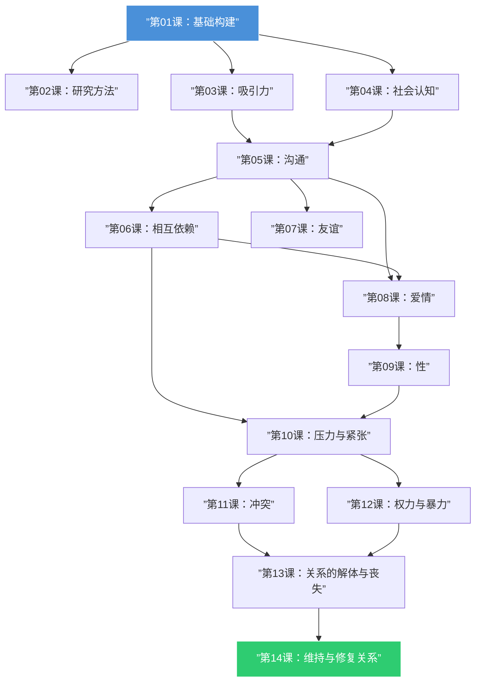

# 课程地图

## 路线说明

- **基础模块**（01-04）：理解亲密关系是什么，如何被研究，吸引力如何产生，以及我们的认知如何塑造关系
- **核心过程模块**（05-06）：沟通和相互依赖是所有亲密关系的运作核心
- **关系形式模块**（07-09）：友谊、爱情和性——三种不同的亲密关系形式
- **挑战模块**（10-12）：压力、冲突和暴力——关系的困难面
- **结局与维护模块**（13-14）：关系如何结束，以及如何维系和修复

> [!TIP] 先修关系
> 第01课是所有后续课程的基础。其他课程之间的依赖关系如上图所示，但理解每课的内容不需要严格按箭头顺序阅读。