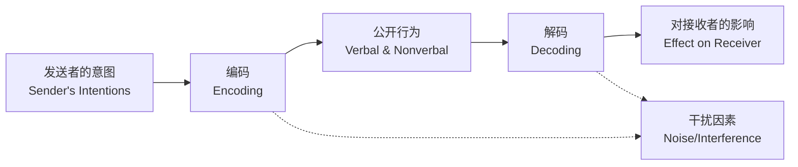
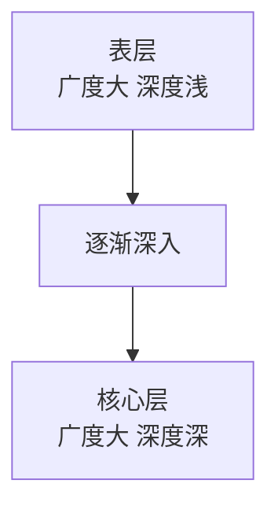

# 第05课：沟通

## Learning Objectives

- 理解**人际间隙**（interpersonal gap）的概念——意图与影响之间的差距
- 掌握**非语言沟通**（nonverbal communication）的七个组成部分及其功能
- 了解**自我表露**（self-disclosure）如何通过**社会渗透理论**（social penetration theory）发展亲密关系
- 识别**沟通功能障碍**（dysfunctional communication）的关键模式（Gottman 研究）
- 掌握改善沟通的具体方法：行为描述、XYZ 陈述、主动倾听

## 沟通的基本模型

> [!QUOTE] 核心洞见
> "There is often a discrepancy—an interpersonal gap—between what the sender intends to say and what the listener thinks he or she hears." — Gottman et al., 1976

沟通远比我们想象的复杂。一个简单的沟通模型包含以下环节：

关键洞察：从一个人的**意图**到消息对他人产生的**影响**，中间存在多个可能出错的步骤。这种差距被称为**人际间隙**（interpersonal gap）。

> [!WARNING] 反直觉发现
> 人际间隙在亲密关系中**比在陌生人之间更常见**（Savitsky et al., 2011）。我们期待伴侣理解我们，因此不像对陌生人那样努力检查是否在同一频道上——而这恰恰导致了更多误解。

**伤心案例**：一个害羞的男生用"这周末有什么计划？"来暗示约会意图，以为自己的浪漫意图很明显。对方没有察觉到约会暗示，给出了平淡的回应。男生感到被拒绝，保持了距离——而对方从未意识到发生了什么（Vorauer et al., 2003）。

## 非语言沟通

### 五个关键功能

| 功能 | 描述 | 例子 |
|------|------|------|
| **提供信息**（Providing Information） | 行为让他人推断意图、感受 | 丈夫的面部表情让妻子判断他心情不好 |
| **调节互动**（Regulating Interaction） | 提供线索来调节顺畅的对话交替 | 声音落下时开始注视对方，对方意识到轮到自己说话 |
| **定义关系性质**（Defining the Relationship） | 非语言行为揭示关系类型 | 恋人站得更近、触碰更多、对视更多 |
| **人际影响**（Interpersonal Influence） | 有目标导向的行为来影响他人 | 请求帮助时前倾、触碰手臂、专注凝视 |
| **印象管理**（Impression Management） | 管理非语言行为来创造或强化特定形象 | 去派对路上吵架，到达后牵手假装快乐 |

### 非语言沟通的七个组成部分

1. **面部表情**（Facial Expression）
   - 快乐、悲伤、恐惧、愤怒、惊讶、厌恶、轻蔑——七种**跨文化通用的表情**（Cordaro et al., 2017）
   - 天生如此：盲人从出生起就展示与其他所有人相同的面部表情（Hwang & Matsumoto, 2016）
   - **惊人发现**：大学毕业照中笑容越大的人，离婚概率越低——笑容最小的人离婚可能性是笑容最大者的**约5倍**（Hertenstein et al., 2009）
   - **表情管理**（Display Rules）：人们通过强化、弱化、中和或伪装来管理表情。但真实笑容会牵动眼周肌肉（"杜兴微笑"），而假笑只有约25%的人会激活这些肌肉（Gunnery et al., 2013）

2. **注视行为**（Gazing Behavior）
   - 瞳孔在看向感兴趣的东西时会放大——可用于判断性取向（Watts et al., 2017）
   - 注视定义了关系：恋人比朋友花更多时间注视对方
   - 友好的注视让注视者更有魅力

3. **身体动作**（Body Movement）
   - 手势在不同文化间差异很大
   - 身体姿势和动作也传递信息

4. **触摸**（Touch）
   - 不同类型的触碰有截然不同的含义
   - 包含亲密触碰（intimate touch）和社交触碰（social touch）

5. **人际距离**（Interpersonal Distance）
   - 四种距离区域：亲密区（intimate）、个人区（personal）、社交区（social）、公共区（public）
   - 不同关系使用不同距离

6. **气味**（Smell）
   - 关于情绪的信息通过体味传递给他人

7. **副语言**（Paralanguage）
   - 除词语外的所有声音变化：节奏、语速、音量、音调
   - 同一句话用不同副语言说，含义可以完全相反

### 非语言敏感性

> [!IMPORTANT] 性别差异
> 不幸福的配偶，尤其是丈夫，在非语言沟通方面表现较差。非语言沟通能力对关系满意度有显著影响。

## 语言沟通

### 自我表露

**自我表露**（self-disclosure）是向伴侣分享个人信息的过程。它是亲密关系的核心机制。

#### 社会渗透理论

**社会渗透理论**（Social Penetration Theory, Altman & Taylor, 1973）用一个"洋葱"模型来描述自我表露的发展：

- **广度**（Breadth）：谈论话题的范围
- **深度**（Depth）：谈论话题的亲密程度
- 关系发展时，广度和深度同时增加
- **互惠性**（Reciprocity）：一方的表露通常引发另一方的同等表露

#### 感知到的回应性

> [!QUOTE]
> "Intimacy develops when we perceive responsiveness in others that indicates that they understand us and care about us."

亲密关系的真正发展不仅取决于自我表露本身，更取决于**感知到的对方回应性**（perceived partner responsiveness）——对方是否理解、关心和重视我们。

#### 秘密与回避话题

即使是亲密伴侣之间，也存在一些**禁忌话题**（taboo topics）和秘密。这是正常的。

#### 自我表露与关系满意度

- 适当的自我表露促进喜欢和满足
- 表达爱意对我们有实质性的健康益处

### 性别差异

| 维度 | 女性 | 男性 |
|------|------|------|
| 谈论话题 | 更可能谈论感受和人际关系 | 更可能谈论非个人兴趣 |
| 交谈量 | 与男性相当（没有显著差异） | 与女性相当 |
| 自我表露 | 在同性友谊中表露更多 | 在同性友谊中表露较少，直到与女性在一起才真正打开心扉 |
| "大男子"型男性 | — | 即使与朋友也极少自我表露，最深的亲密只与女性分享 |

## 沟通中的功能障碍

### 不幸福夫妻的沟通模式

> [!IMPORTANT] Gottman 的关键发现
> 不幸福夫妻并非在"想说什么"上与幸福夫妻有差异，而是他们的消息在伴侣那里的"影响"更加批评性和不尊重（Gottman et al., 1976）。

**不良沟通模式**：

| 模式 | 说明 |
|------|------|
| **厨房水槽**（Kitchen-sinking） | 争论时把过去所有不满都倒出来 |
| **偏离正轨**（Drifting off-beam） | 回避当前问题，转移到无关话题 |
| **读心术**（Mindreading） | 自以为知道对方在想什么 |
| **打断**（Interruptions） | 不让对方说完 |
| **"是的，但是"**（Yes-butting） | 表面同意实际反驳 |
| **交叉抱怨**（Cross-complaining） | 用抱怨回应抱怨 |

### Gottman 的"启示录四骑士"

John Gottman 通过数十年研究发现，以下四种行为是婚姻失败的**最强预测因子**：

| 骑士 | 说明 | 危害 |
|------|------|------|
| **批评**（Criticism） | 攻击对方的人格而非具体行为→"你总是这么自私" | 让对方感到被攻击而非被理解 |
| **蔑视**（Contempt） | 嘲笑、讽刺、翻白眼、居高临下 | 最具破坏性——表达厌恶和不尊重 |
| **防御**（Defensiveness） | 为自己的行为辩护，反指责对方 | 阻止问题解决，火上浇油 |
| **筑墙**（Stonewalling） | 退出对话，拒绝回应 | 最常见于男性，表示情感退出 |

> [!WARNING] 5:1 比率
> Gottman 发现，幸福夫妻在冲突中保持**正面互动与负面互动之比至少为 5:1**。低于这个比率，离婚风险显著增加（Gottman & Levenson, 1992）。

## 改善沟通的方法

### 说清楚我们的意思

| 技巧 | 说明 | 例子 |
|------|------|------|
| **行为描述**（Behavior Description） | 只描述具体行为，不攻击人格 | 不要说"你真懒"，而说"你这周没有洗碗" |
| **我陈述**（I-Statements） | 表达自己的感受而非指责对方 | "我感到难过"而非"你让我难过" |
| **XYZ 陈述**（XYZ Statements） | 在 X 情境下，当你做 Y 时，我感到 Z | "当你在朋友面前打断我（Y）时，我感到不被尊重（Z）" |

### 主动倾听

| 技巧 | 说明 |
|------|------|
| **复述/释义**（Paraphrasing） | 用自己的话重复对方的意思，确认理解正确 |
| **感知检查**（Perception Checking） | 询问对方你的理解是否准确→"你听起来很生气，是这样吗？" |

### 保持礼貌和冷静

- 避免长时间的**负面情绪互惠**（negative affect reciprocity）——你对我凶，我就对你更凶
- 感到生气时**请求暂停**（time out），独处冷静后再回来谈

### 尊重与认可的力量

> [!TIP] 即使不同意，也要沟通尊重
> "Partners should communicate respect and recognition of the other's point of view even when they disagree."

即使你不同意对方的观点，也要让对方感受到他的意见被认真对待了。**蔑视是必须不惜一切代价避免的**。

## 应用练习

> [!QUESTION] 反思你的沟通模式
> 1. 回顾你最近一次与伴侣或好友的冲突。你使用了"启示录四骑士"中的哪些行为？你是否可以用 XYZ 陈述或行为描述来重新表达你的不满？
> 2. 在你现有的亲密关系中，你们在非语言沟通层面是否"同频"？尝试观察对方的面部表情、身体姿势和声音变化——你读到的信息与对方真实感受一致吗？
> 3. 想想你的自我表露模式。你是否因为害怕脆弱而回避某些话题？社会渗透理论告诉我们，适度的互惠性自我表露可以促进亲密——你可以安全地尝试向信任的人分享更多吗？

思考指引

**问题1**：注意区分"批评"和"抱怨"。抱怨针对具体行为（"你昨晚没有倒垃圾"），批评攻击人格（"你总是这么不负责任"）。Gottman 建议练习 XYZ 陈述：在[具体情境]下，当你做[具体行为]时，我感到[具体感受]。

**问题2**：一项研究让夫妻在"谈话桌"（talk table）上沟通——他们在说话前先记录意图，然后再记录伴侣感受到的影响。不幸福夫妻的意图和影响之间的差距显著大于幸福夫妻（Gottman et al., 1976）。试着做这个练习：先写下你想表达的意思，然后问对方"你听到了什么"。

**问题3**：自我表露有风险——**脆弱性**（vulnerability）意味着对方可能拒绝或滥用你分享的信息。但社会渗透理论表明，亲密关系的建立必然需要承担这种风险。**关键**是选择安全、有回应性的伴侣来逐步分享。

## 核心引用

- Altman, I., & Taylor, D. A. (1973). *Social penetration: The development of interpersonal relationships*. Holt, Rinehart & Winston.
- Gottman, J. M., & Levenson, R. W. (1992). Marital processes predictive of later dissolution: Behavior, physiology, and health. *Journal of Personality and Social Psychology, 63*, 221–233.
- Hertenstein, M. J., Hansel, C. A., Butts, A. M., & Hile, S. N. (2009). Smile intensity in photographs predicts divorce later in life. *Motivation and Emotion, 33*, 99–110.

## 继续学习

下一课：[第06课：相互依赖](0006-interdependency)——以经济视角理解亲密关系中的回报、成本、比较水平与承诺。