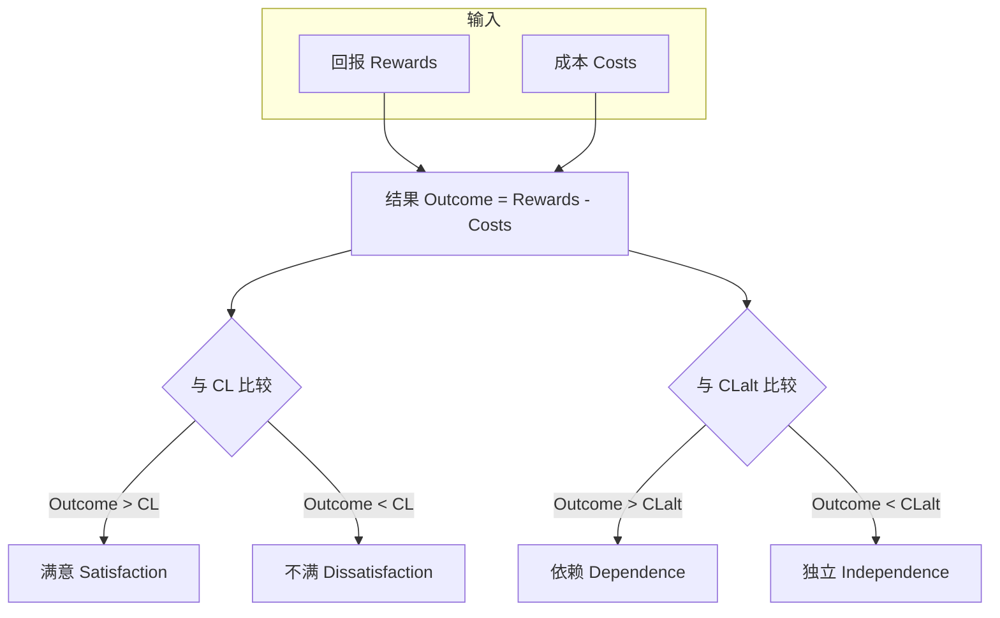
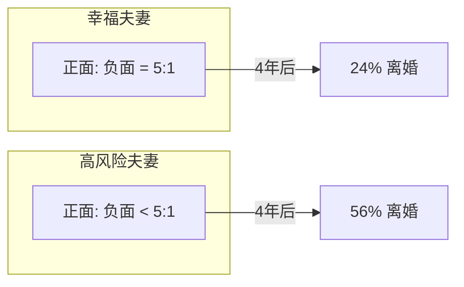
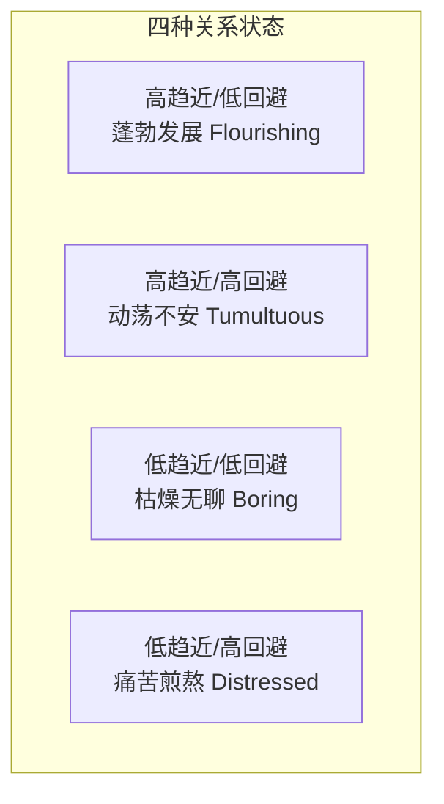
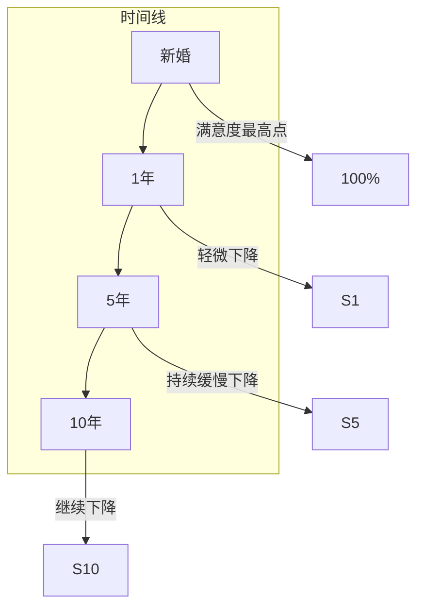
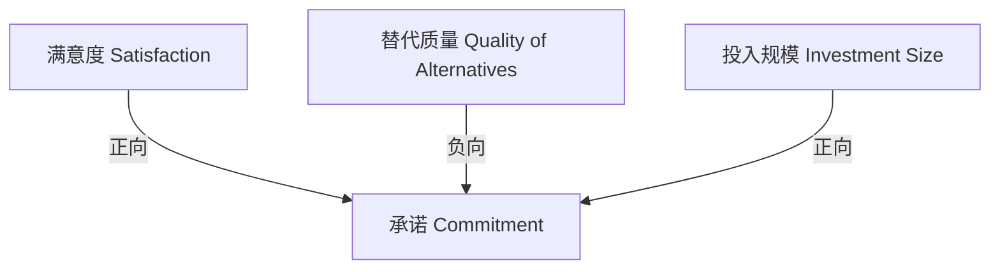

# 第06课：相互依赖

## Learning Objectives

- 理解**社会交换**（social exchange）的核心要素：回报、成本、结果
- 区分**比较水平**（CL）与**替代选择比较水平**（CLalt）对满意度和依赖度的不同影响
- 掌握**投入模型**（Investment Model）：满意度、替代质量、投入规模如何共同决定承诺
- 理解**趋近动机**（approach motivation）与**回避动机**（avoidance motivation）的独立运作
- 辨析**交换关系**（exchange relationships）与**共有关系**（communal relationships）的区别
- 掌握**公平理论**（equity theory）及其与结果质量的相对重要性
- 理解**承诺**（commitment）的三种类型及其后果

## 社会交换

> [!QUOTE] 核心假设
> "Interdependency theories assume that we're all like shoppers in an interpersonal marketplace: We're all seeking the most fulfilling relationships that are available to us."

**相互依赖理论**（Interdependence Theory, Thibaut & Kelley, 1959）是理解亲密关系的经济视角。它认为我们在关系中像"人际会计"一样，持续计算着互动中的收益和损失。

### 核心要素

| 术语 | 定义 | 衡量 |
|------|------|------|
| **回报**（Rewards） | 互动中令人满意的体验和好处 | 从方向指引到亲密的接纳与支持 |
| **成本**（Costs） | 互动中惩罚性的、不愉快的体验 | 金钱支出、不确定性、挫折感、失去的机会 |
| **结果**（Outcome） | 回报减去成本后的净收益或净损失 | Outcome = Rewards - Costs |
| **比较水平**（CL） | 我们期望并认为自己应得的结果水平 | 基于过去经验。CL 高的人期望更高 |
| **替代选择比较水平**（CLalt） | 离开当前关系后能找到的最佳替代结果 | 包括新人、独身、各种离开成本 |

### CL 与满意度

> [!NOTE] 关键洞见
> **满意度取决于结果与期望的差距，而不是结果的绝对值。** 一个富有的明星可能拥有令人惊叹的伴侣但仍然不满——因为他的 CL 太高了。

$$
\text{Outcomes} - \mathrm{CL} = \text{Satisfaction or Dissatisfaction}
$$

### CLalt 与依赖度

> [!IMPORTANT] 最具颠覆性的洞见
> **满意度不是决定关系是否持续的主要因素。** 即使不满意，只要认为离开后会更糟，人们就会留在关系中。反之，即使满意，如果有更好的选择，人们也可能离开。

$$
\text{Outcomes} - \mathrm{CL_{alt}} = \text{Dependence or Independence}
$$

### 四种关系类型

根据结果、CL 和 CLalt 的相对高低，可以划分四种关系类型：

| 类型 | 结果 vs CL | 结果 vs CLalt | 状态 |
|------|-----------|--------------|------|
| **快乐且稳定** | 结果 > CL | 结果 > CLalt | 满意且依赖→不会离开 |
| **不快乐但稳定** | 结果 < CL | 结果 > CLalt | 不满但无法离开 |
| **快乐但不稳定** | 结果 > CL | 结果 < CLalt | 满意但有更好的选择→可能会离开 |
| **不快乐且不稳定** | 结果 < CL | 结果 < CLalt | 不满且有更好的选择→即将结束 |

> [!TIP] 日常生活中
> 不快乐但稳定的关系类似一份你讨厌但无法辞职的工作（因为没有更好的工作机会）。快乐但不稳定的关系则像你喜欢当前工作但收到了一个更好的 offer。

### 时间带来的变化

- **CL 会随着经验上升**：当你的伴侣太好了，你会逐渐习惯，CL 上升，满意度下降
- 研究追踪 5500 名荷兰年轻人 18 年发现：结婚确实让人更幸福，但**这种幸福感在 2 年后基本消退**（Lucas, 2007）
- **文化变迁推高 CL 和 CLalt**：人们对婚姻的期待从"爱与被爱"扩展到"自我实现和个人成长"；女性经济独立降低了离开婚姻的代价

> [!QUOTE]
> "Our spouses are supposed to be 'our best friends, workout partners, spiritual brethren, likeminded sexual partners, culinary compatriots, parental supporters, financial planners, philanthropic kindred spirits, and travel companions.'" — DeWall, 2015

## 关系的经济

### 负面比正面更强

> [!WARNING] 关键发现
> "Bad is stronger than good." — Baumeister et al., 2001

在亲密关系中，负面事件的权重远大于正面事件：
- 一条批评和一个赞美——赞美会缓解批评，但整体仍然让你有一些痛苦
- **损失比收益影响更大**：丢了 20 美元比捡到 20 美元对人的情绪影响更大
- **Gottman 的 5:1 规则**：为了保持关系满意度，正面互动与负面互动的比率至少需要 5:1

（Gottman & Levenson, 1992）

### 趋近与回避动机

回报和成本是两种独立的过程，**它们不是同一枚硬币的两面**。

| 动机 | 目标 | 实现时感受 | 未实现时感受 |
|------|------|-----------|-------------|
| **趋近动机**（Approach Motivation） | 追求愉悦、获得奖励 | 热情、兴奋 | 枯燥、停滞 |
| **回避动机**（Avoidance Motivation） | 规避惩罚、减少痛苦 | 安全、平静 | 焦虑、冲突 |

> [!NOTE] 重要结论
> 没有负面事件不等于幸福——一段安全但没有火花的关系是**无聊的**（boring）。无聊是未来不满的预测因素。2009 年的一项研究显示，在婚姻早期感到关系变得单调的配偶，9 年后比那些不无聊的配偶更不幸福（Tsapelas et al., 2009）。

### 自我扩展模型

**自我扩展模型**（Self-Expansion Model, Aron et al., 2013）认为：我们被那些能扩展我们兴趣、技能和经历的关系所吸引。

- 新恋情令人兴奋的原因之一：初期的亲密关系扩展了我们的自我概念
- 但随着伴侣变得熟悉，自我扩展减慢，关系开始变得平淡
- **解药**：一起参与新奇且令人兴奋的活动

> [!TIP] 实用的关系维护建议
> "To keep things exciting once the shiny, new phase of a relationship is over, go on strange and exciting new adventures together." — Savage, 2019

### 关系的湍流

**关系湍流模型**（Relational Turbulence Model, Knobloch & Solomon, 2004）描述了发展中的关系通常会经历的一段调整和动荡期：

1. 初期：相互依赖较少，干扰较少
2. 亲密增加 → 对方的日常干扰增多，不确定性上升 → **湍流高峰**
3. 适应新的相互依赖 → 关系稳定下来
4. 满意度重新开始缓慢上升

### 婚姻满意度的典型轨迹

- 大多数夫妻的婚姻满意度在最初几年**逐渐下降**
- 约 1/4 的夫妻不会经历这种下降（Karney & Bradbury, 2020）
- 幸福的夫妻往往：安全型依恋、低消极情绪性、高自尊、**保持现实的期望**

> [!WARNING] 过高期望的危险
> 对婚姻抱有最美好期望的人，反而是几年后最不幸福的配偶。那些拥有最现实的婚姻观的人在长期中最满意（Lavner et al., 2013）。

**为什么关系中会出现意料之外的成本？**
1. 缺乏努力：追到伴侣后不再费力保持魅力
2. 相互依赖放大冲突：亲密让摩擦更频繁
3. 获取武器：伴侣知道你的秘密和弱点
4. 不愉快的意外：如孩子带来的关系冲击
5. 不现实的期望：理想化期待与实际体验的落差

## 我们真的这么贪婪吗？

### 相互依赖的本质

即使人们是自私的，相互依赖也会促使他们慷慨——因为让伴侣快乐有助于维持一段有价值的关系。

> [!QUOTE]
> "Actions that would be costly if enacted with a stranger can actually be rewarding in a close relationship because they give pleasure to one's partner and increase the likelihood that one will receive valuable rewards in return." — Kelley, 1979

### 交换关系 vs. 共有关系

| 维度 | 交换关系 | 共有关系 |
|------|---------|---------|
| 做善事后 | 希望对方立即回报 | 不希望对方立即回报 |
| 接受善事后 | 希望立即偿还 | 不希望立即偿还 |
| 共同工作时 | 区分各自贡献 | 不分彼此 |
| 帮助他人后 | 情绪变化小 | 情绪改善明显 |
| 不接受求时 | 情绪无变化 | 情绪变差 |
| 在婚姻中 | 满意度较低 | 满意度较高 |

（Clark & Mills, 2012）

**共有强度**（Communal Strength）衡量的是一个人对特定伴侣需求的回应意愿。共有强度越高，人们越愿意为对方做出小牺牲，双方也更幸福。

### 公平理论

**公平理论**（Equity Theory, Hatfield & Rapson, 2012）认为人们最满意的是**双方结果与贡献的比例相称**的关系：

$$
\frac{\text{你的结果}}{\text{你的贡献}} = \frac{\text{伴侣的结果}}{\text{伴侣的贡献}}
$$

| 状态 | 定义 | 感受 |
|------|------|------|
| **公平**（Equitable） | 结果/贡献比例相当 | 最满意 |
| **受益过度**（Overbenefited） | 得到超过应得 | 轻微的愧疚 |
| **受益不足**（Underbenefited） | 得到少于应得 | 愤怒、怨恨、最不满 |

> [!IMPORTANT] 公平 vs. 结果质量
> 研究结论是：**结果水平（outcome level）比公平更重要**。如果你获得的结果非常丰厚，不公平（受益过度）就不是大问题。但如果你的结果很差，即使公平也于事无补（Cate et al., 1988）。

公平最敏感的领域：**家务分工和育儿**。当这些任务公平分配时，双方对婚姻更满意。美国职业女性做的家务是丈夫的**约两倍**（Pew Research Center, 2015）。

> [!TIP] 对男性的建议
> "Men should do more housework, child care, and affectional maintenance if they wish to have a happy wife." — Gottman & Carrère, 1994
> （优待：做自己份内家务的男性与妻子有更频繁、更满意的性生活——Carlson & Soller, 2019）

### 满足者 vs. 最大化者

| 类型 | 策略 | 结果 |
|------|------|------|
| **满足者**（Satisficer） | 找到符合标准的好选择就停止搜索 | 对朋友和伴侣更满意 |
| **最大化者**（Maximizer） | 必须找到最佳选择，持续评估其他选项 | 承诺低、后悔多、满意度低 |

## 承诺的本质

### 投入模型

**投入模型**（Investment Model, Rusbult et al., 2012）认为承诺来自三个要素：

| 要素 | 影响方向 | 说明 |
|------|---------|------|
| **满意度**（Satisfaction） | 增加承诺 | 快乐的关系让人想继续 |
| **替代质量**（Quality of Alternatives） | 减少承诺 | 更好的选择诱惑你离开 |
| **投入规模**（Investment Size） | 增加承诺 | 离开时损失的东西——包括有形资产和无形心理利益 |

投入可以是**有形**的（家具、共同财产）或**无形**的（与对方家人的感情、共同朋友、回忆）。

### 三种类型的承诺

| 类型 | 动力 | 感受 |
|------|------|------|
| **个人承诺**（Personal Commitment） | 想要继续——因为吸引力、满意度 | 积极、渴望 |
| **约束承诺**（Constraint Commitment） | 不得不继续——因为离开成本太高 | 负担、被困 |
| **道德承诺**（Moral Commitment） | 应该继续——因为道德/宗教/誓言 | 责任、义务 |

（Johnson, 1999）

### 承诺的后果

| 后果 | 说明 |
|------|------|
| **迁就**（Accommodation） | 受到挑衅时不报复，克制自己不口出恶言 |
| **牺牲意愿**（Willingness to Sacrifice） | 为关系利益做自己不会做的事，或不做自己想做的事 |
| **贬低替代选择**（Derogation of Tempting Alternatives） | 觉得其他潜在伴侣不如单身时看到的那么有吸引力 |

## 应用练习

> [!QUESTION] 审视你的关系经济
> 1. 根据相互依赖理论，回忆你（或某段熟悉的关系）的结果、CL 和 CLalt。你的满意度指数是多少？你的依赖度指数是多少？你们属于哪一类关系类型？
> 2. 你的关系中，"趋近动机"（追求愉悦）和"回避动机"（规避冲突）哪个更强？你最近一次与伴侣的活动是趋近导向还是回避导向的？
> 3. 试试测量你们的共有强度：你愿意为对方付出到何种程度？你相信对方会同样回应你的需求吗？如果一方长期受益不足，关系可能面临什么风险？

思考指引

**问题1**：很多人惊讶地发现自己其实处于"不满意但稳定"的状态——关系不够好但也没有更好的选择。这不是一个坏位置，但意识到这一点可以帮助你思考：是降低 CL（调整期望）还是提高结果（增加关系中的积极互动），还是改善 CLalt（让自己更有选择权）？

**问题2**：研究表明，长期来看，高趋近动机的人更少孤独、更满意（Gable, 2006）。在关系中关注获得回报（"我们一起玩得开心"）比关注避免成本（"我们别吵架"）更有益。如果你们的关系正在变得无聊，尝试自我扩展——一起尝试你们都没做过的新活动。

**问题3**：公平最重要的领域可能是家务和育儿。如果一方承担了不成比例的家务劳动，受益不足方的怨恨会侵蚀关系质量。即使总体回报很高，长期的不公平也会导致不满。好消息是：共有关系比交换关系更令人满意——当你不需要时刻计算得失时，关系更幸福。

## 核心引用

- Thibaut, J. W., & Kelley, H. H. (1959). *The social psychology of groups*. Wiley.
- Rusbult, C. E., Martz, J. M., & Agnew, C. R. (1998). The Investment Model Scale: Measuring commitment level, satisfaction level, quality of alternatives, and investment size. *Personal Relationships, 5*, 357–391.
- Clark, M. S., & Mills, J. (2012). A theory of communal (and exchange) relationships. In P. A. M. Van Lange, A. W. Kruglanski, & E. T. Higgins (Eds.), *Handbook of theories of social psychology* (Vol. 2, pp. 232–250). Sage.
- Gottman, J. M., & Levenson, R. W. (1992). Marital processes predictive of later dissolution. *Journal of Personality and Social Psychology, 63*, 221–233.
- Aron, A., Lewandowski, G. W., Jr., Mashek, D., & Aron, E. N. (2013). The self-expansion model of motivation and cognition in close relationships. In J. A. Simpson & L. Campbell (Eds.), *The Oxford handbook of close relationships*. Oxford University Press.

## 继续学习

下一课：[第07课：友谊](0007-friendship)——友谊的本质、性别差异、友谊与爱情的区别、害羞与孤独。