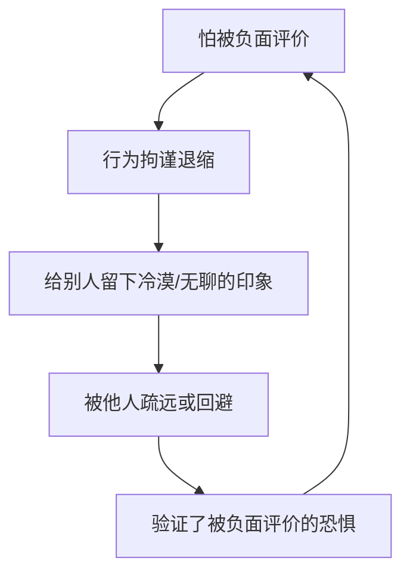

# 第07课：友谊

## Learning Objectives

- 理解友谊的核心特征：情感、共融、陪伴
- 掌握**友谊的规则**（rules of friendship）及其跨文化普遍性
- 区分友谊与爱情的关键差异
- 理解性别差异：女性友谊"面对面"（face-to-face）vs. 男性友谊"肩并肩"（side-by-side）
- 认识**异性友谊**（cross-sex friendships）的特殊挑战和"有福利的朋友"（friends with benefits）
- 了解**害羞**（shyness）和**孤独**（loneliness）的恶性循环
- 识别**黑暗三角**（Dark Triad）特质对友谊的破坏性

## 友谊的本质

> [!QUOTE]
> "Friendship is a voluntary, personal relationship, typically providing intimacy and assistance, in which the two parties like one another and seek each other's company." — Fehr, 1996

### 友谊的核心特征

友谊不仅仅是"喜欢某个人"，它是一个包含多维度的亲密关系：

| 特征 | 含义 | 体现 |
|------|------|------|
| **情感**（Affection） | 喜欢、信任、尊重彼此 | 重视忠诚和真实性 |
| **共融**（Communion） | 互相给予和自我表露 | 情感支持、实际帮助 |
| **平等**（Equality） | 双方偏好都得到重视 | 互惠互利的规范 |
| **陪伴**（Companionship） | 分享兴趣和活动 | 一起找乐子、娱乐 |

> [!IMPORTANT] 友谊有多重要？
> 一项研究发现，未婚年轻人中，**36%**认为友谊是他们"最亲密、最深入、最投入、最亲密"的当前关系（Berscheid et al., 1989）。
>
> 更令人惊讶的是，即使婚后，人们与朋友在一起时通常比与配偶或家人在一起时**更享受、更兴奋**。最佳时刻是配偶和朋友都同时在场的时候（Larson & Bradney, 1988）。

### 友谊的要素

#### 尊重（Respect）

令人尊重的人需要具备：令人称道的道德品质、体贴他人、接纳他人、诚实、愿意倾听（Frei & Shaver, 2002）。尊重越多，关系越满意。

#### 信任（Trust）

信任基于对对方会**善意对待我们、无私顾及我们利益**的信心（Rempel et al., 2001）。

> [!NOTE]
> 信任需要时间培养，但一旦失去就很难恢复。

#### 资本化（Capitalization）

当我们分享好消息时，好朋友会热情地回应，这增强了我们的快乐。**资本化**（capitalization）是指人们分享好消息并获得热情、有回报的回应，从而增加快乐和亲密度（Gable & Reis, 2010）。

#### 社会支持（Social Support）

四种类型的支持（Barry et al., 2009）：

| 类型 | 内容 | 例子 |
|------|------|------|
| **情感支持**（Emotional Support） | 关爱、接纳、安慰 | 考试前的鼓励 |
| **身体安慰**（Physical Comfort） | 拥抱、爱抚 | 受挫后的拥抱 |
| **建议支持**（Advice Support） | 信息和指导 | 职业规划建议 |
| **物质支持**（Material Support） | 金钱或物品 | 借车、借钱 |

> [!TIP] 重要的复杂性
> - **感知到的支持**比实际支持更重要——是"我们认为对方做了什么"而非对方实际做了什么
> - **最好的支持往往看不见**：悄然支持，不被接受者察觉（invisible support）
> - **支持要匹配需求**：不是所有支持都有益——考前复习时，情感支持可能增加焦虑，而实际帮助（做饭）才真正有用

#### 回应性（Responsiveness）

**感知到的伴侣回应性**（Perceived Partner Responsiveness）是亲密关系中最核心的要素——对方是否关注、理解、珍惜我们。这可能是友好朋友的所有特征中最**重要**的一个（Reis, 2013）。

### 友谊的规则

好朋友也会遵守规则。研究者发现了几条似乎**跨文化通用**的友谊规则（Argyle & Henderson, 1984）：

| 规则 |
|------|
| 不要唠叨 |
| 保守秘密 |
| 提供情感支持 |
| 在需要时主动提供帮助 |
| 信任对方并向对方倾诉 |
| 分享成功的消息 |
| 不要嫉妒对方的其他关系 |
| 在对方不在场时维护对方 |
| 主动回报债务、恩惠和赞美 |
| 在一起时努力让对方开心 |

总的来说，我们对好朋友的期望是（Hall, 2012）：
- **可信赖且忠诚**——以我们的最大利益为重
- **知己**——可以分享秘密
- **有趣且快乐的伴侣**
- **态度和兴趣相似**
- **在需要时提供实际帮助**

> [!WARNING]
> 女性对朋友有更高的标准，期望更多的忠诚、自我表露、享受和相似性（Hall, 2012）。

## 友谊与爱情的区别

| 维度 | 友谊 | 爱情 |
|------|------|------|
| 激情 | 低 | 高 |
| 排他性 | 低 | 高 |
| 性欲望 | 通常无 | 通常有 |
| 行为标准 | 约束较少 | 约束更严格 |
| 情感表达 | 较少外露 | 更多外露 |
| 共处时间 | 较少 | 较多 |
| 解体难度 | 较容易 | 更难 |

## 友谊的规则与性别差异

### 女性友谊 vs. 男性友谊

> [!QUOTE] 经典比喻
> "Women's friendships are 'face-to-face,' whereas men's are 'side-by-side.'" — Wright, 1982

| 维度 | 女性友谊（面对面） | 男性友谊（肩并肩） |
|------|-----------------|-----------------|
| 核心特征 | 情感分享和自我表露 | 共享活动、陪伴和竞争 |
| 通话时间 | 更多 | 更少 |
| 话题 | 人际关系、个人问题 | 非个人兴趣（如体育） |
| 自我表露 | 更多 | 更少 |
| 情感支持 | 更多 | 更少 |
| 情感表达 | 更多 | 更少 |

**后果**：女性通常有伴侣以外的亲密关系可倾诉，但男性往往没有。一项 1986 年研究发现：如果被问"如果你的伴侣要离开你，你会找谁倾诉？"，**几乎所有女性都能立刻说出一个同性朋友的名字，但只有少数男性能做到**。

> [!IMPORTANT] 为什么男性友谊不够亲密？
> 不是因为男性**没有能力**，而是因为**不太愿意**。文化规范和性别角色是主要原因。传统男性被鼓励"工具性"而非"表达性"。但在鼓励男性表达性友谊的社会（如中东），性别差异就消失了。

### 异性友谊

大多数人有异性朋友。但异性友谊面临一个同性友谊不会遇到的障碍：**确定这段关系是友谊还是爱情**。

**关键发现**：
- 男性更倾向于认为与女性朋友发生性关系是个好主意（Lehmiller et al., 2011）
- 男性通常会高估女性朋友对他们的性兴趣
- 女性通常会低估男性朋友的性兴趣
- **"性张力"**通常是人们最不喜欢异性友谊的地方

#### 有福利的朋友（Friends with Benefits, FWB）

| 类型 | 特征 |
|------|------|
| **真正的 FWB** | 真正的亲密朋友+性关系，彼此信任 |
| **Booty-call** | 纯粹为了性 |
| **转向浪漫关系** | 极少数成功（仅 15%）|
| **转为纯友谊** | 多数能成功（59%） |
| **分手** | 最常见的结局（31%一年后没有任何关系）|

（Machia et al., 2020）

### 个体差异

**黑暗三角**（Dark Triad）——三种具有破坏性的特质：

| 特质 | 特征 |
|------|------|
| **自恋**（Narcissism） | 傲慢、自我中心、 entitlement——初印象好但很快让人厌烦 |
| **马基雅维利主义**（Machiavellianism） | 愤世嫉俗、欺骗、操纵 |
| **精神病态**（Psychopathy） | 大胆、冲动、冷漠无情、缺乏悔意 |

> [!WARNING] 识别黑暗三角
> 这三个特质的共同点：低宜人性和低谦逊。他们更容易吹毛求疵、蔑视、防御和筑墙。最初他们的自信可能吸引人，但最终他们是**糟糕的朋友**。

### 宠物能做朋友吗？

研究表明宠物确实具有安抚作用：在有压力时，宠物的陪伴甚至比爱人的陪伴更能降低心率和血压（Allen et al., 2002）。养狗的人在 10 年内全因死亡率比不养狗的人低 **24%**（Kramer et al., 2019）。

## 友谊与生命周期

### 儿童到青少年

- 早期儿童：简单的玩伴
- 小学后期：**接纳**成为关键需求
- 青春期前：**亲密**需求出现——第一个真正的友谊诞生
- 青少年：**性需求**加入——朋友逐渐取代父母成为主要依恋对象

### 大学到成年

大学第一年暑假后发现高中友谊在消退，但到第一年末会建立新的友谊网络。毕业后，与朋友互动的人数减少，但互动的**深度增加**。

### 中年

**二人退缩**（Dyadic Withdrawal）：当人们有了浪漫伴侣，与家人和朋友的时间减少。订婚者每天与好友相处时间从约 **2 小时降到不到 30 分钟**（Milardo et al., 1983）。

> [!WARNING] 婚姻中的友谊陷阱
> 当夫妻没有任何共同朋友时，婚姻问题更多。拥有一些自己的朋友无害，但**只有排他性朋友**是危险的（Amato et al., 2007）。

### 老年

**社会情绪选择理论**（Socioemotional Selectivity Theory）认为：年轻时追求未来信息，社交网络大而多样；年老时意识到时间有限，追求情感满足，**宁缺毋滥**——保留少数亲密朋友，让更多普通关系淡出。

> [!TIP]
> 有好友的老年人比社交孤立者活得更长、更健康、更快乐（Gerstorf et al., 2016）。

## 友谊的困难

### 美国友谊的现状

| 指标 | 1985 年 | 现在 |
|------|---------|------|
| 没有任何密友的人 | 10% | **25%** |
| 只有一位知己的人 | — | 19% |
| 平均亲密伴侣数 | 3人 | **2人** |
| 独居成年人比例 | 较低 | **>1/8** |

（McPherson et al., 2006）

### 害羞

**害羞**（shyness）是社交中紧张、拘谨和焦虑的综合征。>80% 的人体验过。

| 特征 | 表现 |
|------|------|
| **害怕负面评价** | 总是担心别人不喜欢自己 |
| **自我怀疑** | 低自尊 |
| **社交能力不足** | 实际技能可能较低——或只是自以为低 |

**害羞的恶性循环**：

> [!TIP] 克服害羞的关键发现（Leary, 1986）
> 当研究中的噪音"大得不可能正常交谈"时，害羞的人的行为和**非害羞者毫无区别**——他们的害羞不是缺乏技能，而是害怕失败。**如果他们相信即使互动不顺也不会被责备，害羞就消失了。**
>
> 害羞的人不需要更多的社交技能培训——他们需要的是**更多冷静和自信**。

### 孤独

**孤独**（loneliness）不是独处——它是你想要的关系与你实际拥有的关系之间的**令人不快的差异**（Cacioppo et al., 2015）。

| 类型 | 定义 |
|------|------|
| **社交孤独**（Social Loneliness） | 缺乏社交网络和朋友 |
| **情感孤独**（Emotional Loneliness） | 缺乏至少一个亲密关系中的情感支持 |

> [!WARNING] 孤独的健康成本
> 孤独的人：血压更高、压力激素更高、睡眠更差、免疫系统功能更弱（Cacioppo et al., 2015）。全球范围内，50 岁以上孤独的人在接下来 6 年内死亡的风险显著高于社交连接良好的人（Holt-Lunstad et al., 2015）。

**孤独的恶性循环**：
- 孤独的人对他人持不信任和不喜欢的态度
- 他们的互动沉闷、浅薄，不自我表露
- 他人因此也不喜欢他们
- 孤独更加重

**性别差异**：

男性比女性平均更孤独——但这是因为传统男性依赖女性来获得亲密感，而女性通过女性朋友就能获得足够的亲密感。

| 情况 | 有伴侣的男性 | 无伴侣的男性 | 有伴侣的女性 | 无伴侣的女性 |
|------|-------------|-------------|-------------|-------------|
| 孤独得分 | 16.9 | **31.2** | 20.2 | 24.3 |

**如何克服孤独**（Cutrona, 1982）：
- 把孤独归因于**暂时的、可改变的因素**（而非长期缺陷）
- **寻找新朋友而不是寻找浪漫关系**——想找新朋友的人通常成功并变得不那么孤独，而寻找浪漫关系的人通常失望
- 调整期望——不要期望过高
- 避免消极的自证预言——如果你认为人人自私，你会变得不那么可爱

> [!QUESTION] 反思你的友谊
> 1. 你的友谊是"面对面"还是"肩并肩"类型？你对此满意吗？如果你需要情感支持，你能立刻想到一个可以倾诉的同性好友吗？
> 2. 你是否有过"有福利的朋友"的关系？这段关系最终走向了友谊、爱情还是终结？这与研究中的数据一致吗？
> 3. 你曾经因为害羞而错过一段可能开始的友谊或恋情吗？下次在社交场合中，如果你给自己"表现得不好的借口"，会发生什么？

思考指引

**问题1**：研究显示，传统男性在失去女性伴侣时会面临严重的社交和情感孤立。如果你觉得自己在友谊中缺乏深度，考虑提高你的**表达性特质**（expressivity）——学会更多地分享感受、提供情感支持。这不仅是可能的，而且会让你与同性朋友的关系更加充实。

**问题2**：FWB 关系最常见的结局是解体（31%）。如果你正考虑或处于一段 FWB 关系中，请清楚地了解：转化为浪漫关系的概率很低（15%）。确保双方对关系的期待是一致的，以避免伤害和误解。

**问题3**：Leary (1986) 的研究说明，害羞的人实际上有能力正常社交——他们只是被"必须表现好"的压力束缚住了。下次尝试另一种策略：把注意力从自己身上转移到对方身上，专心了解对方，而不是担心自己看起来如何。

## 核心引用

- Fehr, B. (1996). *Friendship processes*. Sage.
- Wright, P. H. (1982). Men's friendships, women's friendships and the alleged inferiority of the latter. *Sex Roles, 8*, 1–20.
- Argyle, M., & Henderson, M. (1984). The rules of friendship. *Journal of Social and Personal Relationships, 1*, 211–237.
- Cacioppo, J. T., & Hawkley, L. C. (2009). Perceived social isolation and cognition. *Trends in Cognitive Sciences, 13*, 447–454.
- Leary, M. R. (1986). The impact of interactional impediments on social anxiety and self-presentation. *Journal of Experimental Social Psychology, 22*, 122–135.

## 继续学习

下一课：[第08课：爱](0008-love)——爱的类型、激情之爱与伴侣之爱、爱的文化差异。