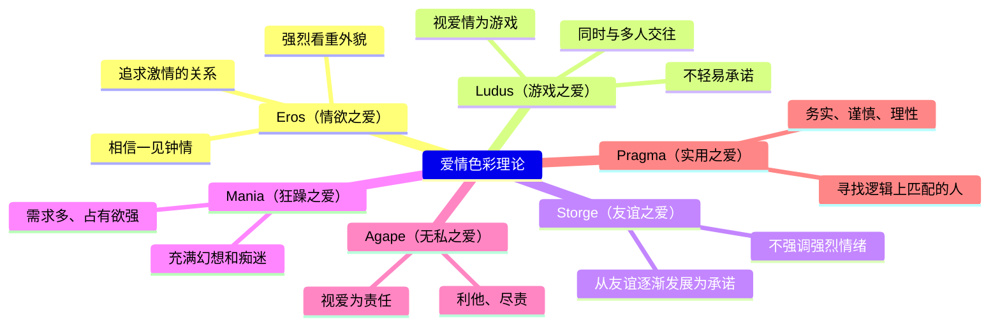
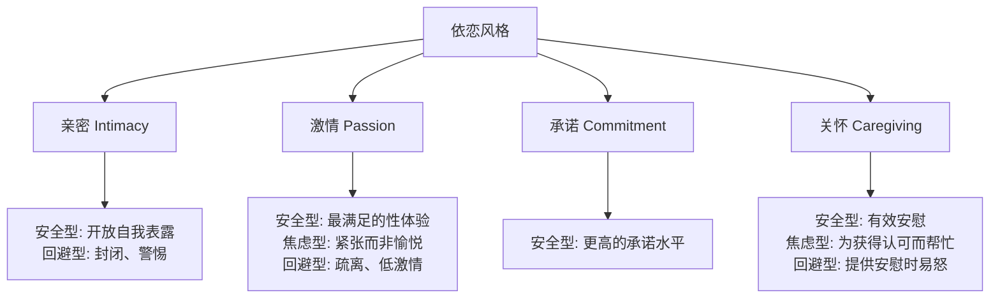

# 第08课：爱情

## Learning Objectives

- 了解不同历史时期和文化对爱的不同看法
- 掌握**斯滕伯格的爱情三角理论**（Sternberg's Triangular Theory of Love）：亲密、激情、承诺三要素
- 区分**七种爱**（seven types of love）及其特征
- 认识**Lee的爱情色彩理论**（Lee's Love Styles）中六种爱的风格
- 理解**激情之爱**（passionate love）与**伴侣之爱**（companionate love）的差异
- 探讨爱是否能持久，以及影响爱情变化的因素
- 了解文化与个体差异如何塑造爱的体验

## 爱的简史

> [!QUOTE] 一个大胆的实验
> "Never before, until now, have people considered love to be an essential reason to marry." — Coontz, 2005

我们今天认为"婚姻必须建立在爱情之上"的观念，在历史上其实是一个极其罕见的例外。不同文化对爱的态度在四个维度上有所不同：

| 维度 | 变化范围 |
|------|----------|
| **文化价值**（Cultural Value） | 爱是值得追求的 vs. 爱是一种疯狂 |
| **性与爱的关系**（Sexuality） | 爱应该包含性 vs. 爱与性无关 |
| **性取向**（Sexual Orientation） | 异性爱 vs. 同性爱 |
| **婚姻地位**（Marital Status） | 应该爱配偶 vs. 爱属于婚外之事 |

### 历史演变概览

| 时期 | 对爱的看法 |
|------|------------|
| **古希腊** | 激情吸引被视为一种**疯狂**；推崇**柏拉图式爱情**（platonic love）——对爱人的非性崇拜，典型体现在男性之间 |
| **古罗马** | 婚姻的目的是生儿育女、建立政治联盟；幸福不是婚姻的一部分 |
| **12世纪宫廷爱情** | 爱情被理想化为高尚的**骑士精神**，但在理论上是**非性且通奸**的——男方应未婚，女方应已婚 |
| **17-18世纪** | 欧洲人开始相信浪漫爱情偶尔可以带来幸福结局；但"因爱而婚"仍被保守派视为对传统婚姻的威胁 |
| **当代北美** | 爱情被视为婚姻的必要条件（1967年：76%的女性和35%的男性愿意嫁娶不爱但完美的人；今天绝大多数人会拒绝） |

> [!IMPORTANT] 文化关键差异
> 北美将爱情与婚姻捆绑的做法在世界范围内仍是异类。这与美国的**个人主义**（individualism）、**经济繁荣**、缺乏种姓制度密切相关。在许多其他地方，年轻人离家、恋爱、决定结婚、再带伴侣回家见家人的顺序显得"完全荒谬"。

## 爱情的类型

### 斯滕伯格的爱情三角理论

> [!NOTE] Sternberg (1987, 2019)
> Robert Sternberg 提出，爱情由三个不同成分组合而成：

```
                     亲密（Intimacy）
                  情感上的温暖、理解、信任、分享
                         /\
                        /  \
                       /    \
                      /      \
            激情（Passion）───承诺（Commitment）
           身体上的唤起、    认知上的决定——
           欲望、兴奋、需要   投入维系关系的决心
```

| 成分 | 本质 | 特征描述 |
|------|------|----------|
| **亲密**（Intimacy） | 情感成分 | 温暖、理解、信任、支持、分享 |
| **激情**（Passion） | 动机/驱力 | 身体唤起、性渴望、兴奋、需求 |
| **承诺**（Commitment） | 认知成分 | 持久性、稳定性、投入维系关系的决定 |

#### 七种爱的类型

当这三个成分以不同强度组合时，形成以下七种（加上"无爱"共八种）关系类型：

| 类型 | 亲密 | 激情 | 承诺 | 描述 |
|------|:----:|:----:|:----:|------|
| **无爱**（Nonlove） | 低 | 低 | 低 | 随意的、表面的关系，类似熟人 |
| **喜欢**（Liking） | **高** | 低 | 低 | 有真正温暖和亲密的朋友关系，但不涉及激情和终身承诺 |
| **迷恋**（Infatuation） | 低 | **高** | 低 | 对几乎不了解的人产生强烈激情——"一见钟情"的典型形式 |
| **空洞之爱**（Empty Love） | 低 | 低 | **高** | 温暖和激情都已消失，只剩下维持关系的决定；西方文化中这是关系的终点，但在包办婚姻文化中可能是起点 |
| **浪漫之爱**（Romantic Love） | **高** | **高** | 低 | 喜欢的迷恋：既有亲密感又有激情；夏季恋情即是典型 |
| **伴侣之爱**（Companionate Love） | **高** | 低 | **高** | 亲密与承诺结合的深厚友谊；热情消退后仍长久幸福的婚姻 |
| **愚昧之爱**（Fatuous Love） | 低 | **高** | **高** | 在缺乏真正了解的情况下因强烈激情而仓促结婚——"闪婚"的风险 |
| **圆满之爱**（Consummate Love） | **高** | **高** | **高** | "完整的爱"，三要素都高度存在——像减肥一样，短期内容易实现，长期维持却很难 |

> [!TIP] 关键洞见
> 在这三个成分中，**激情是最不稳定、最不可控的**。它可以迅速飙升又迅速消退，人们无法有意识地控制它的变化。因此，以激情为基础的爱情往往面临最大的挑战。

### 生理基础的支持

大脑研究证实了激情与亲密是不同的体验：

- 性欲望和依恋感由**不同的大脑区域**调控（Cacioppo, 2019）
- 进化理论家 Helen Fisher 提出三个不同的生物系统：
  - **性欲**（Lust）——性激素调控，驱动与异性交配
  - **吸引**（Attraction）——多巴胺（dopamine）调控，推动浪漫之爱，产生兴奋和欣快感
  - **依恋**（Attachment）——催产素（oxytocin）调控，驱动伴侣之爱，产生舒适、安全和连接感

### 激情之爱

> [!QUOTE]
> "I love you, but I'm not in love with you."

——这句话的真正含义是：我喜欢你，关心你，认为你是个了不起的人，但我不觉得你有多大的性吸引力。

#### 两因素理论

激情吸引建立在两个因素之上：
1. **生理唤起**（physiological arousal）——如心跳加速
2. **归因**（attribution）——相信他人是你唤起的原因

> [!WARNING] 经典实验
> **悬索桥实验**（Dutton & Aron, 1974）：在摇晃的吊桥中间遇到有吸引力的异性时，男性产生的**恐惧唤起**被错误归因为"对这位女性的吸引力"，因此他们更容易给这位女性打电话。
>
> 后续实验证明：**任何形式的强烈唤起**——无论是正面的（喜剧）还是负面的（血腥恐怖）——都能增强对理想伴侣的吸引力，同时降低对不吸引人的伴侣的评价。

#### 激情之爱的特征

| 特征 | 表现 |
|------|------|
| 理想化（Idealization） | "爱是盲目的"——情人眼中出西施，忽视或重新解释对方的缺点 |
| 痴迷（Preoccupation） | 不由自主地想着对方，难以专注其他事物 |
| 认知变化 | 爱上某人后，自我概念会扩展和改变（self-expansion model） |
| 排他性注意力 | 爱情让我们更少注意到其他有吸引力的人 |

### 伴侣之爱

伴侣之爱是"舒适、亲切、信任的爱，基于深厚的友谊，涉及陪伴、共同活动、共同兴趣和共享欢笑"（Grote & Frieze, 1994）。

> [!IMPORTANT] 研究关键
> 数百对结婚至少**15年**的夫妻被问及婚姻持久的原因时——他们的首要答案不是"我会为对方做任何事"或"没有对方我会很痛苦"（浪漫之爱的特征），而是：
> 1. "我的配偶是我最好的朋友"
> 2. "我喜欢我的配偶这个人"

#### 伴侣之爱的生理基础

伴侣之爱涉及**催产素**（oxytocin），这是一种促进放松和减轻压力的神经肽。催产素在分娩、哺乳和性高潮时大量释放，与依恋感和安全感相关。

### 慈悲之爱

**慈悲之爱**（Compassionate Love）——一种超越爱情三角理论的第三种爱，结合了亲密的信任和理解与**同情、无私、牺牲**。慈悲之爱不同于浪漫之爱（"盲目"）；它建立在对伴侣优缺点更准确的认识基础上——"我知道你的不足，但我仍然爱你"。

> [!QUOTE] 慈悲之爱量表项目
> - "我花大量时间关心亲近之人的福祉。"
> - "如果亲近之人需要帮助，我几乎愿意做任何事来帮助他们。"
> - **"我宁愿自己受苦，也不愿看着亲近的人受苦。"**

日常的慈悲行为（如表中的10项行动）不仅让接受方满意，**付出方**的情绪也更好——"施比受更有福"在亲密关系中同样成立。

### Lee 的爱情色彩理论

John Alan Lee 用希腊和拉丁词汇描述了六种爱的风格：



> [!NOTE]
> 这六种风格不应被视为六种额外的"爱情类型"，而应视为爱情体验中的**六个主题**。关系满意度与 Eros 和 Agape 正相关，与 Ludus 负相关。男性在 Ludus（游戏之爱）上得分更高，女性在 Storge（友谊之爱）和 Pragma（实用之爱）上得分更高。

### 单恋

> [!WARNING] 普遍但痛苦
> 80%-90%的年轻人报告曾经历过**单恋**（unrequited love）——对不回报兴趣的人产生浪漫激情。

为什么我们会陷入单恋？
1. 追求者被对方强烈吸引，认为值得等待和努力
2. 乐观地高估对方对自己的喜欢程度
3. 怀有"最终会赢得对方爱情"的幻想

有趣的是：研究表明，**被单恋的一方实际上比追求者更痛苦**——他们觉得被纠缠很烦人，拒绝别人时又感到内疚。

## 爱与个体差异

### 文化差异

尽管浪漫之爱是**普遍的人类体验**（在不同文化的大脑中激活的区域相同），但仍存在细微差异：

| 维度 | 美国人 | 中国人 |
|------|--------|--------|
| 坠入爱河时 | 强调相似性和外貌 | 强调理想人格、他人意见、身体唤起 |
| 恋爱中 | 更多浪漫幻想（"从此幸福"） | 更多接受"伴侣难以理解"和"爱是混合祝福" |
| 婚姻理由 | 坚持爱是结婚的原因 | 更受父母意见影响 |

> [!TIP] 不同视角
> 美国人的婚姻是**个人决定**，中国人的婚姻往往是**家庭决定**。当涉及"父母会为你选谁"的问题时，有趣的是：父母**比子女更看重**种族、社会阶层、宗教背景，**比子女不看重**外貌吸引力。

### 依恋风格



**安全型**（Secure）的人在亲密、激情、承诺和关怀四个维度上均表现最佳，因而体验更强烈的浪漫之爱、伴侣之爱和慈悲之爱。

> [!IMPORTANT] 好消息
> 我们同时拥有多个依恋对象（恋人、父母、朋友），在不同关系中可能拥有不同的依恋安全水平。**依恋可以在不同关系之间有所不同**——对母亲焦虑的人可能完全信任伴侣。

### 年龄

随着年龄增长，大多数人会变得：
- 情绪强度降低，但积极性增强
- 更少身体唤起，但更多善意
- 燃烧般的激情逐渐被温和成熟的爱所取代

### 性别差异

> [!NOTE] 关键发现
> 在爱的问题上，**男女之间的相似性远大于差异性**。说"男人来自火星，女人来自金星"是荒谬的。

| 差异领域 | 男性 | 女性 |
|----------|------|------|
| 浪漫态度 | **更浪漫**——相信"只要有爱一切皆可" | 更谨慎、更有选择性 |
| 坠入爱河 | **更快**，更相信一见钟情 | 更慢，更挑剔 |
| 先说"我爱你" | 70%是男性先说的 | |
| 爱的重点 | 激情（最不稳定的成分）最重要 | 承诺（最稳定的成分）最重要 |

## 爱的持续性

> [!WARNING] 核心问题
> "Does love last?" 关系科学给出的最佳答案是：**可能不会**——至少不会以你期望的程度持续。

### 为什么浪漫之爱会下降？

**原因有三，都是不可逆转的时间趋势：**

| 原因 | 机制 | 说明 |
|------|------|------|
| **幻想消散**（Fantasy） | 理想化被现实取代 | 恋爱时"情人眼里出西施"；共同生活后现实的"刺眼阳光"驱散了浪漫的"月光魔力" |
| **新奇消失**（Novelty） | 熟悉导致的兴奋下降 | **Coolidge效应**（柯立芝效应）：新奇带来性唤起——新的伴侣可以重新激发已经"性疲惫"的个体。关系中，新奇感丧失后激情逐渐消退。**关系时间越长，激情越少**。 |
| **唤起减弱**（Arousal） | 生理上无法持续高强度唤起 | 当伴侣变得熟悉时，大脑可能不再产生同样多的多巴胺 |

数据支持：
- 婚后仅**2年**，伴侣表达感情的频率就减半
- 离婚率最高的时期是**婚后第4年**
- 性行为频率在**关系的第二年中下降最剧烈**
- "浪漫依赖新奇、神秘和危险，而被熟悉驱散。持久的浪漫本身就是一个矛盾说法。"（Mitchell, 2002）

### 并非全是坏消息

> [!TIP] 应对策略
> 虽然燃烧般的浪漫之爱会逐渐降温，但这不意味着关系的终结。

1. **伴侣之爱更稳定**：亲密和承诺会随年龄增长而增加
2. **可以主动创造**：
   - 找一个也是好朋友的恋人
   - 有意识地、创造性地对抗无聊
   - 尝试新奇、自我扩展的活动（即使是用筷子吃爆米花这样的"傻事"）
   - 新颖的共同活动可以**重新点燃**已经消退的激情

> [!QUOTE] 持久婚姻的秘诀
> 当结婚至少15年的夫妻被问及婚姻为什么持久时，最普遍的回答是：
> "我的配偶是我最好的朋友。"
> "我喜欢我的配偶这个人。"

长期成功的关键不是维持当初的激情，而是培育深厚的友谊——**伴侣之爱比浪漫之爱更稳定，也令人满意**。

## 应用练习

> [!QUESTION] 自我反思
> 1. 回顾你当前或过去的一段亲密关系，用斯滕伯格的爱情三角理论来分析：亲密、激情、承诺三者分别处于什么水平？这属于哪种类型的爱？
> 2. 你的爱情风格更接近 Lee 的六种风格中的哪一种？你的伴侣的风格是什么？两种风格是否匹配？
> 3. 如果你正在一段关系中，你认为浪漫之爱的哪些变化已经在发生？你们做了什么或可以做什么来"对抗无聊"？
> 4. 假设你的父母有决定权，他们会为你选择什么样的伴侣？和你的选择标准有什么不同？

<details>
<summary>思考指引</summary>

**问题1**：考虑当下水平而非"曾经有过"。很多长期关系会从"浪漫之爱"向"伴侣之爱"过渡——激情下降，亲密和承诺上升。这种变化可能令人失望，但其实是关系成熟的健康信号。危险在于"空洞之爱"（只有承诺），或"愚昧之爱"（只有激情和承诺，缺乏真正了解）。

**问题2**：风格不匹配可能是关系的隐患。例如，Ludus（游戏之爱）型的人和 Storge（友谊之爱）型的人在一起会很痛苦。虽然风格会影响关系走向，但它们并非不可变——沟通和相互理解可以弥合差异。

**问题3**：对抗无聊的关键是**新颖性体验**（novel experiences）。研究表明，每周一起尝试新奇活动的夫妻，性欲和性满足感都更高。即使是很小的改变——新的餐厅、新的散步路线、新的性姿势——也有帮助。

**问题4**：研究显示父母确实有不同的优先顺序：他们更看重社会阶层、宗教、种族背景和稳定，而更不看重外貌吸引力。这不一定意味着他们是对的，但他们的视角确实关注了年轻人容易忽略的长期兼容性因素。

</details>

## 核心引用

- Sternberg, R. J. (1987). *The triangle of love: Intimacy, passion, commitment*. Basic Books.
- Lee, J. A. (1988). Love-styles. In R. J. Sternberg & M. L. Barnes (Eds.), *The psychology of love* (pp. 38–67). Yale University Press.
- Fisher, H. (2006). The drive to love: The neural mechanism for mate selection. In R. J. Sternberg & K. Weis (Eds.), *The new psychology of love* (pp. 87–115). Yale University Press.
- Hatfield, E., & Sprecher, S. (1986). Measuring passionate love in intimate relationships. *Journal of Adolescence, 9*, 383–410.
- Dutton, D. G., & Aron, A. P. (1974). Some evidence for heightened sexual attraction under conditions of high anxiety. *Journal of Personality and Social Psychology, 30*, 510–517.
- Acevedo, B. P., & Aron, A. (2009). Does a long-term relationship kill romantic love? *Review of General Psychology, 13*, 59–65.

## 继续学习

下一课：[第09课：性](0009-sexuality)——性态度、性行为、性满意度、性胁迫和勾搭文化。