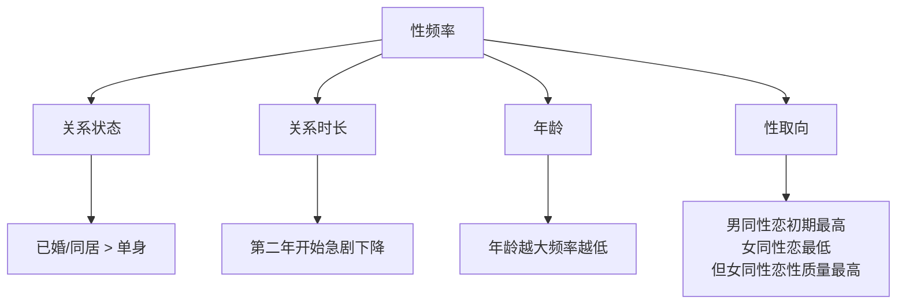
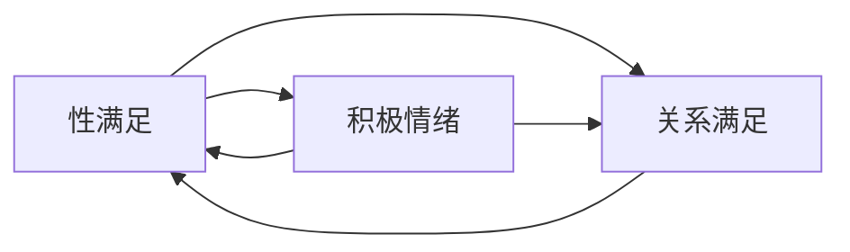
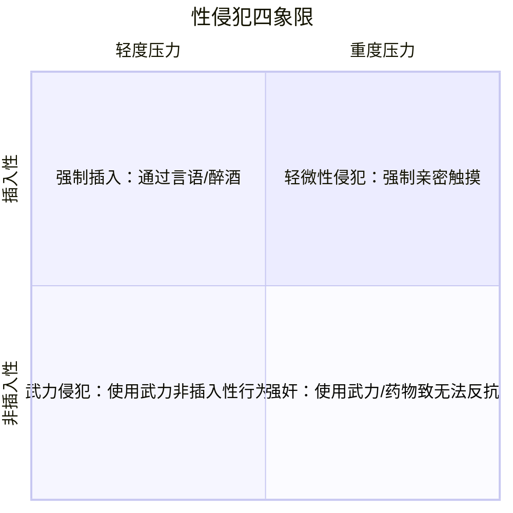

# 第09课：性

## Learning Objectives

- 理解**性态度**（sexual attitudes）的文化差异、性别差异和时代变迁
- 了解**第一次性经历**和伴侣间性行为的模式和影响因素
- 分析**不忠**（infidelity）的发生率、性别差异和影响因素
- 掌握**社会性取向**（sociosexual orientation）的概念及其对关系的影响
- 认识**性满意度**（sexual satisfaction）的核心决定因素——特别是沟通的作用
- 了解**性胁迫**（sexual coercion）的四种类型及其预防
- 理解**勾搭文化**（hookup culture）的特征和影响

## 性态度

### 对随意性行为的态度

> [!QUOTE] 时代变迁
> 50年前，大多数人反对"婚前性行为"；今天，只有不到25%的人认为非婚性行为"总是或几乎总是错误的"。

现代人的主流态度是**情感允许下的开放**（permissiveness with affection）：只要发生在承诺和关心的关系中，未婚伴侣间的性是可以接受的。

```mermaid
graph LR
    subgraph ”对性的态度光谱”
        A[传统保守] --> B[情感允许下的开放]
        B --> C[随意性行为]
    end
    B --> D{”勾搭文化”}
    D --> E[正面感受：兴奋、愉悦]
    D --> F[负面感受：后悔、困惑]
```

#### 勾搭文化（Hookup Culture）

**勾搭**（hookup）指与非恋爱伴侣的性互动，通常只持续一夜，不期待建立持久关系。

| 数据 | 发现 |
|------|------|
| 发生率 | 约75%的大学生有过勾搭经历 |
| 满意度 | 勾搭后通常正面感受多于负面，但约**40%**的情况是困惑或失望的 |
| 后悔率 | 大多数大学生（14%）不后悔最近一次勾搭，但**66%的女性和46%的男性**后悔至少一次 |
| 性行为 | 约一半的勾搭涉及口交或性交 |

#### 性别差异

| 领域 | 男性 | 女性 |
|------|------|------|
| 对无爱性行为的态度 | 更宽容 | 更保守 |
| 勾搭后的感受 | **更正面** | 更多混合感受 |
| 最常后悔的事 | **错过的机会**（没做） | **做过的事**（做了） |

#### 性双重标准（Sexual Double Standard）

> [!WARNING] 双重标准的变化
> 传统上：男性有多位性伴侣 = "种马"（stud）；女性有同样数量 = "荡妇"（slut）。
>
> 今天：双重标准仍然存在但更微妙。人们普遍厌恶"频繁勾搭"的人（无论男女），但女性仍受到更严厉的评判——有性传播感染的女性比男性遭受更多指责。

### 对同性性行为的态度

- 61%的美国人支持同性婚姻（年轻人中高达74%）
- 态度转变的关键原因有二：
  1. **可见性提升**：2019年，美国电视上10%的常驻角色是LGBTQ
  2. **科学理解加深**：性取向是先天而非选择——"在出生前就已在大脑中刻下"

> [!IMPORTANT] 科学共识
> 同性性行为的部分基础在基因中——"不是由一个或几个基因决定，而是由许多基因共同影响"（Ganna et al., 2019）。性取向不是有意识的道德选择。

人们的态度取决于对性取向成因的看法（如图9.1所示）：认为"先天形成"的人大概率接受同性恋；认为"个人选择"的人大概率反对。

### 文化差异

> [!TIP] 令人惊讶的事实
> 相比澳大利亚、加拿大、德国、英国、以色列、俄罗斯、西班牙、瑞典等国家，**美国在性态度上实际上相当保守**。丹麦早在1989年就承认同性民事结合，美国却晚得多。

## 性行为

### 第一次性经历

| 数据 | 数值 |
|------|------|
| 婚前发生性行为比例 | 97% |
| 首次性交中位年龄 | 17岁 |
| 20岁仍未发生性行为 | 约20% |

重要发现：
- 多数青少年（79%）的第一次性经历发生在**稳定且有重要情感的关系**中，而非随意勾搭
- 许多青少年发现首次体验**正面大于负面**——男性更享受且更容易达到高潮
- **16岁前**的早期性经历通常更尴尬、更少回报，且与成人后的高风险性行为模式和更高的离婚率相关
- **第一晚就发生性行为**的伴侣，后续的关系满意度和沟通质量较低

> [!TIP] 实践建议
> 放慢节奏是值得的——等待几周再发生性关系，后续的关系满意度更高。承诺感可以提升性体验质量。

### 伴侣间的性

#### 性动机（Sexual Motives）

人们为什么发生性行为？一项研究识别出**237种不同理由**，归纳为四个主题：

| 主题 | 例子 |
|------|------|
| **情感型**（Emotional） | 表达爱和承诺 |
| **身体型**（Physical） | 愉悦、吸引力 |
| **实用型**（Pragmatic） | 生孩子、让伴侣嫉妒、升职 |
| **不安型**（Insecurity） | 提升自尊、防止伴侣出轨 |

> [!NOTE]
> 男性和女性同等频率地强调"情感"原因，但男性更可能因身体、实用和不安原因发生性行为。

#### 性频率的影响因素



> [!WARNING] 时代趋势
> 所有类型的夫妻现在发生性行为的频率都比上一代人更少。以2014年为例，典型夫妻的性交次数比1990年代少了**18次/年**。这一下降与智能手机的普及高度相关。

### 不忠（Infidelity）

#### 发生率

| 关系类型 | 有过婚外性行为的比例 |
|----------|:-----:|
| 已婚男性 | 32% |
| 已婚女性 | 21% |
| 同居伴侣 | 31% |

> [!WARNING]
> 出轨过一次的人，在下一段关系再次出轨的可能性是其他人的**3倍**。出轨者往往具有高马基雅维利主义（Machiavellianism）、精神病态（psychopathy）、低宜人性和低尽责性的特征。

#### 性别差异

- 男性比女性更容易出轨
- 男性出轨往往为了**性多样性**
- 女性出轨往往更追求**情感连接**
- 女性出轨后更可能离开现有伴侣，与新人建立长期关系

#### 社会性取向（Sociosexual Orientation）

> [!IMPORTANT] 关键个体差异
> **社会性取向**（sociosexual orientation）描述一个人在缺乏爱情和承诺的情况下是否愿意发生性行为：

| 类型 | 特征 | 行为表现 |
|------|------|----------|
| **限制性**（Restricted） | 只有在承诺和情感关系中才愿意发生性行为 | 出轨率低 |
| **非限制性**（Unrestricted） | 不寻求亲密和承诺即可发生性行为 | 更多性伴侣，更可能出轨，更可能在Tinder上寻找对象 |

Simpson & Gangestad 开发的**社会性取向量表**（Sociosexual Orientation Inventory）测量这一特质。非限制性的人更动态、更爱调情、总是在寻找新伴侣。

#### 演化解释

**好基因假说**（Good Genes Hypothesis）：一些女性采取"双重交配策略"——
- 从长期伴侣获得资源和保护
- 从其他男性（特别在排卵期）获得更好的基因，以生育更健康、更有吸引力的后代

数据显示：全球平均约**2%**的孩子由不知道自己是生父的男性抚养；美国大约**1/400**的双胞胎是同期异父。

**精子竞争**（Sperm Competition）：多个男性的精子同时存在于女性阴道中。研究推测，男性的阴茎形状可能进化出了"铲除"其他男性精子的功能。

#### 合意非单偶制（Consensual Non-Monogamy / CNM）

> [!NOTE] 它不是欺骗
> 约20%的美国人和加拿大人曾拥有某种形式的CNM关系：

| 类型 | 特征 |
|------|------|
| **开放式关系**（Open Relationship） | 可以有性行为，但避免情感依恋 |
| **交换伴侣**（Swingers） | 夫妻共同参与，保持随意 |
| **多元之爱**（Polyamory） | 同时拥有多个性爱和浪漫关系 |

CNM并非适合所有人，但其中实践者报告的性满足感**高于**单偶制关系。多伴侣可以提供单一个人无法满足的多样化需求——"消除伴侣必须满足所有需求的期望"对一些人是理想选择。

### 性欲望的性别差异

> [!WARNING] 不可忽视的差异
> 平均而言，男性的性驱力（sex drive）高于女性：

| 指标 | 男性 | 女性 |
|------|:----:|:----:|
| 每周性渴望次数 | 37次 | 9次 |
| 规律自慰 | 51%（每周至少一次） | 25% |
| 每天想到性 | 34次 | 19次 |
| 对随意的性的接受度 | 更高 | 更低 |

> [!QUOTE] 经典场景
> 电影《安妮·霍尔》中，当治疗师询问伴侣双方多久发生一次性行为时：
> - 他感叹："几乎从没有，大概每周三次。"
> - 她抱怨："太频繁了，我觉得每周三次。"

性欲望的性别差异可能导致伴侣间的**欲望不匹配**（desire discrepancy）。女性在生育后和更年期后性欲显著下降，研究显示在60岁的德国夫妻中，**没有一对**是妻子和丈夫性欲一样高的。

### 安全性行为

#### 为什么聪明人做不明智的事？

| 因素 | 描述 |
|------|------|
| **低估风险**（Underestimation of Risk） | 累积概率被低估；吸引力越大，感知风险越低 |
| **独特不可伤害错觉**（Illusion of Unique Invulnerability） | "坏事发生在别人身上，不会发生在我身上" |
| **错误决策**（Faulty Decision Making） | 性唤起时判断力下降——"被冲昏头脑" |
| **酒精近视**（Alcohol Myopia） | 醉酒后只能关注最直接的刺激（"她真迷人"），忘记安全措施 |
| **多元无知**（Pluralistic Ignorance） | 错误认为"大家都觉得勾搭很好"（其实不是） |
| **权力不平等** | 权力较高的一方反对时，避孕套很难被使用 |
| **禁欲教育** | 教"避孕套没用"的禁欲项目反而导致青少年不使用避孕套 |
| **低自控** | 冲动的人更难坚持使用避孕套 |
| **亲密度和愉悦度** | 很多人觉得无套性爱更亲密、更愉悦 |

> [!WARNING] 隐避（Stealthing）
> 在性交过程中未经对方知情同意而偷偷移除避孕套的行为，可被视为性侵犯。实施者通常对女性怀有敌意，且有其他性攻击行为历史，感染性病的概率是其他人的**2倍**。

## 性满意度（Sexual Satisfaction）

### 性满意的条件

> [!QUOTE] 核心发现
> 性品质比性数量更重要。一周一次的频率足够——超过这个频率并不增加关系满意度。

**自我决定理论**（Self-Determination Theory）在性中的应用：最好的性体验满足三种基本需求：
- **自主性**（Autonomy）——做自己想做的事
- **胜任感**（Competence）——自信能做得好
- **关系性**（Relatedness）——被爱和被尊重

### 性成长信念（Sexual Growth Beliefs）

> [!TIP] 心态的力量
> 持有**性成长信念**（sexual growth beliefs）的人认为性满足是通过创造力和努力获得的；持有**性命运信念**（sexual destiny beliefs）的人认为好的性需要找到"灵魂伴侣"。
>
> 前者在遇到挑战时更愿意协作创新，因此性满足感更高。

### 多样性

研究显示，满足的伴侣更常尝试：
- 迷你按摩、共享淋浴
- 新的性姿势
- 性玩具
- 分享幻想、一起看色情片
- **接吻越多，性满意度越高**

### 性沟通（Sexual Communication）

> [!IMPORTANT] 最佳建议
> "Clear communication about sex is associated with better sexual functioning and greater satisfaction."

**性是无声的？这是一种浪费。** 许多伴侣在不讨论性的情况下就发生关系，这导致错失改善的机会。

天普大学 Masters & Johnson（1970）的关键发现：
- 同性恋伴侣的性体验质量**高于**异性恋伴侣
- 主要原因不是"同性更懂对方"，而是**沟通**——同性恋伴侣更开放地讨论性偏好、反馈和指导
- 异性恋伴侣则存在"对开放沟通的持续忽视"和"对伴侣的潜在自我破坏性缺乏求知欲"

> [!WARNING] 性意图的误读
> Abbey（1982）的经典研究：男性倾向于从女性的友好行为中解读出性兴趣，即使女性根本没有这个意图。约**54%**的男性曾至少一次误读女性的意图。
>
> 明确的、肯定的、持续的拒绝是最好的沟通方式——不要暧昧。

### 性满足与关系满足的双向循环



性满足和关系满足是**相互强化的**。满足的性爱减轻压力、改善情绪，从而提升关系满意度，进而让后续的性爱更美好。

### 依恋与性

| 依恋维度 | 性行为特征 |
|----------|------------|
| **焦虑型**（Anxious） | 性需求出自被接受的渴望，更激情但也更绝望；更少拒绝不想要的性行为，更少使用避孕套 |
| **回避型**（Avoidant） | 更少与伴侣发生性行为，更多随意性行为；更多幻想婚外性 |
| **安全型**（Secure） | 最好的性自信、沟通和满足；更开放和乐于探索 |

> [!QUOTE]
> "Great lovers tend to be secure lovers."

## 性胁迫（Sexual Coercion）

### 四种类型

性胁迫可以分为两个维度：**施加的压力类型**和**导致的行为**：



| 象限 | 类型 | 例子 |
|:----:|------|------|
| 1 | 轻度违反（轻度压力+非插入） | 强行牵手、拥抱、抚摸——被认为"没什么大不了"，但对关系有腐蚀作用 |
| 2 | 强制插入（言语/醉酒+插入） | 言语操纵/用酒精削弱抵抗后发生插入行为 |
| 3 | 武力侵犯（武力+非插入） | 使用武力进行非插入性行为 |
| 4 | **强奸**（武力/药物+插入） | 使用武力或让受害者无力抵抗后实施插入——明确违法 |

### 发生率

| 统计 | 数据 |
|------|:----:|
| 16岁后遭遇过性侵犯的女性 | **73%** |
| 违背意愿被强迫性交的女性 | **25%** |
| 曾经历性胁迫的男性 | **43%** |
| 曾言语胁迫不愿伴侣发生性行为的人 | 约25%（男女均等） |

> [!WARNING] 严重性
> 由亲密伴侣实施的性胁迫**比陌生人实施的心理伤害更大**。遭受性胁迫的女性精神和身体健康显著更差。

### 预防建议

1. **警惕将性视为"竞赛"的潜在伴侣**
2. **警惕酒精和药物**——大多数性胁迫涉及酒精
3. **提前决定坚决拒绝**——事先下决心的人被动顺从的可能性更低
4. **在亲密互动前明确边界**——"如果我说不，我就是真的说不"
5. **将伴侣视为平等的合作者**——相互尊重与性胁迫不相容

## 应用练习

> [!QUESTION] 思考题
> 1. 回顾你的"社会性取向"——你是更偏向"限制性"还是"非限制性"？这种倾向如何影响了你过去的关系决策？
> 2. 伴侣之间如何缩短"性欲望不匹配"的差距？除了增加频率之外，还有哪些提升性满意度的途径？
> 3. 在安全性行为方面，你可能面临的最大障碍是什么（低估风险？酒精？不好意思开口？），你打算如何克服它？
> 4. Masters & Johnson 发现同性恋伴侣的性体验质量更高，主要是因为更好的沟通。你认为异性恋伴侣可以从中学到什么？

<details>
<summary>思考指引</summary>

**问题1**：社会性取向不是好坏之分，它反映的是你与性的基本关系。了解自己是限制型还是非限制型有助于预测你和管理你的关系模式——例如，非限制型的人在选择进入开放式关系时可能更合适，而限制型的人则需要确保性发生在有承诺感的关系中。

**问题2**：性满意度研究的核心发现是：**质量大于数量**。提高质量的方式包括：
- 更好的性沟通（告诉对方你喜欢什么）
- 性成长信念（相信通过努力可以改善）
- 新颖性（尝试新事物）
- 关注"接近型"动机（为积极理由而非回避冲突而发生性行为）
- 挑战传统性别角色（女性也可以主动）

**问题3**：最常见的阻碍是"冲动状态下忘记计划"——这也是为什么提前沟通和达成安全协议很重要。酒精和性唤起的组合是危险最大的。实用策略：将避孕套的使用作为"性感前戏的一部分"，而不是破坏气氛的干扰。

**问题4**：关键教训是：**无论性取向如何，坦诚沟通都是最佳性爱的基础**。异性恋伴侣可以从同性恋伴侣身上学到的"功课"：主动询问对方喜欢什么、给予明确的正面反馈、把性对话视为自然的亲密交流而非难堪的事情。

</details>

## 核心引用

- Abbey, A. (1982). Sex differences in attributions for friendly behavior: Do males misperceive females' friendliness? *Journal of Personality and Social Psychology, 42*, 830–838.
- Masters, W. H., & Johnson, V. E. (1970). *Human sexual inadequacy*. Little, Brown.
- Simpson, J. A., & Gangestad, S. W. (1991). Individual differences in sociosexuality: Evidence for convergent and discriminant validity. *Journal of Personality and Social Psychology, 60*, 870–883.
- Meston, C. M., & Buss, D. M. (2007). Why humans have sex. *Archives of Sexual Behavior, 36*, 477–507.
- Impett, E. A., Muise, A., & Peragine, D. (2014). Sexuality in the context of relationships. In D. L. Tolman & L. M. Diamond (Eds.), *APA handbook of sexuality and psychology* (Vol. 1, pp. 269–315).
- Frederick, D. A., Lever, J., Gillespie, B. J., & Garcia, J. R. (2017). What keeps passion alive? *Journal of Sex Research, 54*, 186–201.
- Muise, A., Schimmack, U., & Impett, E. A. (2016). Sexual frequency predicts greater well-being, but more is not always better. *Social Psychological and Personality Science, 7*, 295–302.

## 继续学习

上一课：[第08课：爱情](0008-love)——了解爱情的三角理论、爱的风格和激情之爱与伴侣之爱的差异。

下一课：待定。