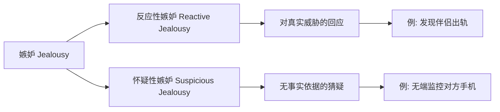
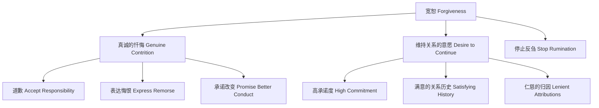

# 第10课：压力与紧张

## Learning Objectives

- 理解**感知的关系价值**（perceived relational value）作为关系压力的核心理论框架
- 识别**关系贬值**（relational devaluation）如何引发**伤害感**（hurt feelings）
- 了解**排斥**（ostracism）的心理影响及其应对策略
- 区分**反应性嫉妒**（reactive jealousy）与**怀疑性嫉妒**（suspicious jealousy）
- 掌握亲密关系中**欺骗与说谎**（deception and lying）的模式与检测局限
- 认识**背叛**（betrayal）的不同类型及其对关系的双重视角
- 理解**宽恕**（forgiveness）的条件、益处与局限

## 核心理论框架：感知的关系价值

本章讨论的所有压力源——伤害感、排斥、嫉妒、说谎、背叛——都有一个共同的底层机制：**感知的关系价值**（perceived relational value）低于我们的期望时，就会产生痛苦。

> [!QUOTE] 核心洞见
> "Negative events like these can be very influential... all of these unhappy events may share a common theme: They suggest that we are not as well liked or well respected as we wish we were."

**感知的关系价值**指的是"他人认为与我们的关系有多重要和宝贵"。当关系价值高时，我们感到被欣赏、尊重和接纳；当关系价值低时，我们感到不被需要。

### 接纳与排斥的七级光谱

Mark Leary 提出，他人对我们的态度是一个连续光谱，从最大限度的接纳到最大限度的排斥：

| 程度 | 含义 | 表现 |
|------|------|------|
| **最大包容**（Maximal inclusion） | 他人主动寻求与我们相处 | 愿意为我们改变计划甚至取消活动 |
| **主动包容**（Active inclusion） | 他人欢迎我们 | 邀请我们参加，但我们不来他们也会继续 |
| **被动包容**（Passive inclusion） | 他人允许我们加入 | 不主动邀请，但我们来了也不会拒绝 |
| **矛盾**（Ambivalence） | 他人不在乎我们在不在 | 既不接纳也不排斥 |
| **被动排斥**（Passive exclusion） | 他人忽略我们 | 希望我们不在场但不主动回避 |
| **主动排斥**（Active exclusion） | 他人回避我们 | 只在必要时容忍我们的存在 |
| **最大排斥**（Maximal exclusion） | 他人驱逐我们 | 命令我们离开 |

> [!TIP] 关键发现
> 研究显示，一旦他人表现出任何形式的排斥（从矛盾到最大排斥），我们的**自尊即刻触底**。微小程度的拒绝就和极端拒绝一样令人痛苦。相反，自尊从"矛盾"到"主动包容"之间的区间**急剧上升**——我们最敏感的是对方是否"想要我们在"。

## 伤害感

### 关系贬值的影响

当感知的关系价值下降——即**关系贬值**（relational devaluation）发生——时，人们会产生强烈的**伤害感**（hurt feelings）。实验显示：

- 在研究参与者与新认识的人交谈的过程中，如果对方给出的评价**从高到低递减**（6→5→3→3→2），造成的痛苦**甚至超过持续的排斥**
- 被拒绝的痛苦与身体疼痛在神经层面上有共同基础——fMRI扫描显示，被拒绝时大脑的活跃区域与经历身体疼痛时相同
- 有趣的是，止痛药对乙酰氨基酚（acetaminophen）也能缓解社交排斥的痛苦

### 影响伤害感的个体差异

| 因素 | 对伤害感的影响 |
|------|--------------|
| **焦虑型依恋**（anxious attachment） | 放大伤害——对被抛弃的恐惧加剧了痛苦 |
| **回避型依恋**（avoidant attachment） | 减弱伤害——本来就不太渴望亲密，所以排斥不那么痛苦 |
| **低自尊**（low self-esteem） | 更容易感到被伤害 |

## 排斥

**排斥**（ostracism）——即"冷处理"或"沉默对待"——是一种常见但极具破坏性的行为：

- 67%的美国人承认曾对伴侣使用过冷处理，75%的人报告曾被亲密的人排斥
- 排斥者通常认为这是惩罚对方、避免对抗、冷静下来的"有效手段"
- 而被排斥者通常不认为这是善意或有效的方式，且往往不知道原因

### 排斥的心理后果

沉默对待会威胁我们的**基本社交需求**：

- 威胁**归属需要**（need to belong）
- 损害**自尊**（self-worth）
- 降低**控制感**（perceived control）
- 削弱**生命的意义感**

> [!WARNING] 身体反应
> - 被排斥的人会觉得房间温度更低，更渴望温热的食物和饮品
> - 肾上腺分泌皮质醇（cortisol）——一种压力激素
> - 时间感知扭曲：在一个40秒间隔的实验中，被接纳的人估算42秒，被排斥的人估算**64秒**
> - 排斥还被发现是校园枪击案最常见的诱因之一

### 应对排斥的两种路径

| 需要受威胁的类型 | 典型反应 |
|----------------|---------|
| **归属需要**受威胁 | 努力赢回对方的认可，服从对方要求；或寻找新的、更友善的伴侣 |
| **控制感或自尊**受威胁 | 愤怒、攻击性（甚至针对无辜的旁观者），蔑视排斥者的意见 |

### 自尊的作用

- **高自尊者**：不会忍受排斥——更倾向于结束关系，寻找更好的伴侣，因此也较少遭受排斥
- **低自尊者**：更容易遭受排斥，更可能怀恨在心并以排斥回应，但不会离开

## 嫉妒

**嫉妒**（jealousy）是因真实或想象的竞争对手可能夺走珍贵关系而产生的复杂情绪，核心由三种感受构成：**伤害**、**愤怒**和**恐惧**。

### 嫉妒的两种类型

### 谁更容易嫉妒？

| 风险因素 | 解释 |
|---------|------|
| **高依赖度**（dependence） | 替代选择差（低CL_alt）→ 失去关系的代价高 |
| **不安全感**（inadequacy） | 认为自己配不上伴侣 |
| **伴侣价值差距**（mate value discrepancy） | 一方明显更"抢手"→ 另一方缺乏安全感 |
| **专注型依恋**（preoccupied attachment） | 高焦虑 + 高渴望亲密 → 最容易嫉妒 |
| **疏离型依恋**（dismissing attachment） | 最不容易嫉妒——不依赖他人 |
| **高消极情绪性**（negative emotionality） | 倾向于担忧一切 |
| **低宜人性**（low agreeableness） | 不信任他人 |
| **黑暗三角特质**（Dark Triad） | 伴侣更可能不忠，从而引发嫉妒 |

### 演化视角下的性别差异

演化心理学对嫉妒提出了一项有争议的预测：

- **男性**对**性背叛**（sexual infidelity）更敏感——因为父权不确定性（paternity uncertainty），抚养他人的后代是演化的死路
- **女性**对**情感背叛**（emotional infidelity）更敏感——因为男性撤回资源的风险更大

> [!NOTE] 重要澄清
> "Both emotional and sexual infidelity can provoke jealousy in either sex... everybody hates both types of infidelity, and here, as in so many other cases, the sexes are more similar to each other than different."
>
> 最合理的结论是：**所有人都厌恶两种背叛**，性别差异只是程度上的微小偏移，而非本质区别。当伴侣与同性出轨时（不涉及生育风险），性别差异消失。

### 嫉妒的反应

应对嫉妒的方式有建设性和破坏性之分：

| 反应类型 | 示例 | 影响 |
|---------|------|------|
| **暴力/报复** | 肢体冲突、语言攻击 | 破坏性 |
| **监视/控制** | 偷看手机、限制自由 | 破坏性 |
| **正向沟通** | 表达担忧、努力改善关系 | 建设性 |
| **自我提升** | 改善外表、多做家务 | 建设性 |

### 建设性应对嫉妒

当嫉妒有事实依据时，专家建议：

1. 切断**关系排他性**（exclusivity）与**自我价值感**（self-worth）之间的绑定——你的价值不取决于这段关系是否继续
2. 停止无休止的**反刍**（rumination）
3. 临床治疗方向：减少灾难化思维、增强自尊、改善沟通、增加关系公平感

> [!IMPORTANT] 警告标语
> 或许每段浪漫关系都应附带标签：
>
> **警告**：如果你不能确定自己离开伴侣的爱仍然是一个有价值的人，这可能对你和伴侣的健康都有害。

## 欺骗与说谎

**欺骗**（deception）是故意制造接受者所不知道的错误印象的行为。不仅包括直接说谎，还包括隐瞒信息、转移话题、说半真半假的话。

### 亲密关系中的谎言

- 大多数人每天说 0 个谎（美国60%，英国24%），但**多数人每周说1个有意义的谎言**
- 约7%的人是"高产说谎者"，每天说3个大谎
- 20%的谎言是为了**利他**——保护他人感受
- 在亲密关系中，**自私性大谎言**（serious lies）反而**更多地**说给最亲密的伴侣

### 欺骗者不信任效应

> [!WARNING] **欺骗者不信任**（Deceiver's Distrust）
> 说谎者事后会开始**不信任那个被欺骗的伴侣**。这是因为：
> 1. 人们假设他人和自己一样——觉得自己会说谎，所以认为对方也会
> 2. 相信他人也有同样缺点，让自己感觉好一点
>
> 这意味着：**即使谎言从未被揭穿，它已经在毒害关系。**

### 为什么谎言难以检测？

- 没有单一的言语、非言语或生理线索"唯一地"指向欺骗
- 人们对**熟悉的人**的谎言检测能力优于陌生人，但**信任偏差**（truth bias）使伴侣通常假设对方说的是真话
- 整体准确率约为 54%——仅比抛硬币好一点点
- 大多数谎言在说的当下不会被发现；真相往往在事后通过第三方信息、物理证据或偶然的坦白才浮出水面

## 伴侣偷猎

**伴侣偷猎**（mate poaching）——诱使他人伴侣离开现有关系——非常普遍：

- 全球54%的男性和34%的女性曾尝试偷猎
- 约80%的偷猎者至少成功过一次
- 约70%的人曾被偷猎者追求，其中60%的男性和50%的女性最终屈服
- 偷猎者通常是**外向、低宜人性、低尽责性、高黑暗三角特质**的人
- 偷猎而来的关系通常**满意度更低、承诺更弱**

## 背叛

**背叛**（betrayal）是信任的人做出了违背关系规范（仁慈、忠诚、尊重、诚信）的伤害性行为。性背叛、说谎、泄露秘密、背后说坏话、食言、冷落以致抛弃关系都属此列。

### 背叛的讽刺

> [!QUOTE]
> "Casual acquaintances cannot betray us as thoroughly and hurtfully as trusted intimates can."

只有亲密的伴侣才能最深地伤害我们。日常生活中让我们的感情受伤的，往往是亲近的朋友或浪漫伴侣。

### 背叛的双重视角

背叛者和受害者对同一事件的看法存在**系统性的不对称**：

| 维度 | 背叛者视角 | 受害者视角 |
|------|-----------|-----------|
| 严重程度 | 觉得无关紧要 | 认为严重伤害 |
| 影响 | 一半认为破坏关系，20%认为**改善了关系** | 93%认为破坏了关系 |
| 归因 | 强调情有可原的客观因素 | 认为对方有意为之 |

### 频繁背叛者的特征

- 更年轻、受教育程度低、不信教
- 具有更高的**黑暗三角**特质：马基雅维利主义（Machiavellianism）、精神病态（psychopathy）、自恋（narcissism）
- 报复心强、多疑、操控性强
- 男性和女性背叛频率相当，但男性更多背叛伴侣和商业伙伴，女性更多背叛朋友和家人

### 为什么报复不是好主意

1. **视角不对称**：受害者认为"以牙还牙"的报复是公平的，但原背叛者（现在成了新受害者）会觉得报复过度，从而继续报复 → **报复循环**
2. **预期错误**：人们以为报复会让自己满足，但实际上报复之后**更痛苦**且**维持愤怒更久**
3. **报复者的人格**：倾向于报复的人通常是高消极情绪性、低宜人性的"酸溜溜"的人

> [!TIP] 有趣的研究方法
> 研究者使用**巫毒娃娃任务**（Voodoo Doll Task）测量报复倾向：让参与者想象娃娃就是那个伤害了自己的伴侣，然后提供一篮子大头针，看他们会扎多少根针。

## 宽恕

**宽恕**（forgiveness）是"放弃报复或让对方欠债的权利"，意味着放下怨恨、消除报复欲望。宽恕不等于忘记、原谅或纵容，而是**愿意退出虐待与指责的恶性循环**。

### 促进宽恕的三要素

### 宽恕的益处

- 保护关系：被宽恕的人往往心怀感激，不太可能再犯
- 减少冲突，鼓励沟通
- 增强自尊、减少敌意、降低压力
- 改善身体健康——宽恕降低血压，而报复升高血压

### 宽恕的局限

> [!WARNING] 不是所有情况下宽恕都是好的
> - 当伴侣**反复冒犯且不悔改**时，宽恕反而不利
> - 可能侵蚀自尊——让人觉得可以随意对待你
> - 在一项研究中，当伴侣很少犯错时，宽恕与更高的婚姻满意度相关；但当伴侣**经常不尊重人**时，宽恕与**更低的满意度**相关
> - 宽恕的好处取决于：伴侣是否值得被宽恕，以及关系是否值得挽救

### 宽恕的正确做法

- **明确表达你的宽恕**——邀请讨论事件及其后果，而不是轻描淡写或闭口不提
- **提出明确的改进要求**——告诉对方你将来能接受的行为标准
- 明确指出你的合理期望：如果伴侣改过，宽恕通常能带来正面效果

## 社交媒体上的压力

现代社交媒体为伤害感情提供了前所未有的机会：

- 被忽略或拒绝好友请求、被移除照片标签、帖子没有获得应有的"赞"
- 看到自己没被邀请的聚会照片——FOMO（fear of missing out）
- 对于容易怀疑性嫉妒的人：能看到伴侣与前伴侣的旧照片、伴侣主页上自己的照片不够多、陌生新朋友的出现
- 研究建议：如果发现自己频繁"窥探"（snooping），并且因此不必要地担忧，**最好放下手机**

## 应用练习

> [!QUESTION] 案例分析
> Ann 出差回来后对周末经历轻描淡写，但 Paul 在她手机中看到她和几位男性一起喝酒狂欢的照片。Paul 感到刺痛和不安，变得阴郁疏远，开始冷落 Ann，并思考如何"报复"。Ann 知道自己过于轻浮了，但内心感到一丝得意——照片中有一位男性正在给她发送暧昧邮件。
>
> 1. 运用本章知识，分析 Ann 和 Paul 各自经历了哪些心理过程？
> 2. Paul 的冷处理（ostracism）和报复倾向可能会带来什么后果？
> 3. 如果你是他们的朋友，你会建议他们如何走出这个局面？

思考指引

**问题1分析**：Paul 经历了感知的关系价值下降，发现自己对 Ann 的重要性可能不如他以为的那样；他感到伤害（hurt feelings），进而用冷处理（ostracism）来回应。Ann 则表现出自欺欺人的倾向——淡化自己的行为，享受他人的关注带来的自我价值感，同时低估 Paul 感受到的伤害。

**问题2分析**：Paul 的冷处理很可能适得其反——它不会让 Ann 更亲近，反而可能激发她的防御和疏远。报复往往是更糟糕的选择：它不会让 Paul 感到满足，反而会维持愤怒，让关系滑向更深的伤害。

**问题3建议**：
- Paul 需要明确表达自己的感受（而不是用冷处理），说出自己受到了伤害
- Ann 需要承认自己的行为对关系造成的伤害，真诚地道歉
- 如果双方都愿意维持关系，宽恕和明确的沟通可以修复伤害——但前提是 Ann 真正愿意改变行为。如果这种模式反复出现，则宽恕本身不足以修复关系。

## 核心引用

- Leary, M. R., & Acosta, J. (2018). Acceptance, rejection, and the quest for relational value. In A. Vangelisti & D. Perlman (Eds.), *Cambridge handbook of personal relationships* (2nd ed.). Cambridge University Press.
- Williams, K. D. (2001). *Ostracism: The power of silence*. Guilford Press.
- Buss, D. M. (2000). *The dangerous passion: Why jealousy is as necessary as love and sex*. Free Press.
- DePaulo, B. M., & Kashy, D. A. (1998). Everyday lies in close and casual relationships. *Journal of Personality and Social Psychology, 74*, 63–79.
- McCullough, M. E. (2008). *Beyond revenge: The evolution of the forgiveness instinct*. Jossey-Bass.
- McNulty, J. K., & Fincham, F. D. (2012). Beyond positive psychology? *American Psychologist, 67*, 101–110.

## 继续学习

下一课：[第11课：冲突](0011-conflict)——冲突的本质、过程、管理策略及其对关系的积极与消极影响。