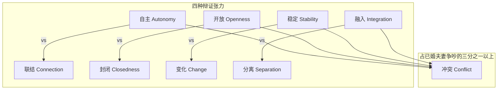
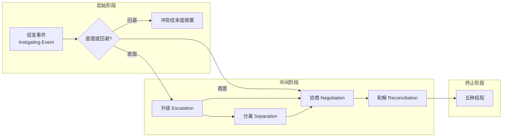
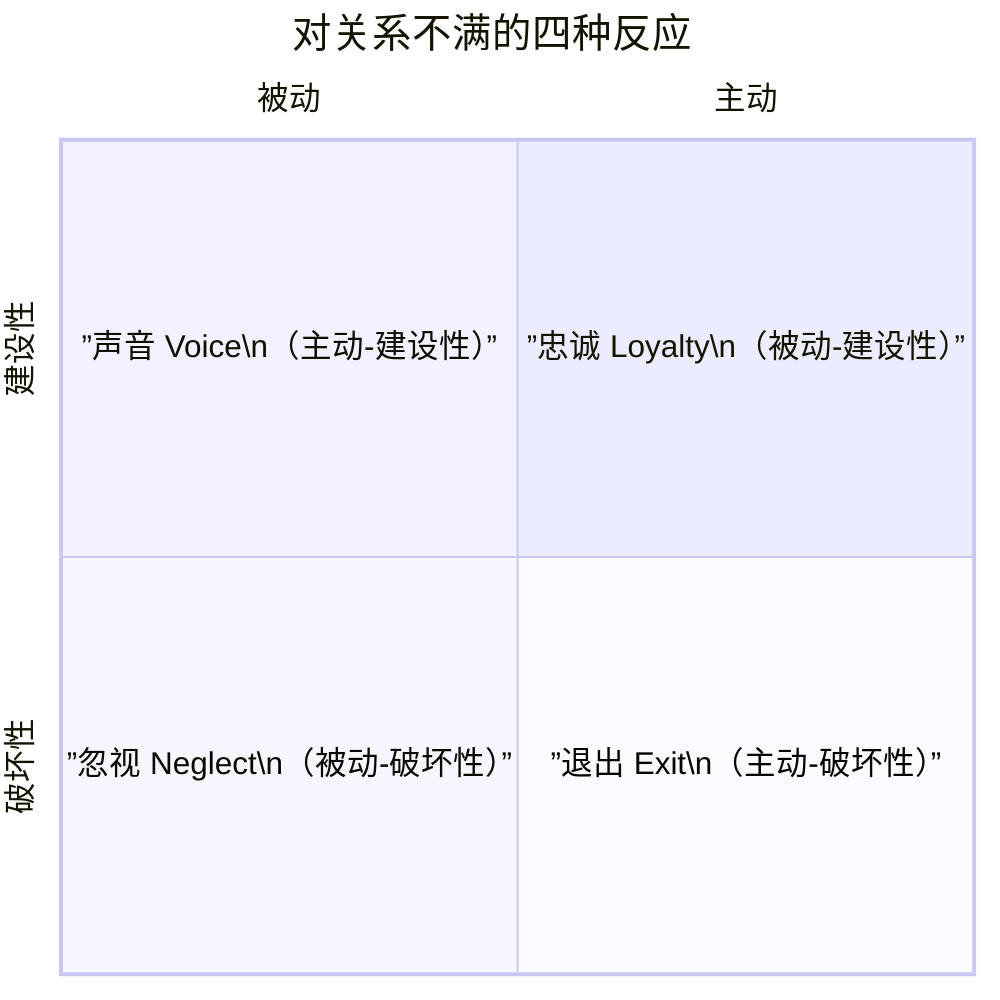
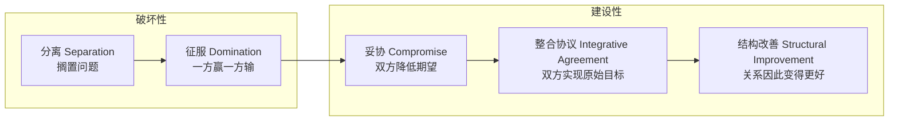

# 第11课：冲突

## Learning Objectives

- 理解亲密关系中冲突不可避免的本质及其**辩证张力**（dialectics）根源
- 识别冲突频率的个体差异和情境影响因素
- 掌握四种**促发事件**（instigating events）：criticism, illegitimate demands, rebuffs, cumulative annoyances
- 了解冲突升级的关键机制：**消极情感互惠**（negative affect reciprocity）和**情绪泛滥**（flooding）
- 区分四种冲突类型夫妻：**volatile, validating, avoiding, hostile**
- 掌握**说话者-倾听者技术**（speaker-listener technique）以建设性管理冲突
- 理解冲突的五种结局及其对关系的含义

## 冲突的本质

### 冲突的定义

**人际冲突**（interpersonal conflict）在一个人必须因伴侣的影响而放弃自己想要的东西时发生。它不一定包含愤怒或敌意——我们有时也会愉快地做出牺牲来迁就对方。

### 为什么冲突不可避免？

冲突不可逃避的原因有二：

**第一，任何两个人的情绪和偏好都会偶尔不同。**
即使你是疯狂派对迷的超级外向者，对方也会因为流感或考试而不想通宵。

**第二，亲密关系内部存在固有的**辩证张力**（dialectics）——永远无法完全满足的对抗性动机：**

### 冲突的频率

冲突在亲密关系中非常频繁：

- 约会的伴侣每周报告约 2.3 次冲突
- 已婚配偶每两周报告约 7 次"值得记住的意见分歧"
- 40% 的冲突从未被提及——伴侣选择不表达不满
- 冲突实际发生的频率比我们意识到的更高

### 影响冲突频率的因素

| 因素 | 影响方向 |
|------|---------|
| **消极情绪性**（Negative emotionality） | 冲突更多 |
| **宜人性**（Agreeableness） | 冲突更少，反应更建设性 |
| **安全型依恋**（Secure attachment） | 冲突更少，管理更好 |
| **焦虑型依恋**（Anxious attachment） | 感知到本不存在的分歧，反应更痛苦 |
| **焦虑+回避组合** | 尤其易燃：焦虑的妻子追，回避的丈夫逃 |
| **年龄** | 从青少年到25岁左右冲突递增，之后趋于平缓 |
| **相似性**（Similarity） | 越相似冲突越少 |
| **压力**（Stress） | 白天压力大 → 晚上冲突多 |
| **睡眠不足**（Sleep deprivation） | 睡不好 → 第二天更容易冲突 |
| **酒精**（Alcohol） | 醉酒使男性更敌对和责备 |

## 冲突的过程

Peterson（2002）的冲突模型描述了冲突从开始到结束的完整过程：

### 促发事件的四种类型

**1. 批评**（Criticism）
言语或非言语行为被解读为对伴侣行为、态度或特质的不公正不满。重点不在于说话者的意图，而在于**接收者是否认为这是不公平的批评**。

**2. 不正当要求**（Illegitimate demands）
超出双方正常期望范围的要求。即使一方确实在赶项目（例如写教材），另一方也可能因为连续三天被要求做饭洗碗而感到不满。

**3. 拒绝**（Rebuffs）
一方期待对方给予某种反应，但对方没有按预期回应。例如，发出含蓄的性邀请后，对方翻身睡去。

**4. 累积性烦恼**（Cumulative annoyances）
小事重复发生，逐渐让人忍无可忍——即所谓的**社交过敏**（social allergies）。女性最容易被男性的粗鲁习惯惹恼（如打嗝），男性最容易被女性缺乏体贴惹恼（如迟到、购物太久）。

### 婚姻冲突的常见议题

| 排名 | 议题 | 在冲突中的占比 |
|:----:|------|:--------------:|
| 1 | **子女**（Children） | 38% |
| 2 | **家务**（Chores） | 25% |
| 3 | **沟通**（Communication） | 22% |
| 4 | **休闲**（Leisure） | 20% |
| 5 | **工作**（Work） | 19% |
| 6 | **金钱**（Money） | 19%（最具破坏性） |

### 归因与冲突

**行为者-观察者效应**（actor/observer effects）和**自利偏差**（self-serving biases）使得双方对同一行为的归因天然不同。当这些不同的归因浮出水面时，就会发生**归因冲突**（attributional conflict）：争论谁的"解释"是对的。

> [!IMPORTANT] 关键发现
> 幸福的伴侣**不太倾向于将伴侣的负面行为归因为自私或恶意的内在原因**，而更倾向于做**仁慈的归因**（benevolent attributions）。如果你认为伴侣的行为是无意的、由外部原因导致的，那么愤怒就不那么强烈，冲突也更容易解决。

### 如何管理愤怒

> [!QUOTE] 重要纠正
> "Expressing anger while you feel angry **nearly always makes you feel angrier**." — Tavris, 1989

"发泄怒火"（venting）是**常见的谬误**。愤怒时对伴侣发火通常只会让对方也愤怒起来 → 双方在负面循环中越烧越旺。

**建设性的愤怒管理三步法：**

1. **换种思路**：不要假定对方是恶意的。尝试从"墙上苍蝇"（fly on the wall）的中立第三方视角看待事件
2. **冷静下来**：离开房间，散步，数到10（或10000）。每分钟不超过6个长而缓慢的深呼吸
3. **寻找幽默**：无法同时感到幽默和愤怒。任何能让你轻松起来的事情都能降低愤怒

### 冲突升级

冲突升级涉及第5课中讨论过的功能失调沟通模式：

**直接攻击战术**：
- 指责（accusations）
- 敌意命令和威胁
- 对抗性问题
- 挖苦贬低

**间接攻击战术**：
- 居高临下的暗示性否定
- 忧郁或抱怨
- 转移话题
- 含糊其辞

#### 消极情感互惠

**消极情感互惠**（negative affect reciprocity）是冲突变得特别恶化的关键机制：

> 一方的烦躁 → 对方回以暴躁 → 前者更加愤怒 → 第二轮交锋更加恶毒 → ... 

这种模式在不幸福的伴侣中常见，而幸福的伴侣能及时退出这种循环。

#### 情绪泛滥

**情绪泛滥**（flooding）是指被过度唤醒和强烈情绪淹没，暂时无法理性思考的状态。当情绪泛滥时：
- 失去幽默感和创造力
- 无法正确处理信息
- 认为"重复自己的立场第31次"对方就会理解
- 身体的应激反应（心跳加快、压力激素分泌）会损害长期健康

> [!WARNING] 健康影响
> 研究表明，冲突中的激烈互动会导致：
> - 伤口愈合更慢
> - 感冒风险增加 2.5 倍
> - 心脏病风险升高
> - 新婚夫妇在讨论冲突时肾上腺素飙升更强的，10年后离婚率更高

### 要求/退缩模式

**要求/退缩模式**（demand/withdraw pattern）是一方要求讨论和改变，另一方回避和退缩的恶性循环：

- 要求方因对方退缩而更加坚持 → 退缩方因压力加大而更加逃避 → **自我维持的循环**
- 全球范围内，**女性更多是要求方，男性更多是退缩方**
- 解释一：性别角色社会化——女性被鼓励表达和亲近，男性被鼓励独立和自主
- 解释二：**社会结构假说**（social structure hypothesis）——拥有更多权力的一方（通常是男性）更不愿意改变现状

> [!NOTE] 有趣发现
> 当研究者让伴侣进行两次讨论——一次妻子想改变，一次丈夫想改变——无论男女，**谁想改变谁就要求，谁被要求谁就可能退缩**。说明这个模式部分源自话题本身，而不仅仅是性别差异。

### 协商与迁就

**协商**（negotiation）是双方冷静下来后，宣布各自立场并寻求解决方案的过程。

**建设性的直接协商战术**：
- 展示解决问题的意愿（接受责任、提出妥协）
- 支持对方观点（用自己的话复述）
- 使用"我句式"（I-statements）进行自我表露
- 表达认可和情感

**间接战术**：友好而非刻薄的非讽刺幽默

> [!TIP] 成功协商的7个技巧
> 1. **保持专注**：放下手机，关掉电视
> 2. **保持乐观**：相信创造性的合作能解决问题
> 3. **重视伴侣的收益**：双方都赢才是最好的结果
> 4. **从"我该做什么"出发**，而非"对方该做什么"
> 5. **展望未来**：想象一年后回看今天的争吵
> 6. **适时休息**：感到烦躁就暂停，从第三方视角看问题
> 7. **暂停后再回来**：休息20分钟，心率恢复后再继续讨论——你会像换了个大脑一样理智

### 对不满的四种反应

Rusbult 提出了人们对关系不满的四种反应类型，分类在主动/被动和建设性/破坏性两个维度上：

- **声音**（Voice）：主动建设性——讨论问题、改变行为、寻求建议
- **忠诚**（Loyalty）：被动建设性——乐观等待、希望情况改善（但往往不被注意，也无实际效果）
- **忽视**（Neglect）：被动破坏性——回避讨论、减少相互依赖、坐视恶化
- **退出**（Exit）：主动破坏性——离开、威胁分手、使用暴力

**迁就**（accommodation）是当伴侣表现出破坏性行为时，能够克制"以牙还牙"的本能，以冷静克制回应——这是一种珍贵的关系能力。

## 四种冲突类型的夫妻

John Gottman 通过多年观察冲突中的夫妻互动，提出了四种类型的夫妻：

| 类型 | 冲突风格 | 可持续性 |
|------|---------|---------|
| **激情型**（Volatile） | 频繁、激烈的争论，伴随大量负面情绪，但同时也用大量幽默和温情来平衡 | 可持续——只要正面:负面 > 5:1 |
| **验证型**（Validating） | 更有礼貌的讨论，像协作者而非对手，经常表达共情和理解 | 最幸福——这始终是有利的方式 |
| **回避型**（Avoiding） | 很少争吵，回避对抗，希望时间解决问题 | 可持续——负面情绪本身就少 |
| **敌对型**（Hostile） | 批评、蔑视、防御、退缩充斥其中，正面:负面远低于5:1 | 危险——婚姻满意度低、问题多 |

> [!IMPORTANT] Gottman 的核心发现
> 关键在于**正面互动与负面互动的比例**维持在**5:1**及以上。激情型夫妻虽然负面情绪多，但正面情绪更多；敌对型夫妻则连这个基础比例都无法维持。
>
> 全美调查显示：**验证型夫妻最普遍（25%双方都是验证型），也最满意**。一个验证型搭配激情型或回避型也比较满意。双方都是回避型（2%）或都是激情型（5%）则少见且满意度较低。

### 四种类型自测

> [!QUESTION] 你们的冲突类型是什么？
> 你和伴侣最符合以下哪种描述？
>
> **A.** 我们有激烈的争吵，有时大声如火山爆发，但关系仍然温暖有爱——我们用笑声和情感来和好。
>
> **B.** 我们争吵时努力保持冷静，尊重对方的意见，即使意见不合也自我克制，寻求妥协。
>
> **C.** 我们避免争吵。讨论分歧只会让情况更糟，所以我们经常"同意不同意"，等待问题自行解决。
>
> **D.** 我们的争吵尖酸刻薄，充满不尊重。我们可能生闷气，但迟早会互相挖苦，说刻薄的话。
>
> A=激情型（Volatile），B=验证型（Validating），C=回避型（Avoiding），D=敌对型（Hostile）

## 冲突的结果

### 冲突的五种结局

从最破坏性到最建设性：

| 结局 | 含义 | 特点 |
|------|------|------|
| **分离**（Separation） | 一方或双方在不解决冲突的情况下退出 | 防止进一步伤害，但问题未解决 |
| **征服**（Domination） | 一方通过另一方屈服而获胜 | 赢家满意，但输家积怨 |
| **妥协**（Compromise） | 双方降低目标，寻求双方都能接受的方案 | 双方都不完全满意，但都不空手而归 |
| **整合协议**（Integrative agreement） | 通过创造性和灵活性，满足双方的原始目标 | 需要努力和想象力，但回报最大 |
| **结构改善**（Structural improvement） | 不仅解决问题，关系还变得更好 | 最理想的结局——双方更加了解、信任，关系质量提升 |

### 冲突可以是有益的吗？

> [!QUOTE]
> "Conflict in couples is common, normal, and **necessary**." — Gottman et al., 2014

关系科学家的主流观点是：**冲突是促进亲密关系的重要工具。**

- 未表达的烦恼越多，关系满意度越低
- 回避冲突而不解决问题的新婚夫妇，多年后更不幸福
- 中年女性若不表达对婚姻的不满，未来10年的死亡率是勇于表达者的**4倍**

> [!WARNING] 注意
> 当关系有严重缺陷时，浪漫化的理想化（romantic illusions）是危险的。认识真实问题并加以批判地对待，才是正确的做法。

### 说话者-倾听者技术

Gottman 提出的**说话者-倾听者技术**（speaker-listener technique）是一种安全讨论棘手问题的结构式沟通方法：

**基本原则：**
- 使用一个实物（如书或遥控器）作为"地板"（floor）——只有持"地板"者可以说话
- 轮流持有地板，每次发言简短
- 不急于解决问题——第一步是相互理解

**说话者规则：**
- 用"我句式"描述自己的想法和感受
- 不说对方的动机或观点（不做"读心者"）
- 讲完后停下来让倾听者复述

**倾听者规则：**
- 复述你听到的内容——证明你在听且理解了
- 不反驳——你的任务只是理解对方，而不是表达自己

> [!TIP]
> 这听起来可能有些笨拙，但正如其提出者所说："这不是一种正常的沟通方式，但它是**安全的方式**。"

### 冲突后的修复

讨论结束后，工作尚未完成：积极努力安抚受伤感情、修复关系的伴侣，比闷闷不乐或退缩疗伤的伴侣更幸福。

最有帮助的修复短语（Rubin, 2009）：
- "我可能错了。"
- "我能看到我在这件事中的部分责任。我怎样才能让情况好转？"
- "我从前没这么想过。"
- "这不是你一个人的问题，这是我们共同的问题。"

### Fight Effects Profile（冲突效果评估表）

每次冲突后，可以从以下维度评估结果：

| 类别 | 积极结果（好争吵） | 消极结果（坏争吵） |
|------|------------------|------------------|
| **伤害** | 感觉伤害减轻 | 感觉伤害加重 |
| **信息** | 了解了更多伴侣的感受 | 没学到新东西 |
| **解决** | 问题更可能被解决 | 解决问题的可能性降低 |
| **信任** | 更确信伴侣的善意 | 对伴侣善意的信心下降 |
| **报复** | 没有产生报复意图 | 产生了报复意图 |
| **和解** | 主动努力弥补造成的伤害 | 不尝试和解 |
| **自我评价** | 自我感觉更好 | 自我感觉更差 |
| **凝聚力** | 与伴侣的亲密感和吸引力增加 | 亲密感和吸引力下降 |

## 应用练习

> [!QUESTION] 案例分析与角色演练
> John 的妻子 Tina 是个"火爆性子"——有事情惹到她时，她希望立刻放下一切来解决问题，但情绪很高涨。她容易生气，但也消气得快。John 比较温和，他讨厌冲突。当他生气时，是慢慢燃烧而不是爆发。当有事困扰他时，他宁愿自己去打游戏，也不愿展开可能变成争吵的讨论。
>
> 最近 Tina 非常沮丧，因为当她提起抱怨时，John 闭口不言、毫无反应。他回避讨论她的不满，这反而让她的烦躁和不满越来越严重。
>
> 1. 这对夫妻展示了哪种冲突模式？
> 2. 如果你是他们的朋友，你会分别给 Tina 和 John 什么建议？
> 3. 尝试想象：用"说话者-倾听者技术"重新演绎他们的一次冲突讨论，应该怎么做？

思考指引

**问题1**：这明显是**要求/退缩模式**（demand/withdraw pattern）的典型案例。Tina 是要求方，John 是退缩方。Tina 越要求讨论，John 越退缩；John 越退缩，Tina 越沮丧，要求越强烈——典型的自我维持循环。

**问题2建议**：
- **给 Tina**：可以考虑降低情绪强度，用"我句式"来表达感受而不是指责。同时，理解 John 的退缩部分源于他的性格特质，不是不关心。
- **给 John**：回避不解决问题。可以要求稍后讨论（"我现在需要一点时间思考，我们半小时后谈好吗？"），但**必须遵守承诺去讨论**。回避只会让问题发酵。
- **共同建议**：双方都需要认识到冲突不是灾难。John 需要学会面对冲突，Tina 需要学会降低情绪温度。使用说话者-倾听者技术来建立安全的讨论结构。

**问题3演练建议**：
- 设定一个实物作为"地板"
- Tina 拿到地板时说："我感到很沮丧，因为当我有一件事想和你讨论时，你似乎不想听我说。"（我句式，不指责）
- John 作为倾听者复述："我听到你说，你想和我讨论事情但觉得我不愿意听。"
- 交换地板，John 说："我感到有压力，当我还没有准备好讨论时，被推着去谈一些事情。"
- Tina 复述......
- 如此循环，不急于解决问题，先确保双方都真被听见了。

## 核心引用

- Peterson, D. R. (2002). Conflict. In H. H. Kelley, E. Berscheid, A. Christensen, et al. (Eds.), *Close relationships*. Percheron Press.
- Gottman, J. M. (1994). *Why marriages succeed or fail*. Simon & Schuster.
- Gottman, J. M. (2015). *Principia amoris: The new science of love*. Routledge.
- Rusbult, C. E., Zembrodt, I. M., & Gunn, L. K. (1982). Exit, voice, loyalty, and neglect: Responses to dissatisfaction in romantic involvements. *Journal of Personality and Social Psychology, 43*, 1230–1242.
- Canary, D. J., & Lakey, S. (2013). *Strategic conflict*. Routledge.
- Tavris, C. (1989). *Anger: The misunderstood emotion*. Simon and Schuster.
- Markman, H. J., Stanley, S., & Blumberg, S. L. (1994). *Fighting for your marriage: Positive steps for preventing divorce and preserving a lasting love*. Jossey-Bass.

## 继续学习

下一课：[第12课：权力与暴力](0012-power-and-violence)——亲密关系中的权力分配、暴力类型及其对关系的影响。