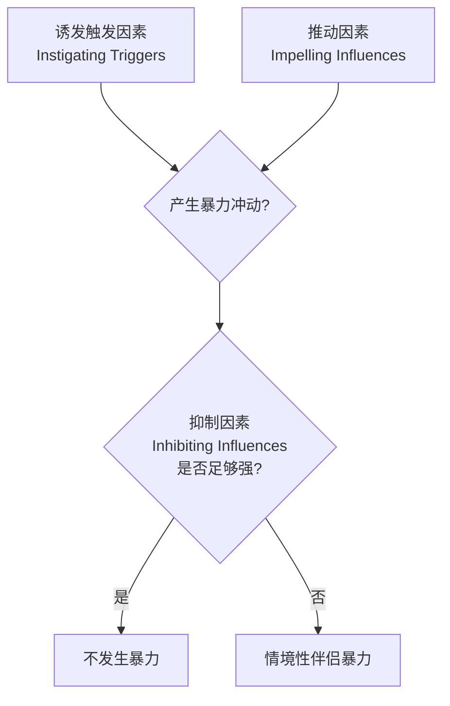

# 第12课：权力与暴力（Power and Violence）

## Learning Objectives

- 理解**社会权力**（social power）的定义及其在亲密关系中的运作方式
- 掌握**最小兴趣原则**（principle of lesser interest）及其对权力平衡的影响
- 区分**命运控制**（fate control）与**行为控制**（behavior control）
- 识别权力的**六种基础**（six bases of power）及其在关系中的应用
- 认识权力的两面性：施惠与支配
- 区分**四种类型的伴侣暴力**：情境性伴侣暴力、亲密恐怖主义、暴力抵抗、相互控制暴力
- 理解 **I³ 模型**（I-cubed model）解释情境性伴侣暴力的机制
- 了解暴力对受害者的影响及其离开困难的原因

## 权力的本质

> [!QUOTE] 书中定义
> **社会权力**（social power）是影响或改变他人思想、情感与行为以满足自己目的的能力，以及抵抗他人对我们施加影响的能力。——Simpson et al., 2015

### 权力与相互依赖

从**相互依赖理论**（interdependence theory）的视角来看，权力的基础在于对**有价值资源**的控制。如果我控制了你想要的东西，你就会被激励去遵从我的意愿。


### 最小兴趣原则

> [!IMPORTANT] 核心原理
> **最小兴趣原则**（principle of lesser interest）指出：在任何伴侣关系中，**对继续和维持关系兴趣较小的一方拥有更大的权力**。——Waller & Hill, 1951

这意味着：
- 爱得更多的人往往拥有**更少**的权力
- 承诺度较低的伴侣通常能更多地"按自己的方式做事"
- 例如：男性平均来说对性有更强渴望 → 这赋予女性权力（性作为一种有价值资源的交换）

### 权力的两种基本形式

| 类型 | 定义 | 示例 |
|------|------|------|
| **命运控制**（Fate control） | 单方面决定伴侣获得何种结果 | 女性拒绝与丈夫发生性关系时，她在行使命运控制 |
| **行为控制**（Behavior control） | 通过改变自身行为，鼓励伴侣也朝理想方向改变 | "如果你清理车库，我就给你按摩" |

> [!NOTE] 关键认识
> 在几乎所有关系中，双方都拥有对彼此的某些权力。权力动态是**持续流动的互动过程**，双方各有不同的影响力，在某些情境中强、在其他情境中弱。

## 权力的来源：六种基础

French 和 Raven（1959）识别出六种权力基础：

| 权力类型 | 资源 | 发挥作用的机制 |
|---------|------|--------------|
| **奖赏权力**（Reward power） | 奖赏 | 可以给予对方喜欢的东西，或拿走不喜欢的东西 |
| **强制权力**（Coercive power） | 惩罚 | 可以做对方不喜欢的事，或拿走喜欢的东西 |
| **合法权力**（Legitimate power） | 权威、互惠/公平/社会责任规范 | 对方承认你有权告诉他们怎么做 |
| **参照权力**（Referent power） | 尊重和/或爱 | 对方认同你、被你吸引、希望保持亲密 |
| **专家权力**（Expert power） | 专长 | 你拥有他们渴望的广泛知识 |
| **信息权力**（Informational power） | 信息 | 你持有某些他们渴望的具体信息 |

### 资源的普遍性与特殊性

| 类型 | 特征 | 示例 |
|------|------|------|
| **普遍性资源**（Universalistic） | 可广泛交换，赋予持有者很大自由度 | 金钱——可在多种情境中与几乎任何人交换 |
| **特殊性资源**（Particularistic） | 只在特定情境/特定伴侣中才有价值 | 爱情——只对特定伴侣提供参照权力 |

> [!WARNING] 性别差异
> 男性通常比女性拥有更多资源、地位和金钱。即使女性收入更高，家务分工仍然不平等：
> - 美国女性平均每周做 18 小时家务，男性仅 10 小时
> - 在重大决策（结婚、生育等）上，男性通常更有话语权
> - 女性控制日常家务，但男性在"真正重要的时刻"更可能获胜

## 权力的过程

```mermaid
flowchart TB
    subgraph ”权力的表达方式”
        A1[对话中的打断]
        A2[非语言姿态]
        A3[非语言敏感度]
        A4[影响策略]
    end
    
    subgraph ”较高权力者特征”
        B1[更多打断对方]
        B2[占据更大空间]
        B3[较低的非语言敏感度]
        B4[更多使用直接双侧策略]
    end
    
    A1 --> B1
    A2 --> B2
    A3 --> B3
    A4 --> B4
```

### 影响策略

Falbo 和 Peplau（1980）识别出两个关键维度：

| 维度 | 描述 |
|------|------|
| **直接 vs. 间接** | 直接：明确请求；间接：暗示、撅嘴 |
| **双侧 vs. 单侧** | 双侧：协商对话；单侧：自行其是 |

- 关系满意度**越高**，越倾向于使用**直接**策略
- 权力**越大**，越倾向于使用**双侧**策略
- 权力**越小**，越倾向于使用**单侧**策略

> [!TIP] 变化趋势
> 新一代女性在果断性（instrumentality）上逐代提高，异性恋关系中的权力已变得更加平等。直接策略也更成功地促使伴侣做出改变。

## 权力的结果：平等的优势

> [!QUOTE] 关键发现
> "当权力被分享时，每个人都赢了。"
> - 女性在拥有与丈夫同等权力时更快乐
> - 男性的快乐程度也略有提高
> - 权力对等的伴侣婚姻更幸福、冲突更少、离婚倾向更低

### 平等关系的四个维度（Mahoney & Knudson-Martin, 2009）

| 维度 | 关键问题 |
|------|---------|
| **相对地位**（Relative Status） | 谁的利益更重要？谁定义什么对两人重要？ |
| **关注对方**（Attention to the Other） | 谁更留意伴侣的感受和需求？双方是否互相给予关怀？ |
| **顺应模式**（Patterns of Accommodation） | 谁的迁就被注意到和认可，谁的被视为理所当然？ |
| **福祉**（Well-Being） | 谁的经济成功更被重视？一方的福祉是以另一方的健康为代价吗？ |

## 权力的两面性

```mermaid
flowchart LR
    subgraph ”权力的光明面”
        A1[公正地使用权力]
        A2[为伴侣福祉着想]
        A3[共同取向的慷慨]
    end
    
    subgraph ”权力的阴暗面”
        B1[控制与支配]
        B2[自私自利]
        B3[诉诸暴力]
    end
    
    A1 --> C[关系更满意]
    A2 --> C
    A3 --> C
    B1 --> D[关系受损]
    B2 --> D
    B3 --> D
```

> [!NOTE] 权力并不必然腐败
> 当人们在承诺的亲密关系中持有**共同取向**（communal orientation）时，他们通常将权力用于伴侣和关系的利益，而非自私目的。善良、有爱心的人会**慈善、宽宏地使用权力**。

## 关系中的暴力

> [!WARNING] 严重性
> 美国疾病控制与预防中心数据：
> - 近 1/4 的女性（23%）和 1/7 的男性（14%）曾经历过来自亲密伴侣的**严重身体暴力**
> - 联合国报告：**30%** 的世界女性曾遭受家庭伴侣的攻击
> - 亲密伴侣暴力（IPV）每年造成约 **93 亿美元** 的医疗、心理服务和误工损失

### 四种类型的伴侣暴力

Michael Johnson（2017）区分了三种（后来扩展为四种）不同类型的伴侣暴力：

| 类型 | 特征 | 起因 | 性别分布 |
|------|------|------|---------|
| **情境性伴侣暴力**（Situational Couple Violence, SCV） | 偶尔发生、通常较温和、常为双向 | 激烈冲突失控，双方愤怒 | 男女发生率相当 |
| **亲密恐怖主义**（Intimate Terrorism, IT） | 持续、单向、随时间升级、常造成严重伤害 | 用暴力作为控制与压迫工具 | **80% 为男性** |
| **暴力抵抗**（Violent Resistance） | 受害者对亲密恐怖主义的还击 | 自卫性质 | 女性多于男性 |
| **相互控制暴力**（Mutual Violent Control） | 双方都使用暴力争夺控制权 | 双方同时实施 IT | 较少见 |

### 亲密恐怖主义的控制策略

| 策略 | 具体行为 |
|------|---------|
| **孤立**（Isolation） | 控制她去哪里、做什么、见谁 |
| **恐吓**（Intimidation） | 威胁、毁坏财产、虐待宠物 |
| **经济虐待**（Economic Abuse） | 拿走她的钱、阻止她工作 |
| **情感虐待**（Emotional Abuse） | 羞辱、无视、指责："这是你的错" |
| **淡化**（Minimizing） | 否认虐待行为 |

### I³ 模型：情境性伴侣暴力的解释框架

Finkel（2008）提出的 **I³ 模型** 将 SCV 的影响因素组织为三类：



**诱发触发因素**（Instigating Triggers）：
- 引发嫉妒的事件
- 记住或发现的背叛
- 真实或想象的拒绝
- 伴侣先骂人/动手

**推动因素**（Impelling Influences）：

| 层面 | 示例 |
|------|------|
| **远端因素**（Distal） | 童年目睹暴力、遭受虐待、接触暴力媒体 |
| **倾向因素**（Dispositional） | 冲动、低宜人性、愤怒倾向、不安全的依恋风格 |
| **关系因素**（Relational） | 沟通技能差、依恋风格不匹配 |
| **情境因素**（Situational） | 工作学业压力、炎热嘈杂的环境 |

**抑制因素**（Inhibiting Influences）：

| 层面 | 示例 |
|------|------|
| 文化 | 促进性别平等、经济繁荣 |
| 个人 | 尽责性、自我控制能力 |
| 关系 | 问题解决技能、爱与关怀、承诺度 |
| 情境 | 清醒状态（酒精会促进暴力） |

> [!IMPORTANT] 暴力一旦开始往往持续
> 在新婚夫妇中，76% 在订婚时有身体攻击的男性在婚后 30 个月内再次施暴。暴力一旦在特定关系中开始，往往持续重复发生。

### 暴力的代际传递

- 在暴力家庭中长大的孩子更有可能成为施暴者
- 但这一循环**并非不可避免**
- 即使在最极端的群体中（最暴力父母的儿子），也只有 20% 对伴侣实施了严重暴力

### 受害者的理性化

施暴者常常为暴力辩护：
- 认为暴力是对"不尊重"的合法回应
- 认为自己是"权威"，有权使用暴力来控制和管教
- 认为自己不是"真正的"施虐者（"我只刺了一次"、"我没有用尽全力"）

受害者往往：
- 被浪漫规范影响而"原谅和忘记"
- 被文化规范引导而责怪自己
- 因为承诺而对暴力轻描淡写
- 认为伴侣会改变

### 为什么不离开？

> [!QUESTION] 核心问题
> 为什么不所有受害者都逃离施暴者？

根据相互依赖理论：
- **他们认为离开后不会过得更好**（尽管往往错误地低估了离开的好处）
- 暴力伴侣有时候是甜蜜和爱人的
- 离开的成本太高（投资损失、替代选择暗淡）
- 经济依赖是关键因素
- 害怕更大报复

> [!TIP] 帮助指南
> 当有人向你披露亲密伴侣暴力时，请严肃对待。来自可信赖知己的支持和关心使受害者更有可能离开。
>
> **美国全国家庭暴力热线**：(800) 799-7233
> **英国全国家庭虐待热线**：0808 2000 247

## Stalking（跟踪/盯梢）

> [!WARNING] 普遍性
> 约会和亲密关系中的跟踪（stalking）比人们想象中更为常见。数据显示，约**16%的女性**和**5%的男性**在生活中曾经历过跟踪。

### Stalker 的三种类型

研究者将 stalker 划分为三种类型，但三种类型之间并非完全互斥：

| 类型 | 英文标签 | 核心特征 |
|------|---------|---------|
| **恶意型** | "Bad" | 有意恐吓、伤害或控制对方，行为带有明确的恶意 |
| **精神障碍型** | "Mad" | 因精神健康问题（如妄想、偏执）而纠缠对方 |
| **渴望亲密型** | "Sad" | 极度渴望亲密关系但社交无能，用跟踪来表达"爱意"或建立联系 |

### 现代形式：Cyberstalking（网络跟踪）

随着数字技术的普及，跟踪不再限于物理空间的尾随。网络跟踪包括：
- 反复发送短信、邮件、社交媒体私信
- 监控对方的位置信息、社交动态
- 使用虚假账号骚扰或冒充对方
- 散布对方隐私信息

### 伴侣守卫（Mate-guarding）

在亲密关系的语境中，暴力常常被用作**伴侣守卫**（mate-guarding）策略：
- **垄断时间**：限制伴侣与朋友、家人的见面
- **监视行为**：检查伴侣的手机、行踪
- **暴力控制**：用身体暴力或威胁来阻止伴侣与他人交往

> [!NOTE] 关键认识
> 伴侣守卫行为的根源是**不安全感**——当一个人感到可能失去伴侣时，会采取极端措施来"保护"关系。但这种行为本身恰恰破坏了关系所需的信任和尊重。

> [!QUESTION] 反思练习
> 1. 检视你自己（或你熟悉）的一段亲密关系：权力分配是平衡还是倾斜的？谁在重大决定和日常决定上更有话语权？
> 2. 回想一段关系中你使用的权力策略：是直接的还是间接的？你觉得这种策略有效吗？是否影响了关系的满意度？
> 3. 假设你发现朋友处于一段有暴力迹象的关系中，你会如何帮助她/他？在什么情况下你会建议寻求专业帮助？

<details>
<summary>思考指引</summary>

**问题1**：注意权力的"隐形"层面。即使表面平等的伴侣，也可能在"谁的利益更重要"、"谁的迁就被视为理所当然"等维度上存在隐性不平衡。可以参考 Mahoney 和 Knudson-Martin 的四个维度进行评估。

**问题2**：研究表明，直接双侧策略（坦诚请求、协商）与更高的关系满意度相关。如果你倾向于使用间接或单侧策略（暗示、自行其是），可能反映了关系中某种权力的不安全感。

**问题3**：关键是要避免评判受害者，同时提供实质支持。牢记：受害者不离开有复杂的原因（经济依赖、恐惧、承诺、对改变的希望）。提供非评判性的倾听，帮助受害者了解资源（如家庭暴力热线），尊重他们的选择。如果涉及紧急危险，不要犹豫拨打紧急电话。
</details>

## 核心引用

- French, J. R. P., Jr., & Raven, B. H. (1959). The bases of social power. In D. Cartwright (Ed.), *Studies in social power* (pp. 150–167). Institute for Social Research.
- Falbo, T., & Peplau, L. A. (1980). Power strategies in intimate relationships. *Journal of Personality and Social Psychology, 38*, 618–628.
- Finkel, E. J. (2008). Intimate partner violence perpetration: Insights from the science of self-regulation. In J. P. Forgas & J. Fitness (Eds.), *Social relationships: Cognitive, affective and motivational processes* (pp. 271–288). Psychology Press.
- Johnson, M. P. (2017). A social-psychological typology of intimate partner violence. In P. B. T. B. S. (Ed.), *The Wiley-Blackwell encyclopedia of social and political movements*. Wiley-Blackwell.
- Mahoney, A. R., & Knudson-Martin, C. (2009). Gender equality in intimate relationships. In C. Knudson-Martin & A. Mahoney (Eds.), *Couples, gender, and power: Creating change in intimate relationships* (pp. 3–16). Springer.

## 继续学习

下一课：[第13课：关系的解体与丧失](0013-dissolution-and-loss)