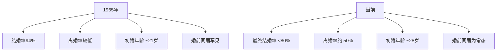
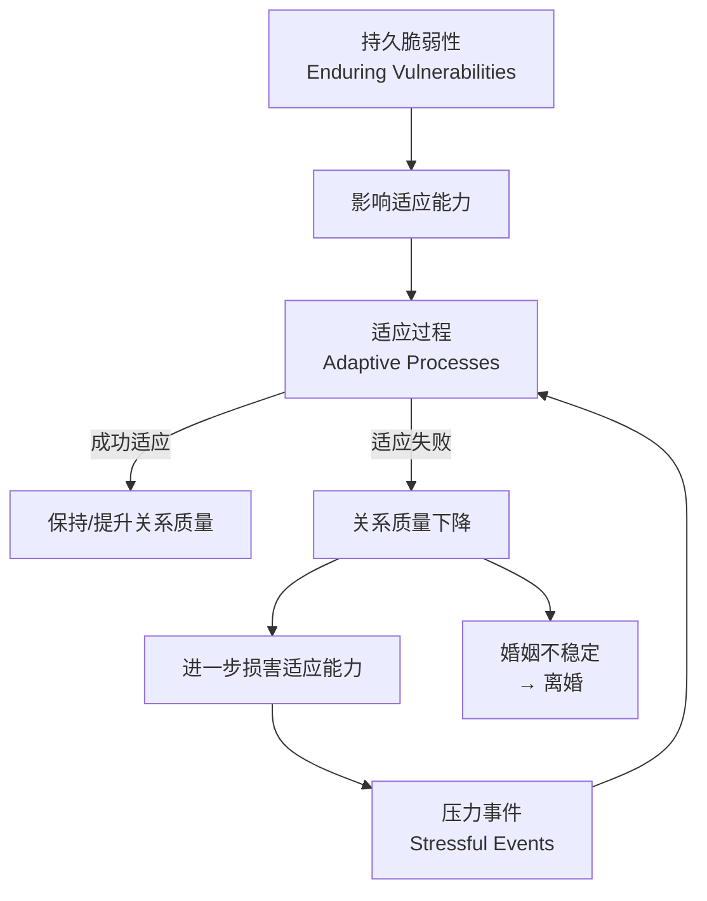
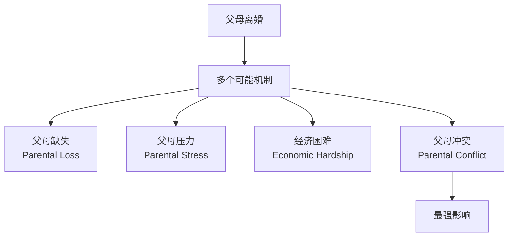

# 第13课：关系的解体与丧失（Dissolution and Loss）

## Learning Objectives

- 了解离婚率的历史变化趋势及其社会原因
- 掌握**Levinger 障碍模型**（barrier model）的三要素
- 理解**脆弱-压力-适应模型**（vulnerability-stress-adaptation model）
- 区分**持续动力学模型**、**浮现困扰模型**与**幻想破灭模型**
- 识别离婚的各类预测因素（个人、关系、社会文化层面）
- 了解**Duck 的阶段模型**中的五个阶段
- 认识分手后恢复的心理过程与时间轨迹
- 理解离婚对成人、儿童及社会网络的多方面影响

## 离婚率的变化趋势

> [!QUOTE] 现状
> 美国当前每一年离婚数量接近结婚数量的一半，近期婚姻最终以分居或离婚告终的概率仍徘徊在 **50%** 左右。



### 为什么离婚率上升了？

| 影响因素 | 作用机制 |
|---------|---------|
| **更高的期待** | 婚姻从"实际需要"变为"个人实现"的路径；期待过高导致失望 |
| **女性就业增加** | 增加工作与家庭冲突、接触更多替代伴侣、减少经济依赖 |
| **个人主义与流动性** | 更少受社区规范约束；频繁搬迁增加离婚倾向 |
| **无过错离婚法** | 使离婚更容易获得、社会接受度更高 |
| **随意同居** | 削弱对婚姻制度的尊重和承诺 |
| **代际传递** | 离异家庭的孩子成年后自己也更可能离婚 |
| **社会网络效应** | 朋友离婚会使自己离婚风险增加 75% |

> [!WARNING] 同居悖论
> 婚前同居与更高的离婚风险相关，但这一风险在**订婚后**才开始同居的伴侣中并不显著。随意同居（特别是与多人同居）会改变对婚姻的信念：减少对婚姻制度的尊重、降低对婚姻结果的乐观预期、增加离婚意愿。

## 离婚的预测模型

### Levinger 的障碍模型

George Levinger（1976）运用相互依赖理论的三个核心元素来解释关系解体：

```mermaid
flowchart LR
    subgraph ”Levinger 障碍模型”
        A[吸引力<br>Attraction]
        B[替代选择<br>Alternatives]
        C[障碍<br>Barriers]
    end
    
    A --> D{是否留下?}
    B --> D
    C --> D
    
    D -->|吸引力高+替代差+障碍强| E[维持关系]
    D -->|吸引力低+替代好+障碍弱| F[关系解体]
```

| 要素 | 含义 | 示例 |
|------|------|------|
| **吸引力**（Attraction） | 关系中的奖赏减去成本 | 愉快的陪伴、性满足 vs. 烦人的不兼容、时间投入 |
| **替代选择**（Alternatives） | 其他关系或单身生活 | 其他伴侣、职业成功 |
| **障碍**（Barriers） | 离开的难度 | 法律压力、宗教约束、经济成本、对子女的愧疚 |

> [!NOTE] 关键洞见
> 障碍模型的重要贡献在于指出：**不快乐的伴侣可能因为离开成本太高而留在一起**。但研究发现，一旦人们真正决定离开婚姻，这些障碍往往起不到阻止作用。

### 脆弱-压力-适应模型

Karney 和 Bradbury（1995）提出了一个更动态的模型：



| 层面 | 内容 |
|------|------|
| **持久脆弱性**（Enduring Vulnerabilities） | 原生家庭不良经历、教育不足、不良人格特质、糟糕的社交技能、对婚姻的功能失调态度 |
| **压力事件**（Stressful Events） | 外部压力（失业、疾病）、内部压力（怀孕、育儿）、日常琐碎烦恼的累积 |
| **适应过程**（Adaptive Processes） | 沟通、支持提供、共同应对的能力 |

> [!TIP] 积极消息
> 成功应对压力可以使我们更强——曾经历过适度压力的夫妻，在面对新压力（如为人父母）时可能更有韧性。压力没有压垮我们，就可能使我们更强大。

### PAIR 项目的三大模型

Ted Huston 的 PAIR 项目（Processes of Adaptation in Intimate Relationships）追踪了 168 对夫妻 30 年，比较了三种解释模型：

| 模型 | 核心主张 | PAIR 项目的发现 |
|------|---------|----------------|
| **持续动力学模型**（Enduring Dynamics Model） | 注定不满的夫妻从求爱期开始就较少爱意、更多冲突 | ✅ **预测了婚姻的幸福程度**——问题从开始就存在 |
| **浮现困扰模型**（Emergent Distress Model） | 问题行为在婚后才开始出现，逐渐陷入消极互动 | ❌ 不是主要因素 |
| **幻想破灭模型**（Disillusionment Model） | 夫妻带着不切实际的玫瑰色愿景开始婚姻，现实逐渐侵蚀浪漫 | ✅ **最佳预测离婚的模型**——浪漫消退的速度和幅度最关键 |

> [!WARNING] 惊人发现
> 那些婚姻持续 7 年以上才离婚的夫妻，在婚姻**开始时**比其他人更浪漫、更深情——正因为他们的起始浪漫程度更高，"掉下来"的幅度更大，虽然终点并未低于平均水平。

## 离婚的具体预测因素

### 个人层面

| 因素 | 影响 |
|------|------|
| 社会经济地位 | 低地位、低教育、低收入者更易离婚 |
| 结婚年龄 | 25 岁后结婚者离婚率更低 |
| 人格特质 | 高消极情绪性（negative emotionality）显著增加离婚风险 |
| 不安全依恋 | 依恋回避比依恋焦虑的风险更高 |
| 遗传因素 | 同卵双胞胎中一人离婚，另一人离婚概率增加 5 倍 |
| 压力激素 | 新婚第一年血液压力激素水平高者，10 年后更可能已离婚 |

### 关系层面

| 因素 | 影响 |
|------|------|
| 婚前同居 | 增加离婚风险（但订婚后的同居风险较小） |
| 婚前矛盾心理 | 求爱期的不确定性预测离婚 |
| 相似性 | 共同的越多，离婚可能性越低 |
| 婚姻满意度 | 对稳定性影响最大的变量之一 |
| 积极-消极互动比 | 低于 5:1 的积极/消极比更易离婚 |
| 不忠 | 伴侣出轨大大增加离婚可能 |

### 文化与制度层面

| 因素 | 影响 |
|------|------|
| 种族 | 非裔美国人因更多风险因素暴露而离婚率更高 |
| 宗教 | 双方参加同一宗教活动可降低离婚风险 |
| 性别比例 | 女性多于男性时离婚率更高 |
| 无过错离婚法 | 使离婚更容易，增加了离婚率 |

> [!QUESTION] 人们自己认为的离婚原因
> 夫妻最常报告的离婚原因：
> 1. 不忠（22%）
> 2. 不兼容（19%）
> 3. 饮酒/物质滥用（11%）
> 4. 成长方向不同（10%）
> 5. 人格问题（9%）
> 6. 沟通困难（9%）
> 7. 身体/精神虐待（6%）

## 分手的过程

### 结束婚前关系的策略

Baxter（1984）识别出几个关键维度：

| 维度 | 描述 |
|------|------|
| **直接 vs. 间接** | 直接声明分手意图 vs. 从未明确表达 |
| **他人取向 vs. 自我取向** | 保护对方感受 vs. 只顾自己 |
| **渐进 vs. 突然** | 逐渐不满（~75%）vs. 关键突发事件（~25%） |
| **单方 vs. 双方意愿** | 仅一方想结束（~2/3）vs. 双方都想结束 |
| **快速 vs. 持久退出** | 多次伪装努力后才成功（更常见）vs. 一次到位 |
| **修复尝试** | 大多数情况下没有正式修复尝试 |

最常见的模式——**持续性间接策略**（persevering indirectness）：逐渐不满 → 一方反复尝试结束关系而不明确表达 → 不尝试修复。

### 分手的典型脚本

| 步骤 | 事件 |
|------|------|
| 1 | 一方开始对关系失去兴趣 |
| 2 | 失去兴趣的一方开始关注其他人 |
| 3 | 该方变得疏远、冷淡 |
| 4 | 双方试图解决问题 |
| 5 | 相处时间减少 |
| 6 | 缺乏兴趣再次浮现 |
| 7 | 有人开始考虑分手 |
| 8 | 沟通感受，"达成共识" |
| 9 | 再次尝试解决问题 |
| 10 | 一方或双方再次关注其他人 |
| 11 | 相处时间再次减少 |
| 12 | 与其他潜在伴侣约会 |
| 13 | 试图复合 |
| 14 | 一方或双方再次考虑分手 |
| 15 | 情感脱离，"向前看" |
| 16 | 最终分手，关系解体 |

### Duck 的阶段模型

Steve Duck 提出关系解体的五个普遍阶段：


| 阶段 | 内容 |
|------|------|
| **个人阶段**（Personal Phase） | 一方不满，感到沮丧和抱怨 |
| **二元阶段**（Dyadic Phase） | 不满方揭示不满，经历谈判、对抗或适应尝试 |
| **社会阶段**（Social Phase） | 双方公开各自的"版本"，向亲友寻求支持 |
| **扫墓阶段**（Grave-dressing Phase） | 哀悼减少，进行认知工作，创建关于关系的**叙事**（narrative）|
| **复活阶段**（Resurrection Phase） | 作为单身重新进入社会生活，宣布自己更智慧了 |

## 分手后的恢复

### 情绪的时间轨迹


> [!NOTE] 好消息
> 分手的痛苦通常**没有我们预期的那么严重**。人们正确预测了时间会愈合伤口，但高估了最初痛苦的强度。

### 影响恢复的因素

| 促进恢复的因素 | 阻碍恢复的因素 |
|---------------|---------------|
| 反思（寻求意义和学习） | 反刍（反复咀嚼痛苦） |
| 接受关系的终结 | 保留大量社交媒体记忆 |
| 关注前任的缺点 | 追踪前任的 Facebook 页面 |
| 安全型依恋 | 焦虑型依恋（尤其难以前行） |
| 开始浏览新的约会资源 | 独自怀旧/幻想复合 |

### 离婚的特殊性

离婚比分手复杂得多：财产分割、子女抚养、法律程序。

**德国社会经济面板研究**（追踪 30,000+ 人 18 年）发现：

```mermaid
flowchart LR
    subgraph ”离婚的典型轨迹”
        A[婚前数年<br>幸福感下降] --> B[离婚时<br>低谷]
        B --> C[离婚后<br>逐渐回升]
        C --> D[多年后<br>仍低于基线]
    end
```

- 大多数离婚结束了一段长期幸福下降的过程
- 离婚后生活开始变好，但**多年后仍不如婚姻未破裂前幸福**
- 约 **9%** 的人在离婚后比离婚前更幸福
- 约 **19%** 的人离婚后幸福感长期低于离婚前

### 再婚

- 52% 的离婚女性和 64% 的离婚男性会再婚
- 再婚通常带来幸福感提升
- 但第二次婚姻往往与第一次惊人相似——**同样的模式可能重复**

### 离婚的经济影响

| 维度 | 对女性的影响 | 对男性的影响 |
|------|------------|------------|
| 家庭收入 | 下降约 27% | 也下降但幅度较小 |
| 人均收入 | **下降 36%**（通常带孩子） | **上升 34%**（通常独居） |
| 生活标准 | 下降 | 改善 |

### 离婚后的前配偶关系类型

| 类型 | 特征 | 比例（1年后）|
|------|------|:----------:|
| **火爆敌人**（Fiery Foes） | 持续敌对，无法共同育儿 | 25% |
| **愤怒同僚**（Angry Associates） | 相互不尊重，但能合作育儿 | 25% |
| **合作同事**（Cooperative Colleagues） | 有礼有节，成功合作育儿 | 38% |
| **完美伙伴**（Perfect Pals） | 维持强友谊，相互尊重 | 12% |

---

### 离婚对子女的影响

> [!WARNING] 总体结论
> 离异家庭的子女在青少年和成年期的幸福感普遍低于完整家庭子女，效果通常**不大**但**始终负向**：
> - 更多抑郁、焦虑、生活满意度低
> - 更多药物使用、违法行为、非意愿怀孕、较差学业
> - 成年后自身关系更脆弱

**影响因素**：



> [!IMPORTANT] "为了孩子而维持婚姻"？
> 关键因素是**家庭冲突的水平**：
> - **低冲突家庭**：离婚对孩子有负面影响（最好不离婚）
> - **高冲突家庭**：离婚对孩子几乎没有额外伤害（离婚反而可能有利）

如果父母能在离婚后合作提供高质量、无冲突的育儿，子女的负面结果会大大减少。

## 应用练习

> [!QUESTION] 案例分析与反思
> 1. 回顾你听过或经历过的分手/离婚案例，你能识别出 Duck 阶段模型中的哪些阶段？分手双方的"叙事"有何不同？
> 2. 如果你的一位朋友正经历分手，根据研究中关于恢复的因素，你会给他/她什么具体建议？
> 3. 假设你喜欢的人曾经历过父母离婚，这对你评估你们未来关系有何启示？你是否会改变你的交往方式？

<details>
<summary>思考指引</summary>

**问题1**：注意叙事的社会建构性——分手双方常常构建截然不同的关系故事，将自身置于有利角度。最有适应性的叙事关注"救赎"（从中学到了什么、如何成长），而非停留在责怪和怨恨上。

**问题2**：鼓励朋友进行反思而非反刍——帮助寻找意义而不是反复咀嚼痛苦。建议减少对社交媒体上前任信息的关注。鼓励发展新的社交和约会可能。对于焦虑型依恋的朋友，特别需要帮助他们有意识地关注前任的缺点，而非理想化回忆。注意：分手后的恢复不是线性的，波动是正常的。

**问题3**：父母离异的孩子成年后离婚风险略高，但并不意味着注定的命运。关键是：了解你的伴侣对婚姻和关系的看法是否受到影响？你们能否就沟通和冲突管理建立健康的共同理解？如果伴侣来自离异家庭，警惕"这不是我的错"的归因模式是否影响了关系互动。
</details>

## 核心引用

- Levinger, G. (1976). A social psychological perspective on marital dissolution. *Journal of Social Issues, 32*, 21–47.
- Karney, B. R., & Bradbury, T. N. (1995). The longitudinal course of marital quality and stability: A review of theory, methods, and research. *Psychological Bulletin, 118*, 3–34.
- Huston, T. L. (2009). What's love got to do with it? Why some marriages succeed and others fail. *Personal Relationships, 16*, 301–327.
- Rollie, S. S., & Duck, S. (2006). Divorce and dissolution of romantic relationships: Stage models and their limitations. In M. A. Fine & J. H. Harvey (Eds.), *Handbook of divorce and relationship dissolution* (pp. 223–240). Lawrence Erlbaum.
- Amato, P. R. (2010). Research on divorce: Continuing trends and new developments. *Journal of Marriage and Family, 72*, 650–666.
- Lucas, R. E. (2005). Time does not heal all wounds: A longitudinal study of reaction and adaptation to divorce. *Psychological Science, 16*, 945–950.

## 继续学习

下一课：[第14课：维持与修复关系](0014-maintaining-and-repairing)