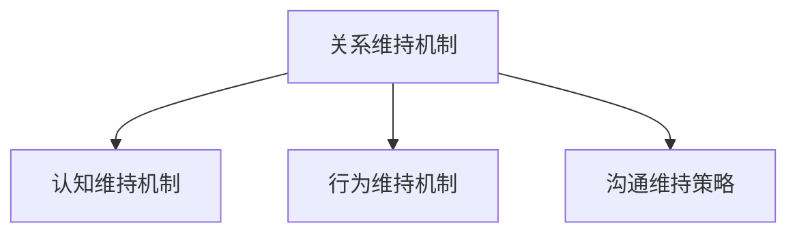
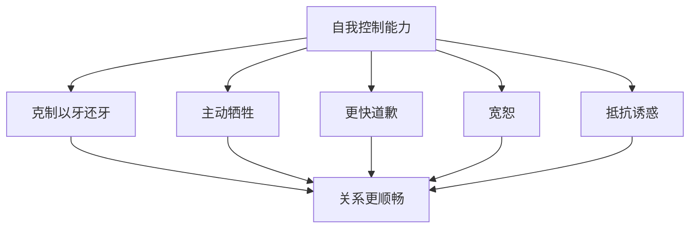

# 第14课：维持与修复关系（Maintaining and Repairing Relationships）

## Learning Objectives

- 掌握**关系维持机制**（relationship maintenance mechanisms）的认知层面与行为层面
- 理解**积极错觉**（positive illusions）、**不关注替代选择**（inattention to alternatives）与**贬低诱惑性替代**（derogation of tempting alternatives）
- 认识**米开朗基罗现象**（Michelangelo phenomenon）与**顺应**（accommodation）
- 了解**自我控制**（self-control）在关系维护中的核心作用
- 理解**自我扩展模型**（self-expansion model）与共同活动的关系增强作用
- 识别 Canary 和 Stafford 的关系维持策略
- 区分**预防性关系教育**（PREP）和各类**婚姻治疗**疗法
- 比较五种主要治疗流派的焦点与不同
- 理解感恩与欣赏在关系维护中的实践应用

## 关系维持机制

> [!QUOTE] 核心观点
> 承诺的伴侣会采取一系列战略行动来维持和保护他们的关系满意度。这些机制既有认知层面的（改变看待关系的方式），也有行为层面的（改变与伴侣互动的方式）。



### 认知维持机制

当人们承诺于一段关系时，他们的视角会发生几个重要的转变：

| 机制 | 描述 | 例子 |
|------|------|------|
| **认知相互依赖**（Cognitive Interdependence） | 自我定义从"我"扩展到"我们" | 更多使用"我们""咱们"而非"我""你" |
| **积极错觉**（Positive Illusions） | 理想化伴侣和关系，从最有利的视角看待关系 | 伴侣的缺点被视为微不足道，不当行为被视为无心之失或临时异常 |
| **感知优越性**（Perceived Superiority） | 认为自己的关系比大多数人的都要好 | "我们的关系真的很特别" |
| **不关注替代选择**（Inattention to Alternatives） | 对替代伴侣缺乏兴趣和意识 | 不太关注其他有吸引力的人 |
| **贬低诱惑性替代**（Derogation of Tempting Alternatives） | 察觉到的诱惑性替代被认为不那么有吸引力 | 当有吸引力的人出现在附近时，承诺的伴侣会降低对其吸引力的评价 |

> [!TIP]
> 积极错觉的一个有趣发现：人们往往清楚地知道伴侣具体做过的讨厌事，但通过"忘记"和"解释"这些事，他们能够维持总体上比各部分之和更积极的评价——只要不太脱离现实，这种玫瑰色视角有助于维护幸福。

### 行为维持机制

| 机制 | 描述 |
|------|------|
| **牺牲意愿**（Willingness to Sacrifice） | 做不喜欢的事或放弃想做的事以促进伴侣/关系福祉 |
| **祈祷**（Prayer） | 为伴侣的幸福和成功祈祷可增强满意度和宽恕意愿 |
| **米开朗基罗现象**（Michelangelo Phenomenon） | 伴侣支持我们成为我们想成为的人，促进个人成长 |
| **顺应**（Accommodation） | 控制以牙还牙的冲动，以建设性方式回应伴侣的挑衅 |
| **自我控制**（Self-Control） | 管理冲动、控制想法、坚持目标、遏制不想要的行为 |
| **玩乐**（Play） | 一起参与新颖、有挑战性、令人兴奋的活动 |
| **品味**（Savoring） | 主动期待、专注体验、愉快回味共享的积极事件 |
| **仪式**（Rituals） | 发展有意义的日常惯例和传统 |
| **宽恕**（Forgiveness） | 在伴侣背叛后给予宽恕，加速双方愈合 |

> [!IMPORTANT] 自我控制的核心地位
> 双方自我控制能力的**总和**越高，关系就越顺畅、越满意。自我控制使我们能够：
> - 克制报复冲动
> - 做出更多对伴侣有益的牺牲
> - 更及时地道歉
> - 更容易宽恕
> - 抵抗诱惑，保持忠诚



### 玩乐：一起玩的人一起留下

> [!NOTE]
> 一项经典研究中，伴侣们手腕脚踝绑在一起，头顶着泡沫圆柱体爬过障碍赛道——那些以这种新奇滑稽方式"玩"的伴侣，在一天结束时报告的关系质量更高。

**实践方案**：
1. 与伴侣共同列出一份有吸引力且有趣的活动清单
2. 每周安排时间做其中一项
3. 选择**新颖的、令人兴奋的、好玩的、充满激情的**活动
4. 双方都**自愿参与**很重要

**品味三要素**：
| 维度 | 行动 |
|------|------|
| 期待（Anticipation） | 事前共同期待 |
| 专注体验（Mindful Experience） | 过程中全情投入 |
| 回味（Reminiscence） | 事后愉快回忆 |

## 关系增强策略：Canary 和 Stafford

沟通学者 Canary 和 Stafford 从数百份报告中提炼了关系维持策略：

| 策略 | 示例行为 |
|------|---------|
| **积极性**（Positivity） | 让互动愉快、保持开朗乐观 |
| **开放性**（Openness） | 鼓励伴侣表露想法和感受 |
| **关系谈话**（Relationship Talk） | 鼓励伴侣说出对关系的期望 |
| **保证**（Assurances） | 表达爱与承诺、谈论未来计划 |
| **理解**（Understanding） | 犯错时道歉、耐心与宽恕 |
| **分担任务**（Sharing Tasks） | 公平分担家务、帮助伴侣完成项目 |
| **社交网络**（Social Networks） | 与伴侣的朋友/家人互动 |
| **共同活动**（Joint Activities） | 共度时光、一起做事 |

> [!TIP] 最重要的三项
> 最能预测婚姻幸福的三项策略：
> **积极性** + **保证** + **分担任务**
>
> 提醒：这些行为如果停止，满意度会随之下降——所以必须**持续做下去**。

## 增强关系的处方：感恩

> [!WARNING] 习惯化陷阱
> 人们会适应快乐的环境——如果你拥有一段好关系，危险在于你会**觉得理所当然**。在相互依赖理论的术语中，你的**比较水平**（CL）会悄悄上移。

**三步处方**：


**具体做法**：
1. **注意**（Tune in）：有意关注伴侣为你做的体贴、善意、慷慨的事
2. **表达**（Express）：每周告诉伴侣你最喜欢的 3 件他/她做的好事
3. **重复**（Repeat）：持续这样做

> [!QUOTE] John Gottman 的建议
> "欣赏、尊重和感情……不能隐藏……说'谢谢你做了那个'、'我喜欢晚餐时的谈话'、'谢谢整理床铺'、'你穿那个颜色很好看'……"我注意到你做了这个，我真的很感激"。必须积极建立一种欣赏和尊重的文化，同时也传达欲望、喜悦、乐趣和冒险。"

## 关系修复

### 自助途径

**优势**：
- 费用低廉
- 可反复参考
- 对害羞不愿寻求正式治疗的人有价值

**陷阱**：
- 有些"专家"没有合法的资质（如 John Gray 的博士来自未经认证的大学）
- 基于个人观点而非可靠研究（如《The Rules》推荐的"欲擒故纵"策略已被研究证伪）
- 男性不喜欢欲擒故纵，真正吸引人的是"对所有人高冷、唯独对我热情"

> [!WARNING] 识别可靠资源
> 请选择由信誉良好的关系科学家撰写的书籍和网站，例如：
> - Finkel, E. (2017). *The All-or-Nothing Marriage*
> - Gottman, J. & Silver, N. (2015). *The Seven Principles for Making Marriage Work*
> - Orbuch, T. (2015). *5 Simple Steps to Take Your Marriage from Good to Great*

### 预防性维护：PREP

**预防与关系增强项目**（Prevention and Relationship Enhancement Program, PREP）：
- 约 12 小时培训，分 5 次课程
- 核心主题：
  - 承诺的力量
  - 共同玩乐的重要性
  - 关于性的开放沟通
  - 不合理期望的后果
  - Speaker-Listener 技巧

> [!IMPORTANT] 效果
> 参加婚前预防项目的订婚/新婚夫妇在 **3 年内分居的可能性降低一半以上**。效果至少持续数年，且最需要的高风险夫妇获益最大。

### 婚姻治疗的主要流派

```mermaid
flowchart TD
    subgraph ”婚姻治疗的五大流派”
        A[行为夫妻治疗<br>BCT]
        B[认知-行为夫妻治疗<br>CBCT]
        C[整合行为夫妻治疗<br>IBCT]
        D[情绪聚焦夫妻治疗<br>EFCT]
        E[领悟导向夫妻治疗<br>IOCT]
    end
```

| 疗法 | 主要焦点 | 对象 | 时间取向 | 核心理念 |
|------|---------|:----:|:--------:|---------|
| **行为夫妻治疗**<br>BCT | 行为 | 夫妻 | 当下 | 鼓励更愉悦的互动，用互惠契约增加奖赏、减少成本 |
| **认知-行为夫妻治疗**<br>CBCT | 认知 | 双方 | 当下 | 改变选择性注意、不合理期望、有害归因 |
| **整合行为夫妻治疗**<br>IBCT | 情感 | 双方 | 当下 | 鼓励改变 + 学会接受无法改变的不兼容 |
| **情绪聚焦夫妻治疗**<br>EFCT | 情感 | 双方 | 当下 | 基于依恋理论，增加伴侣的依恋安全感 |
| **领悟导向夫妻治疗**<br>IOCT | 情感与认知 | 个人 | 过去 | 探索过去关系遗留的"情感包袱" |

### 行为夫妻治疗的技术

| 技术 | 描述 |
|------|------|
| **爱的日子**（Love Days） | 一方刻意做对方要求的好事和善意行为 |
| **交换契约**（Quid Pro Quo Contract） | "如果你做A，我就做B"的直接交换 |
| **诚信契约**（Good Faith Contract） | 行为改变获得特权奖励（不直接连接双方行为） |

### 整合行为夫妻治疗的三种技术

| 技术 | 描述 |
|------|------|
| **共情结合**（Empathic Joining） | 不带责备地表达痛苦和脆弱，让对方理解自己的感受 |
| **统一超然**（Unified Detachment） | 以理性视角冷静分析问题的互动模式，避免情绪卷入 |
| **耐受建设**（Tolerance Building） | 学会对伴侣的问题行为"不那么敏感、反应不那么激烈" |

### 情绪聚焦夫妻治疗的九步骤

| 阶段 | 步骤 | 内容 |
|:----:|:----:|------|
| **阶段一：问题评估** | 1 | 伴侣描述问题，详述最近一次争吵 |
| | 2 | 识别争吵背后的情感恐惧和需求 |
| | 3 | 将情绪转化为语言，让对方理解 |
| | 4 | 明白双方都在受苦，没有人应被单独责备 |
| **阶段二：促进联结** | 5 | 识别并承认深层感受（需要安慰、接纳） |
| | 6 | 承认并开始接受对方的感受，探索自己的新反应 |
| | 7 | 开始基于开放和理解的新互动模式 |
| **阶段三：巩固** | 8 | 共同创造新问题的解决方案 |
| | 9 | 排练和巩固新的接纳行为 |

### 治疗效果的共同特征

> [!TIP] 好消息
> 认真参加任何上述治疗的夫妇中，约 **60-70%** 能够取得显著的痛苦减轻，效果可持续多年。

成功治疗的共同要素：
1. 提供对问题原因的**合理解释**
2. 提供**充满希望的新视角**
3. 提供改变困扰互动模式的**具体方法**
4. 扩展更有效、更令人满意的行为**技能库**

**选择治疗的建议**：
- 选择最吸引你的疗法和让你信任的治疗师
- 信任治疗师、对治疗抱有积极期望能提高疗效
- 不要等到问题严重才求助——越早处理，越容易解决

> [!WARNING] 最后的提醒
> 大多数离婚者从未咨询过婚姻治疗师。少数咨询的人通常等到问题已经严重。男性尤其：更慢意识到问题存在、更不相信治疗有用、更晚寻求帮助。
>
> 当你需要时，不要犹豫。在线低成本方案：www.OurRelationship.com

## 幸福婚姻的长期秘密

对 100 对幸福婚姻超过 45 年的夫妻的调查：

> [!QUOTE]
> 他们这样解释自己的成功：
> 1. 他们**重视婚姻**，视其为长期承诺
> 2. **幽默感**有很大帮助
> 3. 他们**足够相似**，在大部分事情上意见一致
> 4. 他们**真心喜欢伴侣**，享受和对方在一起的时光

## 应用练习

> [!QUESTION] 行动计划
> 1. 你现在的关系中，已经自然使用了哪些维持机制？哪些是你希望加强的？
> 2. 设计你和伴侣的"玩乐清单"——列 3-5 项新颖、有趣的活动，本周可以一起尝试。
> 3. 连续一周，每天注意伴侣为你做的一件好事，并真诚表达感谢。观察这一周你的感受和关系氛围的变化。

<details>
<summary>思考指引</summary>

**问题1**：许多人自然使用积极错觉（美化伴侣）和不关注替代选择，但容易忽略行为层面的投入如牺牲意愿和顺应。注意：关系维持行为需要**持续**进行，一旦停止，满意度会开始下降。

**问题2**：关键不在于活动本身，而在于**共同的新奇体验**——做从未做过的事比重复旧活动更有助于重新激发激情。即使只是 90 分钟/周的共同玩乐，几个月后也能看到满意度提升。

**问题3**：感恩训练有充分的研究支持——它不仅能改善双方情绪，还能让付出的一方更愿意继续付出。但注意：如果伴侣不回应你的感恩，效果会打折扣。如果伴侣是不安全依恋型，你的持续感恩可能逐渐降低他/她的焦虑和回避。
</details>

## 核心引用

- Rusbult, C. E., Olsen, N., Davis, J. L., & Hannon, P. A. (2001). Commitment and relationship maintenance mechanisms. In J. H. Harvey & A. Wenzel (Eds.), *Close romantic relationships: Maintenance and enhancement* (pp. 87–113). Lawrence Erlbaum.
- Canary, D. J., & Stafford, L. (2001). Equity in the preservation of personal relationships. In J. H. Harvey & A. Wenzel (Eds.), *Close romantic relationships: Maintenance and enhancement* (pp. 133–151). Lawrence Erlbaum.
- Aron, A., Norman, C. C., Aron, E. N., McKenna, C., & Heyman, R. E. (2000). Couples' shared participation in novel and arousing activities and experienced relationship quality. *Journal of Personality and Social Psychology, 78*, 273–284.
- Gottman, J. M., & Silver, N. (2015). *The seven principles for making marriage work* (2nd ed.). Harmony Books.
- Johnson, S. M. (2019). *Attachment theory in practice: Emotionally focused therapy (EFT) with individuals, couples, and families*. Guilford Press.
- Bradbury, T. N., & Bodenmann, G. (2020). Interventions for couples. *Annual Review of Clinical Psychology, 16*, 99–123.
- Finkel, E. J. (2017). *The all-or-nothing marriage: How the best marriages work*. Dutton.

## 继续学习

本课程到此结束。回顾：[第01课：亲密关系的基础构建](0001-intimate-relationships-foundations)