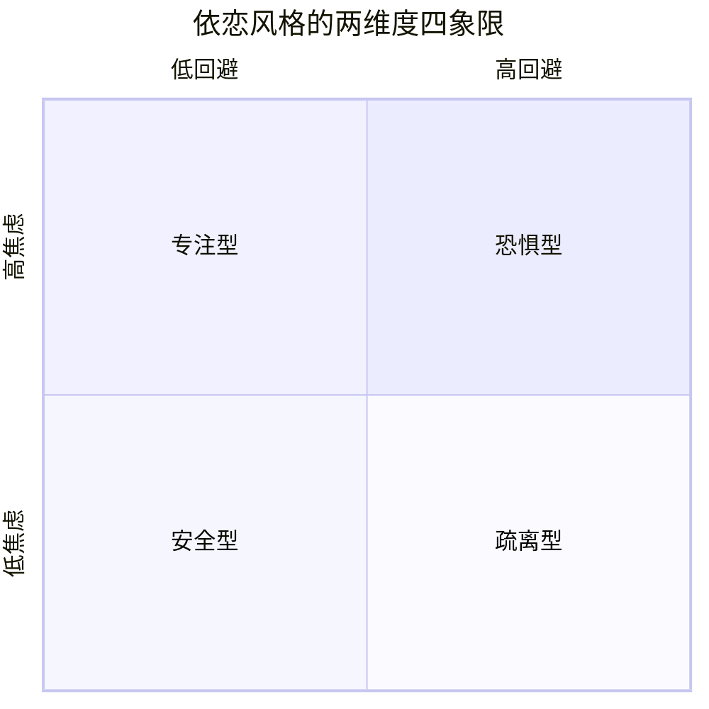
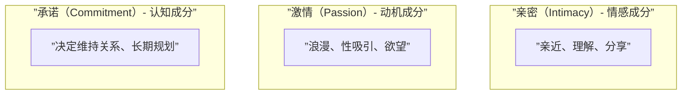

# 核心理论与模型速查

## 亲密关系七维度模型

| 维度 | 核心含义 |
|------|----------|
| 了解（Knowledge） | 共享大量私密个人信息 |
| 相互依赖（Interdependence） | 双方行为深刻影响彼此 |
| 关心（Caring） | 对彼此有超过一般人的情感 |
| 信任（Trust） | 相信对方不会伤害自己 |
| 回应性（Responsiveness） | 感知到对方理解、尊重自己 |
| 共同性（Mutuality） | 视彼此为"我们" |
| 承诺（Commitment） | 预期关系持续并为之投入 |

## 依恋风格模型



| 类型 | 焦虑 | 回避 | 表现 |
|------|------|------|------|
| 安全型（Secure） | 低 | 低 | 安心信任他人，舒适与他人亲密 |
| 专注型（Preoccupied） | 高 | 低 | 渴望亲密，但害怕被拒绝 |
| 恐惧型（Fearful） | 高 | 高 | 想要亲密，但不信任他人 |
| 疏离型（Dismissing） | 低 | 高 | 自给自足，回避亲密 |

## 大五人格与关系影响

| 特质 | 对关系的影响 | 重要性排名 |
|------|-------------|-----------|
| 消极情绪性（Negative Emotionality） | 最强的**负面**影响 | 1 |
| 宜人性（Agreeableness） | 正面 | 2 |
| 尽责性（Conscientiousness） | 正面 | 3 |
| 外向性（Extraversion） | 正面 | 4 |
| 开放性（Open-mindedness） | 正面 | 5 |

## 社会交换理论

```
结果（Outcome）= 回报（Rewards）－ 成本（Costs）

满意度（Satisfaction）= 结果 － CL（比较水平）
依赖度（Dependence） = 结果 － CLalt（替代选择比较水平）
```

四种关系类型：
| 结果 vs CL | 结果 vs CLalt | 关系类型 |
|-----------|--------------|----------|
| 高于 CL | 高于 CLalt | 满意且稳定 |
| 低于 CL | 高于 CLalt | 不满意但稳定 |
| 高于 CL | 低于 CLalt | 满意但不稳定 |
| 低于 CL | 低于 CLalt | 不满意且不稳定 |

## 投入模型（Investment Model）

```
承诺（Commitment）= 满意度（Satisfaction） + 投入规模（Investment Size） - 替代质量（Quality of Alternatives）
```

**承诺的三种类型**：
1. **个人承诺**（Personal Commitment）：想继续这段关系（因为爱和满意）
2. **约束承诺**（Constraint Commitment）：不得不继续（因为投入和离开成本）
3. **道德承诺**（Moral Commitment）：应该继续（因为责任感和价值观）

## 爱情三角理论（Triangular Theory of Love）



七种爱：

| 爱类型 | 亲密 | 激情 | 承诺 |
|--------|:----:|:----:|:----:|
| 喜欢（Liking） | ✓ | ✗ | ✗ |
| 迷恋（Infatuation） | ✗ | ✓ | ✗ |
| 空爱（Empty Love） | ✗ | ✗ | ✓ |
| 浪漫之爱（Romantic Love） | ✓ | ✓ | ✗ |
| 伴侣之爱（Companionate Love） | ✓ | ✗ | ✓ |
| 虚幻之爱（Fatuous Love） | ✗ | ✓ | ✓ |
| 圆满之爱（Consummate Love） | ✓ | ✓ | ✓ |

## 爱情色彩理论（Lee's Theory of Love Styles）

| 类型 | 描述 |
|------|------|
| Eros（激情型） | 强烈的身体吸引和情感投入，"一见钟情" |
| Ludus（游戏型） | 视爱情为游戏，避免承诺 |
| Storge（友谊型） | 从深厚友谊中逐渐发展出爱情 |
| Pragma（实用型） | 理性选择伴侣，关注匹配度 |
| Mania（狂躁型） | 充满嫉妒和焦虑，情绪极端波动 |
| Agape（奉献型） | 无私付出，不求回报 |

## 沟通分析框架

### 非语言沟通七通道

| 通道 | 例子 |
|------|------|
| 面部表情（Facial Expression） | 快乐、悲伤、愤怒的通用表情 |
| 注视行为（Gazing） | 目光接触传达兴趣或支配 |
| 身体动作（Body Movement） | 手势、舞姿、姿态 |
| 身体接触（Touch） | 抚摸、拥抱、握手 |
| 人际距离（Interpersonal Distance） | 亲密距离、个人距离、社交距离 |
| 气味（Smell） | 体味、信息素 |
| 副语言（Paralanguage） | 语调、语速、音量 |

### Gottman 四骑士（冲突中的破坏性行为）

1. **批评**（Criticism）——"你总是…" vs. 具体抱怨
2. **蔑视**（Contempt）——嘲笑、翻白眼——**最具破坏性**
3. **防御**（Defensiveness）——找借口、反指责
4. **筑墙**（Stonewalling）——退出互动、不再回应

> 5:1 比率——一段关系要稳定，积极互动需要是消极互动的 **5 倍以上**。

## 冲突模型

```
冲突的流程：
促发事件 → 直面或回避 → 协商或升级 → 结局
```

**冲突的四种夫妻类型**：
| 类型 | 描述 |
|------|------|
| 激情型（Volatile） | 频繁激烈争吵，但积极情感也多 |
| 验证型（Validating） | 冷静讨论分歧，寻求共识 |
| 回避型（Avoidant） | 尽量避开冲突 |
| 敌对型（Hostile） | 充满批评、蔑视、防御——高离婚风险 |

## 伴侣暴力四类型模型（Johnson, 2008）

| 暴力类型 | 特征 | 性别对称性 |
|----------|------|------------|
| 情境性伴侣暴力 | 由冲突升级而来，最常见的类型 | 相对对称 |
| 亲密恐怖主义 | 以控制为目的，一方系统性地使用暴力 | 男性施暴者居多 |
| 暴力抵抗 | 对亲密恐怖主义的自卫性反应 | 女性为主 |
| 相互控制暴力 | 双方都试图控制对方 | 少见 |

## 关系解体的阶段模型（Duck, 1982）

| 阶段 | 特征 |
|------|------|
| 心灵阶段（Intrapsychic） | 内心开始不满，权衡利弊 |
| 双人阶段（Dyadic） | 与伴侣讨论问题，尝试解决 |
| 社交阶段（Social） | 告知亲友，寻求社会支持 |
| 善后阶段（Grave-dressing） | 重建故事，为分手创造意义 |

## 脆弱-压力-适应模型（Vulnerability-Stress-Adaptation Model）

```
持久的脆弱性（如人格特质）
       ↓
    压力事件（如失业、疾病）
       ↓
    适应过程（沟通、应对）
       ↓
    关系质量和稳定性
```

## 关系维持的认知与行为机制

**认知机制**：
- 积极错觉（Positive Illusions）：以更积极的眼光看伴侣
- 不关注替代选择（Inattention to Alternatives）：减少对其他潜在伴侣的关注
- 贬低替代选择（Derogation of Alternatives）：降低对其他可选对象的评价

**行为机制**：
- 牺牲（Sacrifice）：为关系放弃个人利益
- 顺应（Accommodation）：以建设性方式回应伴侣的破坏性行为
- 自我控制（Self-Control）：抑制冲动，做出有利于关系的选择
- 玩乐（Playfulness）：一起有趣的活动
- 品味（Savoring）：共同回味美好时刻
- 宽恕（Forgiveness）：放下怨恨，修复关系
- 感恩（Gratitude）：表达对伴侣的感谢