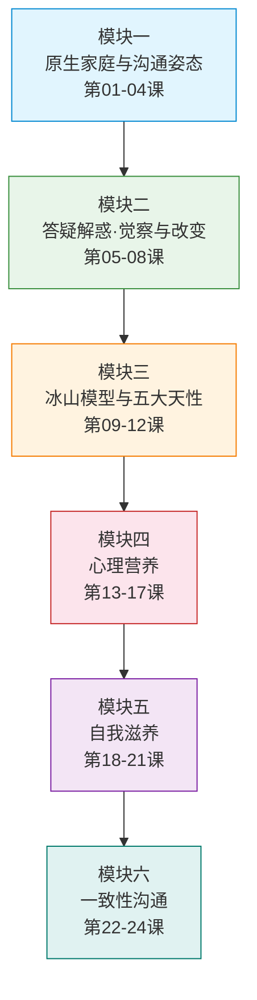
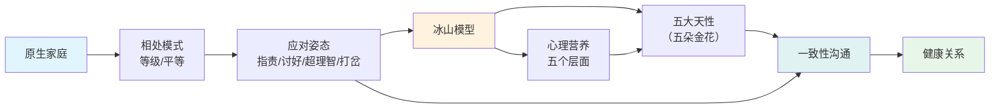

# 课程地图

## 学习路径

本课程设计了**一条主线、六个模块**，建议按顺序学习：

### 第一条曲线：看懂自己（第01-12课）

| 步骤 | 模块 | 目标 |
|------|------|------|
| 1 | [模块一](./lessons/0001-yuan-sheng-jia-ting-tan-tao) | 理解原生家庭如何塑造你，识别自己的沟通姿态 |
| 2 | [模块二](./lessons/0005-tiao-zheng-qiang-po-xing-chong-fu) | 觉察强迫性重复，理解改变的难点 |  
| 3 | [模块三](./lessons/0009-wu-da-tian-xing) | 深入冰山模型，理解五大天性 |

### 第二条曲线：滋养自己（第13-21课）

| 步骤 | 模块 | 目标 |
|------|------|------|
| 4 | [模块四](./lessons/0013-xin-li-ying-yang-shang) | 理解心理营养，学会给他人做心理营养 |
| 5 | [模块五](./lessons/0018-gei-zi-ji-xin-li-ying-yang-shang) | 学会给自己补充心理营养，实现自我接纳 |

### 第三条曲线：表达自己（第22-24课）

| 步骤 | 模块 | 目标 |
|------|------|------|
| 6 | [模块六](./lessons/0022-shi-mo-shi-yi-zhi-xing-gou-tong) | 掌握一致性沟通，建立平等真诚的关系 |

## 核心概念关系图

## 课程分级

- **🔵 核心理论课**：第01、02、03、04、08、09、13、14、15、22课
- **🟡 实操工具课**：第10、11、12、18、19、23、24课
- **🟢 答疑案例课**：第05、06、07、16、17、20、21课

---

> **建议**：核心理论课是骨架，必须按顺序学习；实操工具课可配合练习使用；答疑案例课通过真实案例加深理解。每课至少听四遍，练习至少十二遍。