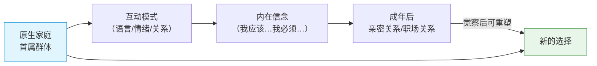
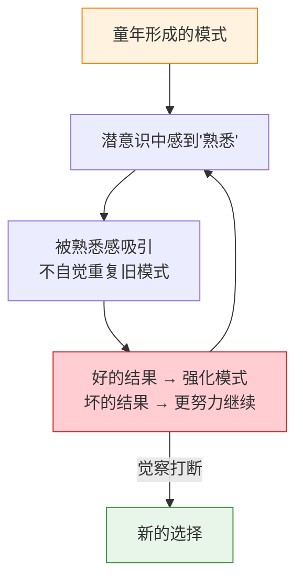
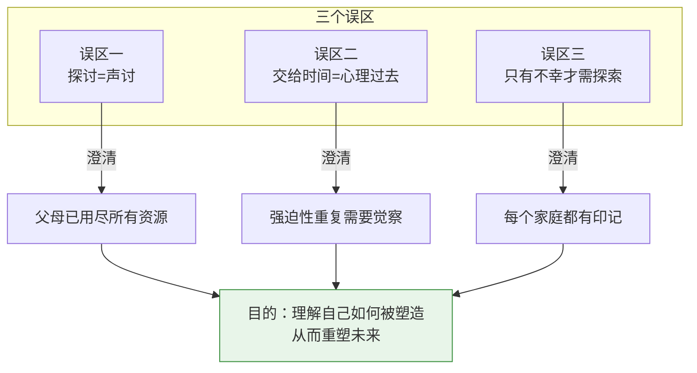

# 第01课：为什么要探讨原生家庭

## Learning Objectives

- 理解萨提亚关于"家庭是首属群体"的核心观点
- 辨识探讨原生家庭时的三个常见误区
- 掌握"强迫性重复"的概念及其在生活中的表现
- 通过案例体会原生家庭对亲密关系的影响

---

## 家庭：我们的首属群体

> 萨提亚（Virginia Satir）认为：家庭是每个人的**首属群体**（Primary Group）。

"首属"意味着**第一个**、**最初的**。我们来到这个世界之后，接触的第一个社会环境就是家庭。在这个群体中，我们学会了：

- 如何表达爱
- 如何面对冲突
- 如何理解自己
- 如何与他人相处

这些在家庭中学到的模式，会像一套"默认程序"一样，在我们日后的生活——尤其是亲密关系中——自动运行。

---

## 三个常见误区

在开始探讨原生家庭之前，我们需要澄清三个常见误区。

### 误区一：探讨 = 声讨

| ❌ 误区 | ✅ 正解 |
|--------|---------|
| 探讨原生家庭就是找父母算账 | 探讨的目的是**理解自己如何被塑造** |
| "都是因为他们，我才变成今天这样" | 父母已经用尽了他们当时拥有的全部资源 |
| 把责任推给原生家庭 | 看到影响，但不归罪 |

> 萨提亚曾说："父母在任何时候都是尽他们所能去做。" 我们探讨，不是为了把父母钉在审判席上，而是为了理解——**他们曾用怎样的方式爱我们，而我们又如何理解并继承了他们爱的语言**。

### 误区二：交给时间 = 心理过去

很多人都听过一个安慰："时间会治愈一切。" 但事实是：

- **时间不会自动疗愈创伤** —— 时间只能让伤口结痂，却不能改变疤痕之下的行为模式
- **强迫性重复** —— 如果没有觉察，人会不由自主地重复童年形成的模式

打个比方：你小时候在家庭中学会了"只有讨好才能被爱"，那么成年后，你在每一个关系里都会不自觉地讨好——这不是时间的功劳能解决的问题。

### 误区三：只有不幸的家庭才需要探索

| ❌ 误区 | ✅ 正解 |
|--------|---------|
| "我家挺好的，不需要看" | 没有100%幸福的家庭，也没有100%不幸的家庭 |
| 只有受过创伤的人才需要 | 每个人都带着原生家庭的印记 |
| 探讨意味着"我有问题" | 探讨是为了更了解自己，了解自己的资源与成长空间 |

> 心理学界公认：**不存在完美的原生家庭**。每个家庭都有其特有的优势和局限。探讨原生家庭，不是为了贴标签，而是为了画地图——帮助你看见自己从哪里来，以及可以往哪里去。

---

## 强迫性重复

### 概念解析

**强迫性重复**（Compulsive Repetition）是一个重要的心理学概念，指的是：

> 人们**不由自主地**重复某种行为模式、情绪模式或关系模式，即使这些模式给自己带来了痛苦。

强迫性重复的背后，是一个深刻的心理学原理：

> **熟悉感 = 安全感**

即使那份熟悉感是痛苦的，我们的潜意识也会倾向于选择"熟悉的痛苦"而非"陌生的快乐"——因为熟悉意味着可控、可知、可预测。这是人类大脑的保守策略。

### 经典案例

> 一位女士从小发誓：**"我绝对不嫁像我爸爸那样的男人。"**
>
> 她的父亲脾气暴躁、不体贴、大男子主义。她对此深恶痛绝。
>
> 然而，她发现自己谈的几任男友，最后都走向了同一个类型——脾气大、控制欲强。最后她嫁的那个人，和父亲"极其相似"。

为什么会这样？

因为父亲的形象构成了她潜意识中"男人"的模板。即使她意识层面拼命排斥，潜意识层面却被那种"熟悉的能量"所吸引。她能敏锐地识别出那种气质、那种说话方式、那种对待女性的态度——识别出来，就等于"我知道怎么和这样的人相处"。

> **"知道怎么相处" ≠ "相处得好"**

这就是强迫性重复最吊诡的地方。

---

## 萨提亚的诗

萨提亚写过一首广为流传的诗，其中有两个关键词贯穿始终：

### 两个关键词

| 关键词 | 含义 |
|--------|------|
| **平等**（Equality） | 人格层面的平等，不因角色、年龄、地位而改变 |
| **真诚**（Authenticity） | 一致性——内外一致，表里如一 |

诗中没有居高临下的教导，没有"你应该怎样"，而是流淌着一种深深的理解和接纳。这恰好体现了萨提亚模式最核心的理念：

> 一致性（Congruence）—— 同时照顾到自己、他人和情境的健康沟通状态。

关于一致性的详细内容，将在后续课程展开（参见[[lessons/0022-shi-mo-shi-yi-zhi-xing-gou-tong|第22课：什么是一致性沟通]]）。

---

## 核心观点：探讨原生家庭是为了找回选择权

探讨原生家庭的最终目的，不是找到"责任人"，而是：

| 不是 | 而是 |
|------|------|
| 为了审判父母 | 为了理解自己 |
| 为了停留在过去 | 为了重塑未来 |
| 为了证明"我是受害者" | 为了发现"我有选择" |

正如萨提亚所说：

> **"我们无法改变过去已发生的事，但可以改变它对现在的影响。"**

探讨原生家庭，就是从"无意识重复"走向"有意识选择"的过程。

这个主题将在[[lessons/0005-tiao-zheng-qiang-po-xing-chong-fu|第05课：调整强迫性重复]]中继续深入。

---

## 小结

探讨原生家庭，不是为了声讨过去，而是为了给未来更多选择。记住：**你无法选择你的起点，但你可以选择你的方向**。

---

## Practice

> [!QUESTION] 自我检测
>
> 1. 以下哪一项是探讨原生家庭的正确态度？
>    A. 找出父母哪里做错了，让他们认识到问题
>    B. 理解自己如何被塑造，从而获得更多选择权
>    C. 把所有问题都归结于童年经历
>
> 2. "强迫性重复"指的是什么？
>    A. 一个人故意重复做让自己痛苦的事
>    B. 不由自主地重复某种行为、情绪或关系模式
>    C. 只有坏习惯才会被重复
>
> 3. 以下哪个说法符合萨提亚的核心观点？
>    A. 探讨原生家庭是为了修复父母
>    B. 一致性沟通只照顾自己的感受即可
>    C. 父母的在当时已经用尽了所有资源

查看答案

1. **B** —— 探讨原生家庭的目的是理解自己如何被塑造，从而获得更多选择权，而非声讨父母。
2. **B** —— 强迫性重复是不由自主地重复某种模式，即使这些模式给自己带来了痛苦。
3. **C** —— 萨提亚认为父母在任何时候都尽他们所能去做。探讨是为了理解，而非归罪。

---

## 应用任务

本周请完成以下练习：

1. **观察日记**：留意本周内是否有某个场景让你产生了"强烈的情绪反应"？记录下是什么事件触发了你，以及你的反应模式是什么。
2. **家庭回忆**：写下三个你记忆中与父母相处的片段。尝试用"理解"而非"评判"的视角重新看这些片段——父母当时可能面临什么压力？他们用怎样的方式爱你？

---

## 下一步

完成本课后，建议进入 [[lessons/0002-yuan-sheng-jia-ting-liang-chong-mo-shi|第02课：原生家庭的两种模式]]，了解不同的家庭系统如何塑造不同的行为模式。

> 相关参考：[[reference/glossary|术语表]] · [[reference/iceberg-model|冰山模型速查]]