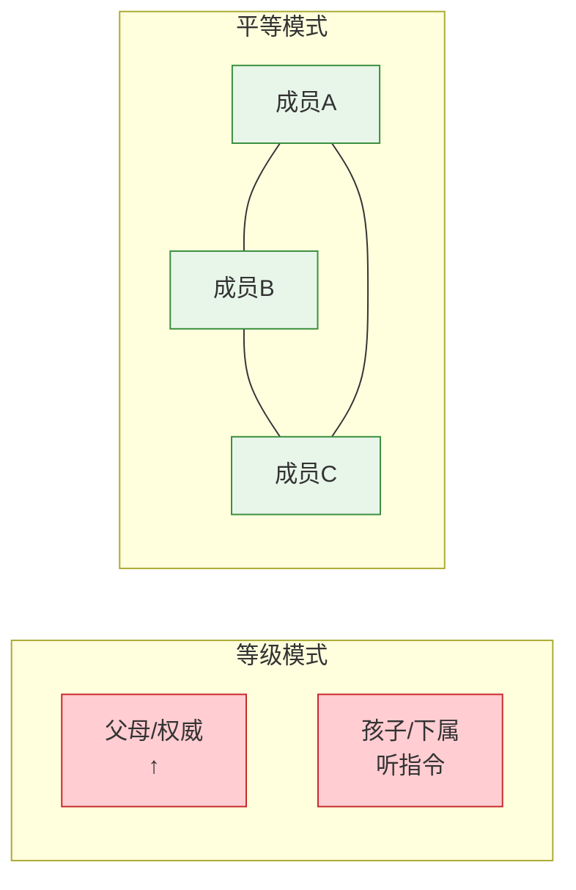
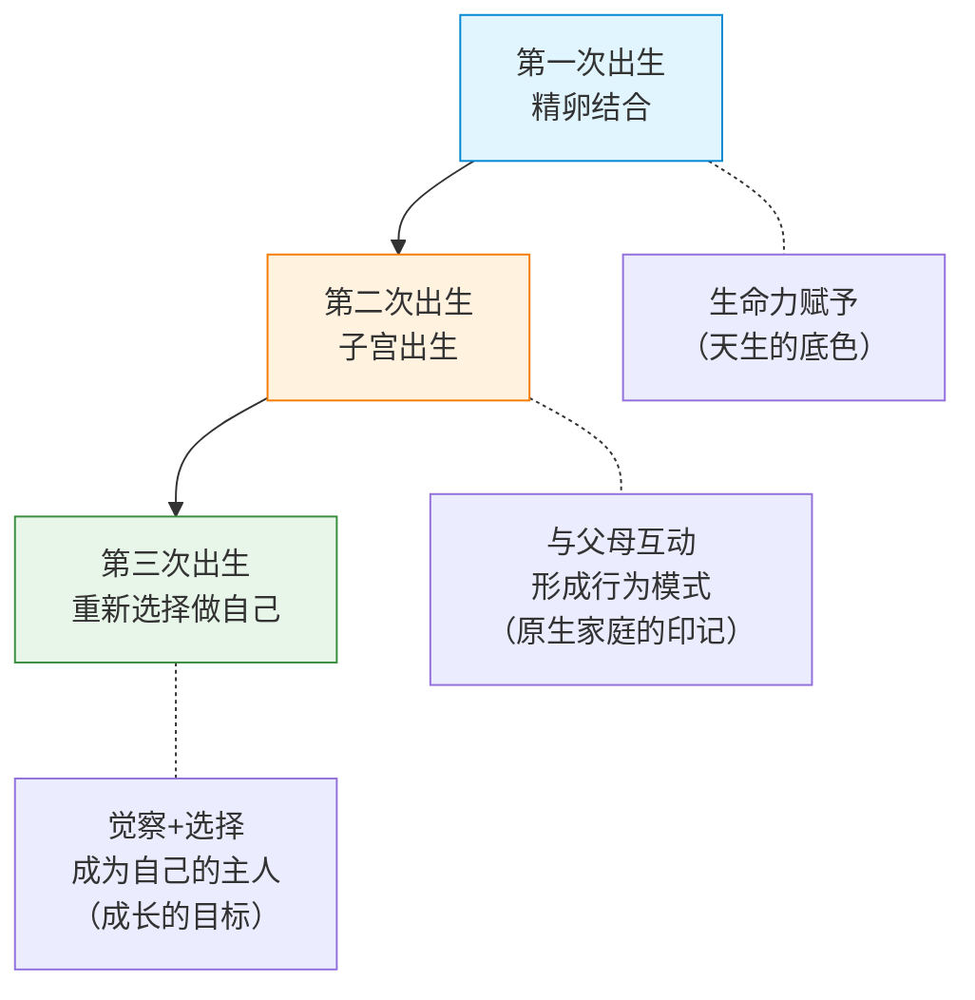

# 第02课：原生家庭的两种模式

## Learning Objectives

- 区分等级模式与平等模式的核心特征
- 理解"人的三次出生"的含义与意义
- 掌握"生命力"概念及其在个人成长中的意义
- 理解"重要他人"对早期心理发展的影响
- 通过小象和井底之蛙的故事理解内在规条的形成机制

---

## 两种家庭模式

萨提亚将家庭系统大致分为两种模式：**等级模式**（Hierarchical Mode）与**平等模式**（Equal Mode）。这两种模式不仅仅存在于家庭中，也映射在职场、学校等社会关系中。



### 等级模式

| 特征 | 表现 |
|------|------|
| 结构 | **僵化封闭**，由上而下，不容质疑 |
| 权力 | 父母/权威拥有最终决定权，孩子的意见不重要 |
| 规则 | "因为我是你爸/妈/领导，所以我说了算" |
| 情绪 | 不允许表达负面情绪——"不许哭！""你还有脸生气？" |
| 影响 | 规则内化成**内在规条**（后文详述） |

在等级模式中长大的孩子，会形成一套"听话-被爱"的等价逻辑：

> "我只有听话，才值得被爱。"
> "我只有按父母说的做，才是好孩子。"

### 平等模式

| 特征 | 表现 |
|------|------|
| 结构 | **流动允许**，系统中的每个人都是平等的个体 |
| 权力 | 人格平等，角色不同但心理地位平等 |
| 规则 | 允许不同声音，允许质疑和讨论 |
| 情绪 | 所有情绪都被允许——"我看到你很生气，能和我说说吗？" |
| 影响 | 孩子学会表达、协商、尊重自己和他人 |

在平等模式中长大的孩子，会形成：

> "我的感受是重要的。"
> "我可以不同意，但这不意味着我不被爱。"

### 两种模式的对比

| 维度 | 等级模式 | 平等模式 |
|------|---------|---------|
| 信息流动 | 单向（从上到下） | 多向（相互交流） |
| 质疑是否允许 | 不允许 | 欢迎 |
| 犯错 | 犯错=失败，要被惩罚 | 犯错=学习机会 |
| 情绪表达 | 压抑负面情绪 | 允许表达+学习管理 |
| 心理结果 | 内在规条多，自我价值感低 | 内在自由，自我价值感稳 |

> [!TIP] 关键认知
> 几乎所有原生家庭都存在两种模式混合的情况。没有100%等级或100%平等的家庭。识别模式的目的不是贴标签，而是理解——**你成长于怎样的土壤，那土壤又如何影响了你的根系生长方向**。

关于等级模式和平等模式更深层的探讨，将在[[lessons/0006-deng-ji-ping-deng-mo-shi|第06课：等级模式VS平等模式]]中展开。

---

## 人的三次出生

萨提亚提出了一个非常优美的概念：**人的三次出生**。



### 第一次出生：精卵结合

当精子和卵子结合的那一刻，一个全新的生命就诞生了。

在这个时刻，一个人获得了最原始的东西——**生命力**。这是每个人与生俱来的力量，是那朵"花"能够盛开的潜能。

### 第二次出生：从子宫出生

当我们从母体分娩，开始与这个世界互动时，**第二次出生**就完成了。

> 这次出生的真正意义在于：**孩子与父母之间的互动，开始塑造孩子的行为模式。**

- 婴儿哭闹时，父母的回应方式 → 决定了孩子对"求助"的认知
- 孩子表达需求时，父母的满足方式 → 决定了孩子对"自我价值"的信念
- 孩子探索世界时，父母的限制方式 → 决定了孩子对"自由"的态度

这些早期互动，就是[[lessons/0001-yuan-sheng-jia-ting-tan-tao|第01课：为什么要探讨原生家庭]]中提到的——那个无形中塑造了我们的力量。

### 第三次出生：重新选择做自己

这是萨提亚模式中最激动人心的部分：

> **第三次出生，发生在你决定重新认识自己、重新选择的时候。**

这不是一个自动发生的事件，而是一个有意识的、需要勇气的选择过程：

1. **觉察**：看见自己身上的模式
2. **理解**：理解这些模式从何而来
3. **选择**：决定哪些部分需要保留，哪些需要调整

第三次出生的本质，就是从"被过去塑造"到"为自己选择"的转变。这个过程将在[[lessons/0005-tiao-zheng-qiang-po-xing-chong-fu|第05课：调整强迫性重复]]和后续课程中继续深化。

---

## 生命力

### 花盛开与枯萎的区别

萨提亚用"花"来比喻人的生命力：

| 状态 | 表现 |
|------|------|
| 🌸 盛开 | 充满活力、好奇、有弹性、愿意尝试、能接受失败 |
| 🌼 萎靡 | 枯萎、僵硬、封闭、害怕犯错、过度防御 |

> 同样的土壤（原生家庭），不同的花（生命力），开花程度不同。但每朵花都有盛开的潜能。

生命力是**天生的潜能**，它不会消失，只会被压抑。就像一颗种子，即使在最贫瘠的土壤里，也在等待一个机会破土而出。

---

## 重要他人

### 概念

**重要他人**（Significant Others）指的是对一个人的心理发展产生重要影响的人。

> **对婴儿来说，父母——尤其是母亲——是存活的主要供给者。**

这意味着：
- 父母不仅提供食物和安全（物理存活）
- 父母还提供关注和回应（心理存活）

### 为什么"重要他人"如此重要？

因为婴儿完全依赖重要他人的反馈来理解"我是谁"：

```
婴儿的行为 → 重要他人的回应 → 婴儿对自我的认知
  哭          →  妈妈过来抱     →  "我是被爱的"
  哭          →  没人理会       →  "我的需求不重要"
  笑          →  被回应微笑     →  "我是受欢迎的"
```

这些早期互动，形成了我们对自己、对他人、对世界的基本信念。这些信念深深嵌入我们的潜意识中，成为后续所有关系的基础模板。

---

## 两个经典故事

### 小象的故事：内在规条的形成

> 马戏团里，小象被一根细绳子拴在小木桩上。小象拼命挣扎，但力气不够，始终挣脱不了。日复一日，小象渐渐放弃了挣扎。
>
> 后来小象长成了大象——它完全有力量轻易拔起木桩、挣断绳子。但它**不再尝试了**。因为在它的脑海中，有一个坚不可摧的信念：**"这根绳子是挣不脱的。"**

这就是**内在规条**的形成机制：

| 阶段 | 内容 |
|------|------|
| 事实 | 小时候确实挣脱不了 |
| 内化 | "我就是挣脱不了的人" |
| 固化 | 即使条件改变，信念不变 |
| 结果 | 限制了自己本该拥有的自由 |

就像[[lessons/0001-yuan-sheng-jia-ting-tan-tao|第01课：为什么要探讨原生家庭]]中提到的强迫性重复——内在规条让我们在时过境迁之后，仍然按照旧模式行事。

> 你的家庭中有哪些"小象的绳子"？
>
> 那些来自童年的"我不得不""我必须""我不可以"，有多少是**曾经真的挣脱不了**，又有多少是**现在仍然挣脱不了**？

### 井底之蛙的故事：思维定势

> 一只从小生活在井底的青蛙，抬头只能看到井口那么大的一片天。它对来访的海龟说："天只有井口那么大。"
>
> 海龟说："不，天无边无际。"
>
> 青蛙不信——因为它从未见过井口以外的天空。

这个故事不仅是说"眼界决定认知"，更是从心理学的角度揭示：

- **我们的原生家庭就是那口井**
- **父母教给我们的规则，就是我们最初看到的"天空"**
- 但是——**这口井不是唯一的天空，而且，你现在可以爬出去**

两种模式的对比告诉我们一个深刻的事实：

> **在等级模式中长大的人，往往不认为还有别的可能——就像井底的青蛙不认为天空还有更大的样子。**
>
> 而觉察的意义，就是让井底的青蛙看到海龟带来的可能性。

---

## 核心观点

本课的核心可以总结为以下三点：

1. **家庭有模式** —— 等级模式或平等模式，各有其影响轨迹
2. **出生有三次** —— 第三次由你决定，这是成长的关键
3. **生命力一直都在** —— 无论被压抑了多久，它始终在等待被唤醒

---

## Practice

> [!QUESTION] 自我检测
>
> 1. 以下哪一项属于等级模式的特征？
>    A. 允许家庭成员表达不同的观点
>    B. 规则由权威自上而下制定，不容质疑
>    C. 犯错被视为学习的机会
>
> 2. "人的第三次出生"指的是什么？
>    A. 从子宫出生
>    B. 精卵结合的那一刻
>    C. 有意识地重新选择做自己
>
> 3. 小象的故事说明了什么？
>    A. 大象不够聪明，不懂得尝试
>    B. 小时候形成的"内在规条"即使条件改变仍会限制我们
>    C. 绳索的质量很好

<details>
<summary>查看答案</summary>

1. **B** —— 等级模式的特征是僵化封闭、规则由权威制定、不容质疑。
2. **C** —— 第三次出生是指一个人有意识地觉察自己的模式，重新选择做自己。
3. **B** —— 小象的故事说明，童年时形成的内在规条（"我挣脱不了"）会持续到成年后，即使条件已经改变。

</details>

---

## 应用任务

本周请完成以下练习：

1. **模式识别**：回顾你的原生家庭，列出三个"等级模式"的特征和三个"平等模式"的特征。你现在在自己的家庭/关系中有没有继承这些模式？
2. **三次出生反思**：写下你的"第三次出生"经历（如果你已经有过）——是哪一刻、哪件事、哪个人让你开始重新认识自己？如果没有，想象一下那可能是什么样的一刻。
3. **你的小象绳子**：写下一句来自童年的"我必须/我不得不/我不可以"，然后问自己：**这个信念现在还适用吗？**

---

## 下一步

理解原生家庭的两种模式之后，下一课我们将聚焦具体的**沟通姿态**——看看在压力下，我们是如何不自觉地使用了哪些"生存策略"。

继续学习：[[lessons/0003-zhi-ze-tao-hao-zi-tai|第03课：指责型与讨好型姿态]]

> 相关参考：[[reference/glossary|术语表]] · [[reference/iceberg-model|冰山模型速查]]