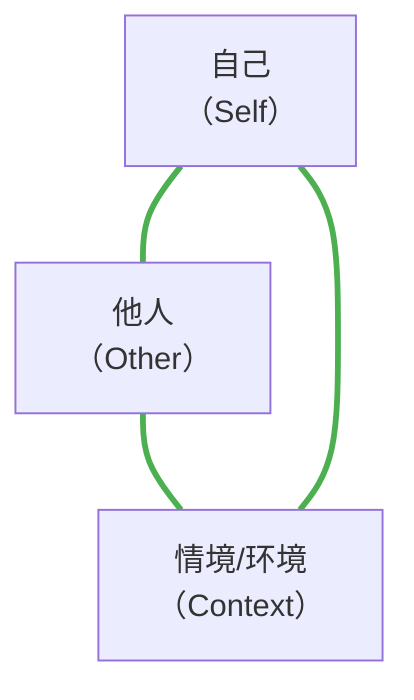
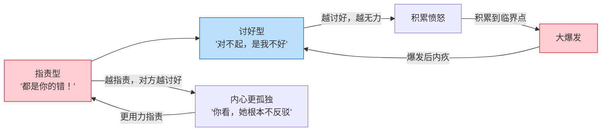

# 第03课：指责型与讨好型姿态

## Learning Objectives

- 掌握沟通三要素（自己、他人、环境/情境）
- 理解四种应对姿态在压力下的生存本质
- 识别指责型姿态的行为表现、内在感受与资源
- 识别讨好型姿态的行为表现、内在感受与资源
- 了解身体姿态在萨提亚沟通分析中的作用

---

## 沟通三要素

萨提亚认为，任何一次健康的沟通都必须同时兼顾三个要素：

| 要素 | 含义 | 代表的问题 |
|------|------|-----------|
| **自己** | 我对自己的感受、需求、期待是否清楚 | "我此刻的感受是什么？我需要什么？" |
| **他人** | 我是否关注对方的感受和需求 | "对方此刻的感受是什么？他需要什么？" |
| **情境/环境** | 沟通发生的背景、客观条件 | "当下的场合、时间、环境是怎样的？" |

> 当三者兼顾时，就是萨提亚所说的**一致性沟通**（Congruence）——一种健康、真诚、平等的沟通状态。关于一致性的系统方法，将在[[lessons/0022-shi-mo-shi-yi-zhi-xing-gou-tong|第22课：什么是一致性沟通]]中详细介绍。

---

## 四种应对姿态：压力下的生存策略

现实是——我们很少能同时兼顾三者。特别是在**压力情境**下，人会不自觉地"走捷径"，牺牲其中的一个或多个要素，形成四种应对姿态：

| 姿态 | 顾及 | 忽略 | 通俗描述 |
|------|------|------|---------|
| **指责型** | 自己 + 情境 | 他人 | "都是你的错！" |
| **讨好型** | 他人 + 情境 | 自己 | "都是我不好……" |
| **超理智型** | 情境 | 自己 + 他人 | "从理论上说……" |
| **打岔型** | 三者都忽略 | 三者都忽略 | "哎对了你吃饭了吗？" |

> **所有四种姿态都是扭曲的**——它们都是压力下的"求生策略"，而非真正的沟通。

其中，指责型和讨好型是最常见、也最容易配对的两种姿态。本课先聚焦它们，[[lessons/0004-chao-li-zhi-da-cha-zi-tai|第04课：超理智与打岔型姿态]]会继续讲解另外两种。

---

## 指责型姿态

### 表现

指责型的人在压力下，习惯性做出以下反应：

| 维度 | 表现 |
|------|------|
| 语言 | "你怎么搞的！""都是你的错！""你到底有没有脑子！" |
| 音量 | 大、有力量、充满攻击性 |
| 手势 | 手指指向对方、拍桌子、叉腰 |
| 身体姿态 | 身体前倾、下巴上扬、全身紧绷 |
| 内在感受 | **悲伤**（被压住的悲伤） |

### 指责型的"资源"

萨提亚从不只看到"问题"，她更看重每一种姿态背后的**资源**：

| 负面表现 | 背后的资源 |
|---------|-----------|
| 咄咄逼人 | **领导力** —— 能站出来、能拿主意 |
| 不依不饶 | **目标感强** —— 对结果负责 |
| 声音大 | **有力量** —— 有行动力 |

### 指责型的真实需求

指责型的人最核心的内心呐喊是：

> **"请你看到我！"**

这听起来很反直觉——一个看起来如此强势的人，内心却渴望被看见？

是的。正因为**渴望被看见而长期未被满足**，所以越"闹"越大声。每一次指责，都是一次对"看到我"的呼唤——只是用了让对方更不想看的方式。

---

## 讨好型姿态

### 表现

讨好型的人在压力下的典型反应：

| 维度 | 表现 |
|------|------|
| 语言 | "都怪我不好……""对不起对不起……""没事没事，你高兴就好" |
| 音量 | 小、温柔、唯唯诺诺 |
| 手势 | 双手摊开、手心向上、身体后缩 |
| 身体姿态 | 身体微微前屈、点头、哈腰、肩膀内收 |
| 内在感受 | **委屈、愤怒**（但被死死压住） |

### 讨好型的"资源"

| 负面表现 | 背后的资源 |
|---------|-----------|
| 过度忍让 | **情感敏感度高** —— 能敏锐捕捉他人情绪 |
| 不敢提需求 | **善解人意** —— 理解别人在想什么 |
| 委屈自己 | **维护关系** —— 重视和谐与联结 |

### 讨好背后的"存资本"机制

讨好型的人有一个非常典型的心理模式：**"存资本"**。

这个循环怎么理解？

1. 讨好型的人一直在忍让、付出，但内心是**有意识的**——"我在忍"
2. 每一次忍让，都在心里"存了一笔资本"
3. 资本积累到一定程度——爆发（常常是因为一件小事）
4. 爆发之后又内疚、自责——"我怎么会这样"
5. 内疚驱动更努力地讨好——循环继续

> 这种模式非常普遍。如果你曾经有过"平时脾气很好，突然因为一件小事暴怒"的经历，可以检查一下：是不是你的"资本"已经存满了？

### 讨好型的真实需求

> **"请你不要离开我。"**

讨好型的人最深的恐惧是——被抛弃、被拒绝、不被接纳。"只要我足够好、足够乖、足够让人满意，我就安全了。"

---

## 身体姿态教学

萨提亚非常重视**身体工作**（Body Work）。她认为，身体的记忆比头脑更深刻。

### 指责型的身体练习

1. 站直，一只手叉腰
2. 另一只手向前伸，食指指向正前方
3. 下巴微微抬起
4. 用愤怒的语气说："都是你的错！"

**感受**：肩膀紧绷、胸腔收紧、呼吸变浅。

### 讨好型的身体练习

1. 站直，双手摊开，手心向上
2. 双肩微微内收，身体微微前倾
3. 用轻柔的语气说："对不起，都是我不好……"

**感受**：胸口有种挤压感、喉咙发紧、呼吸不顺畅。

> [!TIP] 身体工作的意义
>
> 当你做出这些身体姿态时，你会惊讶地发现——身体的姿势会**直接引发**对应的情绪和想法。这不是"表演"，而是你在重新体验那种压力状态。
>
> 身体练习的目的是：**觉察身体信号**。当你在生活中再次出现这些身体姿态时，你就可以及时问自己："我现在进入什么姿态了？我真的想用这个姿态吗？"

---

## 指责型与讨好型的"完美配对"

在人际关系中，指责型和讨好型经常形成一种"互补"的配对模式：

这就是为什么很多夫妻关系中，一个越指责，另一个越讨好；越讨好，指责的越生气——看起来一个强势一个弱势，其实**两个人都很痛苦**。

---

## 本课小结

| | 指责型 | 讨好型 |
|------|--------|--------|
| 顾及 | 自己 + 情境 | 他人 + 情境 |
| 忽略 | 他人 | 自己 |
| 语言特征 | "都是你的错！" | "对不起，是我不好……" |
| 内在感受 | 悲伤 | 委屈/压住的愤怒 |
| 核心需求 | "请你看到我" | "请你不要离开我" |
| 资源 | 领导力、目标感、力量 | 情感敏感、善解人意 |

---

## Practice

> [!QUESTION] 自我检测
>
> 1. 沟通三要素是哪三个？
>    A. 自己、他人、社会
>    B. 自己、他人、情境/环境
>    C. 自己、父母、孩子
>
> 2. 指责型姿态的人内在感受是什么？
>    A. 愤怒
>    B. 悲伤
>    C. 无所谓
>
> 3. 讨好型姿态的人"存资本"机制指的是什么？
>    A. 讨好型的人善于理财
>    B. 每一次忍让都在心里积累愤怒，最终爆发
>    C. 讨好型的人在人际中不断索取

查看答案

1. **B** —— 沟通三要素是：自己（Self）、他人（Other）、情境/环境（Context）。
2. **B** —— 指责型的外在很强硬，但内在感受是**悲伤**。大声喊的背后是"请你看到我"的渴望。
3. **B** —— "存资本"是指讨好型的人在忍让时心里默默记着，积累到一定程度会一次性爆发。

---

## 应用任务

1. **姿态观察**：本周在人际互动中，留意自己出现了几次指责型或讨好型的姿态？（不需要改变，只需要觉察）
2. **身体扫描**：每天选一个时刻，感受你的身体姿态——肩膀是紧绷的还是放松的？呼吸是深还是浅？你的身体在告诉你什么？
3. **角色互换**：如果你能在安全的环境中，找一个信任的人尝试"角色交换"——你演对方，对方演你。感受一下位置互换后有什么新的发现。

---

## 下一步

你已经认识了指责型和讨好型两种姿态。下一课，我们将继续了解另外两种：**超理智型**和**打岔型**，并引出一致性沟通的开端。

继续学习：[[lessons/0004-chao-li-zhi-da-cha-zi-tai|第04课：超理智与打岔型姿态]]

> 相关参考：[[reference/glossary|术语表]] · [[reference/congruent-communication|一致性沟通公式速查]]