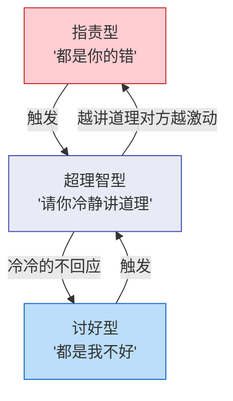
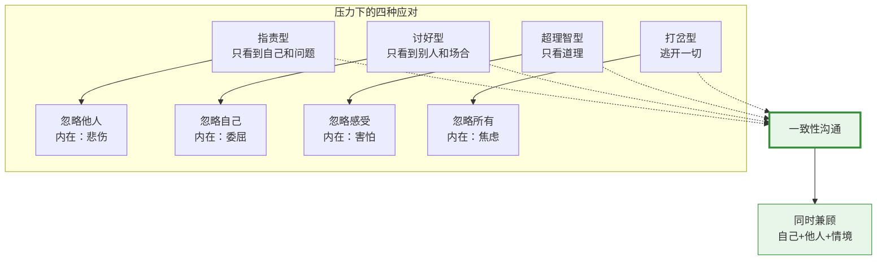
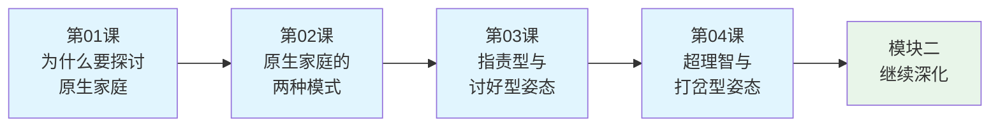

# 第04课：超理智与打岔型姿态

## Learning Objectives

- 识别超理智型姿态的行为特征、内在感受与资源
- 识别打岔型姿态的行为特征、内在感受与资源
- 通过《亮剑》田雨的案例理解沟通姿态的冲突
- 理解四种姿态的完整画面，为一一致性沟通铺垫

---

## 回顾：四种应对姿态

在上一课（[[lessons/0003-zhi-ze-tao-hao-zi-tai|第03课：指责型与讨好型姿态]]）中，我们了解了沟通三要素——**自己、他人、情境**——以及前两种应对姿态：

| 姿态 | 顾及 | 忽略 |
|------|------|------|
| 指责型 | 自己 + 情境 | 他人 |
| 讨好型 | 他人 + 情境 | 自己 |
| **超理智型**（本课） | **情境** | **自己 + 他人** |
| **打岔型**（本课） | **三者都忽略** | **三者都忽略** |

本课将完成四种姿态的全貌，并引出转变的方向——**一致性沟通**。

---

## 超理智型姿态

### 表现

超理智型的人在压力下，习惯性地退入"纯粹理性"的堡垒中：

| 维度 | 表现 |
|------|------|
| 语言 | "从理论上来说……""数据表明……""根据研究……" |
| 语调 | 平淡、不带感情、像在读论文或做报告 |
| 表情 | 几乎没有表情变化，面部肌肉控制得很好 |
| 身体姿态 | 身体僵直、手臂交叉或放在桌上、动作少、保持距离 |
| 内在感受 | **害怕被证明是错的** |

### 超理智型的"资源"

| 负面表现 | 背后的资源 |
|---------|-----------|
| 冷漠、不近人情 | **博学** —— 有丰富的知识储备 |
| 爱抬杠、讲大道理 | **雄辩** —— 逻辑清晰、条理分明 |
| 回避情感话题 | **分析能力强** —— 能理性看待问题 |

### 超理智型的内心世界

超理智型的人最核心的恐惧是：

> **"如果我有情绪，我就会失控。"**
> **"如果我的观点被证明是错的，那我这个人就是错的。"**

他们往往在童年时期经历过这样的环境：
- 情绪表达被否定（"哭有什么用？" "理智一点！"）
- 只有在"讲道理"时才被认可
- 犯错被严厉批评，导致把"错误"等同于"我不好"

于是他们建造了一个坚固的"理性堡垒"——堡垒里安全、可控、没有情感的干扰。但这个堡垒的代价是：**自己也出不去**。

> 超理智型的人常常不自觉地掩盖了真实的自己。他们以为把情绪压住就是坚强，但其实那只是"假装坚强"。

### 超理智型与另外两种姿态的关系

一个常见的生活场景：

> 妻子（讨好型）："你是不是不爱我了？你最近都不怎么和我说话……"
> 丈夫（超理智型）："我最近项目很忙，根据时间管理理论，在项目截止前我应该优先处理工作。这和爱不爱没有关系。"
> 妻子更委屈了："你就是在找借口……"
> 丈夫："我已经用逻辑解释了，你不接受我也没办法。"

在这个对话中，妻子在表达情感需求，丈夫在用逻辑回应——**两个频道完全错开**。妻子需要的是情感联结，丈夫给的是"解决方案"。

---

## 打岔型姿态

### 表现

打岔型是四种姿态中最"奇怪"的一种——它在压力下的反应是：**逃开**。

| 维度 | 表现 |
|------|------|
| 语言 | "诶对了！你听说那个事了吗？""哈哈别那么严肃嘛……""哎，今天天气不错……" |
| 语调 | 轻松、跳跃、甚至有些不着边际 |
| 表情 | 嬉皮笑脸、夸张的表情变化 |
| 身体姿态 | 身体不停地变换姿势、手脚东摸西碰、眼神飘忽 |
| 内在感受 | **用表面的无所谓掩盖深层的焦虑和恐惧** |

### 打岔型的"资源"

| 负面表现 | 背后的资源 |
|---------|-----------|
| 逃避问题、不正经 | **幽默感** —— 能用轻松的方式化解紧张 |
| 注意力不集中 | **灵活** —— 思维跳跃，创造力强 |
| 不直面冲突 | **冲突调解者** —— 能缓解剑拔弩张的气氛 |

> 打岔型的人在团队中往往是一个"开心果"——在气氛紧张的时候，他总能用一句玩笑话让大家轻松下来。这本身是一种可贵的社交能力。
>
> 问题在于：**如果每次都用幽默来回避真正的问题，那幽默就成了逃避的借口。**

### 打岔型的内心世界

打岔型的人最核心的模式是：

> **"只要我不面对，问题就不存在。"**

他们通常在童年经历过：
- 家庭中冲突强度大、频率高，孩子必须"装没事"才能活下去
- 严肃的话题往往伴随着危险后果，所以学会了用打岔来保护自己
- 真实的感受被忽视或否定，只能学会"无所谓"

### 四种姿态的完整对比

| 维度 | 指责型 | 讨好型 | 超理智型 | 打岔型 |
|------|--------|--------|---------|--------|
| 语言 | 大声、攻击 | 小声、道歉 | 平淡、理性 | 跳跃、搞笑 |
| 身体 | 前倾、指人 | 后缩、哈腰 | 僵直、距离 | 不停动、飘忽 |
| 感受 | 悲伤 | 委屈/愤怒 | 害怕被证明错 | 焦虑/无所谓 |
| 言辞 | "都是你的错" | "都是我不好" | "根据理论来说" | "哎对了！" |
| 资源 | 领导力 | 情感敏感 | 博学雄辩 | 幽默灵活 |

---

## 案例：《亮剑》中田雨的沟通姿态切换

电视剧《亮剑》中有一个非常经典的沟通场景，可以用萨提亚的四种姿态来解读。

### 背景

田雨出生于书香门第，父亲是知识分子，家庭环境偏向超理智型。她嫁给军人出身的李云龙后，两人在沟通方式上产生了巨大的冲突。

### 场景一：超理智模式启动

当李云龙用军队式的粗放方式和她沟通时，田雨的反应非常"超理智"：

> "李团长，从逻辑上来说，你的这个要求是不合理的。根据我与你的婚姻契约，双方应当……"

她的肢体语言：坐姿端正、表情克制、语调平稳。

这个状态下，田雨**忽略了自己和他人的感受**，只关注"道理"和"应该"。她在用超理智的方式保护自己——因为这是她在原生家庭中学到的最安全的方式。

### 场景二：被打岔型姿态触动

当李云龙用一种完全不符合"逻辑"的方式表达爱意时（比如直接、笨拙但真诚的行动），田雨会突然破防——她的超理智堡垒被攻破了。

此时她可能会切换到另外一种姿态，要么**讨好**（顺从丈夫），要么用**打岔**（"哎呀不说这个了，我去泡茶"）来应对自己无法处理的感情波动。

### 深度解读

这个案例揭示了超理智型姿态的核心困境：

> 超理智型的人不是没有感受——他们只是**太害怕感受**。
>
> 他们用理性筑起高墙，以为这样就能隔绝痛苦。但同时也隔绝了真正的亲密——因为**亲密需要感受的流动**。

当一个人的某一种姿态被"破防"时，他/她不是转向一致性，而是转向**另一种扭曲姿态**。这就是为什么我们需要学习第四种选择——一致性沟通。

---

## 四种姿态的核心总结

> 萨提亚有一个著名的比喻：
>
> 四种应对姿态，就像是你在冰冷的水中挣扎时的四种**求生姿势**。它们帮你"活下去"，但都不舒服。
>
> 一致性沟通，则是你学会了**游泳**——你不再需要在冰冷的水中挣扎，而是可以自由地游向任何方向。

关于如何"学会游泳"，我们将在后续课程中逐步展开（参见[[lessons/0022-shi-mo-shi-yi-zhi-xing-gou-tong|第22课：什么是一致性沟通]]、[[lessons/0023-yi-zhi-xing-gou-tong-shang|第23课：一致性沟通（上）]]、[[lessons/0024-yi-zhi-xing-gou-tong-xia|第24课：一致性沟通（下）]]）。

---

## 模块一回顾

至此，我们已经完成了模块一的全部四课内容：

模块一的核心收获：
1. 理解了原生家庭如何塑造我们（[[lessons/0001-yuan-sheng-jia-ting-tan-tao|第01课：为什么要探讨原生家庭]]）
2. 认识了家庭系统的两种模式（[[lessons/0002-yuan-sheng-jia-ting-liang-chong-mo-shi|第02课：原生家庭的两种模式]]）
3. 识别了四种压力应对姿态（第03、04课）

---

## Practice

> [!QUESTION] 自我检测
>
> 1. 超理智型姿态的人主要忽略什么？
>    A. 情境/环境
>    B. 自己和他人的感受
>    C. 只有自己
>
> 2. 打岔型姿态的人最核心的特征是什么？
>    A. 专注于讲道理
>    B. 在压力下逃开，不面对问题
>    C. 大声指责别人
>
> 3. 四种应对姿态的共同本质是什么？
>    A. 都是有效的沟通方式
>    B. 都是压力下的生存策略，是扭曲的沟通状态
>    C. 只有好人和坏人的区别

查看答案

1. **B** —— 超理智型的人只关注情境（道理、数据、逻辑），忽略自己和他人两方面的感受。
2. **B** —— 打岔型的人在压力下的核心反应是"逃开"——用幽默、转移话题、插科打诨等方式回避面对真正的问题。
3. **B** —— 四种应对姿态都是在压力下的求生策略，都是扭曲的沟通状态。它们不是"坏人"的标志，而是人类在压力下的自动化反应。真正的健康沟通是**一致性沟通**——同时兼顾自己、他人和情境。

---

## 应用任务

1. **姿态日记**：本周每天选一个你印象最深的沟通场景，记录自己使用了什么姿态（指责/讨好/超理智/打岔）。只要记录，不用评判。
2. **观察他人**：在安全的情况下，观察你身边的同事或家人，尝试识别他们的主要沟通姿态。注意——带着觉察去观察，而不是"给别人贴标签"。
3. **练习切换**：下次当你意识到自己使用了某种"熟悉"的姿态时，试试做一个小小的调整：
   - 如果你是指责型——试着停下来，问一句："你现在感觉怎么样？"
   - 如果你是讨好型——试着说一句："其实我也有点不舒服。"
   - 如果你是超理智型——试着说一句："我现在的感受是……"
   - 如果你是打岔型——试着停下来，说："这个话题让我有点紧张，我们可以继续谈。"

---

## 下一步

恭喜你完成了模块一的学习！接下来，模块二将帮助你进一步**觉察与改变**，深入探讨如何调整强迫性重复、理解等级模式与平等模式的深层影响、建立界限感，以及区分童年创伤与成年创伤。

继续学习：[[lessons/0005-tiao-zheng-qiang-po-xing-chong-fu|第05课：调整强迫性重复]]

> 相关参考：[[reference/glossary|术语表]] · [[reference/iceberg-model|冰山模型速查]] · [[reference/congruent-communication|一致性沟通公式速查]]