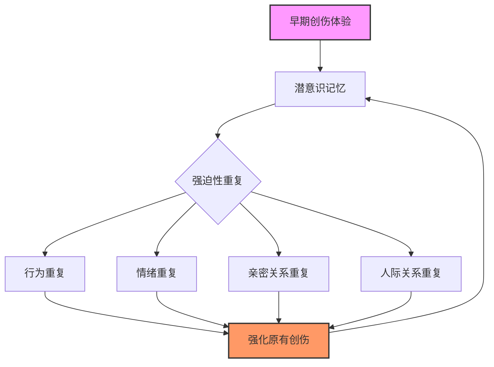
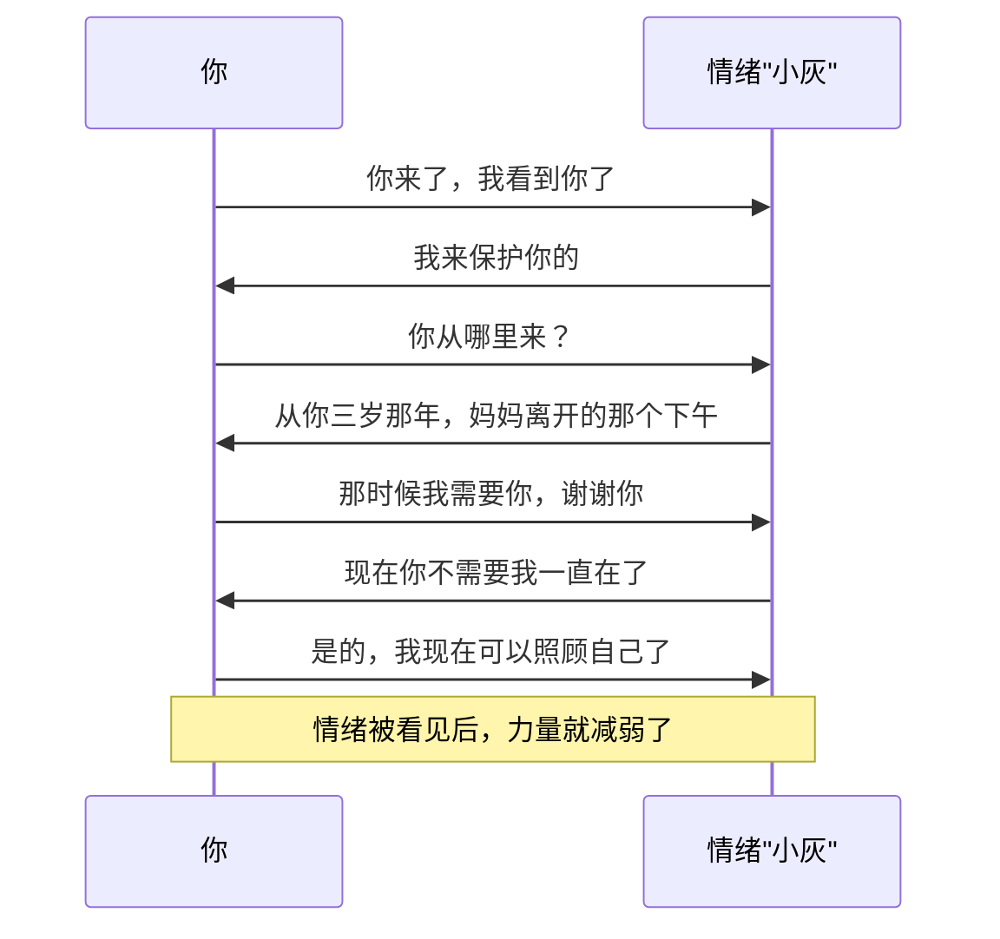
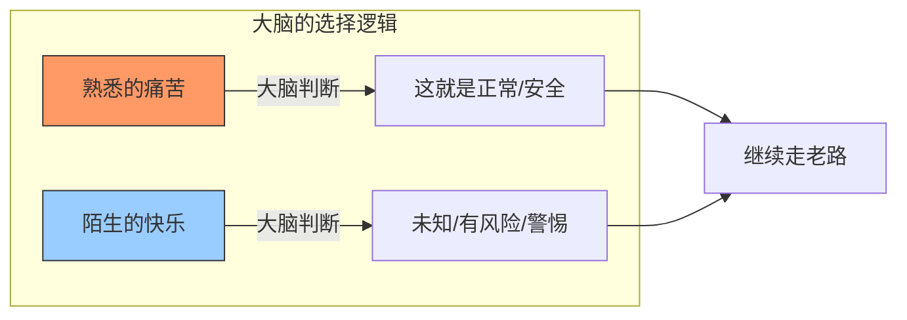

# 第05课：调整强迫性重复

你是否发现自己在不同的人际关系中反复遇到相似的问题？总是吸引同一类人，总是在相似的场景中感到委屈或愤怒，总是做出让自己后悔的选择？这背后可能藏着一个心理学概念——**强迫性重复**。

## Learning Objectives

- 识别四种类型的强迫性重复现象
- 掌握觉察四步曲的实操方法
- 学会用拟人化技术与情绪对话
- 理解"熟悉感比舒适感更重要"的深层含义

## Core Idea

> 强迫性重复（Repetition Compulsion）是指个体无意识地重复早期创伤体验的心理模式。大脑宁愿走熟悉的痛苦之路，也不愿探索未知的舒适之路——**熟悉感比舒适感更重要**。

### 四种强迫性重复

| 类型 | 表现 | 举例 |
|------|------|------|
| **行为重复** | 不断做相同的事，即使结果很糟糕 | 每次恋爱都在三个月后主动分手 |
| **情绪重复** | 反复陷入相似的情绪漩涡 | 每到关键时刻就莫名焦虑到崩溃 |
| **亲密关系重复** | 吸引或选择类似特质的伴侣 | 总是爱上冷漠疏离的人 |
| **人际关系重复** | 在工作、友谊中重复同样的人际模式 | 总是成为群体中被忽略的那一个 |

### 觉察四步曲

打破强迫性重复的第一步不是"改"，而是"看见"。以下是觉察四步曲：

**第一步：注意不舒服的行为**

当你在关系中感到不对劲时，先停下来。身体会给你信号——胃部发紧、心跳加速、肩膀僵硬。这些身体感受是潜意识在敲门。

**第二步：命名它**

给你的情绪和模式取一个名字。这一步非常关键——命名即是掌控。

常见的命名方式：
- "哦，我又被忽略了"（命名事件）
- "黑兔子来了"（命名情绪——用拟人化的名字）
- "这是我的'讨好模式'启动了"

**第三步：对照原生家庭**

问自己：这个场景让我想起了小时候的什么？这个人让我想起了谁？

> [!NOTE] 原生家庭对照表
> | 当前场景 | 小时候的对应场景 |
> |---------|----------------|
> | 被领导批评时的恐慌 | 被父母责骂时的无助 |
> | 伴侣不回消息时的焦虑 | 小时候等待晚归父母的不安 |
> | 不敢拒绝别人的要求 | 童年时必须听话才能得到爱 |
> | 总觉得自己不够好 | 父母总是拿你和别人比较 |

**第四步：告诉自己"小时候能量不够，现在我长大了"**

这是最关键的一步。小时候的你确实没有选择——你必须依赖父母才能生存。但现在你已经长大了，你有资源、有能力、有选择权。重复这句话，直到身体真正相信它。

> [!TIP] Key Insight
> 觉察不是为了指责原生家庭，而是为了理解：**小时候的能量不够，所以那个模式帮你活了下来。但现在你长大了，你可以选择新的路径。**

### 拟人化技术

拟人化技术是将你的情绪或内在模式想象成一个人，给它取名字、看它的样子、与它对话。这个技术的妙处在于——当你把情绪"请出来"，你就从"我就是情绪"变成了"我在观察情绪"，从而获得抽离感和掌控感。

**操作步骤：**

1. **取名字**：给那个反复出现的情绪取一个名字。可以叫它"小黑"、"暴躁老张"、"委屈的小女孩"。
2. **画出来**：闭上眼睛，看看它长什么样子？高矮胖瘦？穿什么颜色衣服？
3. **对话**：问它"你为什么来？""你想告诉我什么？""你需要什么？"
4. **感谢**：感谢它的到来，告诉它"我知道了，你可以走了"。

### 《人生五章》——改变的五个阶段

这首著名的诗描述了从"无意识重复"到"有意识选择"的五个阶段：

| 阶段 | 描述 | 对应心态 |
|------|------|---------|
| **第一章** | 我走在街上，路上有个大坑，我掉了进去。我花了很长时间才爬出来。 | 无意识——"又来了" |
| **第二章** | 我走在同一条街上，路上有个大坑，我假装没看见，又掉了进去。爬出来花了更长时间。 | 有意识但无力——"我知道但改不了" |
| **第三章** | 我走在同一条街上，路上有个大坑，我看到它，但还是掉了进去……这是我的习惯。我爬了出来。 | 看见但仍在重复——"我看到了" |
| **第四章** | 我走在同一条街上，路上有个大坑，我绕过了它。 | 成功避开——"我做到了" |
| **第五章** | 我换了一条街走。 | 彻底转变——"我选择了新的路" |

> [!WARNING] 对自己温柔
> 大多数人在第一到第三章之间反复很久。这不是失败，这是**练习**。每一次掉进坑里，都比上一次多了一份觉察。觉察本身就是进步。

## 熟悉感比舒适感更重要

为什么我们明知是痛苦，还是会重复？因为大脑的底层逻辑是：**熟悉的 = 安全的**。

小时候，我们在某种环境中长大，那个环境就是我们的"正常"。即使那个环境充满伤害，它也是我们唯一知道的"正常"。成年后，我们会无意识地创造熟悉的环境——即使那意味着重复痛苦。

这就是为什么很多人：
- 明明遇到了温柔体贴的伴侣，却觉得"没感觉"——因为太陌生了
- 明明可以放松享受，却总要制造问题——因为平静让人不安
- 明明知道发脾气没用，但就是要发——因为愤怒比脆弱更熟悉

> [!TIP] Key Insight
> 舒适感和熟悉感是两回事。**健康的关系可能一开始让你"不习惯"，但它是真正舒适的。有毒的关系让你"很熟悉"，但它是真正痛苦的。**

## Worked Example

**案例：小A总是在职场中被领导否定**

小A做了三年工作，换了四个部门，但每次都能遇到"针对她"的领导。她觉得自己特别倒霉。

用觉察四步曲分析：

1. **注意不舒服的行为**：每次领导给出反馈意见，小A就感到胃痛、手心出汗、大脑一片空白。
2. **命名它**："我又回到了'被批评的小孩'状态"。
3. **对照原生家庭**：小A的父亲是非常严厉的人，从小到大她无论考多少分，父亲都会说"下次可以更好"。她从来没有得到过"够了"的认可。
4. **告诉自己"我长大了"**：小A意识到，领导只是正常工作反馈，不是否定她这个人。她不需要用讨好父亲的方式去讨好领导。她可以平静地说"收到，我会调整"。

## Practice

> [!QUESTION] Self-check
> 1. 回忆你最近一年内反复出现的某种不愉快情境（工作、亲密关系、友谊皆可），它属于四种强迫性重复中的哪一种？
> 2. 尝试为这个模式中的情绪取一个名字（拟人化），写一段简短的对话。
> 3. 对照你的原生家庭：这个模式让你想到了谁？想到了什么场景？
> 4. 你现在处于《人生五章》的哪个阶段？你可以做一件什么小事进入下一个阶段？

参考答案示例

**示例回应：**

1. **模式识别**：每次和伴侣吵架时，我总是选择沉默冷战。这是亲密关系重复 + 情绪重复。
2. **命名**：我给这个情绪取名叫"门神"——它挡在我和沟通之间，看起来很凶，其实很害怕。
   - 我："门神，你为什么挡住我？"
   - 门神："因为我怕你说错话，关系就断了。"
   - 我："小时候谁让你这么害怕？"
   - 门神："你爸爸。每次说错话，他就会发脾气好多天。"
3. **对照原生家庭**：父亲冷战的处理方式——有情绪就不说话，整个家气压极低。我学到了"有情绪=不说话"。
4. **阶段**：我在第三章和第四章之间徘徊。下一步小事：下次想冷战的时候，先深呼吸三次，然后说一句"我需要一点时间整理，五分钟后我们再聊"。

## 课后应用

这一周，请完成以下练习：

1. **觉察日记**：每天记录一次"熟悉但不舒服"的情绪时刻，用四步曲走一遍。
2. **拟人化对话**：选一个反复出现的情绪，给它取名字，和它对话。把对话写下来。
3. **替换路径**：在《人生五章》中确认自己的阶段，为下一阶段设计一个具体的行动。

> [!TIP] Key Insight
> 改变强迫性重复不是一夜之间换一条路走，而是每次掉进坑里后，**爬出来的速度快了一点点**。这一点点，就是成长。

---

**关联课程：**
- 上一课：[[lessons/0004-chao-li-zhi-da-cha-zi-tai|第04课：超理智与打岔型姿态]]
- 下一课：[[0006-deng-ji-ping-deng-mo-shi|第06课：等级模式VS平等模式]]
- 相关概念：[[reference/glossary.md|术语表]] — 强迫性重复 / 觉察四步曲 / 拟人化技术