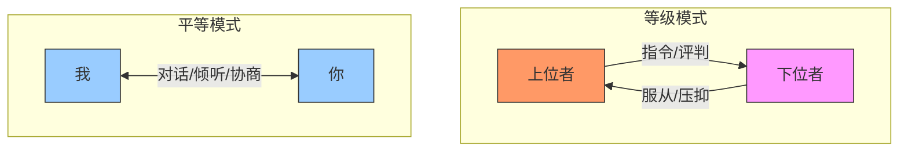
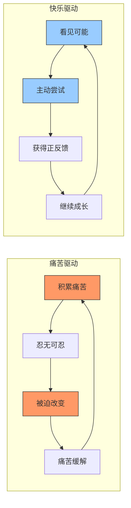
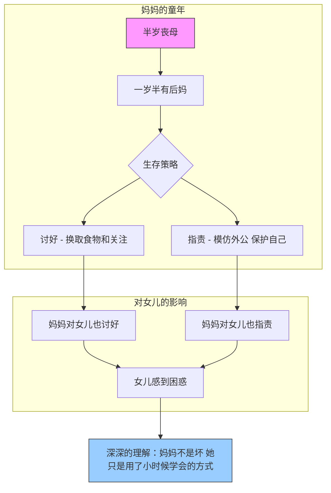

# 第06课：等级模式VS平等模式

我们从小在家庭中学到的关系模式，往往只有两种选择：要么在上位管别人，要么在下位被管。但真正成熟的关系，存在第三种可能——**平等模式**。

## Learning Objectives

- 区分等级模式与平等模式的本质差异
- 理解痛苦驱动与快乐驱动的行为逻辑
- 看到爱与忠诚如何塑造我们的行为模式
- 学会"深深的理解"——不止于头脑，而抵达心灵的看见

## Core Idea

> **平等≠没有规则。** 平等是人格层面的平等、心理地位的平等。在一个平等的关系中，每个人的感受都值得被听见，每个人的需求都可以被表达。

### 等级模式 vs 平等模式

| 维度 | 等级模式 | 平等模式 |
|------|---------|---------|
| 沟通方式 | 从上到下的指令 | 双向对话 |
| 冲突处理 | 谁权力大谁说了算 | 共同寻找解决方案 |
| 情绪表达 | 上位者可以发怒，下位者只能压抑 | 双方都可以表达情绪 |
| 决策方式 | 独断 | 协商 |
| 责任归属 | 下位者执行，上位者负责 | 共同承担 |
| 人格地位 | 不平等 | 平等 |

### 痛苦驱动 vs 快乐驱动

这是两种截然不同的行动逻辑：

**痛苦驱动：**
- "不痛就不动"
- 必须积累到忍无可忍才会改变
- 改变的动机是逃离痛苦
- 一旦痛苦消失，动力也消失
- 典型表现：直到身体出问题才注意健康、直到关系破裂才想修复

**快乐驱动：**
- "我想要更好的效果"
- 改变是因为看到更美好的可能性
- 动机是追求成长和满足
- 即使没有痛苦也能持续推进
- 典型表现：主动学习新技能、定期维护关系

> [!TIP] Key Insight
> 长期来看，快乐驱动的改变更可持续。但大多数人从小被训练成痛苦驱动——因为"考不好就被骂"比"学好了很有趣"更常见。

### 爱与忠诚——来自原生家庭的潜意识编程

孩子对父母的爱，有一种非常隐秘的表达方式：**模仿**。

即使你非常讨厌父母的某个特质，你仍然可能在无意识中活出那个特质。因为对孩子来说——"如果我不像你，我就失去了和你的连接。"

> [!WARNING] 这不是你的错
> 这不是你有意选择的。这是潜意识层面最深层的忠诚。孩子通过"成为父母的样子"来确认自己属于这个家。

**常见的"忠诚性复制"：**
- 小时候发誓"我绝不像我妈那样唠叨"，长大后发现自己在伴侣面前一模一样地唠叨
- 小时候讨厌父亲的暴脾气，但自己在压力下也会暴怒
- 明明想做一个开明的父母，但责备孩子的话和当年父母说的一模一样

### 深深的理解——不止于头脑

"理解"有两个层次：

**层次一：头脑层面的理解**
- "我知道我妈不容易"
- "我爸也是为你好"
- 这是一种理智化的、居高临下的"理解"

**层次二：深深的理解**
- 去探索父母的原生家庭
- 去看到父母在成为父母之前，首先是一个孩子
- 去理解他们的特质曾经是如何帮他们活下来的

> [!TIP] Key Insight
> 探索父母的原生家庭，不是为了原谅他们，而是为了**理解他们也不是坏掉的人，他们只是用自己学会的方式活了下来。**

#### 案例：妈妈的矛盾模式——又指责又讨好

**表面现象：** 妈妈对女儿既挑剔指责，又在小事上过度讨好。女儿感到非常困惑和受伤。

**深深的理解：**

| 妈妈的行为 | 她的成长背景 | 这个行为帮她活了下来 |
|-----------|------------|-------------------|
| 讨好 | 妈妈半岁丧母，一岁半有了后妈 | 不讨好就没有人给她吃的，不讨好就会被忽视。讨好=生存 |
| 指责（向外公模式） | 外公是一个习惯指责的人 | 在那个家庭里，不向外公那样指责，就会被视为软弱。指责=保护自己 |

> 妈妈用"讨好"来获得生存资源，用"指责"来保护自己不被欺负。这两个模式在她身上共存，看似矛盾，实则是她童年最有效的生存策略。

当你看到妈妈的成长背景——半岁失去母亲，一岁半进入一个陌生的家庭——你会理解，她的讨好不是针对你，她的指责也不是因为你不够好。**她只是在做那个小女孩唯一会做的事。**

## Worked Example

**案例：小陈在工作中总是抢活干，不敢拒绝**

小陈是公司里出了名的"老好人"，任何同事塞过来的活她都接，经常加班到深夜。她感到疲惫又委屈——但就是不敢说"不"。

**等级模式的投射：**
- 在小陈的内心地图里，拒绝 = 挑战权威 = 被惩罚
- 她把同事和领导都投射成了"上位者"，把自己放在了"下位者"的位置

**爱与忠诚的线索：**
- 小陈的妈妈也是一个不会拒绝的人，在家族里承担了所有的"额外工作"
- 小陈通过"像妈妈一样任劳任怨"来表达对妈妈的忠诚
- 即使她痛恨这种疲惫，她也不敢"背叛"妈妈

**从等级模式切换到平等模式的练习：**
1. **觉察**："我在用等级模式理解这段关系——我把同事放在了上位。"
2. **重新定义**："我们是同事关系，是平等的成年人。我可以拒绝而不被惩罚。"
3. **小小尝试**：从一个低风险请求开始，练习说"我这周时间排满了，下次吧"。
4. **庆祝**：每一次说"不"之后，给自己一个正反馈——不是世界大战，只是正常沟通。

## Practice

> [!QUESTION] Self-check
> 1. 你在哪些关系中习惯使用等级模式（上位或下位）？这个模式从谁那里学来的？
> 2. 你更多是痛苦驱动还是快乐驱动？请举一个具体的例子。
> 3. 选择一个你父母身上让你不太舒服的特质，去探索：这个特质在他们小时候是如何帮他们活下来的？
> 4. 本周你可以做一件什么事，从一个"下位者"心态切换到"平等"心态？

参考答案示例

**示例回应：**

1. **等级模式**：我在和权威人物（领导、老师）相处时自动切换到"下位"模式——不敢表达真实想法，习惯性说"好的"。这个模式从我妈妈那里来——她在我爸面前就是这样的。
2. **痛苦驱动**：我每次减肥都是在体检出问题后才开始，瘦下来后又反弹。从来没有因为"我想健康有活力"而去运动。
3. **爸爸的固执**：爸爸非常固执，听不进别人的意见。探索后发现，爷爷是一个控制欲极强的人，爸爸从小没有任何话语权。他的固执其实是"我终于可以自己做主了"的反向形成。固执 = 宣告自己的存在。
4. **平等尝试**：下周开会时，我要鼓起勇气对领导说一次"我有个不同的想法"——用尊重的语气，但不压抑自己的意见。

## 课后应用

1. **三级跳练习**：在一周中，选择三件小事，主动从一个你习惯的"等级模式"反应切换成"平等模式"回应。
2. **家族探索**：找一个长辈（父母、祖父母），了解他们小时候的故事。你可能会发现，很多你讨厌的特质，其实都是他们当年的"生存工具"。
3. **快乐驱动实验**：选一件你一直拖着不想做的事，不要等到"不得不做"，而是给自己找一个"做了会更好"的理由。

> [!TIP] Key Insight
> 等级模式让你活下来，平等模式让你活得好。**你不是背叛了父母的生存方式，而是站在他们为你打下的基础上，去走更远的路。**

---

**关联课程：**
- 上一课：[[0005-tiao-zheng-qiang-po-xing-chong-fu|第05课：调整强迫性重复]]
- 下一课：[[0007-jia-ting-mao-dun-jie-xian-gan|第07课：家庭矛盾与界限感]]
- 相关概念：[[reference/glossary.md|术语表]] — 等级模式 / 平等模式 / 痛苦驱动 / 爱与忠诚