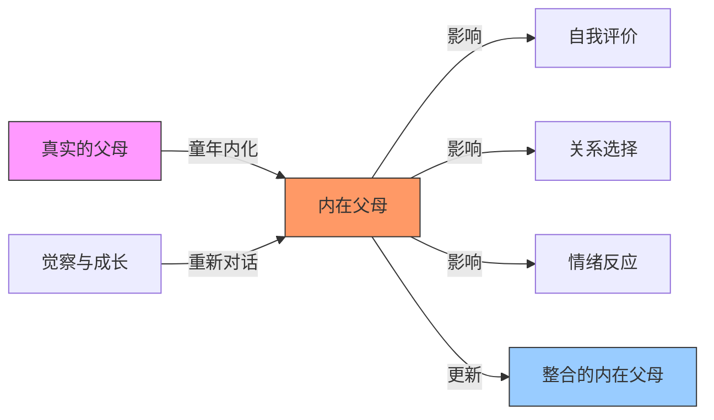
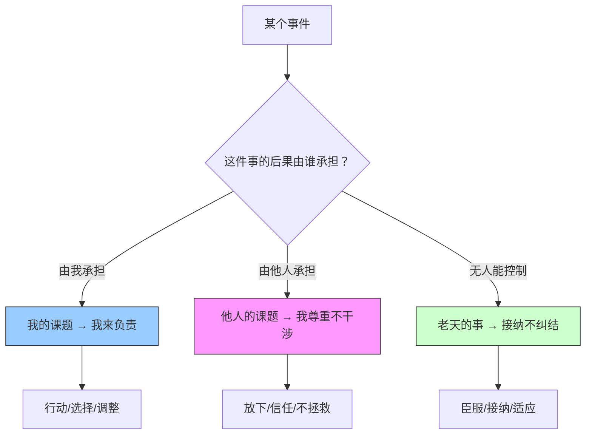

# 第07课：家庭矛盾与界限感

家庭矛盾的根源，往往不是"谁对谁错"，而是**序位错乱**和**界限模糊**。当每个人站错了位置，爱就会变成纠缠。

## Learning Objectives

- 理解家庭系统排列中的序位法则
- 认识到内在父母如何影响当下的关系
- 掌握课题分离的核心技巧
- 学会"两份允许"——对过去和自己温柔以待

## Core Idea

### 家庭系统排列——序位法则

德国心理治疗师伯特·海灵格（Bert Hellinger）提出的家庭系统排列理论认为，每个家庭系统都有其自然的**序位**。当序位被遵守，爱就能顺畅流动；当序位被颠倒，就会出现矛盾和痛苦。

**核心家庭中的序位：**

| 序位 | 成员 | 角色说明 |
|------|------|---------|
| 第一位 | 先生/丈夫 | 核心家庭的支柱和保护者 |
| 第二位 | 太太/妻子 | 与先生并列，共同持守家庭 |
| 第三位 | 孩子 | 被保护和被照顾的对象 |

> [!WARNING] 序位≠价值
> 序位不是谁更重要、谁更有价值。序位是一种功能性安排——就像交响乐团里第一小提琴手和定音鼓手的位置不同，但同样重要。**先生排第一位，不代表他比妻子更重要，而是代表他是家庭的"边界守护者"。**

**常见的序位错乱：**
- 孩子成了"小大人"——替父母做决定、照顾父母的情绪
- 妻子把所有的情感重心放在孩子身上，丈夫被边缘化
- 丈夫和婆婆的联结紧密度超过和妻子的联结

```mermaid
graph TD
    subgraph 健康序位
        H1[丈夫] --- H2[妻子]
        H1 --> H3[孩子]
        H2 --> H3
    end
    
    subgraph 错乱序位
        C1[妻子] -.->|过度关注| C3[孩子]
        C1 -.- C2[丈夫|边缘化]
        C3 -->|承担大人角色| C1
    end
    
    style H1 fill:#9cf,stroke:#333
    style H2 fill:#9cf,stroke:#333
    style H3 fill:#cfc,stroke:#333
    style C1 fill:#f96,stroke:#333
    style C2 fill:#f9f,stroke:#333
    style C3 fill:#f96,stroke:#333
```

### 内在父母

每个人的内心都有一个"内在父母"——它不是真实的父母，而是**父母在你心中留下的形象和声音**。

即使你已经独立生活多年，父母的形象仍然在你心里，并且持续影响着你的选择：

- 当你犹豫要不要做一件事时，心里那个"他们会怎么说"的声音
- 当你取得成就时，自动响起的"这还不够好"的评判
- 当你犯错时，内心那个严厉的批评者



**与内在父母和解不是要抹去他们，而是：**
- 看见他们的存在
- 理解他们从哪里来
- 和那个声音对话，而不是被它指挥
- 最终，你可以选择哪些部分留下，哪些部分放下

### 两份允许

> [!TIP] Key Insight
> **第一份允许：允许自己暂时做不到。**
> **第二份允许：允许父母当年做不到。**

**第一份允许——允许自己暂时做不到**

我们对自己太苛刻了。学了一堂课就要求自己马上改变，觉察到模式就要求自己立刻停止。但改变是一个过程，不是一件事。

"暂时做不到"不等于"永远做不到"。"暂时"是一个过程状语，它包含了进步的可能。

**第二份允许——允许父母当年做不到**

你的父母没有给你的，很可能是因为他们自己也没有。他们无法给你他们没有的东西——他们给不出他们不曾得到的爱、安全感和认可。

这不是为父母开脱，而是**把期待从"他们应该给"调整为"他们给不出"**。前者让你持续失望，后者让你接受现实，从别处获得滋养。

> [!WARNING] 两份允许 ≠ 放弃改变
> 允许自己暂时做不到，不是允许自己永远不做。允许父母当年做不到，不是允许他们继续伤害你。这是为了让你从"埋怨"和"自责"中解放能量，去做真正能改变的事。

### 课题分离——我的事、别人的事、老天的事

课题分离是阿德勒心理学中的一个核心概念，由《被讨厌的勇气》一书广为传播。它的核心是：**谁的课题，谁负责。**

**如何判断是谁的课题？**
一个简单的标准：**这件事的后果最终由谁来承担？**

| 课题归属 | 判断标准 | 举例 |
|---------|---------|------|
| **我的事** | 后果主要由我承担 | 我的情绪、我的选择、我的人生 |
| **别人的事** | 后果主要由别人承担 | 别人的情绪、别人的评价、别人的人生 |
| **老天的事** | 超出个人控制范围 | 天气、天灾、他人的生死 |

**课题分离不是冷漠，而是尊重：**
- 你不需要为他人的情绪负责——那是他们的课题
- 你不需要满足所有人的期待——那是别人的期待，不是你的课题
- 你只需要为自己的选择负责——这是你的课题



### 不需要强迫原谅

这是非常重要的一点：**你不需要强迫自己原谅。**

很多人被"你要大度""你要原谅"的道德绑架压得喘不过气。但真正的疗愈不是强迫自己原谅，而是：

1. **承认伤害的存在**——不否认、不弱化
2. **承认自己的感受**——愤怒、委屈、悲伤都是合理的
3. **设立界限**——保护自己不再受到同样的伤害
4. **选择如何处理这段关系**——可以原谅，可以不原谅，可以有条件地来往

> [!TIP] Key Insight
> 原谅不是治愈的前提，**治愈才是原谅的前提**。当你真正被治愈了，原谅可能会自然发生——也可能不会。无论哪种，你都可以过好你的人生。

## Worked Example

### 案例一：夜总会老大的故事

一位从事娱乐行业的管理者，手下管理着数百名员工，在夜总会里威望极高，所有人都听他的。但他的女儿却不听他的话，和他关系非常紧张。

**分析：**
- 他在外面是"老大"，回到家也习惯用"老大"的模式和女儿相处——命令、控制、不容反驳
- 女儿感受到的不是父爱，而是另一个"老大"
- 女儿无法在自己的家庭序位中找到位置——她既不纯粹是"孩子"，也不愿意变成"下属"

**解决方向：**
- 在推开家门的那一刻，把"夜总会老大"的身份留在门外
- 在家里，激活"父亲"的身份——倾听、陪伴、支持、不控制
- 恢复家庭序位：他是父亲，女儿是女儿。父亲可以温和坚定，但不需要用权威压人

### 案例二：作者与三个姐姐的关系

作者在家中排行最小，上有三个姐姐。在成长过程中，姐姐们对她照顾有加，但这种照顾有时也变成了"过度关心"——姐姐们会替她做决定、替她操心、替她"好"。

**课题分离的应用：**
- 姐姐的关心 → 这是姐姐的课题（她们表达爱的方式）
- 接不接受这种关心 → 这是作者的课题
- 作者的课题是：温和地表达"谢谢你的关心，但我需要自己做决定"
- 姐姐是否因为被拒绝而难过 → 那是姐姐的课题

> [!NOTE]
> 亲情的课题分离最难，因为"我爱你"和"我干涉你"常常被混为一谈。但真正的爱，是尊重对方是一个独立的个体。

## Practice

> [!QUESTION] Self-check
> 1. 在你的原生家庭中，序位是健康的还是错乱的？如果是错乱的，你有什么办法让自己"回到正确的位置"？
> 2. 闭上眼睛，听听你内心的"内在父母"在说什么——那个声音是鼓励的、批评的、还是焦虑的？
> 3. 你在哪个关系中需要练习课题分离？区分一下：什么是"我的事"、"别人的事"、"老天的事"？
> 4. 哪一件事你需要"允许自己暂时做不到"？哪一件事你需要"允许父母当年做不到"？

<details>
<summary>参考答案示例</summary>

**示例回应：**

1. **序位探索**：我家是典型的"妻子太强、丈夫太弱"模式。妈妈承担了所有决策，爸爸基本不出声。我从小就成了妈妈的"小老公"——安慰她、给她建议。现在我需要回到"女儿"的位置，不再扮演伴侣的角色。
2. **内在父母声音**：我内心的声音是"你不行""你会搞砸的"，那是我爸爸的语调。我已经不需要那个声音来"保护"我了。
3. **课题分离练习**：妈妈总是催我结婚。她的焦虑是她的课题，我是否结婚是我的课题。我需要练习温和地说"我知道你担心我，但这是我的人生"。
4. **两份允许**：允许自己暂时无法对妈妈说"不"——这需要练习。允许妈妈当年无法给我安全感——因为她自己也没有被好好爱过。
</details>

## 课后应用

1. **家庭序位图**：画出你目前的家庭关系图，看看谁站在什么位置。有没有序位错乱？这周可以做一件小事来调整。
2. **内在父母日记**：当你听到内心那个批评声音时，写下来。然后问它："你是从哪里来的？你现在还在帮我吗？"
3. **课题分离三清单**：列出"我的事""别人的事""老天的事"各三件，这一周只专注于"我的事"清单。
4. **两份允许仪式**：写下"我允许自己暂时做不到______"和"我允许父母当年做不到______"，念给自己听。

> [!TIP] Key Insight
> 界限不是墙，而是**门**。你可以决定什么时候打开、什么时候关上。有了健康的界限，爱才能自由地流动——而不是变成纠缠。

---

**关联课程：**
- 上一课：[[0006-deng-ji-ping-deng-mo-shi|第06课：等级模式VS平等模式]]
- 下一课：[[0008-tong-nian-cheng-nian-chuang-shang|第08课：童年创伤VS成年创伤]]
- 相关概念：[[reference/glossary.md|术语表]] — 家庭系统排列 / 内在父母 / 课题分离