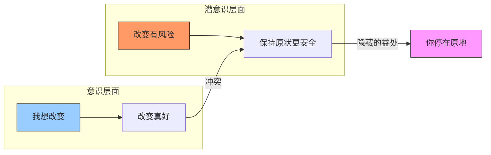
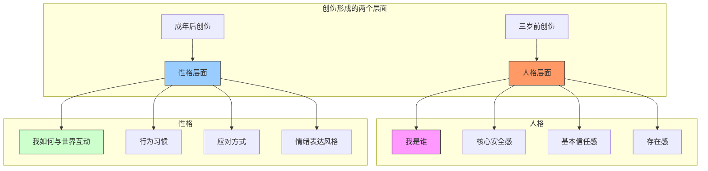
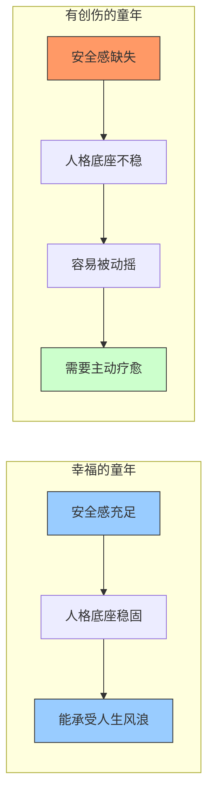

# 第08课：童年创伤VS成年创伤

同样是受伤，有些伤长在性格上，可以调整；有些伤却刻在了人格上，形成了你"是谁"。理解这两种创伤的区别，是走上疗愈之路的关键一步。

## Learning Objectives

- 区分童年创伤与成年创伤的本质差异
- 理解"隐藏的益处"——改变为什么这么难
- 掌握人格与性格的区别
- 认识不同人格底座对人生的影响

## Core Idea

### 隐藏的益处——为什么你停在这个状态？

每次谈到改变，总有一个看不见的阻力在说："不要动。"这个阻力来自一个很现实的问题——**你现在的状态，就算再痛苦，也给了你一些"好处"**。

这不是你的错，这是心理的自我保护机制。关键是看见这些"隐藏的益处"，然后才能做出真正的选择。

**常见"隐藏的益处"案例：**

| 状态 | 表面痛苦 | 隐藏的益处 |
|------|---------|-----------|
| 停留在不健康的恋情中 | 委屈、不被爱 | 不用面对孤独、不用重新适应一个人生活 |
| 不敢换工作 | 每天都很压抑 | 稳定的收入、熟悉的环境、不用承担失败的风险 |
| 持续自我贬低 | 低自尊、不快乐 | 不用对自己有高期待、别人不会对你有要求 |
| 对过去耿耿于怀 | 愤怒、悲伤 | 可以停留"受害者"位置，不用为自己的人生负责 |

> [!WARNING] 这不是在指责你
> "隐藏的益处"不是为了告诉你"你活该停在原地"。而是为了让你看见：**那个停在原地的你，其实也在用他的方式保护自己。** 只有看见了，你才能真正选择是否要放下这个"好处"。

### 童年创伤 vs 成年创伤

这是本课最核心的内容。两种创伤有着根本性的区别：

| 维度 | 童年创伤 | 成年创伤 |
|------|---------|---------|
| **发生时间** | 三岁以前（语言和记忆形成前） | 三岁以后，尤其是成年后 |
| **存储方式** | 身体记忆（躯体化） | 情景记忆（可以讲述） |
| **坐落层面** | 人格层面——"我是谁" | 性格层面——"我如何与世界互动" |
| **改变难度** | 根本性、非常难改变 | 后天可调、相对容易 |
| **语言化能力** | 很难用语言表达 | 可以清晰叙述 |
| **治疗方式** | 身体工作、艺术治疗、长期咨询 | 认知调整、行为训练、短期内省 |

> [!TIP] Key Insight
> 童年创伤是**人格层面的烙印**——它影响了"我是谁"这个核心命题。成年创伤是**性格层面的划痕**——它影响的是"我如何反应"这个表层。

### 人格 vs 性格——底层代码 vs 表层应用

**人格（Personality）：** 是"我是谁"的底层代码。它在你生命的头三年形成，像一个操作系统的内核。人格决定了你的**存在感、安全感和基本信任感**。

**性格（Character）：** 是你与世界互动的方式。它在你成长过程中不断被调整，像安装在操作系统上的应用程序。性格决定了你的**行为习惯、应对方式和情绪表达风格**。

**一个比喻：**
- 人格 = 房子的地基
- 性格 = 房子的装修
- 童年创伤 = 地基出了问题
- 成年创伤 = 墙面漆剥落了

你可以重新刷墙（调整性格），但如果地基是歪的（人格层面的创伤），刷再漂亮的墙也解决不了根本问题。

> [!NOTE]
> 这并不意味着人格层面的创伤无法疗愈。它只是意味着疗愈的方式不同——需要更长的时间、更深入的工作，以及更多的耐心和温柔。

### 阿德勒名言——幸福的童年疗愈一生

阿德勒曾说："幸福的童年疗愈一生，不幸的童年用一生疗愈。"

这句话被很多人引用，但需要正确理解：

- **"幸福"** 不是指没有挫折、物质丰富，而是指在头三年中，孩子获得了**足够的安全感、被看见的感觉、以及身体上的舒适和满足**。
- **"疗愈一生"** 不是指一辈子不需要成长，而是指这样的人格底座足够稳固，人生的风浪不会动摇他的核心。
- **"用一生疗愈"** 不是绝望的宣告，而是提醒：如果你没有那样的童年，你需要更有意识地去为自己做那些早年缺失的事情。

### 人格的底座比喻——不同形状的根基

每个人的"人格底座"形状不同。这个比喻可以帮助你理解为什么面对同样的事情，不同的人反应完全不同：

| 人格底座 | 特征 | 面对压力时的反应 | 核心需求 |
|---------|------|----------------|---------|
| **圆形底座 🟢** | 稳固、灵活、有弹性 | 能弯曲但不会断裂 | 已满足，不需要特殊照顾 |
| **三角形底座 🔺** | 尖锐、敏感、有特定弱点 | 在特定角度容易被击碎 | 需要被理解那个"尖角"在哪 |
| **四方形底座 ⬜** | 刚硬、固执、不灵活 | 不会弯曲，可能会整体裂开 | 需要温和的、缓慢的重新塑形 |

> [!WARNING] 这不是诊断
> 这个比喻只是为了帮助你理解——**不要用它来给自己或他人贴标签**。每个人的情况都是独特的，而且改变是可能的——只是路径和时间不同。

**不同底座的人如何对待同一件事：**

**被领导批评了：**
- 圆形底座：感到难过，但能消化。"他今天心情不好吧，我看看哪里能改进。"
- 三角形底座：那个"尖角"被击中了，触发核心创伤。"我就是不够好，他要抛弃我了。"
- 四方形底座：表面不动声色，但内心已经开始裂开。可能突然在某天彻底崩溃。

## Worked Example

**案例：小林的"存在感"危机**

小林32岁，工作能力不错，但有一个让她非常困扰的模式：每当在会议上被点名发言，她会瞬间大脑空白、手心出汗、心跳加速。即使提前准备好了内容，也说不出来。

**分析：**

| 维度 | 表现 |
|------|------|
| 表面问题 | 公开发言焦虑 |
| 可能的成年创伤层面 | 中学时有一次发言被全班嘲笑——属于性格层面的"一朝被蛇咬" |
| 可能的童年创伤层面 | 母亲在哺乳期患有严重抑郁，对小林的哭声没有反应——属于人格层面的"我的存在没有得到回应" |

**如果只是性格层面的创伤：**
- 通过演讲训练、认知调整、系统脱敏，可以在几个月内明显改善

**如果有人格层面的基础：**
- "存在感"的缺失让公开发言变成了"我是否存在"的考验，而不只是"我是否说得好"
- 除了行为训练，还需要深层的疗愈工作——可能是通过身体工作、安全的治疗关系来重新建立"存在感"

**解决方案应该双管齐下：**
1. 针对性格层面：参加演讲俱乐部，练习公开发言技巧
2. 针对人格层面：做一些身体觉察练习，比如瑜伽或正念，重新建立"我在我的身体里"的感觉

## Practice

> [!QUESTION] Self-check
> 1. 你的一个人格底座更接近圆、三角形还是四方形？为什么这样觉得？
> 2. 你生命中有一个反复出现的困境吗？它是更多落在性格层面还是人格层面？
> 3. 你现在停在某个状态中，"隐藏的益处"可能是什么？诚实面对自己。
> 4. 如果你知道你的某个模式是童年期形成的，你会对自己更温柔一些吗？你会对自己说什么？

参考答案示例

**示例回应：**

1. **人格底座**：我觉得自己像三角形底座。我平时表现得很好，但只要涉及"被抛弃"这个话题，我就会完全失控。这是我的"尖角"。
2. **困境定位**：我不敢深入一段亲密关系。这既有性格层面的原因（青春期被拒绝的经历），也有人格层面的原因（一岁多时妈妈出差三个月，那段时间我可能经历了"妈妈消失了"的创伤）。
3. **隐藏的益处**：我停在"不进入关系"的状态，好处是不用承担被抛弃的风险。这个"好处"保护了我很多年，但现在它也在限制我。
4. **温柔对话**：如果这是幼儿期的我留下的烙印，我会对自己说："那时候你太小了，你理解不了妈妈出差是什么意思。你以为她不要你了。现在你长大了，你知道离开不等于抛弃。你可以慢慢来。"

## 课后应用

1. **创伤分层日记**：遇到一个情绪触发事件时，问自己——"这个反应更多是来自性格层面还是人格层面？"记录下来。
2. **"隐藏的益处"清单**：选一个你想改但一直没改的模式，列出它给你的"隐藏益处"。然后问自己："我能不能换一种方式获得同样的好处？"
3. **身体觉察练习**：每天做5分钟的身体扫描——从头到脚感受你的身体。这可以帮助你连接那些存储在身体里的早期记忆。
4. **为自己做"好的父母"**：如果在头三年你缺失了什么（安全感、回应、抚摸），试着在自己能力范围内，给自己补上。

> [!TIP] Key Insight
> 童年创伤改变起来很难，但**难不代表不可能**。重要的是：
> 1. 不再责怪自己"为什么改不了"
> 2. 理解那个模式曾经帮你活了下来
> 3. 用成年人的资源，去回应当年那个没有被满足的小孩
>
> 阿德勒留给我们的不只是一句真相，更是一句承诺：**哪怕用一生去疗愈，也值得。**

---

**关联课程：**
- 上一课：[[0007-jia-ting-mao-dun-jie-xian-gan|第07课：家庭矛盾与界限感]]
- 相关概念：[[reference/glossary.md|术语表]] — 童年创伤 / 成年创伤 / 人格 / 性格 / 隐藏的益处