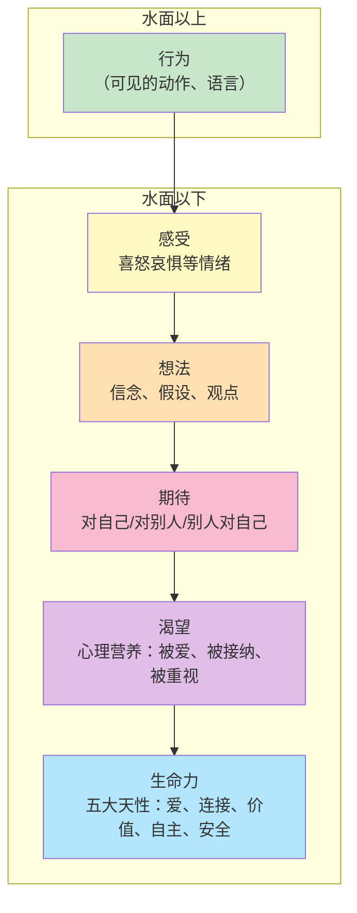
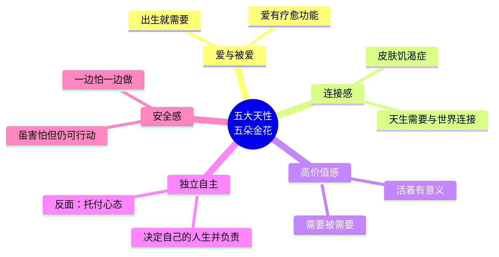

# 第09课：人类的五大天性

## 冰山模型总览

萨提亚沟通模式中最经典的工具，就是**冰山模型**。它用冰山作比喻，来描述一个人的内在能量运作方式。

我们的外在行为只是冰山露出水面的一小部分。水面之下，隐藏着一系列深层的心理动力——感受、想法、期待、渴望、生命力。这些能量平时没有被觉察，就像被冰冻住了一样。你今年多少岁，就有多少年的能量被冻在那里。

> 如果我们不去探索内在，我们就只能活在表面。

## 心理健康的标准

心理学家**科胡特（Kohut）** 对心理健康标准作了一个极其精炼的概括：

> [!TIP] Key Insight
> 心理健康的标准只有八个字——**对内自信，对外热情**。

- **对内自信**：我可以滋养自己的生命力
- **对外热情**：我可以滋养别人的生命力

当你把生命力的五朵金花全部绽放——爱与被爱、连接感、高价值、独立自主、安全感——你自然自信。而当你掌握方法去激活别人的生命力，你就自然热情。

## 五大天性：五朵金花

人的五大天性，也叫做"五朵金花"。它们是人类与生俱来的心理需求，而不是后天习得的东西。

> 就像鱼活在水里，人活在空气里。鱼儿在水中是自由舒服的，一旦离开水就痛苦挣扎。人也一样——离开了五大天性，心就会开始枯萎。

### 1. 爱与被爱

**出生就需要爱。** 婴儿虽然不知道"爱"这个词汇，但他通过一系列行为来判断你是否爱他——你是否重视他、是否足够陪伴他、当他难受时是否在他身边。

**爱具有疗愈功能。** 孩子在外面受了欺负，回到家妈妈抱一抱、说一句"妈妈爱你"，创伤就被疗愈了，第二天又可以开心地去玩。但如果回到家得到的是"你怎么这么笨，打回去啊"，就没有收到爱的疗愈，孩子第二天可能就不肯上学了。

> 如果你从小没有被爱疗愈过，你长大就不懂得用爱去疗愈别人。这不是你的错，但你可以通过觉察和成长来打破这个循环。

### 2. 连接感

人类天生需要与世界连接。我们的大脑神经设计了一套"默认系统"——人一闲下来，只要没有目标，就会自动去想与人有关的事情。

婴儿的第一个连接方式就是**哭声**：它用哭声向世界宣告"我来了，我需要与你们连接"。当哭声引来关注和照顾，婴儿就获得了安全感。当哭声无人回应，就会产生巨大的恐惧。

**触觉与皮肤饥渴症：** 连接与触觉密切相关。婴儿烦躁时，你跟他讲道理完全没用，但一旦抱起他、抚摸他，他就能安静下来。这份安抚会留存在身体的记忆里。如果童年缺失了触觉上的安抚，长大后就可能出现**皮肤饥渴症**——内心渴望被拥抱、被触碰，否则就会烦躁。

> 童年的安抚是身体的抚摸，成年的安抚是心理的拥抱。

### 3. 高价值感

高价值感的意思是：**我活着是有意义的。** 每个人都需要感受到自己被需要。

疫情期间很多人待在家里，明明有存粮不会饿死，却普遍价值感偏低。为什么呢？因为"被别人需要"是人类的天性——我需要做一些对世界有贡献的事。

价值感从哪里来？它建立在前面的基础之上：被爱（爱与被爱）、被接纳（连接感）、被重视。如果没有这些基础，价值感就很难建立。

### 4. 独立自主

独立自主不等于一个人生活、一个人吃饭。独立自主是**第三次出生**——我有完全的权利决定自己的人生，同时为这个决定负责。

**反面：托付心态。** 常见的误区是"我决定，你来负责"——比如"我决定不离婚，但你要向我保证让我幸福"。谁来决定你的人生，谁就要为这个决定负责。当你把决定权交给别人时，你的命运就交到了别人手上。

> 独立自主 = 我做决定 + 我为决定负责

### 5. 安全感

真正的安全感不是不害怕，而是**虽然害怕但仍然可以行动**。老师把这叫做"一边怕一边做"：

- 我害怕与人链接，但带着这份害怕，我仍然愿意尝试
- 我害怕为自己负责，但带着这个害怕，我仍然尝试去负责
- 我害怕对别人表达善意，但带着这个害怕，我仍然愿意表达善意
- 同时我接纳别人拒绝我的善意——没有人规定你表达了别人就必须接收

> **安全感不是没有恐惧，而是带着恐惧依然前行。**

## 五种天性的联动

五大天性之间不是孤立的，它们相互影响、层层递进：

| 天性 | 缺失表现 | 补充关键 |
|------|---------|---------|
| 爱与被爱 | 不敢爱、不会表达爱 | 从小得到爱的疗愈 |
| 连接感 | 不敢与人交流、皮肤饥渴 | 情感和触觉的安抚 |
| 高价值感 | 需要不断证明自己 | 被需要、被肯定 |
| 独立自主 | 托付心态、不能为自己负责 | 自己做决定并承担后果 |
| 安全感 | 害怕、逃避、控制欲强 | 一边怕一边做 |

这五个天性如果绽放得好，你的外在行为就是：友善、温暖、能与人自由连接、有力量追求想要的东西。如果绽放得不好，你就只能依赖**应对姿态**（指责、讨好、超理智、打岔）来表达内在的需求。

## 延伸思考

基于冰山模型，不止个人有冰山，**团队也有冰山**，**家庭也有冰山**：

- 有些人一到公司就死气沉沉，换一个团队却活力四射——这就是团队冰山激活与否的区别
- 有些男人在外面五朵金花全部绽放，回到家里一朵都不开——这就是家庭冰山需要检视的信号

关键的问题是：**我能做些什么，来激活自己和身边人的生命力？**

有关团队冰山和家庭冰山的深入分析，请参考 [[reference/iceberg-model|冰山模型速查]] 和 [[reference/glossary|术语表]]。

## Worked Example

**案例：** 一位妈妈帮女儿带孩子，反复抱怨、指责。女儿很痛苦，建议请保姆妈妈又不同意。

**用冰山分析：**
- 水面行为：抱怨、指责
- 感受：害怕失去价值感
- 想法："我没用了，他们不再需要我了"
- 期待：希望被需要、被重视
- 渴望：被接纳、被爱
- 生命力：价值感这朵花枯萎了

**突破点：** 女儿如果能告诉妈妈"因为你的存在，这个家才安定。妈妈我太需要你了"，妈妈的价值感就会增加。

## Practice

> [!QUESTION] Self-check
> 回顾你最近一次与他人的矛盾事件（可以是家人、同事或朋友），尝试列出以下内容，看看自己能觉察到冰山下的哪些层次：
>
> 1. 事件：发生了什么？
> 2. 你的感受是什么？
> 3. 你当时的想法是什么？
> 4. 你期待对方怎么样？
> 5. 在这个事件中，你真正渴望的是什么心理营养？
> 6. 你的哪朵"金花"被影响了？

参考方向

事件不一定要很"大"。日常中的小摩擦——比如对方没有回复消息、家人说了让你不舒服的话——都可以用来练习。关键在于尝试从行为（水面）一层层往下走，去触碰自己的感受、想法、期待和渴望。

下一课 [[0010-jue-cha-wu-da-tian-xing|第10课：觉察五大天性的现状]] 会带着你用冰山完整分析一个矛盾事件，并审视五朵金花的绽放状态。

## Next Step

Continue with the next lesson or complete the review task above before moving on.

---

> "你跟自己的关系，最终就是你跟世界的关系。" —— 陈艺新