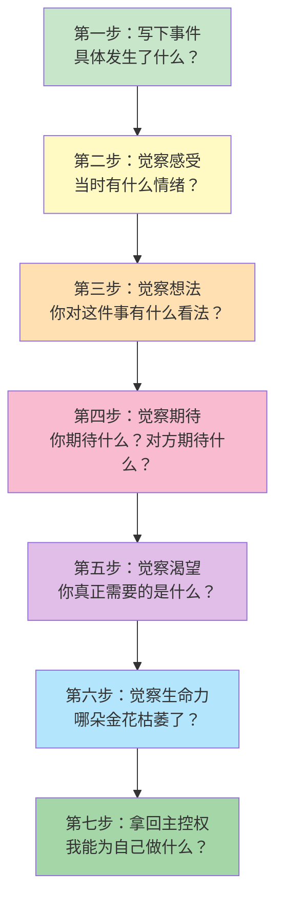

# 第10课：觉察五大天性的现状

## 五朵金花，绽放不同

在上一课 [[0009-wu-da-tian-xing|第09课：人类的五大天性]] 中，我们学习了人类的五种天性——爱与被爱、连接感、高价值感、独立自主、安全感。这五朵金花在每个人身上的绽放程度是不同的。

有的人连接感很好、内心柔软善良，但连接感差、不敢做人际交流。有的人愿意做人际交流，但每次都非常强势、硬邦邦——这就是爱的流动不够，爱的这朵金花需要加强。

> **觉察的第一步：** 在五朵花中，哪一朵开得最好？哪一朵最需要你去浇灌？

### 老师的自我剖析

> [!TIP] Key Insight
> 老师自述：**高价值这朵花，向来比较弱。**
>
> 当高价值感弱的时候，会不自觉地进入一种状态——不允许自己做不够好。需要很多外在的证明来证明自己有价值，比如分数、工作、成绩、金钱，甚至用老公来证明。老师在很长一段时间里，也需要走很远的路，才允许自己不那么强迫和要求自己。

这不是一个"立刻就能好"的过程。觉察本身就是疗愈的开始。当你看到自己哪朵花较弱的时候，不要批判自己，而是开始关注它、滋养它。

| 五朵金花 | 绽放的表现 | 枯萎的表现 |
|---------|-----------|-----------|
| 爱与被爱 | 敢于表达爱、接受爱 | 麻木、不敢爱、不会表达情感 |
| 连接感 | 人际交流顺畅、享受独处也享受群处 | 回避社交、内心孤独 |
| 高价值感 | 有追求目标的能量、相信自己是值得的 | 不断证明自己、不允许失败 |
| 独立自主 | 自己决定并为结果负责 | 托付心态、依赖他人决定 |
| 安全感 | 怕但依然去做（一边怕一边做） | 退缩、逃避、控制欲强 |

## 用冰山分析一件矛盾事件

学习冰山模型的目的，不是停留在理论上，而是要实际运用。现在我们来做一个练习：**用冰山分析一件你亲身经历过的矛盾事件。**

### 冰山分析七步法

### 完整示例

我们来用一个具体场景做完整的冰山分析：

**事件：** 看到男朋友电脑里存了很多他和前任一起旅游的照片，有很多他抓拍前任的瞬间，而他给自己拍照却很少，基本都是摆拍。

**按照冰山层层往下：**

| 层次 | 内容 |
|------|------|
| **事件**（水面） | 看到他给前任拍了很多抓拍照，给自己只有摆拍 |
| **感受** | 伤心、愤怒 |
| **想法** | "他不够爱我，不够重视我。" "我不是他欣赏的那类女生。" |
| **期待** | 期待成为他最喜欢的女生、他心目中的唯一 |
| **渴望** | 渴望被重视、被欣赏 |
| **生命力** | 高价值感受挫、爱与连接受阻——觉得自己没有成为他唯一的爱就是自己没有价值 |

### 为什么矛盾会产生？

> 所有的矛盾，都是因为**没有看到水面以下的东西**。

我们只看行为（他给前任拍了很多照、给我拍得少），然后直接跳到想法（他不爱我），又跳到行为（吵架、冷战）。但如果我们能看到自己的感受、期待和渴望，也看到对方的冰山——他也可能有自己的不安、期待和渴望——矛盾就不会仅仅停留在表面互撕。

## 觉察身边重要的人的生命力

不仅你要觉察自己的冰山，还可以尝试觉察身边重要的人——你的伴侣、父母、孩子、同事——他们的生命力状态：

- 我妈妈的连接感怎么样？她的价值感从哪里来？
- 我伴侣的安全感状态如何？他/她需要什么？
- 我的孩子哪朵花开得好，哪朵需要更多滋养？

**案例：** 老师的妈妈在安全感这朵花上比较弱，所以需要很多很多证明，需要不断确认"我是值得被爱的"。理解了这一点，就能用更有效的方式去给妈妈做心理营养，而不是仅停留在行为层面的对抗。

## Worked Example

**背景：** 一位学员说老公对自己永远有更高的要求和期待，让她感觉很压抑。

**用冰山分析自己的层面：**

1. **事件：** 老公对我永远有更高的要求
2. **感受：** 压抑、委屈
3. **想法：** "我怎么做都达不到他的标准。" "他是不是不满意我？"
4. **期待：** 期待他认可我、肯定我
5. **渴望：** 渴望被接纳、被肯定
6. **生命力：** 高价值感受挫，被欣赏被肯定的需求没有被满足

**再去分析对方的冰山（猜测）：**

1. **事件：** 对妻子提出要求，妻子达不到
2. **感受：** 焦虑、失望（可能）
3. **想法：** "我是在帮她变得更好。" "她为什么总是不听？"
4. **期待：** 期待妻子理解自己的用心
5. **渴望：** 渴望被理解、被重视
6. **生命力：** 连接感受阻？爱的表达方式出现了偏差？

> 猜测对方的冰山不一定准确，但这个动作本身让你从"他对我不好"的单向思维跳出来，开始理解行为背后的动力。

## Practice

> [!QUESTION] Self-check
> 找一件最近让你不太愉快的矛盾事件，按照冰山的七个层次写下来：
>
> 1. **事件：** 发生了什么？（只写事实，不加评判）
> 2. **感受：** 我当时的情绪是什么？（用情绪词汇：伤心、愤怒、委屈、恐惧、内疚……）
> 3. **想法：** 我对这件事/对对方/对自己有什么看法？
> 4. **期待：** 我期待对方怎么做？对方期待我怎么做？我期待自己怎么做？
> 5. **渴望：** 在这件事中，我内心真正需要的是什么心理营养？
> 6. **生命力：** 我的哪朵金花被影响了？
> 7. **主控权：** 我能为自己做什么？

提示：区分感受和想法

常见误区：把想法写成感受。

- ❌ "我感觉他不尊重我" —— 这是一个想法（判断）
- ✅ "我感到伤心" —— 这是一个感受

- ❌ "我感觉自己不被重视" —— 这是一个想法
- ✅ "我感到失落" —— 这是一个感受

请尽量使用单纯的情绪词汇。

## 下一课预告

从这一课开始，你已经开始用冰山工具去觉察自己了。下一课 [[0011-hua-bing-shan-shang|第11课：如何画你的冰山（上）]] 将深入拆解**期待**这个层次——期待的三部分、复合等同、以及成长中形成的三类角色。

## Next Step

Continue with the next lesson or complete the review task above before moving on.

---

> "你跟自己的关系，最终就是你跟世界的关系。" —— 陈艺新