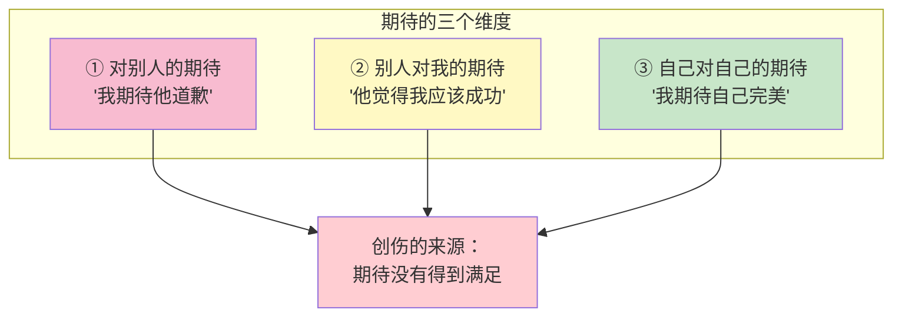
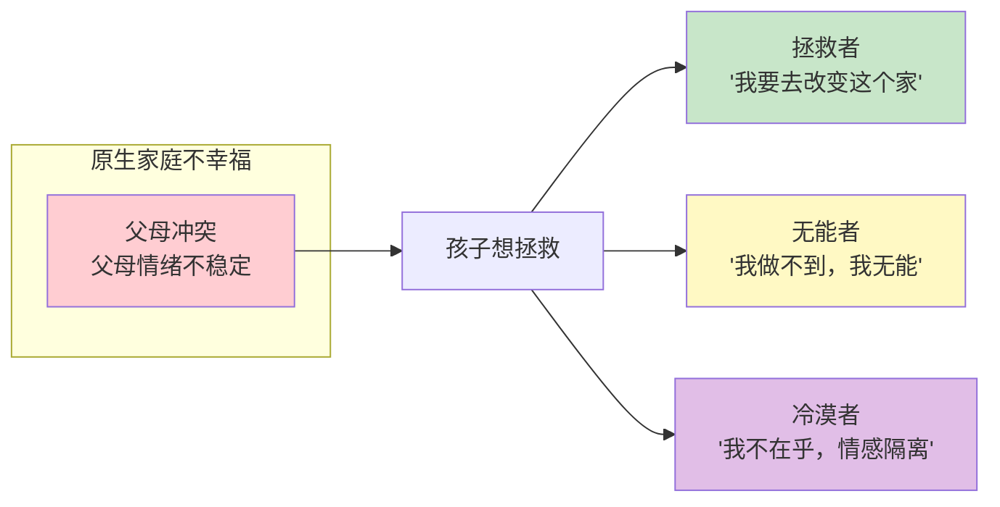

# 第11课：如何画你的冰山（上）

在上一课 [[0010-jue-cha-wu-da-tian-xing|第10课：觉察五大天性的现状]] 中，我们学习了如何用冰山分析矛盾事件。这一课我们深入拆解冰山中的一个关键层次——**期待**——以及由此衍生出的复杂等同和三类角色。

## 期待的三部分

期待有三个维度，大多数人画冰山时只关注了其中第一个：



### 1. 对别人的期待

这是最容易觉察到的期待。比如：

- "我期待他对我道歉"
- "我期待她理解我"
- "我期待老板给我加薪"

### 2. 别人对我的期待

这是我们猜测的、认为别人对我有的期待。比如：

- "他期待我是一个完美的伴侣"
- "老板期待我随时都能解决问题"
- "父母期待我出人头地"

### 3. 自己对自己的期待

这是最深层的、我们对自身的期待。比如：

- "我期待自己永远不犯错"
- "我期待自己是一个够好的妈妈/爸爸"
- "我期待自己能搞定所有事情"

> 我们所有的生气，背后都有一份对自己的生气。所有的愤怒背后，都有一份对自己的不满意。

## 创伤的来源：期待没有得到满足

人类的创伤，本质上都来自于**期待没有得到满足**。

> 巨大的期待没有得到满足 = 巨大的创伤
> 微小的期待没有得到满足 = 微小的创伤

创伤不一定非要发生什么惊天动地的大事。它只是在你的承受范围内、你不喜欢承受的东西。

**举个生活中的例子：** 早上起床，你一脚踩在地板上，你有一个隐藏的期待——"地板是安全的"。这个期待如此理所当然，你根本意识不到它是一个期待。但如果有一天地震了，你一脚踩下去发现地板塌了，你从二楼摔到一楼，你受伤了——这时你才意识到：原来我是有这样一个隐藏期待的。

所有期待没有得到满足的时候，都是因为我们**认为这个期待理所当然会发生**。当它没有发生，就形成了创伤。

## 拿回主控权

画冰山最重要的不是找到原因就结束了——而是要**拿回人生的主控权**。

> 关键问题：**"哪一个期待是我能掌控的？"**

```
我对别人的期待 → 我掌控不了（决定权在对方）
别人对我的期待 → 我掌控不了（决定权在对方）
自己对自己的期待 → 我能掌控一部分（决定权在我）
```

**那要怎么办呢？** 调整期待的方向——把期待从"对外"转向"对内"。

如果你画完冰山，发现所有的期待都是对外的——期待他改变、期待他道歉、期待他理解——那你会越画越无力，因为你发现你什么都掌控不了。

**出路：** 问自己"我能为自己做什么？"

回到上一课的示例——期待成为对方最喜欢的女生、唯一欣赏的人。这个期待的决定权在对方手上。但如果问自己"我对自己的期待是什么？"、"即使他不够重视我，我能不能接纳这个事实？"——这就把焦点拉回到了自己身上。

下一课 [[0012-hua-bing-shan-xia|第12课：如何画你的冰山（下）]] 会深入讲**无条件接纳**——当我们对自己有期待却达不到时，如何接纳自己。

## 复合等同

**复合等同**是把两件不同的事等同起来，形成一个非理性的信念。

### 常见示例

| 错误等同 | 背后的逻辑 | 问题所在 |
|---------|-----------|---------|
| "他是否只爱我 = 我是否有价值" | 把对方的选择等同于自己的价值 | 一个人是否选择你，不决定你的价值 |
| "孩子成绩不好 = 我不是好妈妈" | 把孩子的表现等同于自己的价值 | 孩子的成绩是很多因素决定的 |
| "领导批评我 = 我能力不行" | 把一次反馈等同于自我否定 | 批评可以是成长的机会 |

**老师的解读：** 在之前的案例中，那位女生把"他爱不爱我、他有没有把我当成唯一"等于"我有没有价值"——这两个是完全不同的事情。他可能只爱一个人，也可能他的生活方式就是喜欢很多人——那是他的事。我的价值不会因为他的选择而改变。

> 我们最终要修到的是：**我是谁，不会因为他爱不爱我而改变。**

## 三类角色：原生家庭的影响

在 [[0008-tong-nian-cheng-nian-chuang-shang|第08课：童年创伤VS成年创伤]] 中我们学过，童年经历会塑造我们的行为模式。当原生家庭不幸福、父母经常不高兴时，孩子会产生一种天然的归因——**"父母不高兴 = 我的错"**、"父母离婚 = 我的错"。

孩子基于这份"爱与忠诚"，会发展出三类典型的角色：



### 1. 拯救者

**特征：** 我必须要帮别人。就算别人不需要，我也要帮。我会不断寻找"弱者"来拯救。

**形成过程：** 小时候想拯救父母的情绪和关系，但所有小孩都拯救不了。长大后：
- 找一个和爸爸/妈妈很像的伴侣，试图"改变"他/她
- 对孩子百般挑剔——你坐姿不对、你翻书的姿势不对——本质上是"我来拯救你"

**心理动力：** "因为我能拯救别人，所以我有价值。"

### 2. 无能者

**特征：** "我不行"、"我做不到"、"我没有能力改变生活"。

**形成过程：** 尝试去拯救但屡次被打击，最终下了一个判断——我是没有能力的。从此在每一个困难面前，都有一个"无能者"的声音在说："不要试了，你做不到的。"

**无能者的冰山：**
- **行为：** 逃避、退缩、不敢尝试
- **感受：** 悲伤、孤单、恐惧
- **想法：** "这件事情我是做不到的。别人会笑我。我根本没有能力改变我的生活。"
- **期待：** 期待自己有能力的——但转念一想"不可能的"

> 如果你真正定义了自己是"无能者"，你一辈子都会证明自己无能。

### 3. 冷漠者（情感隔离者）

**特征：** 情感隔离。对家人的事情说"不关我的事"，一有冲突就离开现场。

**形成过程：** 尝试去拯救但失败了，情感压力太大，无法面对强烈的痛苦和悲伤，于是选择**隔离情感**——"我不在乎"。

长大后：
- 可能对家庭负责任（挣钱、养家）
- 但无法做到亲密
- 伴侣一有情绪他就走
- 孩子情绪汹涌他也走

他给不了这个家情感的流动和亲密。

> 生物学特征是"活着"，心理学特征是"有温度的活着"。隔离情感的人只是做到了生物学层面的负责，却做不到心理层面的亲密。

## 这三种角色如何影响你

| 角色 | 优势 | 代价 |
|------|------|------|
| 拯救者 | 有能量、有行动力 | 关系失衡，对方被当成弱者 |
| 无能者 | 安全、不犯错 | 丧失机会，自我设限 |
| 冷漠者 | 不被情绪困扰 | 无法建立深度的亲密关系 |

重要的是：**这三种角色都不是你的本质，它们只是你为了应对童年环境而发展出的生存策略。** 觉察本身就是改变的开始。

## Practice

> [!QUESTION] Self-check
> 练习一：审视你的期待
>
> 回忆最近让你不舒服的一件事，列出三个维度的期待：
> 1. 我对别人的期待是什么？
> 2. 别人对我的期待可能是什么？
> 3. 我对自己有什么期待？
>
> 然后问自己：**这三个期待中，哪一个是我能掌控的？**

<details>
<summary>参考答案方向</summary>

通常"我对别人的期待"和"别人对我的期待"决定权都不在自己手上。你能做的是：

1. 调整"自己对自己的期待"到一个合理水平
2. 如果自己达不到对自己的期待——尝试无条件接纳自己
3. 问"我能为自己做什么"而不是"他什么时候才能改变"

</details>

> [!QUESTION] Self-check
> 练习二：觉察你的角色
>
> 审视你在原生家庭中形成的角色，看看自己身上是否有"拯救者"、"无能者"或"冷漠者"的影子。你在亲密关系、工作关系中的表现，是否受到了这种角色的影响？
>
> 如果发现自己属于某类角色，不要评判自己。那个角色曾经保护你活下来。现在的你是成年人，你可以选择新的应对方式。

## Next Step

Continue with the next lesson or complete the review task above before moving on.

---

> "你跟自己的关系，最终就是你跟世界的关系。" —— 陈艺新