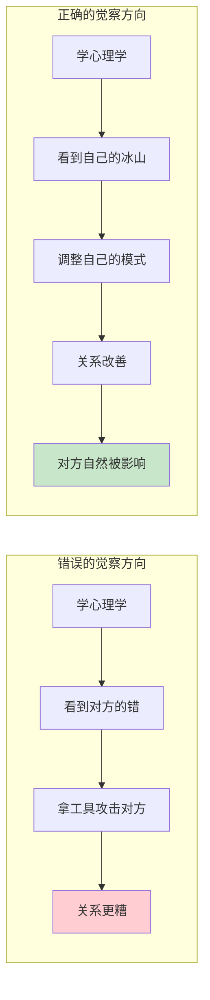

# 第12课：如何画你的冰山（下）

上一课 [[0011-hua-bing-shan-shang|第11课：如何画你的冰山（上）]] 我们深入拆解了期待的三部分和复合等同。这一课我们来谈两个至关重要的问题——**觉察的方向**，以及**安全感和父母角色**的关系。

## 觉察的方向：对准自己

> [!CAUTION] 重要提醒
> **学习心理学，觉察的方向永远对准自己，不是对准别人。**

这是学习冰山模型最重要的一条原则。然而很多人学心理学，第一件事就是把学到的概念变成武器去攻击别人。

### 反面案例：学员的"超理智"老公

一位学员分享：她觉察到老公是"超理智型"的人，老公给她带来了压力，比如孩子吃饭不吃菜是"因为我做饭不好吃"、孩子成绩不好是"因为我没管好"。

老师听完以后严厉地指出了问题：

> **觉察是分两个部分的：一个是对外，一个是对内。**
>
> 你觉察之后，首先敏锐地觉察到的是别人的错。但学习心理学，最重要的是——对外觉察的时候，首先要觉察对方做得**好的部分**。他做错的部分，你现在没有资格去评判（除非你将来走上助人的道路）。
>
> 你现在最大的觉察范围是**对内、对自己**——我有哪些需要改正的？我有哪些方式需要调整？

很多人学完一节课就开始像探照灯一样照别人：

- ❌ "你不能喝那么多可乐"（老师说的）
- ❌ "你就是不懂得爱和被爱"（老师说的）
- ❌ "因为你超理智，所以我们现在关系不好"（老师说的）

> **应用心理学工具如果成了攻击对方的武器，那学再多也只会让关系更糟。**

如果学完心理学，你发现的第一件事是"我老公超理智"——方向就错了。请调整方向，先问自己：**我的冰山是什么样的？我的坑在哪里？**

### 关于"你先来"的文化

很多中国人有一个有趣的现象：

- "一起坠入爱河吧——不过你先来"
- "一起创造美好的未来吧——不过你先来"
- "一起改变吧——不过你先来"

总是要对方先来。但改变必须从自己开始。

## 安全感的来源：妈妈的角色

安全感（[[0009-wu-da-tian-xing|五大天性]] 之一）的获取，**妈妈的角色至关重要**。

### 安全感的两个关键

> **安全感 = 妈妈情绪平和 + 父母关系稳定**

1. **妈妈情绪平和**：妈妈的情绪稳定，是孩子安全感的基础
2. **父母关系稳定**：即使爸爸在外地，只要父母关系和谐稳定，孩子也能有安全感

如果孩子胆子特别小（比如不敢和陌生人交流、不敢和妈妈分开），往往与安全感不足有关。在这个层面上，母亲的能量需要占上风。

## 力量感的来源：爸爸的角色

如果说**安全感靠妈妈**，那么**力量感靠爸爸**。

### 爸爸如何给力量感

孩子通过与爸爸的互动，学习如何应对这个世界。具体来说，孩子会**模仿爸爸**：

| 场景 | 孩子从爸爸身上学到 |
|------|------------------|
| 爸爸如何接人待物 | 人际交往的方式 |
| 爸爸如何面对冲突 | 冲突处理的模式 |
| 爸爸如何面对负面情绪 | 情绪管理的方式 |
| 爸爸如何与陌生人建立联系 | 关系建立的能力 |
| 爸爸如何解决问题 | 面对挑战的勇气 |

> 孩子不是通过爸爸"说什么"来学习的，而是通过**模仿爸爸怎么做**来学习的。

### 如果爸爸缺位怎么办？

如果因为工作或其他原因爸爸很少在家，孩子仍然可以通过以下方式获得力量感：

- 妈妈成为模范（孩子模仿妈妈的应对方式）
- 给孩子做心理营养（参见 [[0013-xin-li-ying-yang-shang|第13课：心理营养（上）]]）
- 寻找其他健康的男性榜样（长辈、老师等）

## 心理学思维 vs 一两句话的方法

在教学过程中，老师经常遇到这样的问题：

> 学员问："老师，我孩子有一个这样的行为，你告诉我一句话我要怎么做。"

老师不回答这样的问题。为什么？

因为**老师让你画冰山，就是为了让你跳到水面以下去感受孩子的感受、看到孩子的想法、理解孩子的期待和渴望。** 如果你只想要"一句话的方法"，那下一句话你就不知道该怎么说了。

> [!TIP] Key Insight
> 学心理学，学的不是"一两句话的方法"，而是**心理学思维**。
>
> 方法如同给一条鱼：
> - 给你一条鱼，你今天吃饱了，明天又饿了
> - 教你钓鱼，你一辈子都能自己找到食物
>
> 心理学思维是"钓鱼的能力"——深层次理解**为什么会发生**，而不是只在表面上找技巧。

举例来说：

| 层次 | 做法 |
|------|------|
| 方法层面 | "孩子哭的时候，你就说——妈妈理解你" |
| 思维层面 | "孩子哭是因为他此刻需要被看见、被接纳。他的冰山下面发生了什么？他有什么感受、想法、期待？" |

前者用完了就没了。后者可以让你每次面对不同场景时，都能自己找到合适的应对方式。

## 从冰山到一致性沟通

到此为止，模块三"冰山模型与五大天性"的四课内容全部完成。我们走过了：

| 课号 | 内容 | 核心收获 |
|------|------|---------|
| [[0009-wu-da-tian-xing\|第09课]] | 五大天性与冰山概览 | 知道人有哪五种天性，冰山有哪些层次 |
| [[0010-jue-cha-wu-da-tian-xing\|第10课]] | 用冰山觉察自己 | 学会用冰山分析矛盾事件 |
| [[0011-hua-bing-shan-shang\|第11课]] | 期待与角色（上） | 理解期待的三部分、复合等同、三类角色 |
| **第12课** | 觉察方向与父母角色（下） | 觉察对准自己，理解安全感与力量感的来源 |

接下来将进入模块四——**心理营养**。心理营养是滋养五大天性的"养分"，也是冰山模型中"渴望"层次的具体操作方法。

你掌握了冰山模型之后，接下来的学习会更有方向感。下一课 [[0013-xin-li-ying-yang-shang|第13课：心理营养（上）]] 我们将学习心理营养的第一个层面——**无条件接纳**和**重视感**。

## Practice

> [!QUESTION] Self-check
> **练习一：检查你的觉察方向**
>
> 回想一下，你最近在人际关系中，是否用了心理学概念去分析别人的不足？试着把焦点转回自己身上，写一写：
>
> 1. 在这段关系中，**我**的冰山是什么样的？
> 2. **我**的哪朵金花需要去浇灌？
> 3. **我**可以为自己做什么？

> [!QUESTION] Self-check
> **练习二：安全感和力量感**
>
> 回顾你的成长经历：
> 1. 你的安全感来源是什么？妈妈的情绪平和吗？父母关系稳定吗？
> 2. 你的力量感来源是什么？爸爸在你成长中扮演了什么角色？
> 3. 如果现在你是父母，你能为自己的孩子提供什么样的安全感和力量感？

参考思考方向

即使原生家庭没有给你足够的安全感和力量感，作为成年人，你现在可以为自己补充。方法是：
- 安全感：一边怕一边做，情绪管理，经营稳定的人际关系
- 力量感：找到值得学习的模范，主动观察和学习健康的冲突处理方式

详细的补充方法在模块四（心理营养）和模块五（自我滋养）会有深入讲解。

## Next Step

Continue with the next lesson or complete the review task above before moving on.

---

> "你跟自己的关系，最终就是你跟世界的关系。" —— 陈艺新