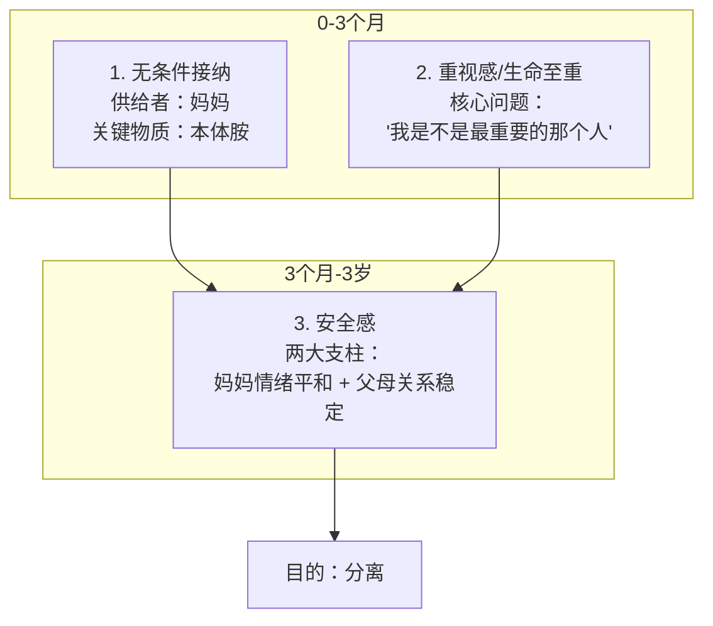
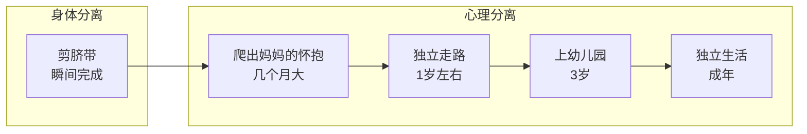

# 第13课：心理营养（上）

## 课前回顾：三次出生

在[[0002-yuan-sheng-jia-ting-liang-chong-mo-shi|第02课]]中我们提到过萨提亚的"三次出生"概念。在进入本课之前，先做一个简要回顾：

> [!NOTE] 三次出生
> | 次数 | 事件 | 意义 |
> |------|------|------|
> | 第一次出生 | 精卵结合 | 生命力被创造 |
> | 第二次出生 | 从子宫来到世界 | 行为模式和应对姿态开始形成 |
> | 第三次出生 | 重新选择做自己 | 觉察、疗愈、为自己负责 |

前两次出生是被动的——我们无法选择父母，也无法选择成长环境。第三次出生则是主动的：当我们意识到自己内心缺少什么，就可以自己给自己补上。**心理营养**就是第三次出生的核心工具。

---

## 什么是心理营养？

身体需要**食物营养**才能长大——蛋白质、维生素、矿物质，缺了任何一样身体都会出问题。心理也是一样的，心理需要**心理营养**才能成熟——接纳、重视、安全、欣赏、模仿，缺了任何一样，心理就会停留在某个阶段停止成长。

> [!WARNING] 巨婴现象
> 心理营养不足的人，身体已经成年，心理却还是婴儿状态。这就是所谓的"巨婴"——他们无法为自己负责、无法承受挫折、无法独立面对分离。

[[reference/glossary|萨提亚模式术语]]中，心理营养（Psychological Nutrition）指的就是心理层面所需的五种养分。

---

## 五大心理营养（前三）

### 1. 无条件接纳（0-3个月）

婴儿刚出生时，什么都不会做——不会说话、不会走路、甚至连翻身都不会。他唯一能做的就是"存在"。在这个阶段，婴儿需要的是**无条件的接纳**：不是因为表现好而被爱，而是仅仅因为存在而被爱。

**本体胺**：妈妈在产后会分泌一种叫做本体胺的荷尔蒙。它让妈妈处于一种"幸福激素"的状态——即使婴儿半夜哭闹、怎么哄都不睡，妈妈依然觉得"我的宝宝真可爱"。这种状态让婴儿感受到："无论我做什么，我都是被接纳的。"

> [!TIP] Key Insight
> 无条件接纳的本质是**存在即被爱**，不是因为表现好、乖、漂亮而被爱。

### 2. 重视感 / 生命至重（0-3个月）

在同一时期（0-3个月），婴儿还需要确认一个问题：

> **"在你的生命中，我是不是最重要的那个人？"**

婴儿通过五个感官来感知自己是否被重视：

| 感官 | 表现 |
|------|------|
| 视觉 | 妈妈是否用充满爱的眼神看着自己 |
| 听觉 | 妈妈的声音是否柔和、带着爱意 |
| 嗅觉 | 妈妈身上的气味是否让自己感到安全 |
| 味觉 | 哺乳时是否能感受到温暖和满足 |
| 触觉 | 被抱的时候是否轻柔、有温度 |

如果在这个阶段，婴儿感觉自己"不是最重要的"（比如妈妈总是心不在焉、忙着做别的），他就会在长大后不断通过各种方式确认自己的重要性：频繁问"你爱不爱我"、需要对方秒回信息、在关系里要当"唯一"。

### 3. 安全感（3个月-3岁）

过了前三个月，婴儿开始逐渐意识到：**我和妈妈不是同一个人**。这是一个令人恐惧的发现——原来我是独立的，原来妈妈会离开。

安全感的建立需要两大支柱：

> [!IMPORTANT] 安全感的两个关键
> 1. **妈妈情绪平和**：妈妈的情绪稳定，孩子就知道"世界是安全的"
> 2. **父母关系稳定**：父母之间的关系和睦，孩子就敢去探索外部世界

当这两大支柱稳固时，孩子会慢慢建立起足够的安全感，然后——**走向分离**。

#### 安全感的目的是分离

身体的分离在出生那一刻已经完成（剪脐带），但**心理的分离是一个漫长的过程**。

心理分离之所以漫长，是因为它需要足够的安全感做支撑。一个孩子只有在确信"妈妈会回来"的时候，才敢让妈妈离开自己的视线。

#### 安全感不足的表现

当安全感不足时，分离就会变得异常困难：

- **幼儿园撕心裂肺**：每天早上上学都是一场生离死别
- **分手困难**：即使知道这段关系已经不合适，也无法放手
- **要求共生**：在亲密关系中要求"你中有我、我中有你"，不允许对方有自己的空间
- **控制欲强**：通过控制来缓解"对方可能会离开"的焦虑

> [!WARNING] 共生 vs 亲密
> 共生是"没有你我就活不下去"，而健康的亲密关系是"有你更好，没有你我也可以"。两者的区别就在于安全感是否充足。

---

## 课堂练习：觉察自己的安全感

回想你最近一次感到"害怕失去"的场景——不论是对人还是对事：

1. 当时发生了什么？
2. 你的身体有什么反应？（哪里紧张？哪里不舒服？）
3. 你脑海里冒出了什么想法？
4. 这个想法背后，你在害怕什么？

> [!QUESTION] Self-check
> 请对照上面四个问题写下一段觉察日记。如果没有想到具体场景，可以思考：你在关系中是否经常需要对方反复确认"你爱我"？
>
> 

> 
参考方向

>
> 如果你发现自己经常需要反复确认，不必自责——这说明你的安全感在小时候没有得到充分满足。这不是你的错，但你现在可以为自己做点什么。下一课我们会讲如何给自己补安全感。
> 

---

## 本课小结

| 心理营养 | 关键期 | 核心需求 | 供给者 |
|----------|--------|---------|--------|
| 无条件接纳 | 0-3个月 | 存在即被爱 | 妈妈（本体胺） |
| 重视感 | 0-3个月 | 我是最重要的 | 妈妈 |
| 安全感 | 3个月-3岁 | 世界是安全的 | 妈妈情绪平和 + 父母关系稳定 |

三个心理营养的核心逻辑链条：

- 被无条件接纳 → 我知道"存在"本身就是有价值的
- 被重视 → 我知道自己很重要
- 有安全感 → 我敢独立、敢分离、敢探索世界

下一课我们将继续学习五大心理营养的最后两个：**被欣赏被肯定**和**模范**，并探讨"心理营养不够怎么办"这一关键问题。

---

## Next Step

Continue with [[0014-xin-li-ying-yang-xia|第14课：心理营养（下）]] to learn about the remaining two psychological nutrients and how to break out of the "asking" pattern.