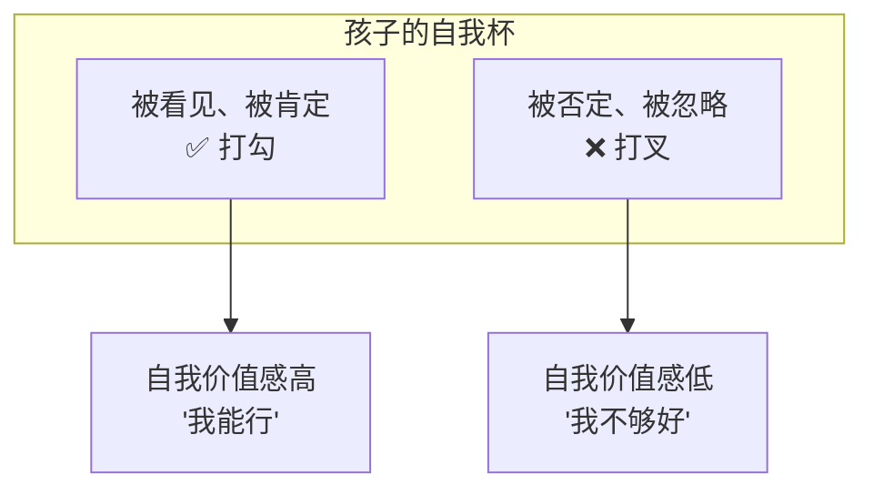
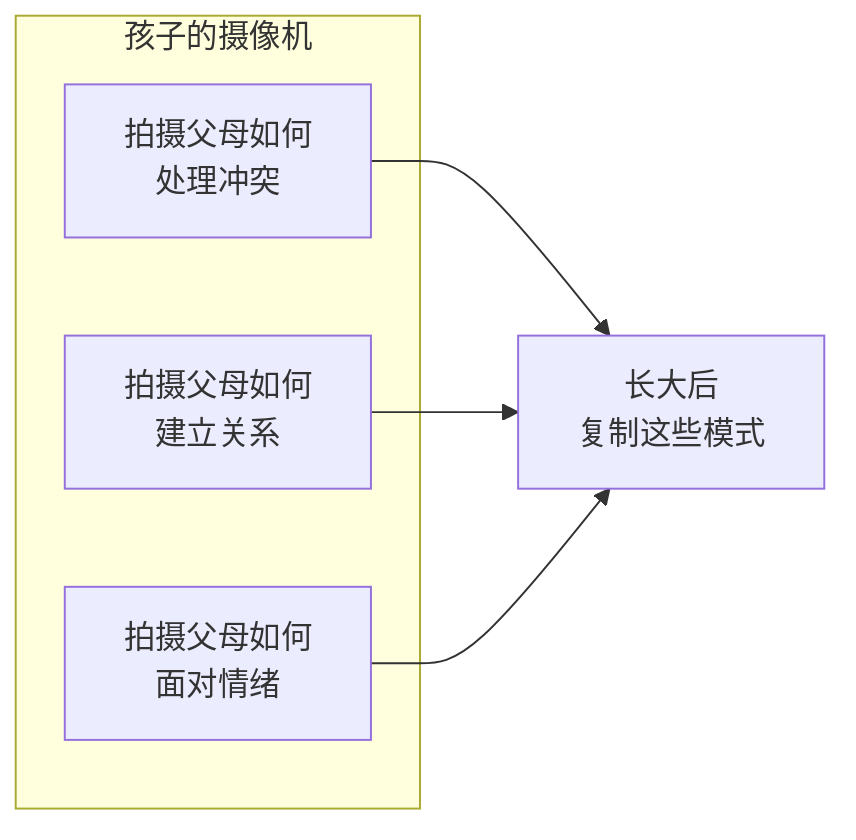
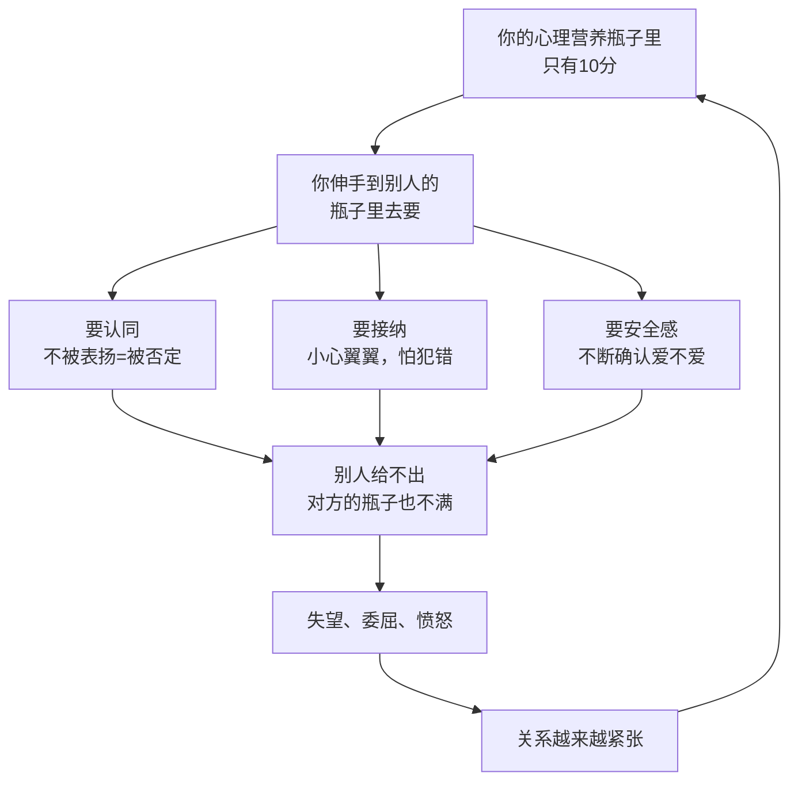

# 第14课：心理营养（下）

## Learning Objectives
- 理解被欣赏与被肯定在4-6岁关键期的意义及其与父亲角色的关系
- 掌握模范（6-12岁）阶段孩子如何通过模仿学习处理冲突、关系和情绪
- 识别心理营养"去要"模式的成因和亲密关系中的恶性循环
- 理解"心理营养首先要自己给自己"这一核心理念

## 课前回顾：三大心理营养

在[[0013-xin-li-ying-yang-shang|第13课]]中，我们学习了五大心理营养的前三个：

1. **无条件接纳**（0-3个月）——存在即被爱
2. **重视感/生命至重**（0-3个月）——我是最重要的那个人
3. **安全感**（3个月-3岁）——世界是安全的，我敢独立

今天我们学习剩下的两个，也是最容易被忽视的两个。

---

## 4. 被欣赏和被肯定（4-6岁）

### 父亲角色登场

在0-3岁阶段，妈妈占据了心理营养供给的核心位置。但到了4-6岁，**父亲的角色变得至关重要**。

为什么是父亲？萨提亚理论认为：

> 妈妈的爱在某种程度上是**天然的**——因为怀胎十月、哺乳喂养，妈妈和孩子的连接几乎是本能的。但父亲的爱是需要**争取**的，它带有一种"被认可"的意味。

当一个4-6岁的孩子从父亲那里得到欣赏和肯定时，他获得的信号是：

> **"我是够好的，我是有价值的。"**

### 孩子的"自我杯"

孩子的内心有一个"自我杯"——每一次被欣赏和肯定，就是往杯子里打一个勾（"我值得被爱"）；每一次被否定和忽略，就是打一个叉（"我不够好"）。

4-6岁这个阶段，孩子开始有了"我要做给别人看"的意识。他会主动展示自己的作品："妈妈你看我画的！""爸爸你看我搭的积木！"——他需要的不是评价（"画得真好"或"这里画歪了"），而是**看见和欣赏**。

> [!TIP] Key Insight
> 欣赏和评价的区别：
> - **评价**："你画得真好"（带有好坏标准）
> - **欣赏**："我看到你用了蓝色和红色，这朵花很特别"（不带评判地看见）

### 父亲缺位的后果

如果在这个阶段父亲长期缺位（不管是物理上的还是情感上的），孩子的"自我杯"就会一直空着。长大后，他会：

- 极度渴望领导的认可
- 无法接受批评（任何否定都会被放大为"我不够好"）
- 在关系中不断寻求对方的肯定

---

## 5. 模范（6-12岁）

### 孩子是一台摄像机

6-12岁的孩子进入了一个被称为"模范期"的阶段。这个阶段的孩子就像一台**高精度摄像机**，24小时不间断地拍摄着生活中重要的人——主要是父母。

他在拍摄什么呢？

> 他在拍摄重要的人**如何**做三件事：
> 1. **如何处理冲突**——吵架了是和好还是冷战？
> 2. **如何建立关系**——怎么交朋友、怎么维护关系？
> 3. **如何面对情绪**——生气了是表达还是压抑？难过了是哭还是忍着？

> [!WARNING] 说教没用
> 你告诉孩子"你要学会控制情绪"，但你自己动不动就摔东西——孩子的摄像机拍到了你摔东西的画面，你说的那句话就是无效的。
>
> **孩子的摄像机从来不听你说什么，它只看你做什么。**

### "模范"的力量

如果你希望孩子学会：
- **情绪管理**：你先做到生气了不吼不摔
- **关系经营**：你让他看到你是如何关心伴侣和朋友
- **应对挫折**：你让他看到你遇到困难时是如何调整和面对的

这就是模范——不是教，而是**做给他看**。

---

## 「去要」模式：心理营养不足的恶性循环

以上五种心理营养，如果一个人在成长过程中没有充分获得，会发生什么？

这个循环叫做**"去要"模式**——你不是在经营关系，而是在**向关系索取心理营养**。

### 亲密关系中的痛苦

亲密关系中的很多痛苦，本质上就是两个"10分的人"在相互索取：

| 现象 | 本质 |
|------|------|
| "你为什么不能多关心我一点？" | 我在向你要重视感 |
| "你是不是觉得我不好？" | 我在向你要接纳 |
| "你爱我吗？你到底爱不爱我？" | 我在向你要安全感 |
| "你觉得我这件事做得怎么样？" | 我在向你要肯定 |

两个人的瓶子里都只有10分，都在伸手向对方要。结果就是：**两个人都得不到，两个人都很痛苦。**

> [!TIP] Key Insight
> 亲密关系的真相是：**别人给不了你没有的东西。** 如果你内心没有安全感，对方说你一百遍"我爱你"也不会让你安心。如果你不接纳自己，对方说一万遍"你很好"也填补不了那个洞。

---

## 出路：心理营养首先要自己给自己

这就回到了萨提亚"[[0002-yuan-sheng-jia-ting-liang-chong-mo-shi|第三次出生]]"的意义：

> **第三次出生，就是自己为自己负责。**

你不再是那个被动等待被喂养的婴儿。你已经长大了，可以自己给自己补充心理营养。

| 营养 | 自己给的方法 |
|------|-------------|
| 无条件接纳自己 | EFT情绪敲击、自由书写、画[[0011-hua-bing-shan-shang|冰山]] |
| 给自己重视感 | 花时间陪伴自己、为自己花钱、把焦点放回自己身上 |
| 给自己安全感 | 一边怕一边做、情绪管理、经营健康的人际关系 |
| 肯定赞美自己 | 每天从事实中找到三个欣赏自己的点 |
| 做自己的模范 | 觉察并选择自己想要的生活方式 |

> [!IMPORTANT] 核心转变
> 从"你为什么不给我"到"我可以给自己"——这是从受害者到责任者的转变，也是第三次出生真正发生的时刻。

---

## 课堂练习：觉察你的"去要"模式

> [!QUESTION] Self-check
> 回想最近一次你因为某人的一句话或一个行为而感到受伤的时刻，问自己：
> 1. 我当时的感受是什么？（失落、委屈、愤怒、被否定？）
> 2. 这个感受背后，我在向对方"要"什么心理营养？
> 3. 如果对方给不了，我可以怎么给自己？
>
> 

> 
参考示例

>
> **场景**：老公下班回来没有和我说话直接去书房了。
> **感受**：失落，委屈。
> **我要什么**：我要重视感——"你是不是不重视我了？"
> **自己给自己**：我可以花半小时做一件自己喜欢的事，给自己陪伴。
> 

---

## 本课小结

五大心理营养完整版：

| 心理营养 | 关键期 | 核心供给者 |
|----------|--------|-----------|
| 1. 无条件接纳 | 0-3个月 | 妈妈 |
| 2. 重视感 | 0-3个月 | 妈妈 |
| 3. 安全感 | 3个月-3岁 | 妈妈+父母关系 |
| 4. 被欣赏被肯定 | 4-6岁 | 爸爸（关键） |
| 5. 模范 | 6-12岁 | 父母 |

心理营养的核心不是"去向别人要"，而是**先给自己**。每一次你选择不向对方索取而是自己补充，你就在完成你的第三次出生。

下一课开始，我们将逐一深入每一种心理营养的具体操作。

---

## Next Step

Continue with [[0015-wu-tiao-jie-jie-na|第15课：无条件接纳与重视感]] for practical details on the first two nutrients.