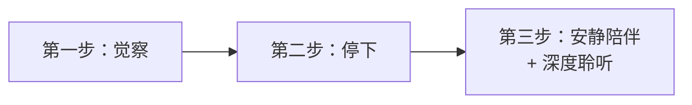
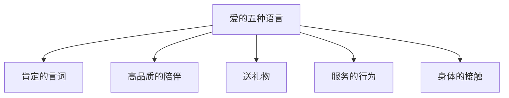

# 第15课：无条件接纳与重视感

## Learning Objectives
- 掌握无条件接纳的四种应用场景
- 学会无条件接纳三步法：觉察→停下→安静陪伴与深度聆听
- 理解"着急安慰是自己的课题"这一边界概念
- 掌握爱的五种语言及其在表达重视感中的应用

## 核心概念回顾

在[[0013-xin-li-ying-yang-shang|第13课]]和[[0014-xin-li-ying-yang-xia|第14课]]中，我们学习了五大心理营养。本课将对前两个——**无条件接纳**和**重视感**——进行深入的操作层面讲解。

---

## 无条件接纳的四种场景

无条件接纳不是一句口号，它需要在真实的生活场景中落地。萨提亚模式指出，最需要被无条件接纳的**恰恰是对方最不可爱的时刻**。

具体来说，有四种场景：

> [!IMPORTANT] 无条件接纳的四种场景
> 1. **做错的时候** — 孩子打碎了碗、伴侣忘记了纪念日
> 2. **失败的时候** — 考试没考好、项目搞砸了
> 3. **有负面情绪的时候** — 发脾气、哭闹、沮丧
> 4. **达不到期待的时候** — 不如别人家孩子、没有按预期发展

### 场景解读

| 场景 | 常见反应（非接纳） | 接纳的回应 |
|------|-------------------|-----------|
| 做错 | "你怎么那么不小心！" | "没关系，人都会犯错" |
| 失败 | "我就知道会这样" | "我看到你已经尽力了" |
| 有负面情绪 | "别哭了，有什么好哭的" | "我看到你很难过，我在这里陪你" |
| 达不到期待 | "你看人家某某" | "你已经很好了，不需要和别人比" |

> [!WARNING] 注意！
> 接纳不等于纵容。接纳行为**背后的人**，不代表允许伤害性行为。如果孩子打人了，你可以说"我看到你很生气，但打人是不可以的"——这就是接纳情绪的同时设定行为界限。

---

## 无条件接纳三步法

知道"要接纳"是一回事，知道"怎么做"是另一回事。以下是具体操作流程：

### 第一步：觉察

当对方（孩子、伴侣、下属）处于上述四种场景时，你先问自己：

> **此刻我最冲动想做什么？**

- 想批评？→ 那是你在表达自己的不满
- 想安慰？→ 那是你在缓解自己的焦虑（见下文）
- 想教他怎么做？→ 那是你在展示自己的能力
- 想否定他的情绪？→ 那是你无法面对他的情绪

**觉察的方向永远是看自己，而不是分析对方。**

### 第二步：停下

觉察到自己冲动的反应后，**停下来**。

- 把准备好的批评咽回去
- 把到嘴边的安慰收回来
- 把伸出去要"改造他"的手缩回来

停下来不是什么都不做，而是**暂停无效行为**。

### 第三步：安静陪伴 + 深度聆听

这是最核心也最难的一步。具体怎么做？

**安静陪伴**：
- 不说话，不评价，不指导
- 只是坐在那里，传递"我在这里陪着你"的安全感
- 可以拉着手、拍拍肩膀，但不用语言干预

**深度聆听**：
- 听他的话，也听他的话背后的情绪
- 听到他的感受，而不是急着判断对错
- 反馈你听到的："听起来这件事情让你很生气"

> [!TIP] Key Insight
> 深度聆听的要点是：**听情绪，不听情节**。不需要了解事情的全部来龙去脉，只需要听出对方此刻的感受。

---

## 为什么我们总想"赶紧安慰"？

一个非常重要的觉察：

> **你着急去安慰，往往是因为你自己无法面对无能为力的感觉。**

看到孩子哭，你心里不舒服——你想让他赶快停下来，因为"他在哭"这件事让你感到焦虑、无助、甚至挫败。你着急安慰，实际上是在**缓解你自己的不适**。

| 对方的情绪 | 你的内心反应 | 行为的真相 |
|-----------|-------------|-----------|
| 孩子哭闹 | "我受不了他哭" | 我在安抚**自己**的不安 |
| 伴侣低落 | "我想让他开心起来" | 我无法承受**他**的负面情绪 |
| 下属犯错 | "我得赶紧教他" | 我受不了**事情失控**的感觉 |

> [!IMPORTANT] 这是你的课题，不是他的
> 当你因为对方的负面情绪而感到不安时，这个不安**是你的课题**，不是他的。你需要的是学会和自己的无力感相处，而不是让他停止表达情绪。

[[0016-gai-shan-fu-mu-ling-dao-guan-xi|第16课]]中我们会进一步探讨"课题分离"。

---

## 重视感：爱的五种语言

重视感（生命至重）的核心问题是：

> **在你生命中，我是不是最重要的那个人？**

如何让对方感受到"你很重要"？心理学家Gary Chapman提出了**爱的五种语言**——每个人都有自己偏爱的一种或几种表达方式。

### 五种语言详解

| 语言 | 含义 | 示例 |
|------|------|------|
| **肯定的言词** | 用语言表达欣赏和肯定 | "你今天处理那件事的方式真棒" |
| **高品质的陪伴** | 全神贯注的个别时间 | 关掉手机，专注地陪孩子玩20分钟 |
| **送礼物** | 用礼物传递"我在想着你" | 出差带回来的小纪念品、路边捡到的漂亮石头 |
| **服务的行为** | 为对方做事表达关心 | 做饭、洗衣服、帮忙修理东西 |
| **身体的接触** | 用肢体语言传递安全感和爱 | 拥抱、拉手、摸头、拍拍肩膀 |

### 如何找到对方的"主要语言"？

观察以下几点：

1. **他经常抱怨什么？** — 如果他总说"你都不陪我"，主要语言可能是高品质陪伴
2. **他经常怎么向你表达爱？** — 人往往用自己喜欢的方式去爱别人
3. **他最常在什么方面感到受伤？** — 受伤的地方就是他的主要语言

> [!TIP] Key Insight
> 用对方需要的语言去爱，而不是用你习惯的方式。你的"拼命做事"在对方看来可能远不如"放下手机陪我一小时"。

---

## 课堂练习：识别你的五种语言

> [!QUESTION] Self-check
> 请按照以下三个步骤完成练习：
>
> **第一步**：给五种爱语排序（从1到5，1是最能让你感受到爱的）
> - 肯定的言词（  ）
> - 高品质的陪伴（  ）
> - 送礼物（  ）
> - 服务的行为（  ）
> - 身体的接触（  ）
>
> **第二步**：回想一下，你最近对伴侣/孩子表达爱时，用的是哪种方式？对比你的排序，你给的是对方想要的，还是你自己习惯的？
>
> **第三步**：这周尝试**用对方的语言**做一件小事，记录下对方的反应。
>
> 

> 
参考分享

>
> 常见情况：一个人主要的爱语是"高品质陪伴"，但他表达爱的方式却是"拼命赚钱送礼"。结果他觉得自己付出了很多，伴侣却觉得"你根本不爱我"。这就是因为给的和要的不匹配。
> 

---

## 本课小结

| 核心要点 | 行动指南 |
|----------|---------|
| 无条件接纳四场景 | 做错、失败、负面情绪、达不到期待 |
| 接纳三步法 | 觉察→停下→安静陪伴+深度聆听 |
| 着急安慰是自己的课题 | 忍住在对方情绪中"出手"的冲动 |
| 爱的五种语言 | 肯定言词、陪伴、礼物、服务、身体接触 |

正如我们在[[reference/psychological-nutrition|心理营养速查]]中看到的，无条件接纳和重视感是心理营养的根基，它们的好坏直接影响后续安全感、认可感、模范的建立。

---

## Next Step

Continue with [[0016-gai-shan-fu-mu-ling-dao-guan-xi|第16课：改善与父母、领导的关系]] to learn how to apply unconditional acceptance in authority relationships.