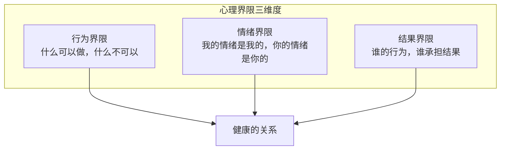
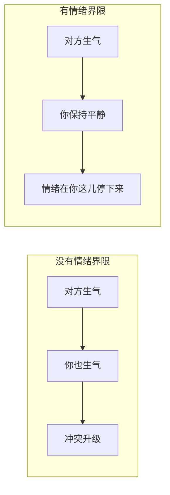
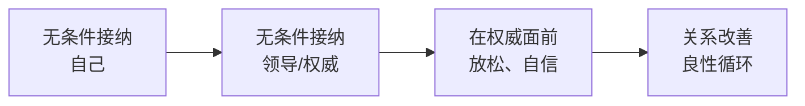

# 第16课：改善与父母、领导的关系

## Learning Objectives
- 区分拯救者与责任者的角色，理解"允许别人为自己负责"
- 掌握心理界限的三个维度：行为、情绪、结果
- 理解害怕权威的根源与父亲的关系
- 学会在不完美背后寻找正面意义
- 理解"无条件接纳领导的前提是先无条件接纳自己"

## 从拯救者到责任者

在生活中，很多人都陷在"拯救者"的角色里：

| 场景 | 拯救者心态 | 责任者心态 |
|------|-----------|-----------|
| 父母吵架 | "我得撮合他们和好" | "他们的关系是他们自己的功课" |
| 父母不开心 | "我要让爸妈开心起来" | "我可以关心他们，但他们的情绪他们负责" |
| 领导焦虑 | "我得加班把事情都做好" | "我有能力做好分内事，超过的部分不是我的责任" |

### 拯救者的三个特征

1. **过度负责** — 觉得自己有义务管别人的情绪和生活
2. **无法放手** — 害怕别人"没有我"会过得不好
3. **委屈累积** — 一边付出一边抱怨，内心充满"凭什么"

### 责任者的三个特征

1. **为自己负责** — 我管好自己的情绪和行为
2. **允许别人为自己负责** — 不再替别人承担他们的人生课题
3. **有界限地付出** — 我可以帮你，但不会替你去活

> [!TIP] Key Insight
> 从拯救者到责任者的转变，核心在于区分：**哪些是我的课题，哪些是别人的课题？**

---

## 心理界限：三个维度

心理界限是健康的亲密关系的基石。没有界限的爱会变成控制，而没有爱的界限会变成冷漠。

心理界限包含三个维度：

### 1. 行为界限

明确告诉对方哪些行为你可以接受，哪些不可以。

| 缺少行为界限的表现 | 建立行为界限的表述 |
|-------------------|-------------------|
| 不想接电话但每次都接 | "我今天很累，明天再聊可以吗？" |
| 被安排超出能力的工作不敢拒绝 | "这件事我可能需要更多支持才能完成" |
| 父母干涉自己教育孩子的方式 | "谢谢你的建议，但我有自己的教育方式" |

### 2. 情绪界限

> **你的情绪是你的，我的情绪是我的。**

这不是冷漠，而是尊重。当一个人有清晰的情绪界限时，他可以在对方情绪爆发时保持平静，不会被卷入对方的情绪漩涡。

### 3. 结果界限

谁的行为，谁承担结果。不替他承担他本应承担的后果：

- 孩子忘带作业 → 让他自己去面对老师的批评
- 同事拖延 → 不替他收拾残局
- 父母情绪不好 → 不把自己搭进去做情绪垃圾桶

> [!WARNING] 建立界限会引发反弹
> 当你第一次建立界限时，身边人可能会不舒服——他们会觉得"你变了"。但这种"不舒服"恰恰说明旧的模式正在被打破。坚持下去，新的健康模式会建立。

---

## 害怕权威：与父亲的关系

很多人发现自己在职场中害怕领导、不敢表达、唯唯诺诺。这个模式往往可以追溯到**与父亲的关系**。

### 为什么是父亲？

在[[0014-xin-li-ying-yang-xia|第14课]]中我们提到，4-6岁是"被欣赏被肯定"的关键期，而**父亲是这个阶段的核心供给者**。

- 如果父亲在这个阶段是严厉的、挑剔的、很少给肯定
- 或者父亲是缺席的（情感上或物理上）
- 那么孩子会形成一种信念：**"权威就等于评判，我需要被权威认可才能证明自己有价值"**

成年后，这个信念被投射到领导、老师、长辈等权威角色上：

| 童年经历 | 影响 | 职场表现 |
|---------|------|---------|
| 父亲严苛 | 形成了"权威=挑剔"的认知 | 害怕被领导审视 |
| 父亲缺席 | 形成了"我需要表现好才能被认可" | 过度讨好领导 |
| 父亲情绪不稳定 | 形成了"权威很危险"的认知 | 在权威面前不知所措 |

> [!NOTE] 觉察练习
> 下次你面对领导感到紧张时，问自己：**"我面前的是我的领导，还是我内心的父亲？"**

---

## 萨提亚核心理念：在不完美背后寻找正面意义

这一理念是改善与父母、领导关系的核心心态转变。

### 正面意义的重构

| 看似不完美的行为 | 背后的正面意义 |
|-----------------|---------------|
| 控制欲强的家长 | 他们在用他们唯一知道的方式保护你 |
| 从不会夸奖的父母 | 他们不夸奖是因为他们自己也没被夸奖过，不知道如何表达 |
| 总是挑剔的领导 | 他对你有高要求，是因为他把你放在"重要"的位置上 |
| 很难沟通的同事 | 他可能是用对立的方式在保护自己的安全感 |

### 这不是为对方开脱

> [!IMPORTANT] 重要提醒
> 寻找正面意义不是为对方的行为找借口，也不是说"他们那样做是对的"。它只是帮你从"受害者"的视角中走出来，让你看到：**每个人都活在自己的局限里，做出了自己认为最好的选择。**

当我们能够看到"不完美背后的正面意义"，我们就不再需要对方先改变才能放过自己。

---

## 无条件接纳领导，先无条件接纳自己

这是整堂课最关键的一句话：

> **你无法给出你没有的东西。**

如果你无法接纳自己，你就不可能真正接纳挑剔的同事或领导——你的"接纳"会变成忍让，忍到某一天爆发。

### 实操路径

1. **先接纳自己的不完美** — 接纳自己会犯错、会失败、会有情绪
2. **再看到领导的不完美** — 他也是个普通人，也有缺失的心理营养
3. **分清课题** — 他的情绪他的课题，我的情绪我的课题
4. **有界限地共事** — 在工作中合作，在生活中保持独立的价值感

[[0015-wu-tiao-jie-jie-na|第15课]]中我们学的无条件接纳三步法——觉察、停下、安静陪伴——同样适用于职场：

| 职场场景 | 觉察 | 停下 | 行动 |
|---------|------|------|------|
| 被领导批评 | 觉察到委屈和愤怒 | 停下回怼或自证的冲动 | 深呼吸，听他说完 |
| 同事甩锅 | 觉察到不公平感 | 停下直接发火 | 说"这件事我需要核实一下" |
| 领导情绪化 | 觉察到恐惧 | 停下讨好模式 | 保持平静，不卷入他的情绪 |

---

## 课堂练习：建立第一道界限

> [!QUESTION] Self-check
> 请选一道你目前最需要的界限，写出具体的"界限话术"：
>
> 1. **行为界限**：什么事情是别人不可以对你做的？
> 2. **情绪界限**：当谁在发泄情绪时，你需要提醒自己"这是他的情绪"？
> 3. **结果界限**：在什么事情上你一直在替别人承担后果？
>
> 示例参考：
> - "妈妈，我理解你担心我，但我会自己决定我的婚姻"
> - "领导，这个时间节点我做不到，我需要调整到下周"
> - "孩子，作业是你自己的事情，我不会再催你了"
>
> 

> 
练习提示

>
> 建立界限不需要态度强硬。温和而坚定才是最好的状态：
> - 温和：让对方感觉到你的尊重
> - 坚定：让对方知道你的底线在哪里
>
> 如果觉得困难，可以先在**小事**上练习——比如拒绝一个不想参加的聚餐、告诉对方"我现在不方便说话"。
> 

---

## 本课小结

| 核心转变 | 内容 |
|----------|------|
| 拯救者 → 责任者 | 允许别人为自己负责 |
| 心理界限 | 行为界限、情绪界限、结果界限 |
| 害怕权威 | 核心是与父亲的关系投射 |
| 正面意义 | 在不完美背后看到对方的局限和善意 |
| 接纳的起点 | 先接纳自己，才能接纳别人 |

改善与父母和领导的关系，说到底是一个**内在功课**——不需要等待对方改变，你从自己开始，关系的转机就会出现。

下一课，我们将把这些原则应用到与孩子的关系中。

---

## Next Step

Continue with [[0017-gai-shan-hai-zi-guan-xi|第17课：改善与孩子的关系]] to learn how to apply unconditional acceptance in parent-child relationships.