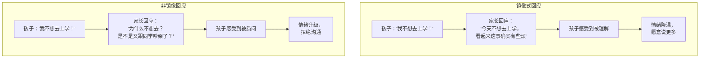
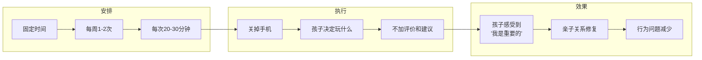
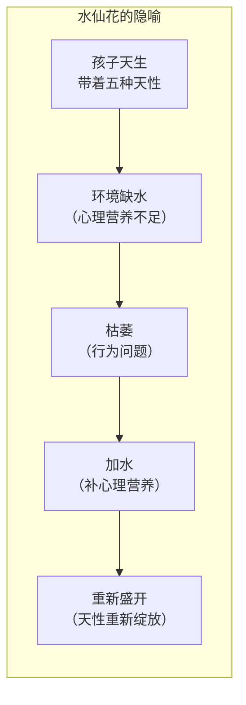

# 第17课：改善与孩子的关系

## Learning Objectives
- 理解"顾念"的含义及其在亲子关系中的应用
- 掌握镜像式回应的操作方法
- 学会为孩子安排个别时间/高品质陪伴
- 通过水仙花隐喻理解孩子天然的生命力

## 顾念：为了你，我愿意给

改善亲子关系的第一步，不是学话术，而是调整心态。这个心态叫做**顾念**。

### 什么是顾念？

顾念不是"我喜欢什么就给什么"，而是**"为了你，我愿意给"**。

| 类型 | 内核 | 表现 |
|------|------|------|
| 溺爱 | 我无法承受你的不开心，所以满足你 | 为了让自己舒服 |
| 交换 | 我对你好，你要回报我 | 有条件地给 |
| 控制 | 我对你这么好，所以你得听我的 | 以爱之名的束缚 |
| **顾念** | **我看到了你的需要，我愿意满足你** | **纯粹为对方** |

### 顾念的两种状态

吃水果的例子可以帮助理解：

- **我喜欢吃榴莲，我给你榴莲** — 这是"我喜欢的"，不是顾念
- **你喜欢吃葡萄，我给你买了葡萄回来** — 这是顾念，因为我记住了你喜欢什么

> [!TIP] Key Insight
> 顾念的核心是**从对方的视角出发**。不是"我认为你需要什么"，而是"我看到了你需要什么"。

### 顾念在亲子关系中的应用

| 场景 | 非顾念 | 顾念 |
|------|-------|------|
| 孩子不想练琴 | "我都花了那么多钱，你必须练" | "你今天好像不想练，愿意跟我说说吗？" |
| 孩子拆了新买的玩具 | "你怎么这么不爱惜东西" | "你好像很好奇它是怎么装起来的？" |
| 孩子不想写作业 | "快点写，写完才能玩" | "你今天作业有点多，需要我陪你一起做吗？" |

---

## 镜像式回应：无条件接纳的正确做法

在[[0015-wu-tiao-jie-jie-na|第15课]]中，我们学习了无条件接纳的四种场景。那么当孩子处于"不可爱"的状态时，具体该怎么做？

答案是：**镜像式回应**。

### 什么是镜像式回应？

就像镜子一样，不加评判地把对方的状态"照"给他看。

### 镜像式回应的操作要点

> [!IMPORTANT] 镜像式回应的核心逻辑
> **别急着出手。** 看到孩子难受，你的第一反应是"帮帮他"。但很多时候，他不需要你帮他解决问题，他只需要你**看见他的感受**。

**正确做法**：
1. 描述你看到的："你今天好像不太开心"——这只是描述事实
2. 反馈你听到的："听起来老师说的话让你很生气"——这是反馈感受
3. 停在原地，等他继续——不需要追加建议

**错误做法**：
1. 急着安慰："没事没事，别难过了"——这是否定他的感受
2. 急着分析："你是不是上课不认真被批评了？"——这是猜测和评判
3. 急着解决："那我明天去学校和老师谈谈"——这是替他承担问题

> [!TIP] Key Insight
> 镜像式回答的核心要点是：**不带自己的观点，不添加自己的判断，只是把对方的状态照出来。** 当你照出了他的感受，他感受到了被看见，情绪自然就会流动。

### 常见场景对比

| 孩子的话 | 常见回应（不推荐） | 镜像式回应 |
|---------|-------------------|-----------|
| "我不要洗澡！" | "不洗澡臭死了，必须洗" | "你现在不想洗澡，是还在玩得开心吗？" |
| "我不想写作业" | "那怎么行，快写" | "作业看起来让你有点烦" |
| "小明不跟我玩了" | "没事，你还有别的朋友" | "小明不跟你玩，你有点难过对吗？" |
| "我不想去学校" | "不行，哪个学生不上学" | "今天好像有什么让你不太想去学校" |

---

## 个别时间：高品质陪伴的实操

### 为什么需要个别时间？

在多子女家庭中，父母的时间和精力被分摊到每个孩子身上。**老大往往是最受委屈的那个**——他失去了"独生子女"的特权，却不知道发生了什么。

> [!WARNING] 二胎/三胎家庭的常见陷阱
> 老大被要求"让着弟弟/妹妹"，却没有得到额外的关注来弥补他失去的"独宠"。

### 个别时间的操作方法

**个别时间**（又称高品质陪伴）是爱的五种语言中"高品质陪伴"在亲子关系中的具体应用。

### 个别时间规则表

| 规则 | 说明 |
|------|------|
| **固定时间** | 约定好每周哪天几点，雷打不动 |
| **一对一** | 只带一个孩子，其他孩子不参与 |
| **孩子主导** | 玩什么、怎么玩，完全由孩子决定 |
| **家长配合** | 你只需要投入地参与，不指导、不评判 |
| **关掉电子设备** | 这30分钟里，你和孩子是彼此的唯一 |

> [!NOTE] 为什么是"孩子主导"？
> 日常生活中，孩子几乎所有时间都在听大人的——什么时候吃饭、什么时候睡觉、穿什么衣服。个别时间让孩子做主，是给他"被重视感"的最直接方式。

### 个别时间的适用场景

- **二胎家庭大宝被冷落** — 每周给老大2次个别时间，告诉他"这一小时只属于你"
- **孩子出现行为问题** — 行为问题的背后往往是"你不够关注我"，个别时间可以大幅度减少行为问题
- **亲子关系紧张** — 不需要说教，单纯的陪伴本身就是修复

---

## 水仙花隐喻：枯萎与重新盛开

萨提亚有一个非常美的隐喻:

> **每个孩子都是一株水仙花，天生就带着盛开的基因。枯萎只是因为它缺水了——加水就好，不需要教它怎么开花。**

### 隐喻的现实含义

| 隐喻中的元素 | 现实对应 |
|-------------|---------|
| 水仙花的种子 | 孩子与生俱来的五大天性（爱、连接、价值、自主、安全） |
| 缺水 | 心理营养不足 |
| 枯萎的叶子 | 行为问题、情绪问题 |
| 加水 | 家长心态调整、无条件接纳、陪伴 |
| 重新盛开 | 孩子恢复活力，天性重新绽放 |

> [!IMPORTANT] 核心启示
> 你不需要教水仙花如何开花，你只需要给它水。同样，你不需要教孩子"如何变好"，你只需要给他足够的心理营养——他自己就会朝着健康的方向生长。

---

## 综合练习：为孩子做一次"镜像式回应"

> [!QUESTION] Self-check
> 回想最近一次你和孩子之间不愉快的互动（或者下一次发生时），尝试做以下练习：
>
> **步骤一**：观察——他当时的情绪是什么？（开心？难过？烦躁？害怕？）
>
> **步骤二**：镜像式回应——试着用一句话描述你观察到的状态。
>
> **步骤三**：停下来——不要追加建议，不要急着安慰，只是等他回应。
>
> **步骤四**：如果他说了更多——继续镜像式回应，保持"听情绪不听情节"的姿态。
>
> 

> 
参考案例

>
> **孩子**：（把书包扔在地上）"作业太多了，我不想写！"
> **你**："作业太多让你觉得很烦。"
> **孩子**："对啊，数学太难了，我根本不会！"
> **你**："数学题碰到了困难，感觉挫败是不是？"
> **孩子**：点头，开始哭。哭完之后说："要不然你教我一下？"
>
> 注意：你没有说教、没有批评、没有急着安慰。你只是**看见了他的情绪**。他感受到了被理解，然后自己提出了解决方案。
> 

---

## 本课小结

| 核心概念 | 关键要点 | 实操方法 |
|----------|---------|---------|
| 顾念 | 为了你，我愿意给 | 看见孩子的真实需要，而不是给自己想给的 |
| 镜像式回应 | 别急着出手 | 描述状态→反馈感受→停止→等待 |
| 个别时间 | 高品质陪伴 | 每周1-2次，一对一，孩子主导，家长配合 |
| 水仙花隐喻 | 孩子天生会开花 | 给他心理营养，他就会自己成长 |

改善与孩子的关系，不需要你做"完美的父母"，只需要你做**"足够好的父母"**——一个愿意看见孩子、愿意为孩子调整、愿意给孩子"加水"的父母。

---

## Next Step

Continue with [[0018-gei-zi-ji-xin-li-ying-yang-shang|第18课：给自己做心理营养（上）]] to learn how to nourish yourself.