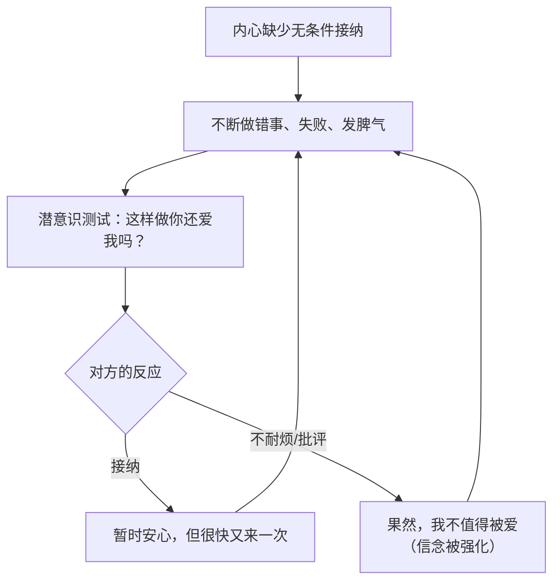

# 第18课：给自己心理营养（上）

## Learning Objectives

- 理解"向别人索取心理营养"的恶性循环机制
- 掌握情绪敲击法（EFT）的操作步骤，能在情绪低落时独立使用
- 了解自由书写法、画冰山法、动态静心法三种工具的应用场景
- 学会在日常生活中给自己做重视感的三个具体方法

## Core Idea

### 心理营养如同植物的阳光空气水

植物需要阳光、空气和水才能生长。心理营养对人的心理成长，就像这些元素之于植物——没有它们，生命就会枯萎。

然而，很多人的心理营养**在童年时没有得到充分满足**。当内在的营养瓶是空的，人就会不自觉地伸出手，向别人去要。

> 心理营养没得到满足的人，会用一生向别人索取。

### 索取无条件接纳的恶性循环

当一个人内心缺少无条件接纳时，他会用一些"迂回"的方式来测试"你还爱我吗"：



这是一个**没有出口的循环**——因为无论对方接不接纳，内心的空洞都不会被真正填满。你就像一个拿着破碗去接水的人，接再多也存不住。

> [!TIP] Key Insight
> 心理营养的核心原则是：**先自己给自己，再求别人给。** 如果自己不给自己，别人给再多都不够。

## 无条件接纳自己的四种工具

### 工具一：情绪敲击法（EFT）

EFT（Emotional Freedom Techniques）是一种结合认知和身体刺激的情绪调节技术。

**操作步骤：**

1. 用三个手指（食指、中指、无名指）找到身体上**不舒服的部位**（比如胸口堵、胃紧绷、喉咙哽咽）
2. 边轻轻敲击，边说："即使我**焦虑/愤怒/害怕……**，我仍然深深地、完全地接纳我自己。"
3. 重复3-5遍，同时观察情绪强度的变化（从10分降到几分）

| 步骤 | 内容 | 要点 |
|------|------|------|
| 定位 | 找到身体不适的具体位置 | 胸口、胃部、喉咙等 |
| 命名 | 明确情绪的名称 | "即使我焦虑""即使我愤怒" |
| 敲击 | 轻敲不适部位 | 力量适中，持续30秒以上 |
| 接纳 | 重复接纳语句 | "我仍然深深地、完全地接纳我自己" |

> **为什么有效？** EFT的原理是：当你在身体层面释放紧张的同时，在认知层面加入接纳的暗示，大脑会逐渐把"情绪刺激"和"安全接纳"连接起来。

### 工具二：自由书写法

准备一个本子和笔，设定一个定时器10分钟，然后：

- 不停笔地写
- 不评判内容好坏
- 不修改错别字
- 写什么都可以，哪怕一开始是"我不知道写什么"

**作用**：把潜意识里的杂念倒出来，你往往会发现写到最后，真正困扰你的东西浮现出来了。

### 工具三：画冰山法

结合 [[reference/iceberg-model.md|冰山模型]]，把当下的情绪事件画出来：

```
行为：__________________（我做了什么）
感受：__________________（情绪是什么）
想法：__________________（我认为什么）
期待：__________________（我想要什么）
渴望：__________________（我需要什么心理营养）
```

画完之后问自己：**这一层的渴望，我能为自己做点什么？**

### 工具四：动态静心/抖动法

观察动物世界：一只羚羊被狮子追捕，逃脱之后，它会**全身抖动**几分钟，然后若无其事地继续吃草。

> 动物不会像人一样，把逃跑的恐惧存留在身体里。

抖动法操作：

1. 站立，双脚与肩同宽
2. 膝盖微曲，全身放松
3. 开始抖动全身——像一只刚从惊吓中释放的动物
4. 持续3-5分钟
5. 自然停下，感受身体的变化

这个方法的原理是：**恐惧和紧张会被锁在身体的筋膜和肌肉中**，通过抖动释放出来。人类是唯一会"存住"恐惧的动物，因为我们用思维反复回放创伤画面。

## 给自己做重视感

重视感是心理营养中的第二种。在婴儿期，它来自妈妈的全心全意关注；在成年后，它需要**自己给自己**。

三个具体方法：

### 1. 花时间给自己

| 类型 | 示例 | 频次建议 |
|------|------|---------|
| 微小时间 | 每天5分钟独处，喝杯茶/咖啡 | 每天 |
| 中等时间 | 每周半天做自己喜欢的事 | 每周 |
| 大段时间 | 每年一次独自旅行 | 每年 |

### 2. 为自己花钱

- 买一束花放在自己的办公桌上
- 买一本想看的书
- 去吃一顿想吃的饭
- 报一个想学的课

> 很多人在为别人花钱时很大方，为自己花钱时却很纠结。这种纠结本身就说明了——你不够重视自己。

### 3. 把焦点放回自己身上

当你发现自己一直在想"他怎么还不回我消息""领导是不是对我不满意"，试着把焦点拉回来：

- 问自己："**我现在需要什么？**"
- 深呼吸三次
- 做一件让自己舒服的事

## Worked Example

**场景**：小王在工作中提交的方案被领导否定了，她感到非常沮丧。

**使用EFT情绪敲击法：**

1. 她感觉到**胸口闷、胃部紧缩**
2. 她用三个手指轻敲胸口，同时说：
   - "即使我感到被否定、很难过，我仍然深深地、完全地接纳我自己。"
   - "即使我觉得自己不够好，我仍然深深地、完全地接纳我自己。"
   - "即使我担心领导对我有看法，我仍然深深地、完全地接纳我自己。"
3. 重复三遍后，她感觉胸口的闷减轻了很多
4. 然后进行**自由书写**10分钟：
   - 写到最后她发现，真正让自己难受的不是方案被否，而是"我害怕自己不够优秀就不被喜欢"
5. 她问自己："这件事是事实还是我的解读？"（关联 [[0020-jie-na-zi-ji|第20课：接纳我自己]]）

## Practice

> [!QUESTION] Self-check
> 回想最近一次让你情绪低落的事情，尝试用下面的表格做一个EFT敲击记录：

| 项目 | 你的回答 |
|------|---------|
| 事件描述 | |
| 身体不适部位 | |
| 情绪名称（焦虑/愤怒/害怕/委屈？） | |
| 敲击前的情绪强度（1-10分） | |
| 敲击后的情绪强度（1-10分） | |
| 自由书写后发现了什么？ | |

<details>
<summary>参考示例</summary>

**事件描述**：和同事因项目分工发生了争执。

**身体不适部位**：太阳穴发紧，肩膀僵硬。

**情绪名称**：愤怒、委屈。

**敲击前的强度**：8分。

**敲击后的强度**：4分。

**自由书写后发现**：我愤怒的真正原因不是事情本身，而是觉得"我的付出没有被看见"——这是渴望被重视的心理营养在敲门。
</details>

## Next Step

这一课我们学习了无条件接纳自己的工具，下一课我们将继续学习 **给自己心理营养（下）** ，聚焦如何给自己安全感、如何做自己的肯定赞美者，以及理解两性在心理营养需求上的关键差异。

继续学习 [[0019-gei-zi-ji-xin-li-ying-yang-xia|第19课：给自己心理营养（下）]]。

---

*每个人心里都住着一个需要被看见的孩子。你不需要等到别人来爱你，你可以先做那个爱自己的人。*