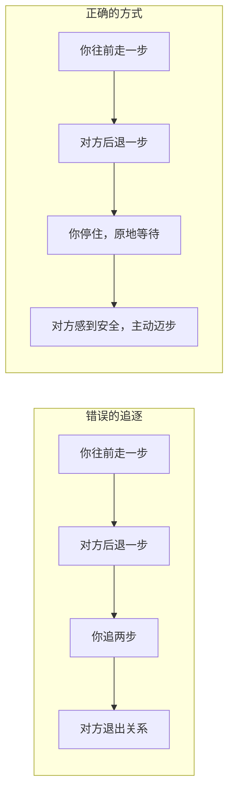
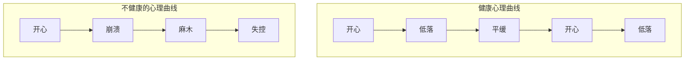
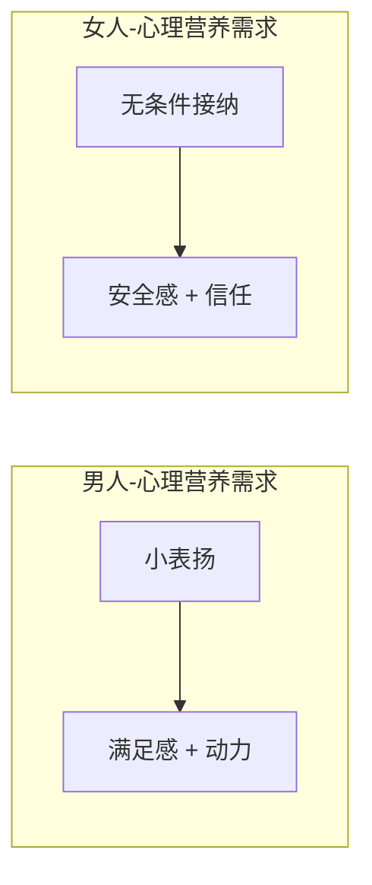

# 第19课：给自己心理营养（下）

## Learning Objectives

- 掌握给自己安全感的三种具体方法
- 理解心理曲线的概念及其健康形态
- 学会每天从事实中找三个欣赏自己的点
- 理解两性在心理营养需求上的核心差异

## Core Idea

### 回顾：安全感的来源

在 [[0014-xin-li-ying-yang-xia|第14课]] 中我们学过，安全感的来源有两个关键：

1. **妈妈的情绪平和**
2. **父母关系稳定**

当这两个条件不满足时，人的内在安全感就会不足。安全感不足的表现：

- 害怕分离——分手困难、无法独自入睡
- 控制欲强——必须掌握一切信息才能安心
- 过度焦虑——对未知充满恐惧
- 要求"共生"——希望和重要的人完全黏在一起

### 安全的距离

> 关系中的安全感，不是越近越好，而是**该近的时候近，该远的时候远**。

想象一个场景：你往前走一步，对方往后退一步。这时候你该怎么办？

大多数人的本能反应是：**再往前追一步**。

但这样做只会让对方退得更远。

> **安全的距离公式**：当对方后退时，停下来。只有你不再追，对方才会主动靠近。

这不仅适用于亲密关系，也适用于一切人际关系——朋友、同事、甚至亲子。

## 给自己安全感的三个方法

### 方法一：一边怕一边做

安全感不是"不怕了再去做"，而是**一边怕一边做**。

| 恐惧类型 | 一边怕一边做的示例 |
|----------|-------------------|
| 社交恐惧 | 手心出汗但还是打了那个电话 |
| 分离恐惧 | 心里很难受但还是让伴侣出差 |
| 选择恐惧 | 不确定对不对但还是做了决定 |

> 勇气不是没有恐惧，而是恐惧还在，但行动已开始。

### 方法二：情绪管理

安全感不足的核心是**对情绪的失控感**。当你觉得自己能被情绪吞没时，整个世界都不安全。

情绪管理的四个步骤：

1. **觉察**：我现在是什么情绪？
2. **命名**：给它一个准确的名字（不只是"不舒服"，而是"焦虑""委屈""愤怒"）
3. **接纳**：允许这个情绪存在，不急着赶走它
4. **调节**：用EFT敲击法（见 [[0018-gei-zi-ji-xin-li-ying-yang-shang|第18课]]）释放身体中的紧张

### 方法三：经营人际关系

安全感不是一个人硬撑出来的。健康的人际关系网络是安全感的缓冲垫。

- 维护2-3个可以深度交谈的朋友
- 定期和家人联系
- 加入一个兴趣社群

> 一根筷子容易断，一捆筷子折不断。关系本身就是安全感。

## 心理曲线

心理健康的人不是"永远快乐"，而是**情绪有规律起伏，但基底稳定**。

健康的心理曲线特征：

- 有起伏：能开心也能难过
- 有基底：即使在低落期，也能保持基本功能（吃饭、睡觉、工作）
- 有弹性：从低谷恢复的时间不会太长

> **关键判断标准**：不是你有没有负面情绪，而是你从负面情绪里**出来**需要多久。

## 肯定赞美认同

### 每天三个欣赏自己的点

从4-6岁开始，孩子需要父亲的欣赏和肯定来建立自我价值。成年后，这份肯定要由**自己给自己**。

做法：每天睡前，从今天的**事实**中找出三个欣赏自己的点。

| ❌ 空洞的肯定 | ✅ 基于事实的肯定 |
|-------------|----------------|
| "我很棒" | "今天在会议上我虽然紧张，但还是把话说完了" |
| "我很好" | "今天同事心情不好，我安静地听了她倾诉十分钟" |
| "我值得被爱" | "今天坚持跑步了15分钟，没有放弃" |

> [!TIP] Key Insight
> 基于事实的肯定才能刺激多巴胺、血清素等快乐激素的分泌。空洞的夸奖反而会让人产生"真的吗"的怀疑。

### 为什么这样有效？

从神经科学角度：

| 快乐激素 | 如何刺激 | 肯定赞美的作用 |
|---------|---------|--------------|
| 多巴胺 | 获得成就/奖励 | 从事实中找到自己的进步 |
| 血清素 | 被认可/有价值 | 确认自己做对了什么 |
| 内啡肽 | 克服困难后的愉悦 | 看到自己坚持的部分 |

## 两性差异

> 在心理营养这件事上，男人和女人的需求有本质的差异。

### 男人需要赞美（容易满足）

男人对心理营养的需求，在"被欣赏肯定"这个层面非常直接：

- 你夸他一句"这件事你处理得真好"，他能开心一整天
- 赞美对他来说，就像给手机充电——充一次能用很久
- **容易满足**：一个小表扬就能让他感到被看见

### 女人需要无条件接纳（难满足）

女人需要的是：**即使我做错了、我搞砸了、我发脾气了，你还爱我。**

- 这不是夸奖能解决的
- 这是一种深层的安全感——"我不需要表现好，你依然接纳我"
- **难满足**：需要持续稳定的陪伴和接纳

> 理解这种差异，不是为了给谁贴标签，而是为了在关系中减少误解。当丈夫做了一件事，给他一句具体的赞美；当妻子情绪不好，给她一个安静的拥抱。

## Worked Example

**场景**：小李最近因为工作压力大很焦虑，晚上睡不好。

**使用三种方法给自己安全感：**

1. **一边怕一边做**：她害怕和领导沟通工作量太大的问题，但还是鼓起勇气预约了一对一谈话。谈之前手心冒汗，但谈完之后发现领导很理解。

2. **情绪管理**：睡前用EFT敲击法（胸口的压迫感），敲了五分钟后情绪从8分降到4分，然后安然入睡。

3. **经营人际关系**：约了闺蜜周末喝咖啡，聊完之后感觉好多了。

**睡前三个欣赏自己的点（基于事实）：**

- "今天虽然害怕，但我还是预约了和领导的谈话"
- "中午吃饭时没有刷手机，看了10页书"
- "晚上对快递员说了谢谢，语气很温和"

## Practice

> [!QUESTION] Self-check
> **练习一：给自己安全感**
> 最近哪件事让你感到不安？尝试用"一边怕一边做"的方式，写下你打算怎么行动：

| 项目 | 你的回答 |
|------|---------|
| 让我不安的事 | |
| 我害怕的是什么 | |
| 我能做的最小一步是什么 | |
| 计划什么时间做 | |

**练习二：三个欣赏自己的点**
今晚睡前，从今天的事实中找出三个欣赏自己的点，写在纸上。

参考示例

**练习一示例：**

让我不安的事：下周要在部门会议上做汇报。

我害怕的是什么：说得不好被同事笑话。

我能做的最小一步是什么：先把PPT框架列出来。

计划什么时间做：今晚8点。

**练习二示例：**

1. 今天早上按时起床了，没有赖床。
2. 午休时同事吐槽工作，我没有跟着抱怨，转了个话题。
3. 下班后给妈妈打了十分钟电话。

## Next Step

这一课我们学习了给自己安全感、肯定赞美自己，以及理解两性差异。下一课我们将更深入一个核心话题——**接纳我自己**，探讨如何区分"事实"和"解读"，以及如何走出全能型自恋的陷阱。

继续学习 [[0020-jie-na-zi-ji|第20课：接纳我自己]]。

---

*别人给的肯定，是甜点；自己给自己的肯定，才是正餐。*