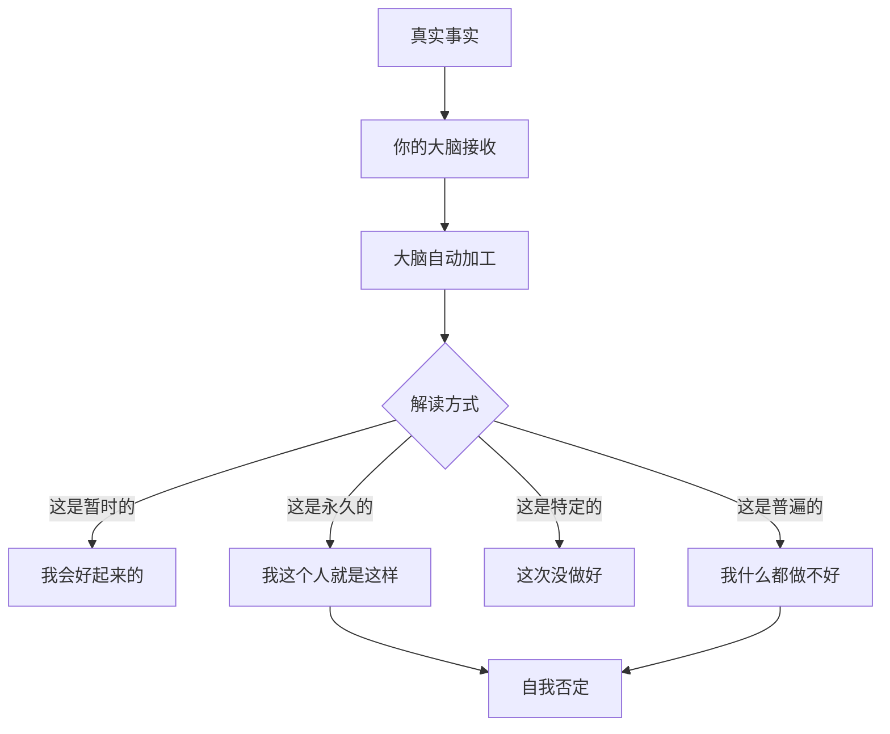
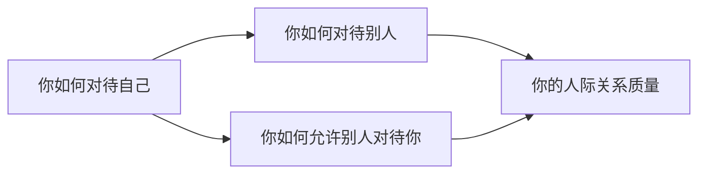

# 第20课：接纳我自己

## Learning Objectives

- 学会区分"事实"和"对自己的解读"
- 理解"永久vs暂时"的认知偏差
- 识别全能型自恋的表现和自己的期待模式
- 掌握情绪接纳的核心方法

## Core Idea

### 这是事实，还是你对自己的解读？

我们对自己说的大多数话，其实不是事实，而是**解读**。



> [!TIP] Key Insight
> 每一次自我否定之前，先问自己：**这是事实，还是我对自己的一种解读？**

**事实 vs 解读对比表：**

| 事件 | 事实（可验证） | 解读（你的故事） |
|------|--------------|----------------|
| 方案被否 | 领导说"这个方案需要修改" | "我能力不行，领导对我不满意" |
| 约会迟到 | 我迟到了15分钟 | "我这个人就是不靠谱" |
| 情绪低落 | 我今天心情不好 | "我有问题，我不应该这样" |

### 永久 vs 暂时

人类大脑有一种**把暂时状态解读为永久特质**的倾向。这是抑郁症的核心认知偏差之一。

| ❌ 暂时（真实情况） | ❌ 永久（你的解读） |
|-------------------|-------------------|
| "我这次没做好" | "我就是个失败者" |
| "我今天没状态" | "我能力不行" |
| "我现在很难过" | "我是一个悲观的人" |
| "这段关系结束了" | "我不值得被爱" |

> **把"状态"当成"特质"，是自我接纳的最大障碍。**

练习：每当你说"我是……"的时候，试着换成"我现在……"或"我这次……"。

- "我是一个粗心的人" --> "我这次没有仔细检查"
- "我是一个没用的人" --> "我现在感到很挫败"
- "我是一个没人喜欢的人" --> "我这次没有融入那个聚会"

### 全能型自恋

全能型自恋听起来很专业，但其实它非常普遍：

> 全能型自恋 = 我期待自己**什么都能做到**

表现形式：

- "我不应该有任何负面情绪"
- "我不应该犯错"
- "我应该让所有人都满意"
- "我应该永远状态很好"
- "我应该一次就把事情做好"

> [!WARNING] 警惕全能型自恋
> 全能型自恋的背面，不是"我什么都能做到"，而是"我做不到就是我有问题"。它让你对自己极其苛刻。

**拆解全能型自恋的步骤：**

1. **觉察期待**：我对自己有什么不合理的期待？
2. **问自己**："如果这是我的好朋友遇到同样的情况，我会对 TA 说什么？"
3. **把期待从"必须"降级为"希望"**：
   - "我必须永远情绪稳定" --> "我希望自己能多一些情绪稳定"
   - "我不应该犯错" --> "犯错是人之常情，我可以从中学到东西"

### 情绪如同孩子

把情绪想象成一个**正在闹腾的小孩**：

| 你的态度 | 孩子的反应 |
|---------|-----------|
| 不理他 | 闹得更凶 |
| 训斥他"不许哭" | 委屈加倍，哭得更厉害 |
| 蹲下来看着他说"我看到你了" | 慢慢安静下来 |
| 抱抱他 | 情绪被接纳后逐渐平复 |

情绪也是一样。

- 你不接纳它（"我不应该生气""我怎么又焦虑了"），它会闹得更凶
- 你看到它、接纳它（"我看到你了，你很生气/焦虑/难过"），它反而慢慢安静下来

> **情绪不需要被解决，只需要被看见。**

操作步骤：

1. **命名**："我现在感到……"
2. **定位**："这个感觉在身体的哪个部位？"
3. **接纳**："我允许这个感觉存在。"
4. **陪伴**：和这个感觉待一会儿，不急着赶走它

### 核心金句

> **你跟自己的关系，最终就是你跟世界的关系。**



- 如果你对自己很苛刻，你也会对别人很苛刻
- 如果你不允许自己犯错，你也不会允许别人犯错
- 如果你觉得自己不被接纳，你也会觉得世界不接纳你

反过来：
- 当你学会温柔对待自己，你自然会对世界温柔
- 当你学会接纳自己的不完美，你也能接纳别人的不完美
- 当你觉得自己值得被爱，你就会吸引爱

## 学员案例

**案例背景**：一位学员在课堂上画了自己的冰山，发现冰山表层全是负面自我评价。

```
冰山表层（她写下的）：
- "我不好"
- "我不够努力"
- "我不自律"
- "我不聪明"
- "我不配拥有好的东西"
- "我活得很累"

继续往下探索：
感受层：委屈、疲惫、无力
想法层："我必须做得更好才值得被爱"
期待层：期待自己完美、期待被人认可
渴望层：渴望被无条件接纳、被重视

生命力层（她画了一条横线）：
她说："我的生命力是一条横线，没有起伏，没有活力。"
```

**辅导过程：**

1. 帮助她区分事实 vs 解读：
   - 事实：她每天工作10小时，照顾家庭
   - 解读："我不够努力"——这完全是解读，不是事实

2. 帮助她看到"永久vs暂时"的偏差：
   - "我不聪明" --> "我这次没有达到自己的预期"

3. 帮助她重新画生命力：
   - 她意识到：那条横线不是"没有生命力"，而是"能量被自我否定的内耗消耗掉了"
   - 当她停止自我攻击，生命力自然会流动起来

## Worked Example

**场景**：小张今天在公司会议上说错了一句话，被同事当场纠正。他回到家后不断回放那个画面，觉得自己"蠢死了"。

**不接纳的反应链：**

```
说错话 --> "我太蠢了" --> 反复回放 --> "以后不说话了" --> 下次更紧张 --> 又说错话
```

**接纳的应对方式：**

1. **区分事实 vs 解读**：
   - 事实：我说错了一句话，同事纠正了我
   - 解读："我太蠢了"——这只是解读

2. **检查永久 vs 暂时**：
   - "我是蠢人"（永久）vs "我这次说错了"（暂时）

3. **情绪接纳**：
   - "我看到你了，尴尬和羞耻。这些感觉不舒服，但我允许你们存在。"
   - 深呼吸，感受胸口的闷，等它自然消散

4. **温柔地自我对话**：
   - "每个人都可能在公开场合说错话。这不是世界末日。"
   - "明天我可以正常面对同事。"

## Practice

> [!QUESTION] Self-check
> **练习一：事实 vs 解读**
> 回想最近一次让你自我否定的经历，填写下表：

| 项目 | 内容 |
|------|------|
| 发生了什么事（客观描述） | |
| 我对自己说了什么 | |
| 这是事实还是解读？ | |
| 如果换一个解读角度，会是什么？ | |

**练习二：情绪接纳**
下次当你感到强烈的负面情绪时，尝试：

1. 停下来
2. 给它命名："我感受到______"
3. 在身体中找到它："它在我的______（部位）"
4. 对它说："我看到你了，我允许你在这里。"
5. 观察它——它有什么变化？

<details>
<summary>参考示例</summary>

**练习一示例：**

**发生了什么事**：和邻居打招呼，对方没有回应。

**我对自己说了什么**："他不喜欢我，我肯定哪里得罪他了。"

**事实还是解读**：解读。事实只是"他没有回应"，其他全是我的脑补。

**换一个角度**：可能他今天心情不好、可能他没听见、可能他在想事情。

**练习二示例：**

**情绪名称**：愤怒。

**身体部位**：胸口发紧，太阳穴突突跳。

**接纳过程**：我对它说"我看到你了，愤怒"。观察了大概一分钟，胸口紧的程度从7分降到了5分。它没有被赶走，但好像没那么有冲击力了。

</details>

## Next Step

这一课我们学习了如何区分事实和解读、如何识别永久vs暂时的认知偏差、如何接纳情绪。下一课我们将进入一个更深的话题——**走出内心黑洞**，探索恐惧的正面意义，以及改变自己和改变别人的真正方法。

继续学习 [[0021-zou-chu-nei-xin-hei-dong|第21课：走出内心黑洞]]。

---

*自我接纳不是"我很好"，而是"我可以不好，这也很好。"*