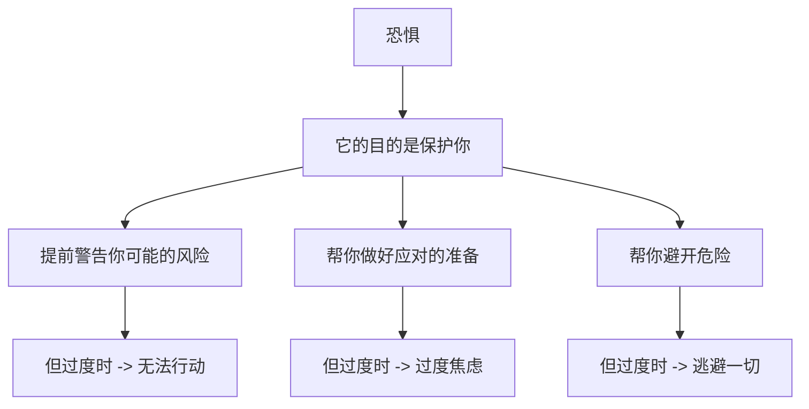
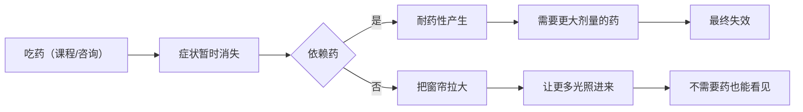
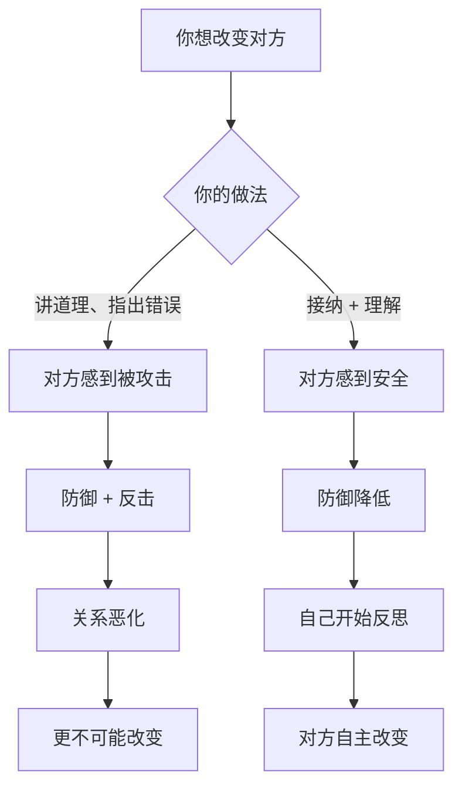

# 第21课：走出内心黑洞

## Learning Objectives

- 理解恐惧的正面意义，学会和恐惧对话
- 掌握改变自己的两种方法：强烈冲击法和空间重复法
- 理解"改变别人的唯一路径"背后的深层逻辑
- 学会在低谷中给自己留一扇窗

## Core Idea

### 恐惧的正面意义

提到恐惧，大多数人的第一反应是"不想要的负面情绪"。但恐惧其实是一种**自我保护的能量**。



> 恐惧不是你的敌人，它是一个过于尽职的保镖。

**和恐惧对话的方法：**

当恐惧来袭时，不要急着推开它。坐下来，问它几个问题：

1. "你想告诉我什么？"
2. "你在保护我免受什么伤害？"
3. "这个危险是真实的，还是大脑模拟的？"
4. "以我现在的能力，我可以怎么做？"

| 恐惧的话 | 可能的翻译 | 应对方式 |
|---------|-----------|---------|
| "别去那个社交场合" | "我害怕你被拒绝" | "我理解了，但我可以去一下试试，不行就回来" |
| "别说那句话" | "我害怕你被讨厌" | "谢谢你提醒我，我会温和但真实地表达" |
| "别做这个决定" | "我害怕你犯错" | "犯错也可以，人需要在错误中学习" |

## 特效药一定会失效

很多人在课程中、咨询中得到了巨大的启发，感觉"突然好了"。但——

> **特效药一定会失效。**

就像一个感冒的人吃了特效药，症状消失了。但药效过了，症状可能又回来了。这不是药没用，而是**药的本来功能就是暂时缓解症状**。

真正的改变不是依赖"特效药"，而是：



> **关键不在药，在于把窗帘拉大。**

所谓"拉大窗帘"，就是：
- 让觉察成为一种生活习惯，而不只是上课时才做的事
- 在日常生活中反复练习新的应对方式
- 把课程中的工具内化成自己的本能

## 允许自己掉回谷底

成长不是一条直线上升的路。它更像一条**波浪线**：

```
        /\        /\
       /  \      /  \      /\
      /    \    /    \    /  \
     /      \  /      \  /    \
    /        \/        \/      \
   /                              \
  /                                \
```

> 人生是波浪线，不是直线。向上的时候不骄傲，向下的时候不自弃。

当你再次感到低落时：

1. **允许自己在谷底**——不是"我应该立刻好起来"
2. **记住这不是第一次**——之前你也从低谷走出来过
3. **做最小的一件事**——起床刷牙、下楼走走、给朋友发条消息

### 感谢生命的缝隙

> **感谢生命的缝隙，那是光照进来的地方。**

如果没有缝隙，光怎么进来？

- 那些让你痛苦的经历，不是生命的缺陷，而是生命的入口
- 那些你觉得"不应该有"的脆弱，恰恰是别人能靠近你的通道
- 完美的人不需要被安慰——所以你才有机会被爱

> [!TIP] Key Insight
> 你以为的裂缝，其实是光进来的地方。```mermaid
    graph LR
        A["痛苦/低谷/裂缝"] --> B["光（觉察/成长/连接）照进来"]
        B --> C["新的可能性"]
        C --> D["更深的理解"]
        D --> E["真正的改变"]
    ```

## 改变自己的两种方法

### 方法一：强烈冲击法

不是"慢慢来"，而是**一次强烈的体验**让你彻底转变视角。

| 类型 | 示例 | 适用场景 |
|------|------|---------|
| 深度体验式课程 | 三天工作坊、密集训练营 | 卡在某个模式很久 |
| 冲击性体验 | 独自旅行、极限运动 | 需要打破僵化的认知 |
| 关键时刻 | 一次深度的对话、一次被触动的观影 | 情绪到位的时候 |

**原理**：当你被强烈冲击时，大脑会进入一种"可塑性"状态，旧有的神经连接被打破，新的连接有机会建立。

### 方法二：空间重复法

不是一次剧烈的冲击，而是**在安全的空间里反复练习**。

- 一周一次的咨询/课程
- 每天5分钟的自我觉察练习
- 固定的书写习惯
- 每周和同修小组的交流

**原理**：通过持续稳定的重复，在安全的环境中，大脑建立新的神经通路。

> **两种方法都需要，缺一不可。** 冲击打开门，重复巩固路。

## 改变别人的唯一路径

> **你不能通过把别人放在"错"的位置上来改变他。**

这是人际关系中最根本的法则，也是最多人违反的法则。



**为什么讲道理没用？**

当你把对方放在"错"的位置上时，他全部的精力都用在了**证明自己没错**上。他没有空间去思考改变。

**正确的方式：**

1. **先理解**——"我理解你为什么这样做"
2. **再连接**——"我们是一边的，不是对立的"
3. **后提问**——"你觉得有没有其他可能的方式？"
4. **支持自主选择**——"无论你做什么决定，我都尊重"

> 改变别人的唯一路径是：**不改变他，而是创造一个他愿意改变的环境。**

## 案例：女企业家与自杀冲动

**背景**：一位非常成功的女企业家，事业有成、家庭美满，但在一次开车途中，突然产生了强烈的**自杀冲动**——她想把方向盘打向对面车道。

她吓坏了，不明白为什么自己会有这样的想法。

**用情绪对话法：**

她靠边停车，深呼吸，然后问自己："这个冲动想告诉我什么？"

她闭上眼睛，和那个冲动对话：

- **她问**："你是谁？"
- **冲动说**："我是你的疲惫。"
- **她问**："你为什么现在出现？"
- **冲动说**："因为你从来不停下来。我一直在这里，但你从来不看我。"
- **她问**："你需要我做什么？"
- **冲动说**："停下来。看见我。允许我存在。"

她突然意识到：那个"自杀冲动"不是真的想死，而是她内在的一部分在呐喊——**她已经太累了，但她的意识层面不允许自己休息**。

> 那些最极端的情绪，往往不是想伤害你，而是用最激烈的方式让你**看见**它。

她做了三件事：

1. **承认疲惫**——不再对自己说"我不应该累"
2. **调整节奏**——周末彻底不工作
3. **建立支持**——定期和朋友倾诉，不一个人扛

## Worked Example

**场景**：老李最近又陷入了自我怀疑的低谷，觉得自己"一把年纪了还没做出什么成就"。

**用本课的方法：**

1. **和恐惧对话**：
   - 恐惧想告诉我什么？——"我害怕自己平庸地过完一生"
   - 这个危险是真实的吗？——可能有一部分真实，但"平庸"的定义是我自己定的
   - 我能做什么？——定义我自己的"不平凡"标准

2. **允许掉回谷底**：
   - "是的，我现在又在低谷里了。没关系，上次也在，我也出来了。"

3. **改变的方法**：
   - 强烈冲击：报名一个一直想学但没敢学的课程
   - 空间重复：每天做10分钟冥想，持续30天

4. **感谢缝隙**：
   - "这份焦虑虽然难受，但它也在提醒我：我还在乎自己的生活，我还有想要的东西。如果我不在乎了，我连焦虑都不会有。"

## Practice

> [!QUESTION] Self-check
> **练习一：和恐惧对话**
> 最近你最大的恐惧是什么？试着和它对话：

| 问题 | 你的回答 |
|------|---------|
| 我的恐惧是什么 | |
| 它想保护我免受什么伤害 | |
| 这个危险有多大概率真的发生 | |
| 以我现在的资源和能力，我能做什么 | |
| 我能接受的最小行动是什么 | |

**练习二：改变方法规划**
你想改变自己哪个方面？用两种方法各设计一个方案：

| 方法 | 方案 |
|------|------|
| 强烈冲击法（一次体验） | |
| 空间重复法（持续练习） | |

<details>
<summary>参考示例</summary>

**练习一示例：**

**恐惧**：害怕换工作后不适应。

**保护什么**：保护我免受损失败和后悔。

**概率**：不适应的概率可能有30%，但适应的概率也有70%。

**能做什么**：提前了解新公司的文化；给自己预留3个月的适应期；存一笔应急资金。

**最小行动**：先更新简历，看看市场上有哪些机会。

**练习二示例：**

我想改变的方面：改善拖延习惯。

**强烈冲击法**：报名一个限时完成的项目或课程，用外部压力打破拖延模式。

**空间重复法**：每天用"5分钟启动法"——不管做什么，先做5分钟再说。坚持打卡30天。

</details>

## Next Step

这一课我们学习了恐惧的正面意义、改变自己的两种方法，以及改变别人的唯一路径。至此，本模块"自我滋养"的内容全部完成。

回顾整个模块：

- [[0018-gei-zi-ji-xin-li-ying-yang-shang|第18课：给自己心理营养（上）]] ——无条件接纳的工具
- [[0019-gei-zi-ji-xin-li-ying-yang-xia|第19课：给自己心理营养（下）]] ——安全感与肯定赞美
- [[0020-jie-na-zi-ji|第20课：接纳我自己]] ——事实与解读、情绪接纳
- **第21课：走出内心黑洞** ——恐惧对话、改变方法

接下来将进入新的模块：**一致性沟通**，在这个模块中，我们将学习如何用一致性的方式表达自己、处理冲突、建立健康的人际关系。

---

*光不是来消除黑暗的，光只是告诉你：即使在黑暗里，你也没有消失。*