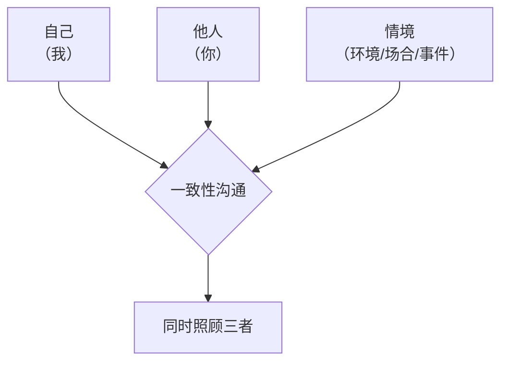
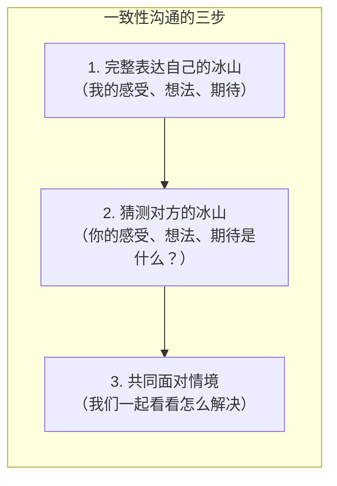
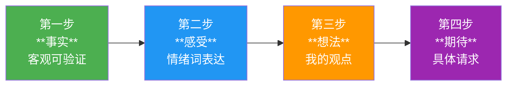
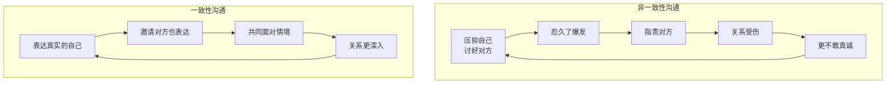

# 第22课：什么是一致性沟通

## 回顾：关系三要素

在进入一致性沟通之前，我们先回顾一个基础框架——任何关系沟通都离不开三个要素：

| 要素 | 含义 | 失衡的表现 |
|------|------|-----------|
| **自己** | 我自己的感受、想法、期待、渴望 | 忽略自己 → 讨好型 |
| **他人** | 对方的感受、想法、期待 | 忽略他人 → 指责型 |
| **情境** | 当时的场合、事件、客观环境 | 忽略情境 → 超理智/打岔型 |

在[[0003-zhi-ze-tao-hao-zi-tai|第03课]]和[[0004-chao-li-zhi-da-cha-zi-tai|第04课]]中，我们详细学习了四种求生存姿态。每一种姿态都是我们在压力下的自动反应，但它们的背后也藏着宝贵的正面资源——

> [!NOTE] 四种姿态的正面意义
>
> | 姿态 | 忽略什么 | 背后的正面资源 |
> |------|---------|---------------|
> | **指责型** | 忽略他人 | 有领导力、目标感强、敢于直面问题 |
> | **讨好型** | 忽略自己 | 情感敏感、善解人意、温暖 |
> | **超理智型** | 忽略自己与他人 | 博学、冷静、分析能力强 |
> | **打岔型** | 三者都忽略 | 幽默、灵活、有创意 |
>
> 一致性沟通不是要你抛弃这些姿态——而是让你**在需要的时候能够调用这些资源，同时不再被它们困住**。

## 什么是一致性沟通？

**一致性沟通**（Congruent Communication）是萨提亚模式中沟通的终极目标——一种同时照顾到**自己、他人和情境**的沟通方式。

> [!QUOTE] 萨提亚
> 一致性意味着你的言语和非言语信息是匹配的，你的内在体验和外在表达是一致的。

用冰山模型的语言来理解：

### 核心是真诚

一致性沟通的核心只有一个词——**真诚**。

但为什么大多数人不敢真诚？

> [!TIP] Key Insight
> 不敢真诚，是因为**不信任对方能接住彼此的反应**。
>
> - 我怕说出了真实感受，你会嘲笑我
> - 我怕表达了对你的不满，你会离开我
> - 我怕暴露了自己的脆弱，你会伤害我
>
> 一致性沟通的勇气，来自你愿意冒这个险——不是为了别人，而是为了你自己的自由。

关于"真诚"的力量，可以参考[[0018-gei-zi-ji-xin-li-ying-yang-shang|给自己做心理营养]]中的内容——当你给自己足够的心理营养，你才有力气在关系中做真实的自己。

## 一致性沟通四步曲总览

一致性沟通可以拆解为四个清晰的步骤，形成一个完整的表达路径：

| 步骤 | 核心 | 需要区分的陷阱 |
|------|------|--------------|
| **事实** | 不带评论的观察 | 事实 vs 评判 |
| **感受** | 用情绪词表达 | 感受 vs 想法 |
| **想法** | 我的观点和信念 | 这是我的看法，不是真理 |
| **期待** | 具体请求（不是命令） | 请求 vs 命令 |

这四步将在[[0023-yi-zhi-xing-gou-tong-shang|第23课]]和[[0024-yi-zhi-xing-gou-tong-xia|第24课]]中逐一分步详解。这里先为你呈现一个**完整案例**，让你对四步曲有一个整体印象。

## 完整案例：创业失败与离婚

> 小张创业三年，公司最终倒闭，欠了一笔债。回到家，妻子说："我叫你不要这么冒险，你偏不听。"小张忍不住吼了回去："你就知道说风凉话！我这么拼命也是为了这个家！"两人大吵一架。

用一致性沟通重新表达——

**小张的表达**：

| 步骤 | 内容 |
|------|------|
| 事实 | "公司上个月正式进入清算程序，我们欠了供应商15万。你刚才说'叫你不要这么冒险'。" |
| 感受 | "我感到**羞愧和沮丧**。同时你这么说的时候，我也**有点委屈**。" |
| 想法 | "我知道你是担心我。但我的想法是——创业确实有风险，但不试的话我永远不知道能不能成。我现在需要的是我们一起面对，而不是被说'我早就知道'。" |
| 期待 | "我希望你能抱我一下，然后今晚我们一起列一下怎么还债的计划，可以吗？" |

**妻子的表达**（用一致性沟通来回应）：

| 步骤 | 内容 |
|------|------|
| 事实 | "我看到你三个月瘦了八斤，每天晚上两点才睡。刚才你说想让我抱你一下。" |
| 感受 | "我**很心疼**，也**很害怕**。" |
| 想法 | "我说风凉话的时候，其实心里想的是'如果当初我多支持你一点，会不会不一样'。我是对自己生气。" |
| 期待 | "我愿意和你一起列计划。我也希望你能让我参与你的决定，不要一个人扛，可以吗？" |

> [!NOTE]
> 注意这个案例中双方都没有进入指责-讨好的死循环。两个人都在表达自己的冰山，同时也在猜测对方的冰山——这，就是一致性沟通。

## 一致性沟通的本质

一致性沟通不是一套话术，不是"这样说就对了"。它本质上是一种**关系立场**：

- **我不忽略自己**——我表达真实的感受和想法
- **我不忽略你**——我关心你的感受和想法
- **我不忽略情境**——我面对现实，和你一起解决问题

关于更深的关系滋养方式，你还可以参考[[reference/psychological-nutrition|心理营养速查]]中关于"关系中的心理营养"的内容。

## Practice

> [!QUESTION] Self-check
>
> 回想最近一次让你感到不舒服的沟通。用一致性沟通四步曲的框架来重新组织你的表达：
>
> 1. **事实**：发生了什么客观事件？（如果写成评判，请改成事实）
> 2. **感受**：我有什么情绪？（用情绪词，不要用"我觉得+想法"）
> 3. **想法**：我对此有什么看法？（用"我认为……"开头）
> 4. **期待**：我希望对方做什么？（具体、可执行的请求）

参考答案示例

**假设情境**：同事在群里@你催进度，你感到不爽。

**原反应**（指责型）："你没看到我在做吗？催什么催！"

**一致性沟通重构**：

| 步骤 | 内容 |
|------|------|
| 事实 | "今天下午三点你在群里@我问方案进度。" |
| 感受 | "我感到**有些压力**。" |
| 想法 | "我觉得你对这事很着急，但我认为我已经按计划在推进了。被当众@催的时候，我有点被推着走的感觉。" |
| 期待 | "下次能不能先私聊问我进度？如果需要在群里同步，我们也可以提前约定一个时间点。" |

## Next Step

一致性沟通的四步曲，第一步是最容易被忽略却最重要的一步——**事实**。在下一课中，我们将深入学习如何区分"事实"和"评判"。

继续学习 [[0023-yi-zhi-xing-gou-tong-shang|第23课：一致性沟通（上）]]

---

✍️ **最后的话**

一致性沟通不是技巧的堆砌，而是一次次勇敢的练习。每一次你选择用真实代替伪装、用表达代替攻击，你都在为自己和对方创造更深的理解空间。关系不是完美的表演，而是真实的相遇。