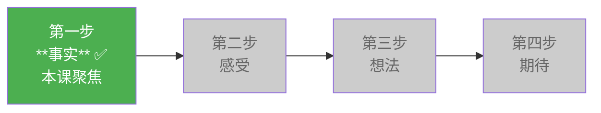
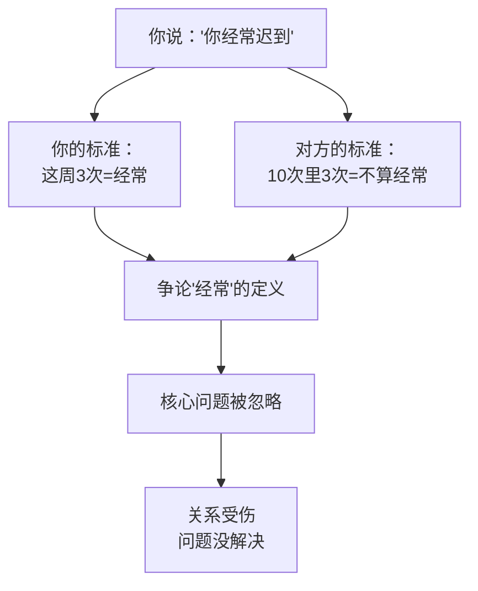
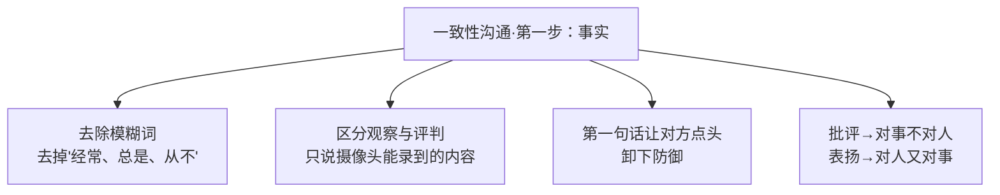

# 第23课：一致性沟通（上）

一致性沟通四步曲的**第一步，也是最关键的一步**——说出客观事实。

在[[0022-shi-mo-shi-yi-zhi-xing-gou-tong|第22课]]中我们了解了四步曲的总览，这一课我们聚焦在第一步，深入探讨**事实与评判的区分**。



## 不带评论的观察

> [!QUOTE] 克里希那穆提
> **"不带评论的观察是人类智力的最高形式。"**

这句话之所以震撼，是因为它揭示了一个真相：**人类的语言天然带有评判的倾向**。我们太习惯在看到一件事的瞬间就给它贴标签、下结论，以至于我们常常以为自己说的是"事实"，而对方听到的却是"攻击"。

### 事实 vs 评判

来看一组清晰的对比：

| ❌ 评判（容易引发防御） | ✅ 事实（对方无法反驳） |
|----------------------|----------------------|
| "你**经常**迟到" | "你这周**三次会议**都迟到了" |
| "你**太邋遢了**" | "你的衬衫上有一块油渍" |
| "你**不负责任**" | "这个项目你没有在截止日期前提交" |
| "你**根本不在乎**我" | "这周你没有主动给我打过电话" |
| "你**总是**打断我" | "刚才我还没说完，你先开口了" |
| "你像**猪一样脏**" | "你在地上爬" |

> [!WARNING] 关键区分
>
> **评判**是对人的定性（"你是个什么样的人"），**事实**是行为的描述（"你做了什么/没说/没做"）。
>
> 评判会立刻激活对方的防御系统——对方的注意力会从问题本身转移到"我是不是这样的人"这件事上，沟通还没开始就结束了。

## 让沟通从点头开始

一致性沟通有一个非常实用的技巧——

> [!TIP] Key Insight
> **让沟通从点头开始。**
>
> 你的第一句话必须说一个对方一定会点头同意的事实。对方点头了，他的防御系统才会放下，他的耳朵才会打开。

**实践要点**：

1. 第一句话只说客观事实
2. 这件事是对方自己也能确认的（视频录像、聊天记录、时间地点等）
3. 不添加任何评论、推测、情绪色彩

| ❌ 错误的开场 | ✅ 正确的开场 |
|-------------|-------------|
| "你最近状态很差"（评判） | "这个月你请了三天病假"（事实） |
| "你很粗心"（对人定性） | "这份报告第三页的数据和第五页有出入"（事实） |
| "你不配合团队"（评判） | "上周的会议你没有参与讨论"（事实） |

## "经常"——最危险的词

沟通中最具破坏力的词之一：**"经常"**、"总是"、"从不"、"每次"。

> 人类最大的矛盾，是说着同样的词，却有着完全不同的理解。

- **你说**"你经常迟到"——你的意思是"这周迟到了三次"
- **对方听到**"你经常迟到"——他的防御启动："我上周只迟到了三次，上上周才一次，这怎么能叫经常？"

你们不是在解决问题，而是在争论"三次算不算经常"。



**解决方案**：去掉模糊词，用**可验证的数据**说话。

| ❌ 模糊 | ✅ 精确 |
|--------|--------|
| "你经常……" | "这周三次……" |
| "你总是……" | "最近三次项目你都是最后一刻才提交……" |
| "你从不……" | "这次你没有提前通知我就改了方案……" |

## 对事不对人（批评时）

当你需要提出批评或反馈时，原则是——**对事不对人**。

```mermaid
graph LR
    subgraph 对人（错误）
        A["你这个人太粗心了"] --> B["对方感到被否定"]
        B --> C["防御/反驳/争吵"]
    end
    subgraph 对事（正确）
        D["这份报告有三处数据错误"] --> E["对方确认事实"]
        E --> F["一起找原因/解决"]
    end
```

| ❌ 对人（评判） | ✅ 对事（事实） |
|----------------|---------------|
| "你真懒" | "这周的卫生你还没有打扫" |
| "你太自私了" | "这个西瓜你一个人吃完了一半" |
| "你没有团队精神" | "这次分工你选择了工作量最轻的部分" |

> 对事不对人，本质上是在告诉对方：**我不否定你的价值，只是指出这件事需要调整。** 这样对方才听得进去。

## 对人又对事（表扬时）

有趣的是，表扬的时候要反过来——**对人又对事**。

这背后的原理是：**行为 + 身份提升**。

当你表扬一个人的时候，如果只说"你做得很好"，对方可能会觉得你只是客气。但如果你把**具体行为**和**身份提升**联系起来，效果会完全不同：

| ❌ 空洞表扬 | ✅ 行为→身份提升 |
|-------------|-----------------|
| "你好帅"（空洞） | "你戴的黄色眼镜框配上黄外套和棒球帽，特别帅"（全部是让人点头的事实） |
| "你真棒" | "今天你主动把玩具分享给小朋友，你是一个**懂得分享的好哥哥**" |
| "你工作能力强" | "上个项目你提前两天交付，连客户的额外需求也处理了，你真的很**靠谱**" |

> [!NOTE] 为什么行→身份提升有效？
>
> 当你的表扬中包含了**可验证的事实证据**时，对方无法怀疑你的真诚。同时，你把行为上升到身份——"你是一个××的人"——会让对方**朝着这个身份去努力**。
>
> 这和[[0013-xin-li-ying-yang-shang|心理营养】中"被欣赏被肯定"的原理是相通的：孩子（和成年人）都需要被看见具体的好行为，才能建立起**高价值感**。

## 赞美要有证据

这是事实原则在表扬中的应用。

> [!TIP] Key Insight
> **赞美要有证据**——你的第一句话必须是对方会点头说"嗯，是这样的"的事实。
>
> 如果你说：
> - "你好聪明" → 对方可能会想："你是不是随便说的？"
> - "你这个方案用了全新的角度来解决问题，尤其第三点那个逻辑链条让我眼前一亮" → 对方：真实感+被看见的感觉

### 日常赞美对比

| 场景 | ❌ 空洞 | ✅ 有证据 |
|------|---------|----------|
| 夸同事 | "你真厉害" | "你刚才那段汇报用数据说话，真的很清晰，尤其是那个增长曲线图" |
| 夸孩子 | "真乖" | "今天妈妈打电话时你没有打断，在旁边自己玩，你真的很**体贴**" |
| 夸伴侣 | "你真好" | "今天你特意绕路去买我最爱的甜点，还帮我放在冰箱里，你真的**很在乎我的感受**" |
| 夸朋友 | "你有品位" | "你家这个灯选得很别致，暖光和灰色墙面搭起来很有层次感" |

## 回顾：第一步的核心要点



关于事实这一步更详细的示例，可以查阅 [[reference/congruent-communication|一致性沟通公式速查]]。

## Practice

> [!QUESTION] Self-check
>
> **练习一：评判改写为事实**
>
> 请将以下评判性语句改写为客观事实描述：
>
> 1. "你太大方了，又乱花钱。"
> 2. "你从来不关心我。"
> 3. "你工作态度不认真。"
>
> **练习二：有证据的表扬**
>
> 请为以下场景设计一句"有证据的表扬"（行为+身份提升）：
>
> 你的孩子今天主动把作业做完后，还帮弟弟收拾了玩具。

<details>
<summary>参考答案</summary>

**练习一：评判→事实**

| 原评判 | 改写为事实 |
|--------|-----------|
| "你太大方了，又乱花钱" | "这个月你买了三个包和两双鞋，总共消费超过8000元" |
| "你从来不关心我" | "这个星期你没有主动问过我'今天过得怎么样'" |
| "你工作态度不认真" | "这个项目你有两次错过了deadline" |

**练习二：有证据的表扬**

> "妈妈看到你做完作业后，还帮弟弟把积木收拾到盒子里了。你真的是一个**有责任感的哥哥**。"

注意：行为描述要具体（做了什么），身份提升要正向（"负责任"、"体贴"、"细心"——选择一个真正匹配的词）。

</details>

## Next Step

说出事实只是第一步。接下来，你需要表达**你的感受**——但这比想象中更难，因为我们常常把"想法"误当作"感受"。

继续学习 [[0024-yi-zhi-xing-gou-tong-xia|第24课：一致性沟通（下）]]

---

✍️ **最后的话**

事实是沟通的锚点。当你只说事实时，你给了对方一个可以站立的地方，而不是一个需要防御的战场。从今天开始，试试在你的每一段重要对话中，第一句话只说事实——让对方从点头开始。