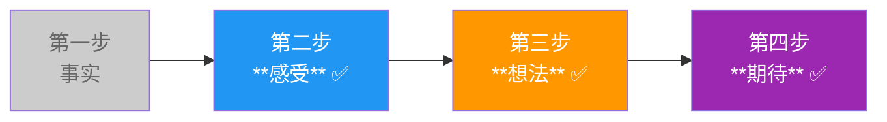
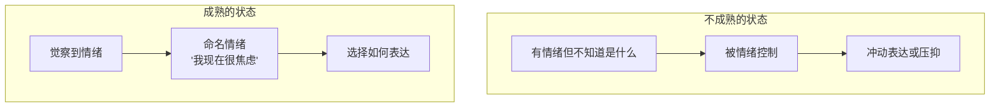
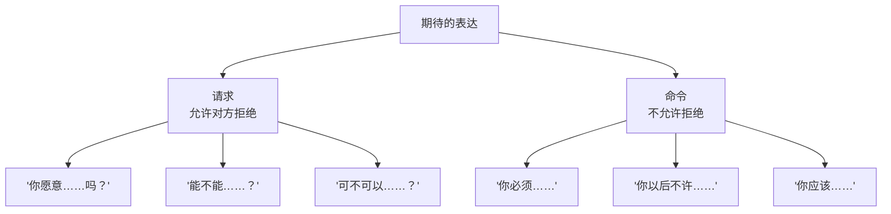
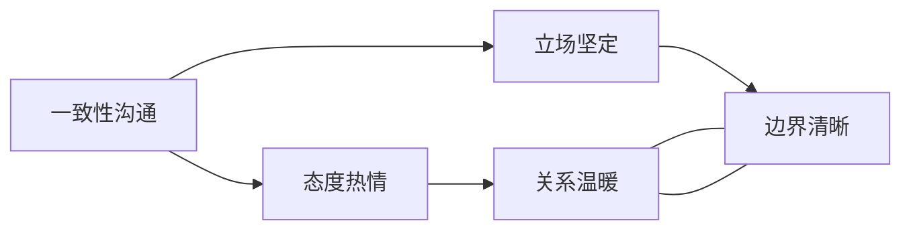
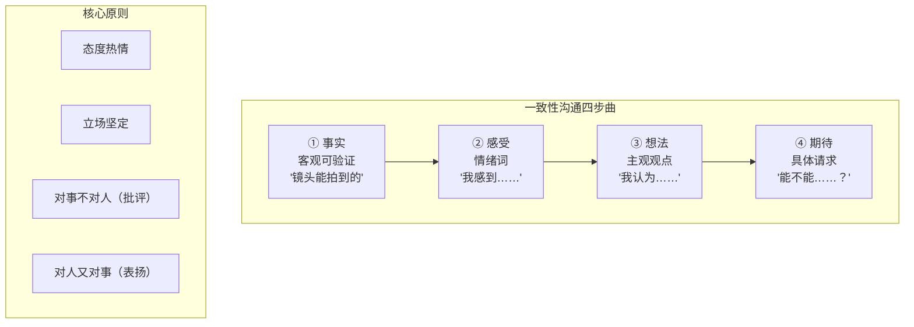

# 第24课：一致性沟通（下）

本课我们将完成一致性沟通四步曲的后三步——**感受、想法、期待**，并给出完整公式和案例。

## 第二步：感受 —— 成熟的人感受敏锐

> [!QUOTE] Key Insight
> **成熟的人感受敏锐**——不是迟钝，而是能体察自己情绪的细微起伏，也能感知对方的情绪状态。

很多人以为"成熟"意味着情绪稳定、不动声色。但真正的成熟恰恰相反——是**情绪的敏感度和觉察力**的提升。

关于情绪觉察的深层原理，可以参考 [[reference/iceberg-model|冰山模型速查]] 中的感受层——感受是冰山水面下的第一层，是所有沟通的能量来源。

### 感受 vs 想法：最容易被混淆的陷阱

中文里，我们常说"我觉得……"，但这个"觉得"后面跟的常常是一个**想法**，而不是**感受**。

| ❌ 误以为是感受（其实是想法） | ✅ 真正的感受（情绪词） |
|-----------------------------|----------------------|
| "我觉得**我搞砸了**" | "我很**沮丧**" |
| "我觉得**不公平**" | "我很**生气**" |
| "我觉得**他不尊重我**" | "我感到**受伤**" |
| "我觉得**你不爱我**" | "我感到**孤独**" |
| "我觉得**我有问题**" | "我很**羞愧**" |

> [!WARNING] 感受 vs 想法的区分标准
>
> **感受**：可以用一个情绪词来替代——伤心、愤怒、委屈、焦虑、羞愧、孤独、开心、感动……
>
> **想法**：是一个判断、评价、解读——"我搞砸了"、"这不对"、"他错了"……
>
> 一个简单的判断方法：把"我觉得"后面的话换成"我**感到**"试试——"我**感到**我搞砸了"不通顺，但"我**感到沮丧**"通顺。

### 常见情绪词汇库

为了帮助你更准确地表达感受，这里提供一份情绪词汇参考：

| 类型 | 情绪词 |
|------|--------|
| **愤怒** | 生气、愤怒、不满、恼怒、烦躁、憋屈、憎恨 |
| **悲伤** | 伤心、难过、失落、沮丧、绝望、忧伤、孤独 |
| **恐惧** | 害怕、焦虑、紧张、担心、不安、惊慌、恐惧 |
| **喜悦** | 开心、兴奋、满足、感动、欣慰、温暖、幸福 |
| **羞愧** | 羞愧、尴尬、丢脸、懊悔、自责、不好意思 |
| **受伤** | 委屈、心痛、被刺伤、憋闷、受伤、酸楚 |

## 表达愤怒 vs 愤怒地表达

关于感受，有一个非常重要的区分——

> [!TIP] **表达愤怒** vs **愤怒地表达**
>
> | | 表达愤怒 | 愤怒地表达 |
> |--|---------|-----------|
> | 本质 | 我**描述**我的愤怒 | 我被愤怒**控制** |
> | 语言 | "我对这件事感到很愤怒" | 吼叫、砸东西、攻击 |
> | 效果 | 对方听见你的感受 | 对方只感到被攻击 |
> | 结果 | 解决问题 | 制造新问题 |

**表达愤怒**让你拥有情绪的主控权；**愤怒地表达**让你成为情绪的奴隶。

| ❌ 愤怒地表达 | ✅ 表达愤怒 |
|-------------|-----------|
| "你有病啊！"（拍桌子） | "你刚才说的那句话，让我**非常生气**。" |
| "你每次都这样！"（摔门） | "这种事情再次发生了，我感到**很失望**。" |

表达愤怒，同时保持[[0022-shi-mo-shi-yi-zhi-xing-gou-tong|关系三要素]]中"照顾自己、他人、情境"的整体视角——你在表达自己，不是伤害对方。

## 第三步：想法 —— 我的观点

想法是冰山的中间层，是你对这件事的**解读、信念、观点**。

表达想法的要点：

- 用"我认为……"、"我的看法是……"开头
- 明确表明这是**你的主观想法**，不是绝对真理
- 可以用"也许……"、"可能……"来软化语气

| ❌ 绝对化表达 | ✅ 表达想法 |
|-------------|-----------|
| "你就是故意拖延" | "我认为你可能对这个项目有顾虑" |
| "这方案肯定不行" | "我的看法是这个方案的风险比较高" |
| "你不重视我" | "我感觉到你可能最近比较忙，这是我的理解" |

## 第四步：期待 —— 具体请求，不是命令

最后一步，明确提出你的期待。这里的关键是——**请求 vs 命令**。

| ❌ 命令（引发反击） | ✅ 请求（邀请合作） |
|--------------------|------------------|
| "你以后不许迟到" | "下次会议能否提前五分钟到？" |
| "你必须改掉这个毛病" | "我希望我们可以一起商量一下怎么调整" |
| "你马上给我道歉" | "你能让我把你刚才的话说完吗？" |
| "以后不准再这样" | "下次遇到这种情况，能不能先跟我说一声？" |

> [!NOTE]
> 请求给了对方选择的自由。当对方感到有选择权时，他反而更愿意配合你。这也是[[reference/glossary|术语表]]中"平等模式"在沟通中的体现——你不是居高临下地命令，而是平等地邀请。

## 一致性沟通完整公式

把四个步骤连起来，一致性沟通的完整公式是：

> **事实 + 感受 + 想法 + 期待**

这四条线组合在一起，构成一个**完整的表达**：

### 态度热情，立场坚定

一致性沟通的另一个核心原则：**态度热情，立场坚定**。

- **态度热情**：语气平和、表情温和、尊重对方、不居高临下
- **立场坚定**：我的观点清楚、我的感受真实、我的期待明确

这二者不是矛盾的。你可以笑着说"我对这件事很不满意"——你在表达愤怒，而不是愤怒地表达。

## 完整案例：印刷厂宣传册印错

> **情境**：创业公司做产品发布会，展前三天发现印刷厂把宣传册印错了。印刷厂张总说"重新印需要三天"，但展会只有三天就要开了。你作为项目负责人，需要和张总沟通。

### ❌ 非一致性沟通（指责型）

> "张总你怎么搞的？我们给了那么长时间，你们印错了让我们怎么办？这责任你们负得起吗？你必须三天内给我赶出来！"

对方听到的：被指责、被命令。对方的防御立刻启动，可能会找各种理由推诿。

### ✅ 一致性沟通

> "张总，我刚刚收到消息说宣传册印错了。（**事实**）
>
> 我现在非常焦虑和担心。（**感受**）
>
> 我认为没有宣传册的话，展会可能会功亏一篑。（**想法**）
>
> 我希望能3月1日前拿到宣传册，不管是外发还是调整排单，您看可以吗？（**期待/请求**）"

**注意**：最后一句是请求，不是命令。"您看可以吗？"给了对方尊重和选择权——同时立场没有动摇（3月1日前必须拿到）。

这个完整公式的速查表详见 [[reference/congruent-communication|一致性沟通公式速查]]。

## 进阶：完整表达自己的冰山 + 猜测对方的冰山

在四步曲的基础上，真正的深度一致性沟通还需要**猜测对方的冰山**。

| 你的冰山 | 对方的冰山（猜测） |
|---------|-----------------|
| 事实：宣传册印错了 | 事实：印厂出了错 |
| 感受：焦虑、担心 | 感受（猜测）：内疚、压力、怕被骂 |
| 想法：没有册子展会会崩 | 想法（猜测）：想补救但怕做不到 |
| 期待：3月1日前拿到 | 期待（猜测）：希望我理解他的难处 |

当你把对方的冰山也纳入考量时，你的沟通会变得更加温暖和有力：

> "张总，宣传册印错了（事实）。我知道您可能也很着急（**猜测对方的感受**）。我们一起来想想有没有什么办法能在三天内补救（**共同面对情境**）。"

## 一致性沟通公式总结

## Practice

> [!QUESTION] Self-check
>
> **情境**：
>
> 你是一个团队项目负责人。团队成员小李连续三次会议都迟到，每次迟到5-15分钟。今天他又迟到了10分钟，其他团队成员已经发出了不满的声音。
>
> 请用一致性沟通的完整公式（事实+感受+想法+期待）写一段话，和小李单独沟通。

参考答案

> "小李，这周三次项目会议你都是9点之后到的，今天迟到了10分钟。（**事实**）
>
> 我感觉有些为难和担心。（**感受**——注意不是"我觉得你不负责任"）
>
> 我的看法是迟到本身对团队氛围有一定影响，其他人可能会觉得不公平，而且你也错过了前面的讨论。（**想法**）
>
> 我希望下次会议你能准时参加，如果确实有困难，能不能提前五分钟在群里说一声？你觉得可以吗？（**期待/请求**）"

**要点检查**：
- ✅ 事实：可验证的行为描述（三次、迟到、具体时间）
- ✅ 感受：情绪词（为难、担心），不是想法
- ✅ 想法：用"我的看法是"开头，明确是主观观点
- ✅ 期待：具体的请求，末尾给了对方选择权
- ✅ 态度：温和但不软弱，立场清晰

## Next Step

完成了一致性沟通四步曲的学习，你已经掌握了萨提亚模式中最核心的沟通工具。如果想复习其他模块，可以回到 [[00-course-map|课程总览]] 查看完整学习路径。

---

✍️ **最后的话**

一致性沟通不是一场完美的表演，而是一次次真实的相遇。你不需要每次都说得"完美"，你只需要每次都带着真诚试探性地迈出一步。事实让你安全，感受让你真实，想法让你清晰，期待让你向前。走完这四步，你已经不是在吵架——你是在建造一座桥。