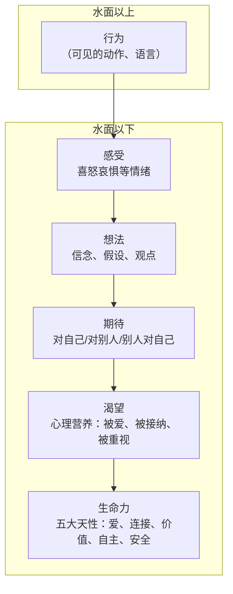

# 冰山模型速查

## 各层次详解

### 1. 行为（水面以上）
- 可见的外部动作和语言
- 只占冰山能量的很小一部分
- 仅仅改变行为无法触及根本

### 2. 感受
- 原始情绪：喜、怒、哀、惧、爱、恶、欲
- 感受的感受：对自己情绪的二次评判（如"我不应该生气"）
- 成熟的人感受敏锐——能体察自己情绪的细微起伏

### 3. 想法
- 信念、假设、观点、价值观
- 非理性信念的常见来源："应该"、"必须"、"总是"、"从不"
- 需要区分事实和想法

### 4. 期待
三个维度：
- **对别人的期待**：期待他道歉、期待他改变
- **别人对我的期待**：觉得爸妈期待我成功
- **自己对自己的期待**：期待自己完美

> 拿回主控权的关键：问自己"哪一个期待是我能掌控的？"

### 5. 渴望（心理营养）
- 被无条件接纳
- 被重视（生命至重）
- 安全感
- 被欣赏和被肯定
- 被引导/模范

### 6. 生命力（五大天性/五朵金花）
- 爱与被爱的能力
- 连接感
- 高价值感
- 独立自主
- 安全感

## 使用冰山的步骤

1. **写下事件**：最近一次让你不舒服的矛盾
2. **觉察感受**：当时有什么情绪？身体哪里不舒服？
3. **觉察想法**：你对自己/对方/这件事有什么看法？
4. **觉察期待**：你期待什么？对方期待什么？你对自己有什么期待？
5. **觉察渴望**：你真正需要的是什么心理营养？
6. **觉察生命力**：你的哪朵金花枯萎了？
7. **拿回主控权**：我能为自己做什么？

## 注意事项

> 觉察的方向永远对准自己，而不是拿着冰山去分析别人。

> 学习冰山学会的是心理学思维（深层次理解为什么会发生），不是一两句话的方法。