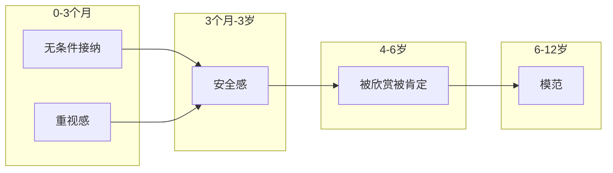
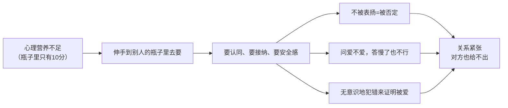

# 心理营养速查

## 五大心理营养概览

## 各营养详解

### 1. 无条件接纳（0-3个月）

**关键期**：出生后前三个月，妈妈分泌本体胺（幸福激素）

**需要被接纳的四种场景**：
- ✅ 做错的时候
- ✅ 失败的时候
- ✅ 有负面情绪的时候
- ✅ 达不到期待的时候

**操作方法**：
1. **觉察**：最冲动想给什么（安慰/批评/鼓励）？
2. **停下**：暂停无效行为
3. **安静陪伴**：深度聆听，不做评价

### 2. 重视感/生命至重（0-3个月）

**关键**：婴儿通过五个感官感知"我是不是你生命中最重要的人"

**爱的五种语言**（表达重视感的方式）：
1. 肯定的言词
2. 高品质的陪伴时间
3. 送礼物
4. 服务的行为
5. 身体的接触

### 3. 安全感（3个月-3岁）

**两大关键**：
- 妈妈情绪平和
- 父母关系稳定

**安全感的目的是分离**：
- 身体分离（剪脐带）容易
- 心理分离需要足够的安全感
- 安全感不足的表现：幼儿园撕心裂肺、分手困难、要求共生

### 4. 被欣赏和被肯定（4-6岁）

**关键角色**：父亲
- 父亲的爱是可以争取的（妈妈的爱相对固定）
- 孩子的"自我杯"——被看见打勾，被否定打叉

### 5. 模范（6-12岁）

孩子天生会模仿重要的人如何：
- 处理人际冲突
- 建立人际关系
- 面对情绪失控

> 说教没用，只能做给他看。

## 心理营养的"去要"模式

**出路**：心理营养首先要自己给自己。

## 给自己做心理营养

| 营养 | 方法 |
|------|------|
| 无条件接纳自己 | 情绪敲击法（EFT）、自由书写、画冰山、动态静心 |
| 给自己重视感 | 花时间给自己、为自己花钱、把焦点放回自己身上 |
| 给自己安全感 | 一边怕一边做、情绪管理、经营人际关系 |
| 肯定赞美自己 | 每天从事实中找到三个欣赏自己的点 |
| 做自己的模范 | 觉察并选择自己想要的生活方式 |