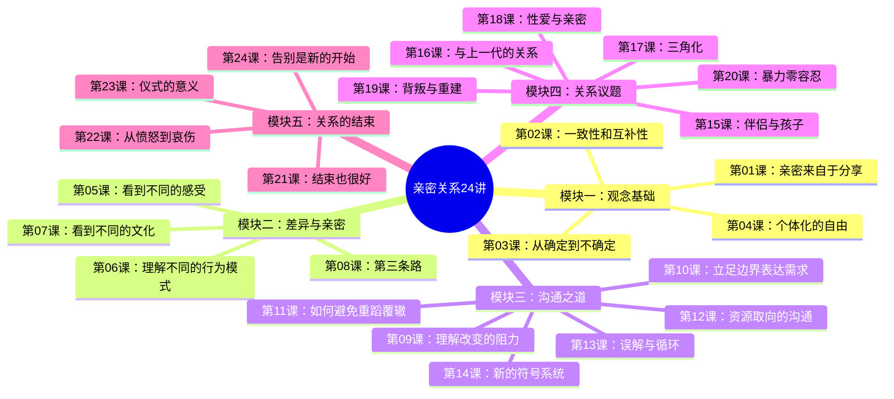

# 李松蔚亲密关系24讲

## 课程简介

本课程由系统式家庭咨询师 **李松蔚** 讲授，以后现代哲学为背景，系统式家庭咨询为方法，帮助你建立亲密关系的底层操作系统。课程包含 **5 大模块、24 讲**，覆盖从观念基础到具体议题、从沟通技术到告别成长的完整路径。

## 适读人群

- 正在亲密关系中感到困惑、想要改善关系的人
- 希望为进入亲密关系做好观念储备的人
- 对系统式家庭咨询理念感兴趣的学习者

## 课程结构

## 课程目录

### 模块一：不确定时代的亲密共识

1. [[lessons/0001-shen-me-neng-rang-wo-men-qin-mi|第01课：亲密来自于分享]] — 斯腾伯格爱情三元素，亲密的本质是分享
2. [[lessons/0002-yi-zhi-xing-he-hu-bu-xing|第02课：一致性和互补性]] — 不一致也能和谐，互补的力量
3. [[lessons/0003-cong-que-ding-dao-bu-que-ding|第03课：从确定到不确定]] — 规划模型到漂流模型
4. [[lessons/0004-ge-ti-hua-de-zi-you|第04课：个体化的自由]] — 自由选择是亲密的前提

### 模块二：差异与亲密

5. [[lessons/0005-kan-dao-bu-tong-de-gan-shou|第05课：看到不同的感受]] — 认可感受，直接表达
6. [[lessons/0006-li-jie-bu-tong-de-xing-wei-mo-shi|第06课：理解不同的行为模式]] — 行为模式差异的理解
7. [[lessons/0007-kan-dao-bu-tong-de-wen-hua|第07课：看到不同的文化]] — 把对方当作"外国人"
8. [[lessons/0008-di-san-tiao-lu|第08课：第三条路]] — 不强制、不委屈、不评判

### 模块三：沟通之道

9. [[lessons/0009-li-jie-gai-bian-de-zu-li|第09课：理解改变的阻力]] — 不改变也有意义
10. [[lessons/0010-gou-tong-zhi-dao-bian-jie-xu-qiu|第10课：立足边界表达需求]] — 沟通的核心原则
11. [[lessons/0011-bi-mian-zhong-dao-fu-zhe|第11课：如何避免重蹈覆辙]] — 建设性需求表达
12. [[lessons/0012-zi-yuan-qu-xiang|第12课：资源取向的沟通]] — 你不是问题，你是资源
13. [[lessons/0013-wu-jie-xun-huan|第13课：误解与循环]] — 跳出长期冷战
14. [[lessons/0014-xin-fu-hao-xi-tong|第14课：新的符号系统]] — 用新语言说"我爱你"

### 模块四：亲密关系中的具体议题

15. [[lessons/0015-ban-lv-yu-hai-zi|第15课：伴侣与孩子的平衡]] — 先伴侣后亲子
16. [[lessons/0016-shang-yi-dai|第16课：如何处理与上一代的关系]] — 代际边界
17. [[lessons/0017-san-jiao-hua|第17课：三角化]] — 家庭中的隐性威胁
18. [[lessons/0018-xing-yu-qin-mi|第18课：性爱与亲密]] — 性在亲密关系中的角色
19. [[lessons/0019-bei-pan-yu-chong-jian|第19课：背叛与重建]] — 出轨后的修复
20. [[lessons/0020-bao-li-ling-rong-ren|第20课：暴力零容忍]] — 离开暴力的四步

### 模块五：关系的结束

21. [[lessons/0021-jie-shu-ye-hen-hao|第21课：结束也很好]] — 打破重复模式
22. [[lessons/0022-nu-zhuan-bei|第22课：向前走：从愤怒到哀伤]] — 哀伤的过程
23. [[lessons/0023-yi-shi-de-yi-yi|第23课：未完成的结束：仪式的意义]] — 告别仪式
24. [[lessons/0024-gao-bie-shi-xin-de-kai-shi|第24课：带上祝福告别]] — 成熟分离

## 核心概念

- [[reference/glossary|核心术语表]]
- [[reference/gou-tong-gong-shi|沟通原则速查]]

## 学习建议

1. 按顺序学习，每课之间相互关联
2. 每课后完成自我反思练习
3. 鼓励与伴侣一起学习，但一人先学也有帮助
4. 不必急于改变，先理解再行动