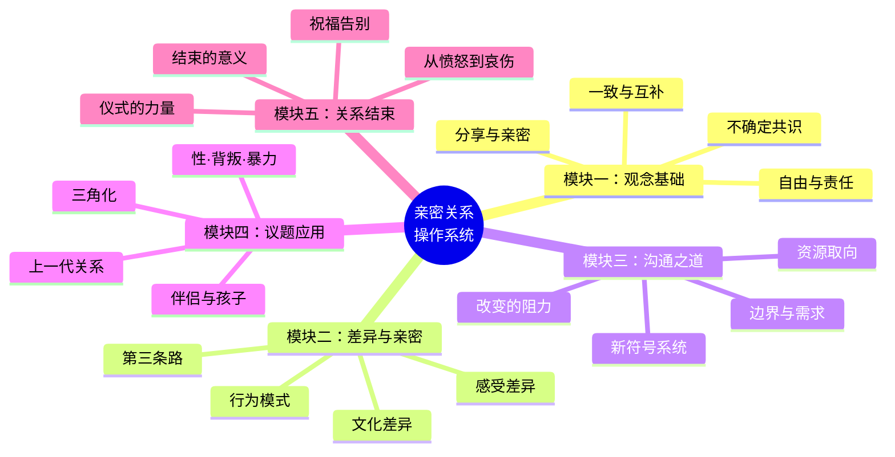

# 第00课：发刊词——亲密是挑战，更是可以学会的能力

## 学习目标

- 理解新时代亲密关系的独特挑战
- 了解系统式家庭咨询的核心理念
- 掌握课程的模块结构和学习路径

## 新时代的亲密关系挑战

我们生活在一个前所未有的时代。从前做咨询只需要考虑两个人在一起好好过日子，现在要考虑的却是：**在一起的同时保持独立，稳定的同时还要成长**。

李银河老师说过："今天的爱情建立在独立人格的基础上。"这句话本身就是一个悖论——独立意味着选择的自由，而传统婚恋观要求一致和稳定。

> [!TIP] 核心洞察
> 新时代的亲密关系，最大的特点就是 **不确定** 。你无法控制另一个人，无法把关系绑定在自己身边，无法让正确的道理被别人信服。

## 系统式家庭咨询的理念

本课程的学术根基是 **系统式家庭咨询**，它以后现代哲学为背景，有三大特点：

1. **不关心谁对谁错**——没有唯一标准时，促进多人合作
2. **不要求遵循某个标准**——尊重每个人的独立意志
3. **不劝和不劝离**——只关心如何与独立个体相处

## 亲密关系底层操作系统

课程将亲密关系比作一套 **底层操作系统**——一套共识、观念、技巧和应对策略。操作系统之上，可以自由搭载属于你们的小程序（日常互动方式），它们之间兼容，不会出 bug。

## 学习建议

1. 不需要心理学基础，课程通过生活现象和案例展开
2. 鼓励与伴侣一起学习，但一人先学也有帮助
3. 不急于改变，先理解再行动
4. 保持开放心态，接受不确定性

> [!NOTE] 写给单身的朋友
> 这门课也适合没有亲密关系的人——帮助澄清对关系的理解，提高亲密的能力。等机会出现时，你会更容易抓住一段关系。

## 课后练习

回想一下你在亲密关系中遇到的一个具体的困惑。带着这个问题进入后面的学习，看看课程中的哪个概念或方法能帮你找到新的视角。

下节课：[[lessons/0001-shen-me-neng-rang-wo-men-qin-mi|第01课：亲密来自于分享]]——分享是亲密的核心，最重要的是分享脆弱。