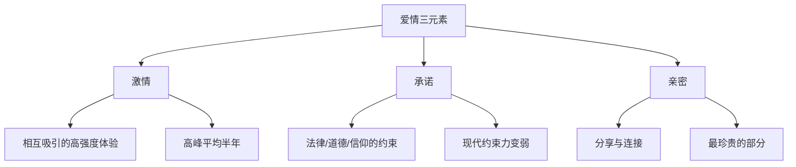

# 第01课：亲密来自于分享

## 学习目标

- 理解斯腾伯格爱情三元素：激情、承诺、亲密
- 掌握"分享"作为亲密核心的定义
- 理解分享的层次，特别是分享脆弱的重要性

## 爱情三元素

心理学家斯腾伯格提出了著名的 **爱情三元素模型**：



### 激情
激情是爱情的开端——那个人是你的一切，为了他什么都可以放弃。但激情的高峰平均只有半年。不要被偶像剧骗了，长期关系的维持不能靠激情。

### 承诺
承诺是契约。老一辈更多靠承诺来约束稳定——法律、道德、信仰。但现代社会中，不结婚的人越来越多，离婚率越来越高。承诺的约束力在变弱。

### 亲密
这是三元素中最核心、也最容易被忽视的部分。

## 亲密的本质：分享

**亲密就是你可以跟另一个人一起分享**。就这么简单。你们能分享的越多，代表你们越亲密。

分享有不同的层次：

```
陌生人 → 基本信息（姓名、城市、工作）
  ↓
普通朋友 → 照片、心情、兴趣爱好
  ↓
亲密朋友 → 私密信息、负面感受、过去的伤
  ↓
最亲密的人 → 一切：全部经历、最深感受、财物、身体
```

> [!TIP] Key Insight
> 检验亲密最重要的标准：**两个人还在多大程度上愿意跟对方分享？**

## 最重要的是分享脆弱

分享当中最重要的，不是思想，也不是身体，而是 **脆弱**——各自的缺点、深层的欲望、不足为外人道的想法。

就像练武功的人有自己的 **罩门**（弱点）。你把罩门告诉另一个人，这个人对你就是最宝贵的同伴。

## 自我检验

想一想最近有没有一点感受，是你很私密、不敢让别人知道的？找个机会对伴侣分享这一点感受。如果他告诉你他能理解这种感觉，你就会体验到那种无可取代的亲密感。

如果伴侣反应冷淡，或者你根本不愿意分享——这说明你们的亲密遇到了一些困难。发现困难不可怕，我们可以想办法应对。

> [!QUESTION] 反思
> 你现在还了解你身边这个人吗？他还了解你吗？你们最近一次真正分享内心感受是什么时候？

## 下节课预告

Continue with [[lessons/0002-yi-zhi-xing-he-hu-bu-xing|第02课：一致性和互补性]]——不一致的两个人如何形成合力。