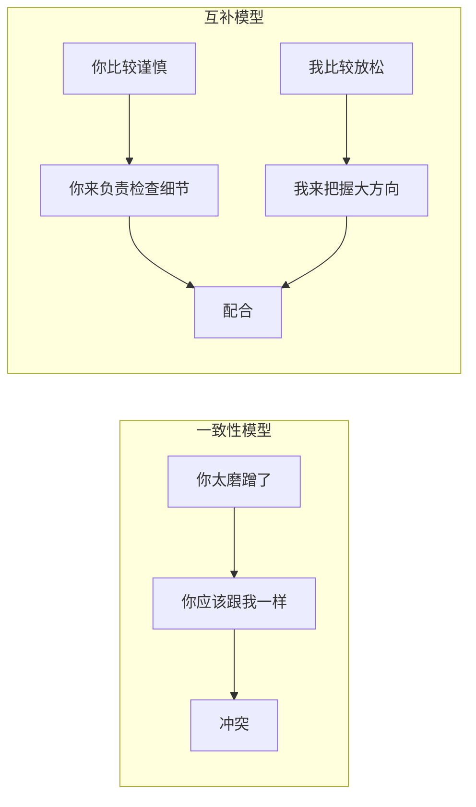

# 第02课：一致性和互补性

## 学习目标

- 理解一致性吸引的局限与互补性合作的价值
- 掌握培养互补能力的三步法
- 学会用系统式语言描述差异

## 一致性的诱惑

两个人在茫茫人海中相遇，发现有相似的爱好、共同的话题——那种"有人跟我一样"的感觉非常幸福。一致性是人们产生吸引的起点，也是亲密关系中最熟悉的幸福。

**但过分追求一致性，迟早会希望破灭**。这个世界上不存在完全懂你的那个人。男性和女性从生理上就注定无法取得完全一致，更何况成长环境、教育背景、个性特点的差异。

> [!WARNING] 三观不合的陷阱
> "三观不合"这个说法暗示不只是"不一样"，而且是"合不来"。但研究发现：一致性影响两个人能否走到一起，真正决定走得有多好多长久的，是 **互补**。

## 互补的力量

**互补** 的意思是：不一致，但刚好可以互相配合补足。

生活中有无数互补的例子：一个做饭一个洗碗，一个唱红脸一个唱白脸，一个负责挣钱一个负责花钱。甚至在关系风格上：一个做决定一个跟随，一个紧张一个放松。

**互补案例**：丈夫嫌老婆出门前磨蹭，划拳决定谁来掌控这些事情后，丈夫发现自己大大咧咧反而更糟，反而向老婆求饶"还是你来吧"。同样的差异，从"你为什么跟我不一样"变成了"你的不一样怎么帮到我"。

## 培养互补能力三步法

### 第一步：提醒自己互补的概念
遇到不一致时，有意识地提醒自己：这不是威胁，而是形成合力的机会。

### 第二步：改变语言习惯
用中立的、不带评判性的语言描述差异：

| ❌ 评判性语言 | ✅ 中立语言 |
|---|---|
| 你怎么那么矫情 | 你的感受比我丰富 |
| 你太磨蹭了 | 你比我要谨慎细致 |
| 你这个钢铁直男 | 你逻辑能力很强 |

### 第三步：培养系统式视角和表达

系统式的语言特点：**把不同的部分并列，不涉及谁好谁不好**。

- ✅ "我更擅长理性这方面，你更擅长感性这方面"
- ✅ "解决问题主要靠我（冷静），发现问题主要靠你（敏感）"
- ✅ 用"同时"代替"但是"——"你看重家庭，同时我追求事业"

> [!TIP] 语言的力量
> 说"但是"暗示比较和排除，说"同时"则让双方特点平等共存。

## 风险提示

承认差异、不去消除差异，意味着交出了底牌。对方有可能利用这一点伤害你——你说"我喜欢你的理性也喜欢我的感性"，对方却说"既然理性重要你干嘛还一惊一乍"。这是亲密关系中必须面对的不确定性，我们将在[[lessons/0003-cong-que-ding-dao-bu-que-ding|第03课]]进一步探讨。

## 课后练习

找一件你和伴侣最近因为不一致而争吵的小事，尝试用"互补"的思路重新看待：**他的这一点不一样，在什么情况下是有用的？**

然后练习用系统式语言表达出来："在这件事上，你更擅长……，我更擅长……，我们可以配合。"

Continue with [[lessons/0003-cong-que-ding-dao-bu-que-ding|第03课：从确定到不确定]]。