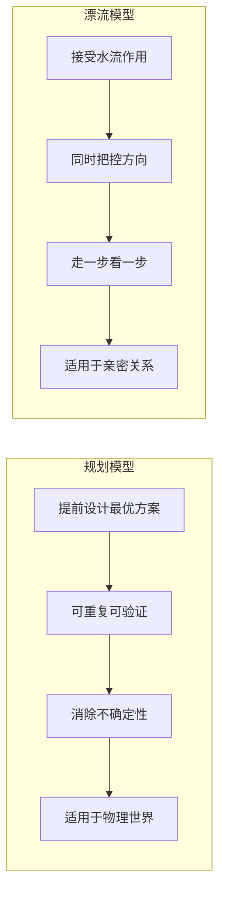

# 第03课：从确定到不确定

## 学习目标

- 理解规划模型与漂流模型的本质区别
- 掌握接受不确定性的四方面
- 发展适应不确定性的心智能力

## 迷路隐喻

想象开车去露营迷路了——天快黑了，周围没人，手机信号不好。不同的人有不同反应：

- 焦虑、后悔、生地图的气
- 冷静下来想办法
- **接受**：反正都是露营，这片荒地不正好用吗？搭帐篷、找吃的、唱歌——在不确定中享受当下

最后一种应对方式与其他人的区别是：**他不是要找回确定，而是直接接受不确定本身**。

> [!TIP] 核心洞察
> 亲密关系就像迷路——出发前都有设想和计划，但真的出发后，常常发现跟想象的不一样。重点是用什么心态应对。

## 规划模型 vs 漂流模型

规划模型在当今生活中无处不在——出门旅行有攻略、吃饭有评分最高的餐厅。但亲密关系是 **不确定性最后的栖息地**。

## 接受不确定性的四方面

### 1. 接受不确定性是亲密的一部分
你在关系中把自己打开得越多，面对的不确定性就越强。唯一确保没有风险的办法是不进入关系，或只以非常浅的方式进入。

### 2. 进化出匹配的心智模型
从一元走向多元——不再认为"我想要什么事就一定能变成什么样"。承认对方作为独立的意志存在，让出一定的掌控权。

### 3. 放下掌控的愿望
想找一个"攻略"把关系稳定下来，其实是想把对方纳入模式化的框架——**抹杀了对方作为一个独立生命的存在**。

> [!WARNING] PUA 的教训
> 把关系变成套路，就是把活生生的人变成一个"目标"、一个"分步骤可以解决的问题"。关系被这样掌控时，人就不再是人。

### 4. 发展不一样的技能
漂流所需的技能关键词：**适应、理解、沟通、合作、尝试多种可能、弹性、平衡、学会放手**。

## 关系中最奇妙的时刻

那个一心想掌控女朋友的男生，他越用力女生越不舒服。当他最沮丧的时候，不得不放下掌控的愿望——女朋友反而说："你现在理解我的感受了，我不生你的气了。"

有时候你放下掌控、接受不一致，反而让这段关系更安全。

## 课后练习

想想你在亲密关系中是否在用"规划模型"？你是否有一份对关系的"攻略"？试着列出三件你无法控制、但愿意接受的事。

Continue with [[lessons/0004-ge-ti-hua-de-zi-you|第04课：个体化的自由]]。