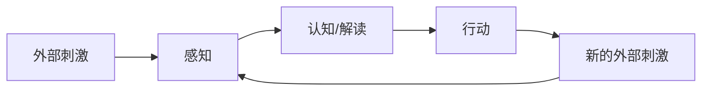
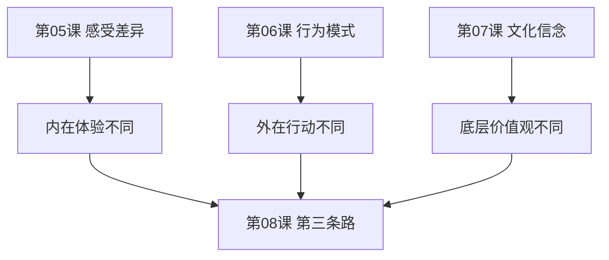

# 第06课：理解不同的行为模式

## 学习目标

- 理解行为模式差异的根源
- 掌握感知-认知-行动循环模型
- 学会尊重不同的行为方式

## 什么是行为模式

如果说[[lessons/0005-kan-dao-bu-tong-de-gan-shou|第05课]]讲的是内在感受的差异，这一课讲的是这些感受如何导致不同的外在行为。

面对同样的情境，不同的人会有完全不同的行动反应。有人遇到压力会不停地说话，有人会沉默；有人喜欢提前规划，有人随性而为——这些都不是对错问题，而是行为模式的差异。

## 感知-认知-行动循环

这个循环每时每刻都在发生，但每个人的感知过滤器、认知框架和行动倾向都不同：
- **感知差异**：有人对细节敏感，有人对整体敏感
- **认知差异**：有人把冲突看作威胁，有人把冲突看作机会
- **行动差异**：有人倾向于主动解决，有人倾向于等待观察

## 性别与行为模式

虽然不能一概而论，但观察发现：
- 男性更倾向于解决问题导向："你需要我做什么？"
- 女性更倾向于情感连接导向："你需要我听听吗？"

冲突往往发生在：一个人想解决问题，另一个人想要被倾听。

> [!WARNING] 
> 当他说"我来修"的时候，她可能想要的是"你坐下来陪我"。两个都没错，只是行为模式不同。

## 如何尊重不同的行为模式

1. **意识到模式的存在**——这不是他故意气你，这是他习惯的方式
2. **不做价值判断**——你的方式不是"对的"，他的不是"错的"
3. **寻找模式间的接口**——他的模式在什么情况下正好能帮到你？

## 与前三课的关联

感受、行为、文化——这三个层面层层深入，构成了完整的差异理解框架。

## 应用练习

回想一个你和伴侣因为行为方式不同而产生的冲突场景，问自己：
1. 他这么做，是他的哪种行为模式在起作用？
2. 如果我不把它看成"不对"，而是"不同"，我的感受会变化吗？
3. 这种不同的行为模式，在什么情境下其实是有价值的？

## 下节课预告

Continue with [[lessons/0007-kan-dao-bu-tong-de-wen-hua|第07课：看到不同的文化]]——文化信念的差异更加深层。