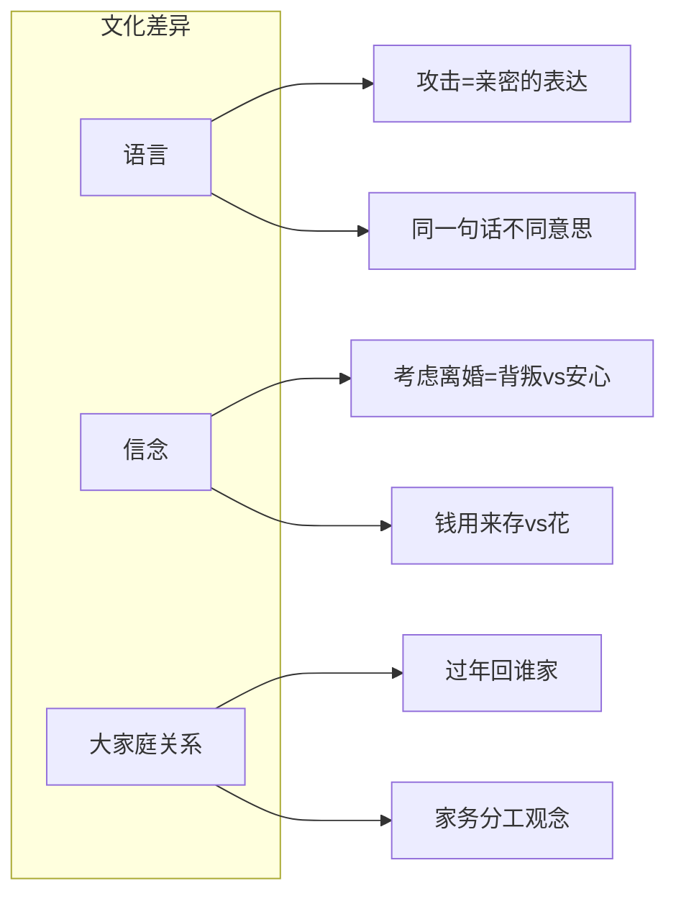

# 第07课：看到不同的文化

## 学习目标

- 理解文化信念差异的深层影响
- 掌握"游客、翻译、导游"三种角色
- 学会用文化差异视角化解冲突

## 文化差异无处不在

一对夫妻第一次回丈夫老家过年。妻子主动让丈夫帮忙打下手做饭，婆婆看到后很不高兴——在她的文化里，家务活是女性的责任，媳妇让儿子干活是一种挑衅。

妻子觉得委屈：明明是体谅你，怎么成了坏媳妇？

**这是两个人的文化冲突，不是谁对谁错的问题。**

> [!TIP] 
> 在亲密关系里，你要经常 **把对方当成"外国人"** 。亲密关系中隐藏的文化差异，一点不比和真正的外国人差别小。

## 文化差异的三个方面

1. **语言**：有人用攻击表达亲密（"你不行"=自己人），有人把攻击理解为不尊重
2. **信念**：想象离婚后的生活——有人觉得是背叛，有人觉得是让自己更安心地留在婚姻里
3. **大家庭关系**：跟父母长辈怎么相处，到处是看不见的雷区

## 三种角色

### 角色一：游客 👀
去对方的文化里做客。像出国旅游一样，带着探寻的眼光观察学习：
- ✅ "在你们那里，这意味着什么？"
- ❌ "你们怎么能这样呢？"

### 角色二：翻译 🗣️
做不同文化之间的桥梁，用一种文化能听懂的方式解释另一种文化：
- 丈夫对母亲说："妈，他们家的风俗跟我们不一样，小两口得一起干活表示对长辈尊重"
- 日常中："我翻译一下——我的意思不是说你的问题不重要……"

### 角色三：导游 🧭
打开你的文化，邀请对方进来参观：
- 句式："我的故事跟你不一样——这件事对你来说是……，对我来说意味着……"
- 自己的特点也值得尊重和保留

## 应用案例

过年回家怕踩雷？记住这几点：
1. 提前做"文化准备"：像带老外见父母一样，提前沟通规矩
2. 遇到冲突先问"在你们文化里这意味着什么"
3. 丈夫/妻子做好翻译，帮双方理解对方的心意

## 课后练习

列出你和伴侣在以下方面的文化差异：
- 钱（存钱vs花钱？）
- 家庭角色（谁做什么？）
- 语言习惯（同一句话你们理解不同？）

试着用"游客"心态去了解他的文化，用"导游"心态介绍你的文化。

Continue with [[lessons/0008-di-san-tiao-lu|第08课：不强制，不委屈，不评判——让亲密升级的第三条路]]。